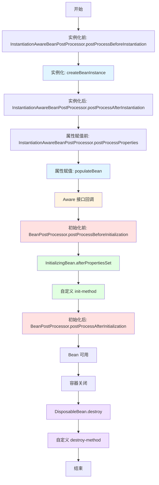
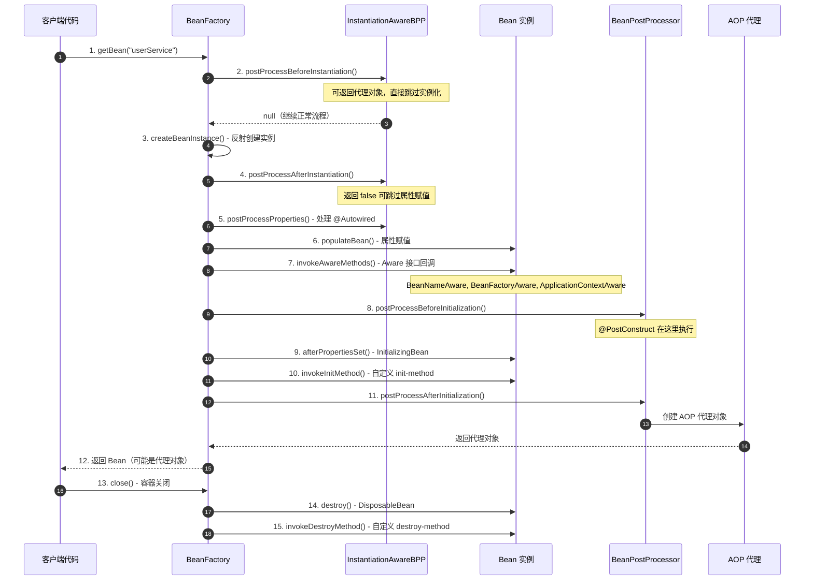

# Spring Bean 生命周期完整解析

Spring Bean 的生命周期是 Spring 框架中最核心的知识点之一，也是高频面试题。理解 Bean 的完整生命周期，有助于我们掌握 Spring 的初始化机制、AOP 代理生成时机、以及如何优雅地扩展 Spring 容器。

---

## 一、Bean 生命周期完整流程图

### 1. 完整生命周期概览



### 2. 时序图详解



---

## 二、生命周期各阶段详解

### 阶段 1：实例化前（Before Instantiation）

```java
public interface InstantiationAwareBeanPostProcessor extends BeanPostProcessor {
    
    /**

     * 在 Bean 实例化之前调用
     * 如果返回非 null 对象，则直接使用该对象，跳过后续的实例化和初始化流程
     * AOP 的某些场景会在这里返回代理对象

     */
    @Nullable
    default Object postProcessBeforeInstantiation(Class<?> beanClass, String beanName) {
        return null;
    }
}
```

**应用场景**：

- 创建代理对象（如某些 AOP 场景）
- 替换原有的 Bean 实例

---

### 阶段 2：实例化（Instantiation）

```java
// AbstractAutowireCapableBeanFactory.createBeanInstance()
protected BeanWrapper createBeanInstance(String beanName, RootBeanDefinition mbd, Object[] args) {
    Class<?> beanClass = resolveBeanClass(mbd, beanName);
    
    // 1. 使用工厂方法创建
    if (mbd.getFactoryMethodName() != null) {
        return instantiateUsingFactoryMethod(beanName, mbd, args);
    }
    
    // 2. 使用有参构造器创建
    Constructor<?>[] ctors = determineConstructorsFromBeanPostProcessors(beanClass, beanName);
    if (ctors != null) {
        return autowireConstructor(beanName, mbd, ctors, args);
    }
    
    // 3. 使用默认无参构造器创建（最常见）
    return instantiateBean(beanName, mbd);
}

// 底层使用反射
protected Object instantiateBean(String beanName, RootBeanDefinition mbd) {
    return getInstantiationStrategy().instantiate(mbd, beanName, this);
}
```

**核心要点**：

- Spring 优先使用**工厂方法**或**有参构造器**创建实例
- 如果没有特殊配置，使用**默认无参构造器**通过反射创建

---

### 阶段 3：实例化后（After Instantiation）

```java
public interface InstantiationAwareBeanPostProcessor extends BeanPostProcessor {
    
    /**

     * 在 Bean 实例化之后、属性赋值之前调用
     * 如果返回 false，则跳过后续的属性赋值流程

     */
    default boolean postProcessAfterInstantiation(Object bean, String beanName) {
        return true;
    }
}
```

---

### 阶段 4-5：属性赋值（Populate）

```java
// AbstractAutowireCapableBeanFactory.populateBean()
protected void populateBean(String beanName, RootBeanDefinition mbd, BeanWrapper bw) {
    // 1. 调用 InstantiationAwareBeanPostProcessor.postProcessProperties()
    // 这里处理 @Autowired、@Resource、@Value 等注解
    for (InstantiationAwareBeanPostProcessor bp : getBeanPostProcessorCache().instantiationAware) {
        PropertyValues pvsToUse = bp.postProcessProperties(pvs, bw.getWrappedInstance(), beanName);
    }
    
    // 2. 应用属性值
    if (pvs != null) {
        applyPropertyValues(beanName, mbd, bw, pvs);
    }
}
```

**核心注解处理器**：

| 注解 | 处理器 | 说明 |
| ----- | -------- | ------ |
| `@Autowired` | `AutowiredAnnotationBeanPostProcessor` | 按类型注入 |
| `@Resource` | `CommonAnnotationBeanPostProcessor` | 按名称注入 |
| `@Value` | `AutowiredAnnotationBeanPostProcessor` | 注入配置值 |

---

### 阶段 6：Aware 接口回调

```java
// AbstractAutowireCapableBeanFactory.invokeAwareMethods()
private void invokeAwareMethods(String beanName, Object bean) {
    if (bean instanceof Aware) {
        if (bean instanceof BeanNameAware) {
            ((BeanNameAware) bean).setBeanName(beanName);
        }
        if (bean instanceof BeanClassLoaderAware) {
            ((BeanClassLoaderAware) bean).setBeanClassLoader(getBeanClassLoader());
        }
        if (bean instanceof BeanFactoryAware) {
            ((BeanFactoryAware) bean).setBeanFactory(this);
        }
    }
}

// ApplicationContextAwareProcessor.postProcessBeforeInitialization()
// 处理 ApplicationContextAware 等
private void invokeAwareInterfaces(Object bean) {
    if (bean instanceof EnvironmentAware) {
        ((EnvironmentAware) bean).setEnvironment(this.applicationContext.getEnvironment());
    }
    if (bean instanceof ApplicationContextAware) {
        ((ApplicationContextAware) bean).setApplicationContext(this.applicationContext);
    }
    // ... 其他 Aware 接口
}
```

**常用 Aware 接口**：

| Aware 接口 | 回调方法 | 作用 |
| ----------- | --------- | ------ |
| `BeanNameAware` | `setBeanName(String name)` | 获取 Bean 在容器中的名称 |
| `BeanFactoryAware` | `setBeanFactory(BeanFactory factory)` | 获取 BeanFactory 对象 |
| `ApplicationContextAware` | `setApplicationContext(ApplicationContext ctx)` | 获取 ApplicationContext 对象 |
| `EnvironmentAware` | `setEnvironment(Environment env)` | 获取环境配置 |
| `ResourceLoaderAware` | `setResourceLoader(ResourceLoader loader)` | 获取资源加载器 |

---

### 阶段 7：初始化前（Before Initialization）

```java
public interface BeanPostProcessor {
    
    /**

     * 在 Bean 初始化方法（如 afterPropertiesSet、init-method）调用之前执行
     * 可以对 Bean 进行包装或修改

     */
    @Nullable
    default Object postProcessBeforeInitialization(Object bean, String beanName) {
        return bean;
    }
}
```

**重要应用**：

- `@PostConstruct` 注解由 `CommonAnnotationBeanPostProcessor` 在这里处理
- `@ConfigurationProperties` 绑定也在这里完成

```java
@Component
public class UserService {
    
    @PostConstruct  // 在这个阶段执行
    public void init() {
        System.out.println("@PostConstruct 初始化");
    }
}
```

---

### 阶段 8-9：初始化（Initialization）

```java
// AbstractAutowireCapableBeanFactory.invokeInitMethods()
protected void invokeInitMethods(String beanName, Object bean, RootBeanDefinition mbd) {
    // 1. 调用 InitializingBean.afterPropertiesSet()
    if (bean instanceof InitializingBean) {
        ((InitializingBean) bean).afterPropertiesSet();
    }
    
    // 2. 调用自定义 init-method
    if (mbd != null && mbd.getInitMethodName() != null) {
        invokeCustomInitMethod(beanName, bean, mbd);
    }
}
```

**示例**：

```java
@Component
public class UserService implements InitializingBean {
    
    @Override
    public void afterPropertiesSet() throws Exception {
        System.out.println("InitializingBean.afterPropertiesSet()");
    }
    
    // 通过 @Bean(initMethod = "customInit") 指定
    public void customInit() {
        System.out.println("自定义 init-method");
    }
}
```

**执行顺序**：

1. `@PostConstruct` 注解方法
2. `InitializingBean.afterPropertiesSet()`
3. 自定义 `init-method`

---

### 阶段 10：初始化后（After Initialization）

```java
public interface BeanPostProcessor {
    
    /**

     * 在 Bean 初始化方法调用之后执行
     * AOP 动态代理通常在这里生成

     */
    @Nullable
    default Object postProcessAfterInitialization(Object bean, String beanName) {
        return bean;
    }
}
```

**核心应用：AOP 代理生成**

```java
public class AbstractAutoProxyCreator extends ProxyProcessorSupport
        implements SmartInstantiationAwareBeanPostProcessor {
    
    @Override
    public Object postProcessAfterInitialization(@Nullable Object bean, String beanName) {
        if (bean != null) {
            Object cacheKey = getCacheKey(bean.getClass(), beanName);
            // 如果需要代理，则创建代理对象
            if (shouldProxy(bean, beanName)) {
                return wrapIfNecessary(bean, beanName, cacheKey);
            }
        }
        return bean;
    }
}
```

---

### 阶段 11-12：销毁（Destruction）

```java
// DisposableBeanAdapter.destroy()
public void destroy() {
    // 1. 调用 @PreDestroy 注解方法
    if (this.invokeDisposableBean) {
        ((DisposableBean) this.bean).destroy();
    }
    
    // 2. 调用自定义 destroy-method
    if (this.destroyMethod != null) {
        invokeCustomDestroyMethod(this.destroyMethod);
    }
}
```

**示例**：

```java
@Component
public class UserService implements DisposableBean {
    
    @PreDestroy  // 第一个执行
    public void preDestroy() {
        System.out.println("@PreDestroy");
    }
    
    @Override
    public void destroy() throws Exception {
        System.out.println("DisposableBean.destroy()");
    }
    
    // 通过 @Bean(destroyMethod = "customDestroy") 指定
    public void customDestroy() {
        System.out.println("自定义 destroy-method");
    }
}
```

**销毁顺序**：

1. `@PreDestroy` 注解方法
2. `DisposableBean.destroy()`
3. 自定义 `destroy-method`

---

## 三、完整代码示例

```java
@Component
public class LifecycleBean implements BeanNameAware, BeanFactoryAware, 
                                      ApplicationContextAware, InitializingBean, DisposableBean {
    
    private String beanName;
    private BeanFactory beanFactory;
    private ApplicationContext applicationContext;
    
    public LifecycleBean() {
        System.out.println("1. 构造器执行");
    }
    
    @Override
    public void setBeanName(String name) {
        this.beanName = name;
        System.out.println("2. BeanNameAware.setBeanName: " + name);
    }
    
    @Override
    public void setBeanFactory(BeanFactory beanFactory) {
        this.beanFactory = beanFactory;
        System.out.println("3. BeanFactoryAware.setBeanFactory");
    }
    
    @Override
    public void setApplicationContext(ApplicationContext applicationContext) {
        this.applicationContext = applicationContext;
        System.out.println("4. ApplicationContextAware.setApplicationContext");
    }
    
    @PostConstruct
    public void postConstruct() {
        System.out.println("5. @PostConstruct");
    }
    
    @Override
    public void afterPropertiesSet() throws Exception {
        System.out.println("6. InitializingBean.afterPropertiesSet");
    }
    
    // 通过 @Bean(initMethod = "customInit") 指定
    public void customInit() {
        System.out.println("7. 自定义 init-method");
    }
    
    @PreDestroy
    public void preDestroy() {
        System.out.println("8. @PreDestroy");
    }
    
    @Override
    public void destroy() throws Exception {
        System.out.println("9. DisposableBean.destroy");
    }
    
    // 通过 @Bean(destroyMethod = "customDestroy") 指定
    public void customDestroy() {
        System.out.println("10. 自定义 destroy-method");
    }
}

@Configuration
public class BeanConfig {
    
    @Bean(initMethod = "customInit", destroyMethod = "customDestroy")
    public LifecycleBean lifecycleBean() {
        return new LifecycleBean();
    }
}
```

**输出结果**：

```

1. 构造器执行
2. BeanNameAware.setBeanName: lifecycleBean
3. BeanFactoryAware.setBeanFactory
4. ApplicationContextAware.setApplicationContext
5. @PostConstruct
6. InitializingBean.afterPropertiesSet
7. 自定义 init-method
8. @PreDestroy
9. DisposableBean.destroy
10. 自定义 destroy-method

```

---

## 四、自定义 BeanPostProcessor

### 1. 基本实现

```java
@Component
public class CustomBeanPostProcessor implements BeanPostProcessor {
    
    @Override
    public Object postProcessBeforeInitialization(Object bean, String beanName) {
        if (bean instanceof UserService) {
            System.out.println("初始化前处理：" + beanName);
        }
        return bean;
    }
    
    @Override
    public Object postProcessAfterInitialization(Object bean, String beanName) {
        if (bean instanceof UserService) {
            System.out.println("初始化后处理：" + beanName);
            // 可以在这里返回代理对象
            return Enhancer.create(bean.getClass(), (MethodInterceptor) (obj, method, args, proxy) -> {
                System.out.println("代理增强：" + method.getName());
                return proxy.invokeSuper(obj, args);
            });
        }
        return bean;
    }
}
```

### 2. 实战案例：自动填充创建时间

```java
@Component
public class AutoFillBeanPostProcessor implements BeanPostProcessor {
    
    @Override
    public Object postProcessAfterInitialization(Object bean, String beanName) {
        Field[] fields = bean.getClass().getDeclaredFields();
        for (Field field : fields) {
            if (field.isAnnotationPresent(AutoFillCreateTime.class)) {
                if (field.getType() == LocalDateTime.class) {
                    field.setAccessible(true);
                    try {
                        field.set(bean, LocalDateTime.now());
                    } catch (IllegalAccessException e) {
                        throw new RuntimeException(e);
                    }
                }
            }
        }
        return bean;
    }
}

// 自定义注解
@Retention(RetentionPolicy.RUNTIME)
@Target(ElementType.FIELD)
public @interface AutoFillCreateTime {
}

// 使用
@Component
public class User {
    
    @AutoFillCreateTime
    private LocalDateTime createTime;
}
```

---

## 五、高频面试题

### 1. Bean 的生命周期有哪些阶段？

**标准回答**：

Bean 的生命周期可以分为四个核心阶段：

1. **实例化（Instantiation）**：通过反射或工厂方法创建 Bean 实例
2. **属性赋值（Populate）**：进行依赖注入，填充 `@Autowired` 等属性
3. **初始化（Initialization）**：
   - 执行 Aware 接口回调
   - 执行 `BeanPostProcessor.postProcessBeforeInitialization()`
   - 执行 `@PostConstruct`、`InitializingBean.afterPropertiesSet()`、自定义 `init-method`
   - 执行 `BeanPostProcessor.postProcessAfterInitialization()`（**AOP 代理在这里生成**）
4. **销毁（Destruction）**：执行 `@PreDestroy`、`DisposableBean.destroy()`、自定义 `destroy-method`

### 2. BeanPostProcessor 和 BeanFactoryPostProcessor 的区别？

| 特性 | BeanPostProcessor | BeanFactoryPostProcessor |
| ----- | ------------------- | ------------------------- |
| **作用对象** | Bean 实例 | BeanDefinition（Bean 定义） |
| **执行时机** | Bean 实例化之后 | Bean 实例化之前 |
| **核心方法** | `postProcessBeforeInitialization()` <br /> `postProcessAfterInitialization()` | `postProcessBeanFactory()` |
| **应用场景** | AOP 代理、属性填充、初始化增强 | 修改 Bean 定义、占位符解析（`${}`） |

**代码示例**：

```java
@Component
public class CustomBeanFactoryPostProcessor implements BeanFactoryPostProcessor {
    
    @Override
    public void postProcessBeanFactory(ConfigurableListableBeanFactory beanFactory) {
        // 获取并修改 BeanDefinition
        BeanDefinition bd = beanFactory.getBeanDefinition("userService");
        bd.setScope(BeanDefinition.SCOPE_PROTOTYPE); // 修改作用域
        
        // 可以在这里添加新的 BeanDefinition
        BeanDefinitionBuilder builder = BeanDefinitionBuilder.genericBeanDefinition(UserService.class);
        ((DefaultListableBeanFactory) beanFactory).registerBeanDefinition("customUser", builder.getBeanDefinition());
    }
}
```

### 3. 初始化方法的执行顺序是什么？

**执行顺序**：

1. `@PostConstruct` 注解方法（由 `CommonAnnotationBeanPostProcessor` 处理）
2. `InitializingBean.afterPropertiesSet()`
3. 自定义 `init-method`（通过 `@Bean(initMethod = "xxx")` 或 XML 配置）

**记忆技巧**：注解 → 接口 → 配置

### 4. AOP 代理是在什么时候创建的？

**答案**：在 `BeanPostProcessor.postProcessAfterInitialization()` 阶段创建。

具体由 `AbstractAutoProxyCreator` 实现，它会在初始化后检查 Bean 是否需要代理，如果需要，则创建代理对象返回。

**验证代码**：

```java
@Component
public class UserService {
    
    public UserService() {
        System.out.println("构造器：" + this.getClass().getName());
    }
    
    @PostConstruct
    public void init() {
        System.out.println("初始化：" + this.getClass().getName());
    }
}

@Aspect
@Component
public class LogAspect {
    
    @Before("execution(* com.example.UserService.*(..))")
    public void before() {
        System.out.println("AOP 增强");
    }
}
```

**输出**：

```
构造器：com.example.UserService
初始化：com.example.UserService
// 初始化后返回的是代理对象：com.example.UserService$$EnhancerBySpringCGLIB$$12345678
```

### 5. 如何在 Bean 初始化时执行自定义逻辑？

**四种方式**：

```java
// 方式 1：@PostConstruct 注解（推荐）
@Component
public class UserService {
    @PostConstruct
    public void init() {
        System.out.println("初始化");
    }
}

// 方式 2：InitializingBean 接口
@Component
public class UserService implements InitializingBean {
    @Override
    public void afterPropertiesSet() {
        System.out.println("初始化");
    }
}

// 方式 3：@Bean 注解的 initMethod
@Configuration
public class BeanConfig {
    @Bean(initMethod = "init")
    public UserService userService() {
        return new UserService();
    }
}

// 方式 4：自定义 BeanPostProcessor
@Component
public class CustomBeanPostProcessor implements BeanPostProcessor {
    @Override
    public Object postProcessAfterInitialization(Object bean, String beanName) {
        if (bean instanceof UserService) {
            // 执行自定义逻辑
        }
        return bean;
    }
}
```

**推荐使用 `@PostConstruct`**，因为它清晰、简洁，且不依赖 Spring 特定接口。

---

## 六、总结

Spring Bean 的生命周期是一个复杂而精妙的过程，理解它的关键在于掌握以下几点：

1. **四大阶段**：实例化 → 属性赋值 → 初始化 → 销毁
2. **扩展点**：`BeanPostProcessor` 和 `BeanFactoryPostProcessor` 是 Spring 提供的强大扩展机制
3. **AOP 时机**：代理对象在 `postProcessAfterInitialization()` 阶段创建
4. **初始化顺序**：`@PostConstruct` → `InitializingBean` → `init-method`
5. **销毁顺序**：`@PreDestroy` → `DisposableBean` → `destroy-method`

掌握 Bean 的生命周期，不仅能够应对面试，更能在实际开发中灵活扩展 Spring 容器，实现更优雅的架构设计。
