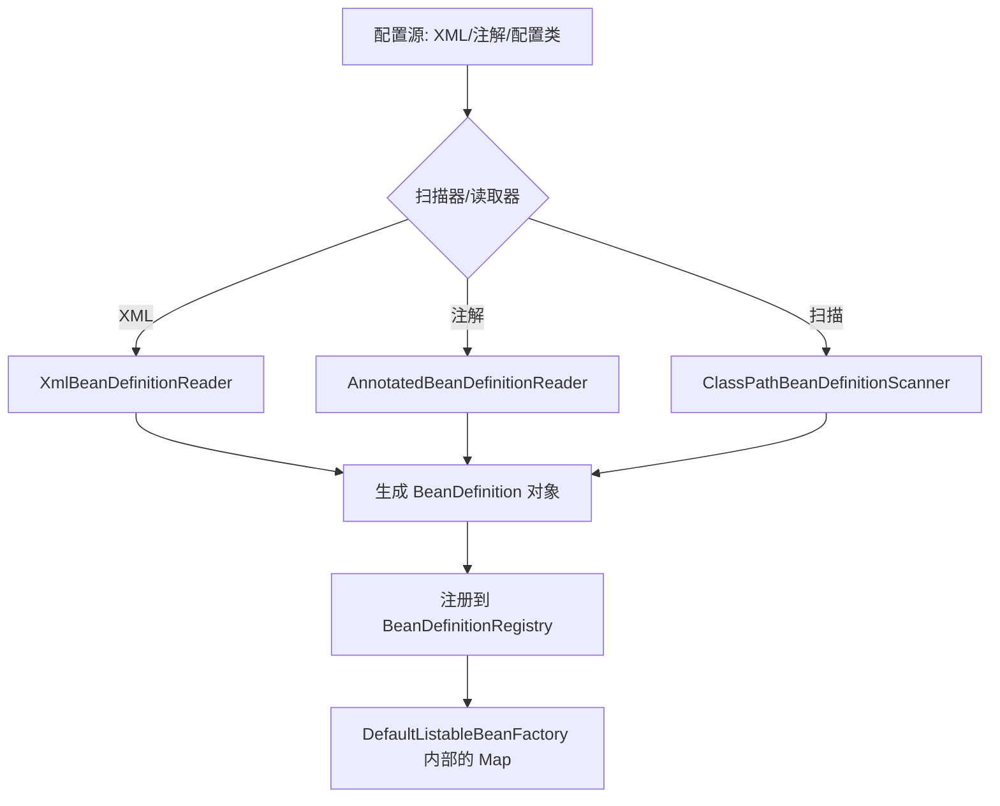

# Spring 配置类与 BeanDefinition 加载原理

Spring 容器之所以强大，是因为它将所有的配置（XML、JavaConfig、注解）统一抽象为了 **`BeanDefinition`**（Bean 定义）。理解 BeanDefinition 的生成过程，是看懂 Spring 源码的关键。

---

## 一、 什么是 BeanDefinition？

`BeanDefinition` 接口定义了 Bean 的元数据，包括：

- **`beanClassName`**：全限定类名。
- **`scope`**：作用域（singleton, prototype）。
- **`isLazyInit`**：是否懒加载。
- **`propertyValues`**：属性注入的值。
- **`dependsOn`**：依赖的其它 Bean。

---

## 二、 加载与注册的全流程



### 1. 核心仓库：BeanDefinitionRegistry

在 Spring 默认实现类 `DefaultListableBeanFactory` 中，所有的 BeanDefinition 都存放在一个 Map 里：

```java
private final Map<String, BeanDefinition> beanDefinitionMap = new ConcurrentHashMap<>(256);
```

---

## 三、 @Configuration 解析深度内幕

Spring 如何处理标注了 `@Configuration` 的类？这主要归功于一个极其重要的后置处理器：**`ConfigurationClassPostProcessor`**。

### 1. 全配置类（Full）与 精简配置类（Lite）

- **Full 模式**：类标注了 `@Configuration`。Spring 会通过 **CGLIB** 为该类生成代理。
  - **原因**：为了保证单例。如果在类内部方法 A 调用方法 B（两个都是 `@Bean` 方法），CGLIB 拦截器会确保 B 方法对应的 Bean 只被从容器内获取一次，而不是真的执行两次方法逻辑。
- **Lite 模式**：类标注了 `@Component`、`@Import` 或只有普通 `@Bean` 方法。Spring 不会生成代理，方法间内部调用会按普通 Java 逻辑执行，可能导致单例失效。

### 2. 解析顺序

`ConfigurationClassParser` 会按以下顺序递归解析：

1. **`@PropertySource`**：加载资源属性。
2. **`@ComponentScan`**：执行路径扫描，立即注册发现的 Bean 为 BeanDefinition。
3. **`@Import`**：处理导入的类（Selector 或 Registrar）。
4. **`@ImportResource`**：引入 XML。
5. **`@Bean`**：解析方法上的 Bean 定义。

---

## 四、 @Import 的三种玩法

这是 Spring Boot 自动装配的底层支撑：

1. **直接导入类**：当作普通 `@Component` 处理。
2. **实现 `ImportSelector`**：根据逻辑动态返回需要导入的类名数组（用于开启某个功能，如 `@EnableTransactionManagement`）。
3. **实现 `ImportBeanDefinitionRegistrar`**：直接操作 `BeanDefinitionRegistry` 手动注册 Bean（最强大的扩展点，如 MyBatis 的 `@MapperScan`）。

---

## 五、 面试 Q&A

### Q: 为什么 Spring 启动时要先解析所有的 BeanDefinition，而不是直接创建 Bean？

1. **解耦**：将配置与对象创建分离。
2. **校验**：在实例化前可以检查是否存在循环依赖（构造器模式）或配置错误。
3. **扩展**：允许 `BeanFactoryPostProcessor` 在 Bean 实例化之前修改定义（例如修改属性值、替换占位符）。

### Q: 手动往容器注册 Bean 的正确姿势？

可以通过实现 `BeanFactoryAware` 获取工厂，或者使用 `BeanDefinitionBuilder` 构建定义并注册到 `BeanDefinitionRegistry`。
