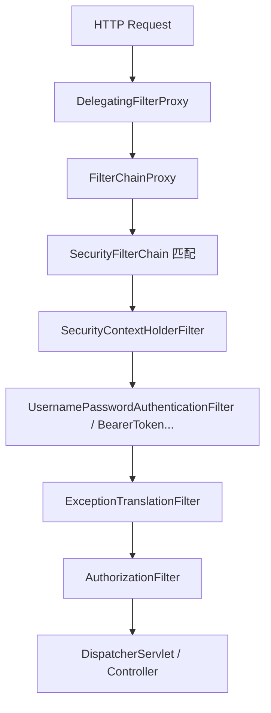
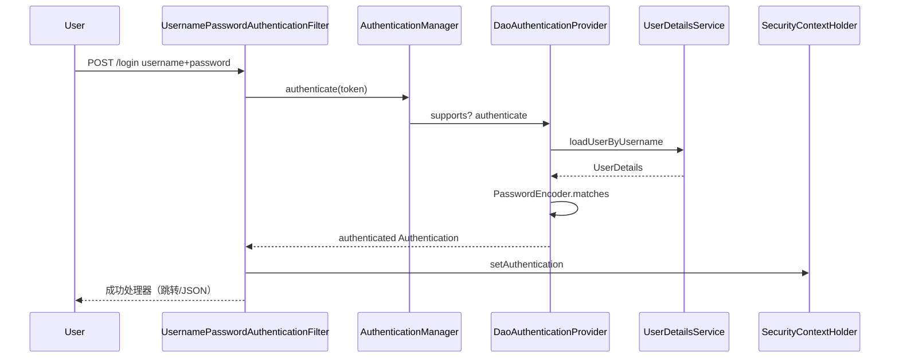

## Spring Security 安全架构与过滤器链深度解析

Spring Security 是高度可定制的认证（Authentication）与授权（Authorization）框架。Servlet 场景下，核心是 **`Filter` 链** + **`SecurityContext`**；资源服务器场景则常与 JWT / OAuth2 结合。

相关阅读：[MVC 流程](../mvc/8-springmvc-principles.md)、[Gateway 鉴权](../cloud/21-gateway-advanced.md)、[Boot 自动配置](10-springboot-core.md)。

---

## 一、总体架构



### 1. DelegatingFilterProxy

Servlet 容器只认识 `web.xml` / `FilterRegistrationBean` 里的 Filter，不认识 Spring Bean。`DelegatingFilterProxy` 做桥接：容器调用它 → 它委托给 Spring 容器中名为 `springSecurityFilterChain` 的 Bean（即 `FilterChainProxy`）。

### 2. FilterChainProxy 与多 SecurityFilterChain

`FilterChainProxy` 可挂多条 `SecurityFilterChain`，按 `requestMatchers` 匹配第一条：

```java
@Bean
SecurityFilterChain apiChain(HttpSecurity http) throws Exception {
    http.securityMatcher("/api/**")
        .authorizeHttpRequests(auth -> auth.anyRequest().authenticated())
        .oauth2ResourceServer(oauth2 -> oauth2.jwt(Customizer.withDefaults()));
    return http.build();
}

@Bean
SecurityFilterChain adminChain(HttpSecurity http) throws Exception {
    http.securityMatcher("/admin/**")
        .authorizeHttpRequests(auth -> auth.anyRequest().hasRole("ADMIN"))
        .formLogin(Customizer.withDefaults());
    return http.build();
}
```

Boot 2.7+ / Security 6 起，推荐组件式 `SecurityFilterChain` Bean，替代旧 `WebSecurityConfigurerAdapter`。

---

## 二、关键过滤器职责（常考顺序）

下列名称随版本略有调整，但职责稳定：

| 过滤器 | 职责 |
| :--- | :--- |
| `SecurityContextHolderFilter` | 从 Session / 请求加载 `SecurityContext`，请求结束清理 |
| `CorsFilter` | CORS |
| `CsrfFilter` | CSRF Token 校验 |
| `UsernamePasswordAuthenticationFilter` | 表单登录，提取用户名密码 |
| `BearerTokenAuthenticationFilter` | 解析 `Authorization: Bearer` |
| `AnonymousAuthenticationFilter` | 未登录时填匿名 Authentication |
| `ExceptionTranslationFilter` | 把安全异常转换为 401/403 或跳转登录 |
| `AuthorizationFilter`（旧 `FilterSecurityInterceptor`） | **授权决策** |

链路越靠后越接近业务；认证成功后 `SecurityContext` 才有有效 `Authentication`。

---

## 三、认证流程（Authentication）

### 1. 核心抽象

```text
AuthenticationManager
  └── ProviderManager
        └── AuthenticationProvider (DaoAuthenticationProvider / JwtAuthenticationProvider ...)
              └── UserDetailsService.loadUserByUsername
```

| 类型 | 含义 |
| :--- | :--- |
| `Authentication` | 认证令牌：principal、credentials、authorities、authenticated 标志 |
| `SecurityContext` | 持有当前 `Authentication` |
| `SecurityContextHolder` | 默认 `ThreadLocal` 策略存储上下文 |
| `UserDetails` | 框架所需用户视图（用户名、密码哈希、是否锁定等） |
| `GrantedAuthority` | 权限 / 角色（`ROLE_ADMIN`） |

### 2. 表单登录时序



密码比对必须走 `PasswordEncoder`（如 BCrypt），禁止明文相等比较。

### 3. JWT 资源服务器要点

1. 网关或客户端带 `Authorization: Bearer <jwt>`。
2. `BearerTokenAuthenticationFilter` 提取 Token。
3. `JwtAuthenticationProvider` 验签、校验 `exp`/`iss`/`aud`。
4. 把 claims 映射为 `Authentication` authorities。
5. 无 Session 时常用 `SessionCreationPolicy.STATELESS`。

---

## 四、授权流程（Authorization）

### 1. 请求级

`authorizeHttpRequests`：

```java
http.authorizeHttpRequests(auth -> auth
    .requestMatchers("/public/**").permitAll()
    .requestMatchers("/admin/**").hasRole("ADMIN")
    .anyRequest().authenticated()
);
```

`hasRole("ADMIN")` 会自动加 `ROLE_` 前缀（与 `hasAuthority("ROLE_ADMIN")` 对应关系要记清）。

### 2. 方法级

`@EnableMethodSecurity` +：

- `@PreAuthorize("hasRole('ADMIN')")`
- `@PostAuthorize` / `@PreFilter` / `@PostFilter`

底层通过 AOP 代理，**同类自调用会失效**（与 `@Transactional` 相同坑）。

### 3. 决策模型

旧版 `AccessDecisionManager` 投票（Affirmative/Consensus/Unanimous）；新版 `AuthorizationManager` 更直接返回结果。面试能讲清“认证后拿 authorities 与规则匹配”即可。

---

## 五、SecurityContext 与线程传播

- 默认 `MODE_THREADLOCAL`：子线程看不到登录态。
- `@Async` / 线程池需要 `MODE_INHERITABLETHREADLOCAL` 或显式传递上下文（注意线程池污染风险）。
- WebFlux 使用 Reactor Context，而非 Servlet ThreadLocal。

请求结束过滤器会 `SecurityContextHolder.clearContext()`，防止线程池复用导致**用户串号**。

---

## 六、CSRF、CORS 与前后端分离

| 话题 | 建议 |
| :--- | :--- |
| 前后端分离 + JWT | 常 `csrf.disable()`，依赖 Token 与 HTTPS |
| Cookie Session 传统 MVC | **保持 CSRF 开启**，表单带 Token |
| CORS | 优先在 Gateway 或 Security `cors` 统一配置，避免每个服务重复 |
| XSS | Security 不替代输出编码；模板与 CSP 仍要做 |

```java
http.csrf(csrf -> csrf.disable())
    .sessionManagement(sm -> sm.sessionCreationPolicy(SessionCreationPolicy.STATELESS));
```

---

## 七、常见生产坑

1. **过滤器顺序错误**：自定义 Filter 插入位置不对，导致 Token 未解析就授权失败。
2. **多个 SecurityFilterChain 匹配重叠**：顺序 Bean 优先级未设，请求进错链。
3. **密码编码器不一致**：注册 BCrypt、登录用 NoOp，全部 401。
4. **方法安全自调用**：`this.secured()` 不走代理。
5. **异常被全局 `@ControllerAdvice` 吃掉**：与 `ExceptionTranslationFilter` 职责重叠，401/403 语义混乱。
6. **Swagger / Actuator 未放行**：联调全挂，应用 `requestMatchers` 精确放行。

---

## 八、最小可运行骨架（Security 6 风格）

```java
@Configuration
@EnableWebSecurity
@EnableMethodSecurity
public class SecurityConfig {

    @Bean
    SecurityFilterChain filterChain(HttpSecurity http) throws Exception {
        http.authorizeHttpRequests(auth -> auth
                .requestMatchers("/actuator/health", "/login").permitAll()
                .anyRequest().authenticated()
            )
            .formLogin(Customizer.withDefaults())
            .logout(Customizer.withDefaults());
        return http.build();
    }

    @Bean
    PasswordEncoder passwordEncoder() {
        return new BCryptPasswordEncoder();
    }

    @Bean
    UserDetailsService users(PasswordEncoder encoder) {
        UserDetails user = User.withUsername("user")
            .password(encoder.encode("password"))
            .roles("USER")
            .build();
        return new InMemoryUserDetailsManager(user);
    }
}
```

生产应改为 JDBC/LDAP/自定义 `UserDetailsService`，并外置密钥与 HTTPS。

---

## 九、总结

- 架构主线：`DelegatingFilterProxy` → `FilterChainProxy` → 认证 Filter → 授权 Filter → 业务。
- 状态主线：`Authentication` 存入 `SecurityContextHolder`（ThreadLocal）。
- 扩展主线：自定义 `AuthenticationProvider`、Filter、`AuthorizationManager`、JWT 转换器。

把过滤器链和上下文生命周期讲顺，再叠加 OAuth2/JWT 细节，即可覆盖绝大多数 Spring Security 面试与落地问题。
