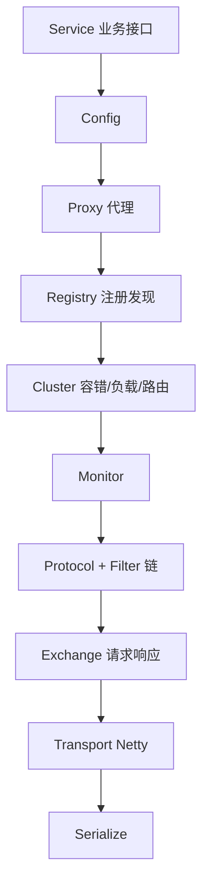
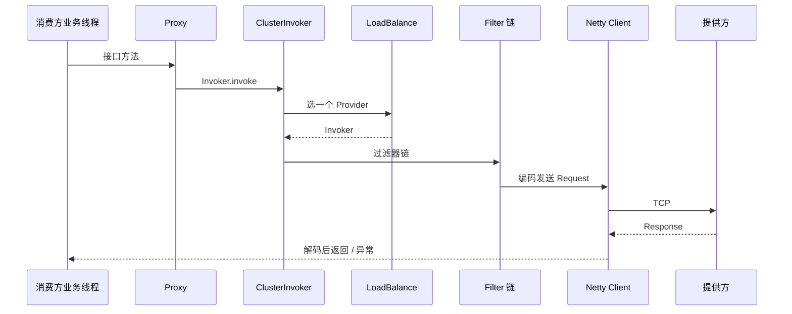

## Dubbo 核心架构与高性能 RPC 通信原理

Dubbo 是高性能 Java RPC 框架：接口级代理、自适应 SPI、Cluster 容错与 Netty 异步通信是其内核。本篇覆盖分层架构、SPI、调用链、负载均衡与线程模型。

相关：[Netty RPC 实战](../../network/7-netty-rpc-practice.md)、[Netty 面试](../../../interview/java/8-interview-netty.md)、[Feign HTTP 调用](22-mvc-remote-call.md)。

---

## 一、为什么是 RPC 而不是纯 HTTP

| 维度 | OpenFeign/HTTP | Dubbo RPC |
| :--- | :--- | :--- |
| 协议 | 文本/JSON 为主 | 二进制（Hessian2、protobuf 等） |
| 性能 | 中 | 高（连接复用 + 紧凑协议） |
| 治理 | 依赖 Cloud 组件 | 自带路由、容错、粘滞 |
| 跨语言 | 强 | 需 Triple/gRPC 等 |
| 适用 | 对外 API、异构 | 内网 Java 服务高 QPS |

可并存：边缘 HTTP 网关 + 内部 Dubbo。

---

## 二、分层架构（经典 10 层）



| 层 | 职责 |
| :--- | :--- |
| Proxy | 消费方动态代理 / 提供方 Wrapper |
| Registry | ZK/Nacos/等注册与订阅 |
| Cluster | 多邀请者伪装成一个；容错 + LB |
| Protocol | `dubbo://` `tri://` 等协议导出/引用 |
| Exchange | Request/Response 与 requestId |
| Transport | 网络 IO |
| Serialize | 序列化扩展点 |

设计原则：**单向依赖、URL 驱动配置、SPI 可替换每一层实现**。

---

## 三、一次远程调用端到端



同步调用时，业务线程在 `DefaultFuture.get` 上等待；IO 线程只负责收发包。

---

## 四、增强 SPI（ExtensionLoader）

与 JDK SPI、Spring `spring.factories` 不同，Dubbo SPI：

1. 配置在 `META-INF/dubbo/com.xxx.Interface`。
2. **按需加载**，不是一上来全实例化。
3. **`@Adaptive`**：运行时按 URL 参数选实现（如 `proxy=jdk`）。
4. **Wrapper 自动 AOP**：实现类构造注入同接口其他扩展，形成包装链。
5. **`@Activate`**：按条件自动激活 Filter 等。

```java
Protocol protocol = ExtensionLoader
    .getExtensionLoader(Protocol.class)
    .getAdaptiveExtension();
```

Adaptive 类常由 Javassist/JavaCompiler **运行时生成**，内部 `if (url.getProtocol())` 分发。

---

## 五、Filter 责任链

与 Servlet Filter / Spring 拦截器同构：

```text
ConsumerContextFilter → MonitoringFilter → ... → Invoke
```

常见扩展：鉴权、隐式传参（TraceId）、限流、超时、泛化调用日志。

```java
@Activate(group = {CONSUMER})
public class TraceFilter implements Filter {
    public Result invoke(Invoker<?> invoker, Invocation inv) throws RpcException {
        RpcContext.getClientAttachment().setAttachment("traceId", MDC.get("traceId"));
        return invoker.invoke(inv);
    }
}
```

---

## 六、Cluster 容错与负载均衡

### 1. 容错策略

| 策略 | 行为 | 场景 |
| :--- | :--- | :--- |
| `Failover` | 失败换实例重试 | 读多、幂等 |
| `Failfast` | 一次失败立即报错 | 非幂等写 |
| `Failsafe` | 失败吞掉 | 审计日志 |
| `Failback` | 后台定时重试 | 消息通知 |
| `Forking` | 并行多个取先返回 | 实时性要求高 |
| `Broadcast` | 广播所有 | 缓存刷新 |

写操作默认慎用 Failover 重试，防重复扣款。

### 2. 负载均衡

| 算法 | 要点 |
| :--- | :--- |
| Random | 加权随机，默认 |
| RoundRobin | 加权轮询 |
| LeastActive | 最少活跃调用 |
| ConsistentHash | 粘滞到同一实例 |

---

## 七、Netty 异步与 DefaultFuture

```text
发送: requestId → FUTURES.put(id, future) → channel.write
等待: future.get(timeout) → park
接收: 取 requestId → future.complete → unpark
```

| 点 | 说明 |
| :--- | :--- |
| 连接 | 多路复用，非一请求一连接 |
| 超时 | 定时扫描 FUTURES，防泄漏 |
| 线程 | IO 线程禁业务；线程池派发提供方服务调用 |

与 [Netty 手写 RPC](../network/7-netty-rpc-practice.md) 同构，Dubbo 是工程化加强版。

---

## 八、注册中心与服务导出/引用

**导出 Export（提供方）：**

```text
ServiceConfig.export
  → Proxy 包装实现
  → Protocol.export
  → 绑定端口
  → Registry.register(URL)
```

**引用 Refer（消费方）：**

```text
ReferenceConfig.get
  → Registry.subscribe
  → Protocol.refer 多 Invoker
  → Cluster.join 成一个 Invoker
  → 生成代理返回
```

URL 携带超时、重试、序列化、版本 `group/version` 等元数据。

---

## 九、协议演进

| 协议 | 特点 |
| :--- | :--- |
| `dubbo://` | 经典二进制，Java 友好 |
| `tri://` (Triple) | 基于 HTTP/2，更好跨语言、网关友好 |
| `grpc://` | 生态互通 |

新项目可评估 Triple，便于与 mesh/网关协同。

---

## 十、与 Spring 集成要点

```java
@DubboService(version = "1.0.0", timeout = 3000)
public class ProductServiceImpl implements ProductService { ... }

@DubboReference(version = "1.0.0", retries = 0, check = false)
private ProductService productService;
```

- `check=false`：启动时提供方未就绪不失败（注意空指针窗口）。
- `retries`：写 0；读可 >0。
- `timeout` 链路：消费方 < 网关超时，避免误重试。

---

## 十一、生产检查清单

1. 接口变更兼容（加字段、版本号 `version`）。
2. 序列化安全（避免任意反序列化漏洞配置）。
3. 线程池监控：提供方 `biz` 池拒绝策略。
4. 注册中心与配置中心高可用。
5. 指标：QPS、RT、失败率、线程池活跃数。

---

## 十二、总结

- 分层 + SPI 让 Dubbo 每层可替换。
- Cluster/Filter/LB 构成治理面；Netty + requestId 构成性能面。
- 选型：内网高性能 Java 互调用 Dubbo；对外 HTTP 用 Gateway/Feign。

HTTP 声明式调用对照见 [MVC 与远程调用](22-mvc-remote-call.md)。
