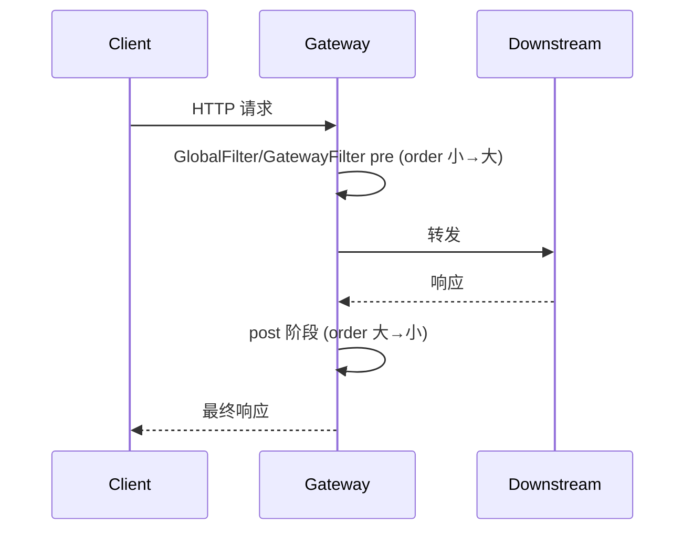

## Spring Cloud Gateway 流量入口与安全网关实战

在微服务架构中，**网关**是系统统一入口：路由、负载均衡、鉴权、限流、灰度与审计都集中在这里。Spring Cloud Gateway 基于 **WebFlux + Project Reactor**，用非阻塞模型扛高并发接入。

相关阅读：[微服务起步](30-springcloud-quickstart.md)、[Sentinel 治理](27-sentinel-governance.md)、[Security 架构](../boot/28-spring-security-architecture.md)、[Feign 远程调用](../mvc/22-mvc-remote-call.md)。

---

## 一、为什么需要网关

| 没有网关 | 有网关后 |
| :--- | :--- |
| 每个服务各自鉴权、跨域、限流 | 横切能力收敛到入口 |
| 客户端绑定一堆服务地址 | 只感知网关域名 |
| 服务直接暴露公网 | 内网服务只接受网关/服务网格流量 |
| 灰度、审计难统一 | 在 Filter 层统一插桩 |

Gateway 不是业务编排层：复杂 BFF 聚合可放独立服务，网关保持**薄、稳、快**。

---

## 二、核心三要素：Route / Predicate / Filter


| 要素 | 含义 | 例子 |
| :--- | :--- | :--- |
| **Route** | 一条路由规则：id + uri + predicates + filters | `id=order-route` |
| **Predicate** | 断言，全部为 true 才命中路由 | `Path=/order/**` |
| **Filter** | 请求前/响应后加工 | 加 Header、限流、改路径 |

`uri` 常用：

- `lb://order-service`：走服务发现 + 客户端负载均衡
- `http://10.0.0.1:8080`：直连（排障或固定依赖）
- `ws://` / `wss://`：WebSocket 代理

---

## 三、请求生命周期与 Filter 排序

Gateway Filter 分 **pre**（转发前）与 **post**（响应返回后）：



- `GlobalFilter`：全局，所有路由生效（鉴权、日志、Trace）。
- `GatewayFilter`：绑在具体 Route 上。
- 排序靠 `Ordered.getOrder()`：**数字越小越先执行 pre**。

内置过滤器速查：

| Filter | 用途 |
| :--- | :--- |
| `StripPrefix` | 去掉路径前缀再转发 |
| `RewritePath` | 正则改写路径 |
| `AddRequestHeader` / `AddResponseHeader` | 加头 |
| `RequestRateLimiter` | Redis 令牌桶限流 |
| `Retry` | 对幂等请求重试 |
| `CircuitBreaker` | 与 Resilience4j 熔断集成 |
| `RequestSize` | 限制 body 大小 |

---

## 四、配置实战

### 1. 基础路由

```yaml
spring:
  cloud:
    gateway:
      discovery:
        locator:
          enabled: true          # 可按服务名自动路由 /service-id/**
          lower-case-service-id: true
      routes:
        - id: order-service-route
          uri: lb://order-service
          predicates:
            - Path=/order/**
            - Method=GET,POST
            - Header=X-Request-Id, \d+
          filters:
            - StripPrefix=1
            - AddRequestHeader=X-Source, gateway
```

### 2. CORS 统一处理

```yaml
spring:
  cloud:
    gateway:
      globalcors:
        cors-configurations:
          '[/**]':
            allowedOriginPatterns: "*"
            allowedMethods: "*"
            allowedHeaders: "*"
            allowCredentials: true
```

生产勿长期 `allowedOrigins: "*"` + `allowCredentials: true` 组合；按域名白名单收紧。

### 3. Redis 令牌桶限流

```yaml
spring:
  data:
    redis:
      host: 127.0.0.1
  cloud:
    gateway:
      routes:
        - id: limited
          uri: lb://order-service
          predicates:
            - Path=/order/**
          filters:
            - name: RequestRateLimiter
              args:
                redis-rate-limiter.replenishRate: 10
                redis-rate-limiter.burstCapacity: 20
                redis-rate-limiter.requestedTokens: 1
                key-resolver: "#{@userKeyResolver}"
```

```java
@Bean
KeyResolver userKeyResolver() {
    // 优先按用户；匿名可按 IP
    return exchange -> Mono.justOrEmpty(exchange.getRequest().getHeaders().getFirst("X-User-Id"))
        .switchIfEmpty(Mono.just(
            exchange.getRequest().getRemoteAddress() != null
                ? exchange.getRequest().getRemoteAddress().getAddress().getHostAddress()
                : "anonymous"
        ));
}
```

| 参数 | 含义 |
| :--- | :--- |
| `replenishRate` | 每秒填充令牌数（稳态 QPS） |
| `burstCapacity` | 桶容量（允许突发） |
| `requestedTokens` | 每次请求消耗令牌 |

---

## 五、自定义 GlobalFilter：统一 JWT 鉴权

```java
@Component
public class JwtAuthGlobalFilter implements GlobalFilter, Ordered {

    private static final List<String> WHITE = List.of("/auth/login", "/actuator/health");

    @Override
    public Mono<Void> filter(ServerWebExchange exchange, GatewayFilterChain chain) {
        String path = exchange.getRequest().getURI().getPath();
        if (WHITE.stream().anyMatch(path::startsWith)) {
            return chain.filter(exchange);
        }
        String auth = exchange.getRequest().getHeaders().getFirst(HttpHeaders.AUTHORIZATION);
        if (auth == null || !auth.startsWith("Bearer ")) {
            exchange.getResponse().setStatusCode(HttpStatus.UNAUTHORIZED);
            return exchange.getResponse().setComplete();
        }
        try {
            String userId = JwtUtil.parseUserId(auth.substring(7));
            ServerHttpRequest req = exchange.getRequest().mutate()
                .header("X-User-Id", userId)
                .header("X-From-Gateway", "1")
                .build();
            return chain.filter(exchange.mutate().request(req).build());
        } catch (Exception e) {
            exchange.getResponse().setStatusCode(HttpStatus.UNAUTHORIZED);
            return exchange.getResponse().setComplete();
        }
    }

    @Override
    public int getOrder() {
        return -100; // 尽量靠前
    }
}
```

**零信任补强：**

1. 网关验 JWT，下游只信 `X-From-Gateway` + 内网防火墙 / mTLS。
2. 下游拒绝直接公网访问；或二次校验网关签发的内部 Token。
3. 敏感头（`X-User-Id`）禁止客户端伪造：网关应 **覆盖** 而非透传客户端同名头。

---

## 六、动态路由

配置写死在 yml 只适合起步。生产常把路由存在 Nacos / DB：

1. 实现 `RouteDefinitionRepository`（或监听 Nacos 配置变更）。
2. 变更后发布 `RefreshRoutesEvent` 触发路由刷新。
3. 与 [Nacos 配置中心](23-nacos-config-advanced.md) 结合，实现路由热更新。

注意：动态路由要有版本与审计，避免误配导致全站 404。

---

## 七、灰度发布与流量染色

常见做法：

1. 上游带 `X-Version=canary` 或按用户尾号染色。
2. Gateway Predicate 匹配 Header / Weight。
3. 下游注册多版本实例，LoadBalancer 按元数据过滤。

```yaml
predicates:
  - Path=/order/**
  - Header=X-Version, canary
filters:
  - name: RewritePath
    args:
      regexp: /order/(?<segment>.*)
      replacement: /${segment}
```

也可对接阿里云 MSE、Istio 等做更细网格灰度；Gateway 负责入口染色即可。

---

## 八、韧性：超时、重试、熔断

```yaml
spring:
  cloud:
    gateway:
      httpclient:
        connect-timeout: 2000
        response-timeout: 5s
      routes:
        - id: order
          uri: lb://order-service
          predicates:
            - Path=/order/**
          filters:
            - name: Retry
              args:
                retries: 2
                methods: GET
                statuses: BAD_GATEWAY,GATEWAY_TIMEOUT
            - name: CircuitBreaker
              args:
                name: orderCb
                fallbackUri: forward:/fallback/order
```

原则：

- **只对幂等 GET/PUT 重试**；POST 下单禁止盲目重试。
- 超时必须小于上游网关/Nginx 超时，形成超时预算链。
- 熔断 fallback 返回托底 JSON，避免把异常栈吐给前端。

---

## 九、观测与排障

| 手段 | 目的 |
| :--- | :--- |
| Micrometer + Tracing | 跨网关-服务 TraceId 透传 |
| Access Log / 自定义 Filter | 记录 path、status、latency、userId |
| Actuator `gateway/routes` | 查看当前生效路由 |
| 下游 401/403 突增 | 先查鉴权 Filter 与时钟/公钥 |

常见故障：

1. **404**：`StripPrefix` 多剥/少剥一层路径。
2. **503**：服务发现无实例或 LoadBalancer 选不到健康节点。
3. **401 循环**：白名单路径写错，登录接口也被拦。
4. **Body 只能读一次**：改 Body 的 Filter 需缓存 `DataBuffer`。
5. **阻塞调用进了 WebFlux**：`block()` 会拖垮事件循环，鉴权应用 Reactor 风格或 `boundedElastic`。

---

## 十、与 Zuul / Nginx 怎么选

| | Gateway | Zuul 1 | Nginx |
| :--- | :--- | :--- | :--- |
| 模型 | 非阻塞 WebFlux | 阻塞 Servlet | C 事件驱动 |
| Java 生态集成 | 强（发现、限流、熔断） | 旧 | 需 Lua/插件 |
| 性能 | 高 | 中 | 极高 |
| 适用 | 微服务统一入口 | 遗留 | L4/L7 入口、静态、TLS 终结 |

很多架构：**Nginx/SLB → Gateway → 微服务**。Nginx 扛 TLS 与静态，Gateway 做业务路由与鉴权。

---

## 十一、总结

- 三要素：`Route` 选路，`Predicate` 匹配，`Filter` 横切。
- 生产标配：统一鉴权、Redis 限流、超时预算、Trace 透传、动态路由。
- 保持网关薄：复杂聚合下沉 BFF；协议私有化走 [Netty/Dubbo](19-dubbo-rpc-kernel.md)。

下一站数据一致性见 [Seata 分布式事务](25-seata-distributed-transaction.md)。
