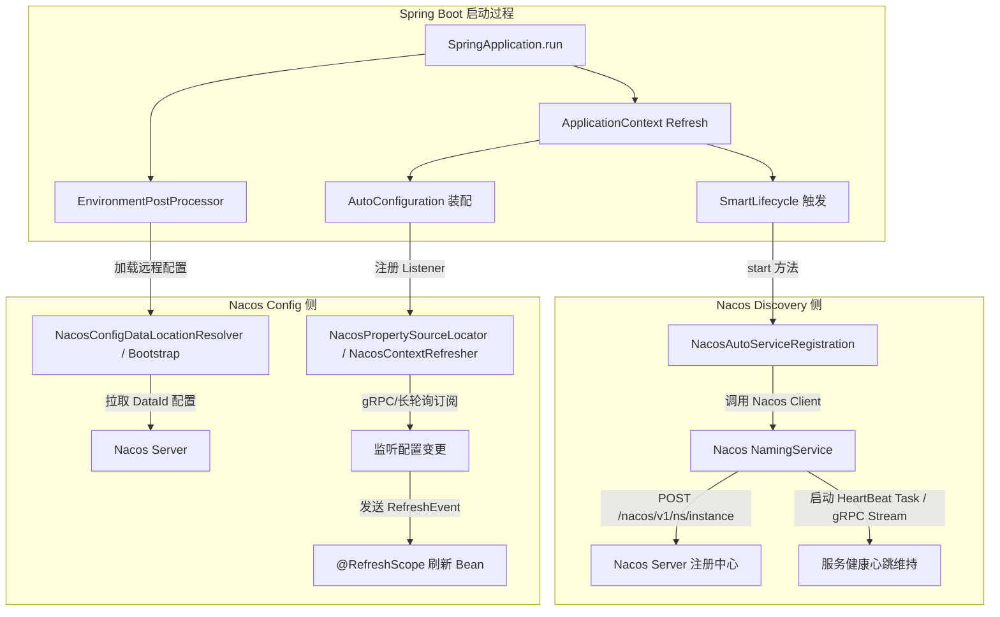
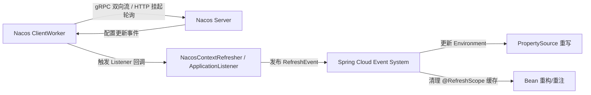
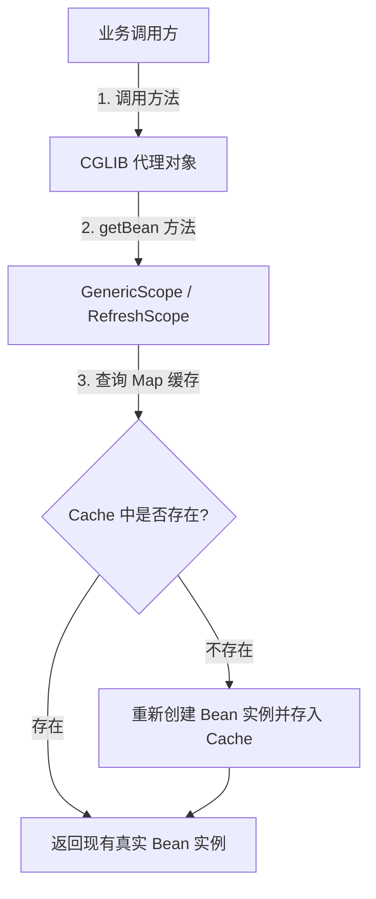

## Nacos 与 Spring Boot 集成底层原理深度剖析

在微服务架构中，Nacos 常同时充当**服务注册中心**与**配置中心**。其与 Spring Boot / Spring Cloud 的无缝集成建立在 Spring 生态的扩展机制（如 AutoConfiguration、EnvironmentPostProcessor、ApplicationListener、SmartLifecycle 等）之上。

本篇将从源码与底层机制层面，深度剖析 **Spring Boot / Spring Cloud Nacos Discovery**（服务注册与发现）和 **Spring Boot / Spring Cloud Nacos Config**（配置管理与动态刷新）的装配过程与原理。

相关：[Spring Boot 自动装配原理](15-springboot-springcloud.md)、[Nacos 动态配置管理](23-nacos-config-advanced.md)、[Spring Boot 生命周期管理](../boot/12-springboot-extension.md)。

---

## 一、 Nacos 集成架构图景



---

## 二、 服务注册与发现 (Nacos Discovery) 底层原理

Nacos 服务注册在 Spring Cloud 中依托 `spring-cloud-commons` 抽象规范实现，核心为 `ServiceRegistry` 和 `AutoServiceRegistration` 接口。

### 1. 自动装配入口

Spring Boot 应用引入 `spring-cloud-starter-alibaba-nacos-discovery` 后，在 `META-INF/spring/org.springframework.boot.autoconfigure.AutoConfiguration.imports` 中触发加载以下自动配置类：

- `NacosDiscoveryAutoConfiguration`：装配 `NacosDiscoveryProperties` 与 `NacosServiceManager`。
- `NacosServiceRegistryAutoConfiguration`：装配 `NacosServiceRegistry`、`NacosRegistration` 和 `NacosAutoServiceRegistration`。

### 2. 生命周期驱动：SmartLifecycle

服务注册不是在 Spring Bean 初始化的回调方法（如 `@PostConstruct`）中完成的，而是在 Spring 容器完全初始化、Web 服务器（如 Tomcat/Netty）启动完毕后，由 **`SmartLifecycle`** 接口触发。

```mermaid
sequenceDiagram
    autonumber
    participant App as Spring Context / WebServer
    participant Reg as NacosAutoServiceRegistration
    participant ServiceReg as NacosServiceRegistry
    participant Client as Nacos NamingService

    App->>Reg: WebServer 启动完毕，触发 SmartLifecycle.start()
    Reg->>Reg: super.start() -&gt; register()
    Reg->>ServiceReg: register(Registration)
    ServiceReg->>Client: namingService.registerInstance(...)
    Client->>Client: 提交 HeartBeatTask / 开启 gRPC 双向流
```

**关键源码逻辑：**

1. `NacosAutoServiceRegistration` 继承自 `AbstractAutoServiceRegistration`，后者实现了 `SmartLifecycle` 接口。
2. 当 Spring 容器刷新完毕且 Web 容器成功启动后，`SmartLifecycle.start()` 被调用。
3. `start()` 方法中触发 `register()`，最终由 `NacosServiceRegistry` 调用 Nacos Client 的 `NamingService.registerInstance()` 向 Nacos Server 发起 HTTP/gRPC 注册请求。

> **为什么要在 Web 服务器启动后注册？**  
> 如果在 Web 容器准备好之前注册实例，可能导致流量瞬间切入而应用尚无法处理 HTTP 请求，引发大量 502/503 报错。

### 3. 心跳机制与长连接（Nacos 1.x vs 2.x）

- **Nacos 1.x（HTTP 短轮询 + 心跳包）**：
  - 注册完成后，客户端通过 `BeatReactor` 启动定时任务 `BeatTask`（默认每 5 秒发送一次心跳包 `/nacos/v1/ns/instance/beat`）。
  - 服务端检测心跳，超 15 秒标记不健康，超 30 秒自动剔除。
- **Nacos 2.x（gRPC 长连接 + 双向流）**：
  - 客户端与 Nacos Server 建立 TCP/gRPC 长连接。
  - 健康状态通过 gRPC 链路中的 KeepAlive ping/pong 包维持，极大降低了 HTTP 频繁心跳的网络开销，延迟由秒级降至毫秒级。

---

## 三、 配置管理与动态刷新 (Nacos Config) 底层原理

Nacos 配置中心需要优先于普通 Bean 的创建加载，以便外部配置能注入到依赖 `@Value` 或 `@ConfigurationProperties` 的 Bean 中。

### 1. 引导阶段配置加载机制

Spring Boot 框架中，Nacos Config 提供了两种加载机制：

1. **Bootstrap 机制（Spring Cloud Standard）**：
   - 依赖 `spring-cloud-context`，通过 `BootstrapApplicationListener` 创建父级 `Bootstrap Context`。
   - 实现 `PropertySourceLocator` 接口（`NacosPropertySourceLocator`），在父容器启动时通过 `locate()` 方法向 Nacos Server 拉取远程 DataId 配置，并注入到 `Environment` 顶层。
2. **Spring Boot 2.4+ `spring.config.import` 机制**：
   - 基于 Spring Boot 扩展接口 `ConfigDataLocationResolver` 与 `ConfigDataLoader`。
   - `NacosConfigDataLocationResolver` 解析 `optional:nacos:xxx.yaml` 语法。
   - `NacosConfigDataLoader` 负责网络请求拉取配置并转为 `PropertySource`。

### 2. 长轮询与长连接订阅机制

配置变更的实时感知由 Nacos Client 的 `ClientWorker` 承担：



1. **配置注册监听器**：Nacos Client 在拉取配置后，会为该 DataId 注册 `Listener`。
2. **变更推送**：Nacos 2.x 中服务端配置改变时，直接通过 gRPC 流（Stream）主动推送 `ConfigChangeNotifyRequest` 到客户端。
3. **客户端通知**：`ClientWorker` 收到通知后拉取最新配置内容，并调用 Spring 注册的 Listener。

---

## 四、 动态刷新 `@RefreshScope` 底层实现

当 Nacos 配置发生变更后，Spring 容器是如何在**不重启应用**的前提下更新变量的？

### 1. RefreshEvent 事件链

当 Nacos 监听器感知到配置变化时：

1. `NacosContextRefresher` 监听到回调，发布 Spring `RefreshEvent` 事件。
2. `ContextRefresher` 或 `RefreshEventListener` 接收到事件，执行 `ContextRefresher.refresh()`。
3. 过程分为两步：
   - **更新 Environment**：重新加载并替换 `Environment` 中的 Nacos `PropertySource`。
   - **清理 Scope 缓存**：调用 `RefreshScope.refreshAll()` 销毁所有标记了 `@RefreshScope` 的 Bean 实例。

### 2. `@RefreshScope` 与 CGLIB 动态代理

`@RefreshScope` 是一个复合注解，标注了 `@Scope("refresh")` 和 `proxyMode = ScopedProxyMode.TARGET_CLASS`。



1. **代理机制**：注入到其他组件中的带有 `@RefreshScope` 的 Bean，实际上是一个 **CGLIB 动态代理类**。
2. **延迟加载**：每次调用该 Bean 的方法时，代理对象都会委托给 `ScopedProxyInterceptor`，从 `RefreshScope` 容器中通过 `getBean()` 获取真正的 Target Bean 实例。
3. **缓存失效**：当触发 `refreshAll()` 时，`RefreshScope` 仅清空内部保存 Target Bean 的 `Map` 缓存（并不立即重载所有 Bean）。
4. **懒加载重建**：当下次请求再次调用该 Bean 方法时，由于缓存为空，Spring 容器会以新的 `Environment` 属性重新实例化并初始化该 Bean，完成无感刷新。

---

## 五、 核心设计亮点与踩坑指南

### 1. 核心设计亮点

- **非阻塞高并发**：Nacos 2.x 全面使用 gRPC + Netty 进行长连接传输，相比 HTTP 轮询减少了大量连接创建和线程开销。
- **配置优先级**：Nacos PropertySource 被插到 Spring `Environment` 的最前列，确保远程配置优先于本地 `application.yml` 生效。
- **优雅停机与自动剔除**：依赖 `SmartLifecycle.stop()` 回调，应用关闭时主动发送 `deregisterInstance` 注销请求，避免灰度期间残留死节点。

### 2. 常见踩坑与排查指南

| 常见现象 | 底层原因 | 解决方案 |
| :--- | :--- | :--- |
| **`@Value` 配置无法动态刷新** | 仅配置了 `@Value`，所在类未标注 `@RefreshScope` | 在使用 `@Value` 的类上添加 `@RefreshScope`，或改用 `@ConfigurationProperties` |
| **应用启动时未注册到 Nacos** | `spring.cloud.nacos.discovery.enabled` 设置为了 `false`，或未引入 Web 依赖（无 `WebServer` 无法触发 Lifecycle） | 检查依赖与配置；若为非 Web 应用，设置 `spring.main.web-application-type=none` 并开启相关注册开关 |
| **Nacos 2.x 连接超时/注册失败** | Nacos 2.x 需额外暴露 9848 (gRPC) 和 9849 (Raft) 端口 | 防火墙/安全组中开启主端口（如 8848）加 1000 和 1001 的偏移端口 |
| **数据源/线程池刷新失效** | 复杂 Bean（如 Druid/HikariCP）内部持有旧连接，简单的属性注入无法清空连接池 | 使用 `@RefreshScope` 重新创建 DataSource 对象，或针对专门的组件编写 `EnvironmentChangeEvent` 监听器手动重载 |

---

## 六、 总结

Nacos 与 Spring Boot 的深度融合充分利用了 Spring 的扩展机制：

1. **Discovery** 借力 `SmartLifecycle` 与 `ServiceRegistry` 规范，实现基于容器生命周期的优雅注册与心跳挂载。
2. **Config** 借力 `EnvironmentPostProcessor` / `PropertySourceLocator` 实现配置预载，并通过 **CGLIB 作用域代理 (`@RefreshScope`)** 与 **`RefreshEvent`** 响应机制，达到了低侵入、高效率的运行时配置动态更新。
