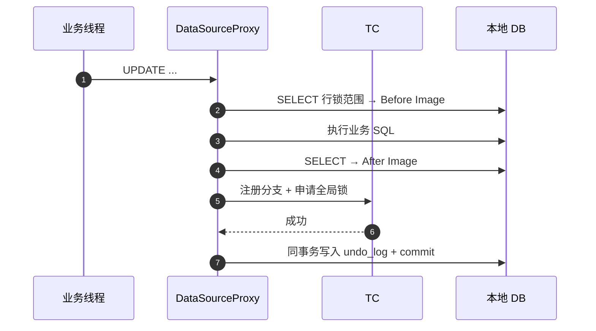
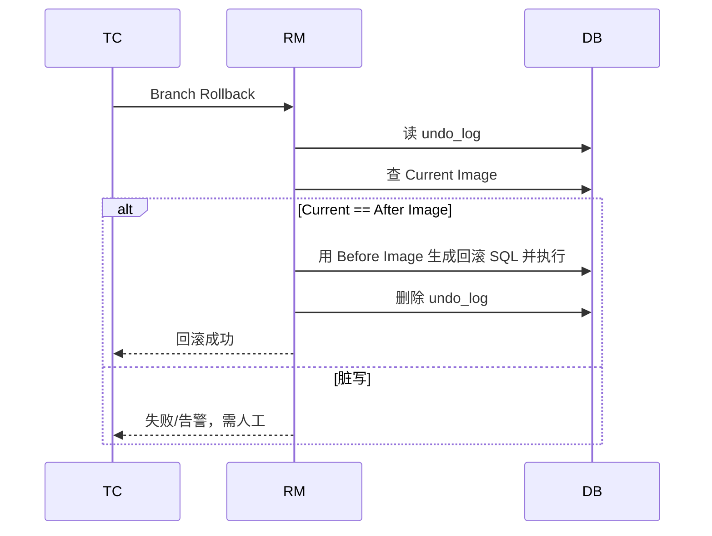

## Seata AT 模式无锁化两阶段提交原理

微服务拆库后，本地 ACID 无法覆盖跨服务写操作。Seata **AT 模式**以 DataSource 代理 + UndoLog 实现**业务低侵入**的分布式事务。本篇聚焦 AT 内核：TC/TM/RM、两阶段、全局锁与脏写检测。

实战注解与模式对比见 [Seata 分布式事务全解](25-seata-distributed-transaction.md)。

---

## 一、三大角色

| 角色 | 全称 | 职责 |
| :--- | :--- | :--- |
| **TM** | Transaction Manager | 开启/提交/回滚**全局事务**（通常是发起方服务） |
| **RM** | Resource Manager | 管理**分支事务**、注册分支、上报状态、执行二阶段 |
| **TC** | Transaction Coordinator | Seata Server：存全局/分支状态，驱动二阶段 |

```mermaid
flowchart LR
    TM -->|"begin/commit/rollback"| TC
    RM1["RM 订单库"] -->|"register/branch report"| TC
    RM2["RM 库存库"] -->|"register/branch report"| TC
    RM1 --> DB1["("order DB")"]
    RM2 --> DB2["("stock DB")"]
```

全局事务 ID：`XID`。分支事务 ID：`branchId`。跨服务调用需把 `XID` 写入 RPC 上下文（Seata 对 Feign/Dubbo 有拦截器自动透传）。

---

## 二、AT 模式本质

AT = **自动补偿的改进 2PC**：

1. 一阶段：本地事务**直接提交**业务数据 + UndoLog（不是传统 2PC 一直悬着 XA）。
2. 二阶段成功：异步删 UndoLog，几乎无业务开销。
3. 二阶段失败：用 Before Image 生成反向 SQL 补偿。

代价：依赖关系型数据库、可解析 SQL、主键/唯一键清晰；隔离靠**全局锁**补强。

---

## 三、一阶段：执行业务并提交本地事务

`DataSourceProxy` / `ConnectionProxy` 拦截 JDBC：



### 关键步骤拆解

1. **SQL 解析**：识别表、条件、更新列（支持常见 DML；复杂 SQL 可能解析失败）。
2. **Before Image**：按主键把变更前行数据查出来。
3. **执行业务 SQL**。
4. **After Image**：再查变更后镜像。
5. **向 TC 注册分支并抢全局锁**（按行主键维度）。
6. **本地原子提交**：业务行变更 + `undo_log` 同事务 commit。

`undo_log` 典型字段语义：

| 字段 | 含义 |
| :--- | :--- |
| `xid` / `branch_id` | 关联全局与分支 |
| `rollback_info` | 序列化的前后镜像与元数据 |
| `log_status` | 正常 / 防悬挂等状态 |
| `log_created` | 清理与排查用 |

一阶段结束时：**本地数据已对其他非全局事务可见**（读已提交视角），但其他 AT 事务写同行为被全局锁挡住。

---

## 四、二阶段：提交 vs 回滚

### 1. 全局提交（快乐路径）

```text
TM commit → TC 记 Global Committed → 异步通知 RM 删 undo_log、释全局锁
```

业务数据一阶段已落地，二阶段**不必再改业务行**，故 AT 提交极快。

### 2. 全局回滚



脏写判定：

$$
\text{安全回滚} \iff \text{Current Image} = \text{After Image}
$$

若中途有**未走 Seata** 的 SQL 改了同行，Current ≠ After，自动回滚会覆盖第三方写入 → Seata **拒绝自动回滚并告警**。

---

## 五、双层锁：本地锁 + 全局锁

| 锁 | 持有者 | 生命周期 | 作用 |
| :--- | :--- | :--- | :--- |
| 本地行锁 | DB（InnoDB X 锁） | 仅一阶段本地事务内 | 保护本地提交原子性 |
| 全局锁 | TC 内存/存储 | 全局事务结束前 | 防止其他 AT 事务交叉写 |

### 写写冲突时序

1. 事务 A 一阶段拿到行 R 的全局锁并本地 commit。
2. 事务 B 也要改 R：本地可执行 SQL，但**提交前申请全局锁失败**。
3. B 进入**全局锁重试等待**（可配重试次数与间隔）；等待期间可能长时间占着本地锁 → 注意超时与热点行。
4. A 全局提交/回滚后释放全局锁，B 才能继续。

### 与隔离级别

- AT 默认近似 **读未提交/读已提交** 混合观感：一阶段已提交对普通读可见。
- 若要全局读已提交，可对查询加 `@GlobalLock` 或 `SELECT FOR UPDATE` 走代理校验全局锁（有性能成本）。

---

## 六、UndoLog 与回滚 SQL 生成

回滚不是简单“反向业务 API”，而是根据镜像生成：

- `UPDATE` 回滚：`SET col=before WHERE pk=? AND col=after...`（带后镜像条件做乐观校验）
- `INSERT` 回滚：`DELETE WHERE pk=?`
- `DELETE` 回滚：`INSERT` 回补 Before Image

这也解释了为何表需要**主键**、为何禁止无主键大更新。

---

## 七、性能与可用性要点

1. **TC 集群 + 共享存储**（DB/Redis/Raft 模式按版本选型），禁止单机 TC 无持久化上生产。
2. **undo_log 表**与业务库同库（同库同事务提交）；定期清理残留（正常由二阶段删）。
3. **热点商品行**全局锁竞争会放大 RT，考虑库存分段、TCC、或最终一致性。
4. **跨服务必须传 XID**，否则下游变本地事务，全局回滚管不到。
5. **超时**：全局事务超时后 TC 会驱动回滚；业务要能接受补偿窗口。

---

## 八、与 XA / TCC 内核对比（精简）

| | AT | XA | TCC |
| :--- | :--- | :--- | :--- |
| 一阶段 | 本地已提交 + UndoLog | 分支 prepare 未提交 | Try 预留资源 |
| 二阶段成功 | 删日志 | commit | Confirm |
| 二阶段失败 | 镜像补偿 | rollback | Cancel |
| 侵入 | 低 | 低（但资源占用高） | 高 |
| 长事务 | 全局锁压力 | 连接/锁占用严重 | 设计得好更合适 |

---

## 九、总结

- AT 内核 = **代理数据源 + 前后镜像 + 全局锁 + 二阶段异步清理/补偿**。
- 提交快在“一阶段已落地”；安全在“脏写检测 + 全局锁”。
- 用 AT 前先确认：SQL 可解析、有主键、能接受全局锁语义。

落地注解、TCC 对照与避坑清单见 [Seata 全解](25-seata-distributed-transaction.md)。
