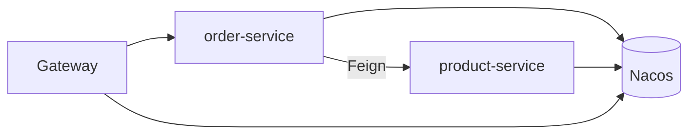

## Spring Cloud 微服务起步：架构演进与全家桶协同实战

Spring Cloud 是分布式能力的**集成标准库**：用 Spring Boot 自动装配，把注册发现、配置、网关、调用、治理、事务等组件收成可插拔 Starter。本篇给最小闭环与组件地图，细节链到各专章。

---

## 一、从单体到微服务

| 单体痛点 | 微服务收益 | 新成本 |
| :--- | :--- | :--- |
| 编译部署慢 | 独立发布 | 分布式复杂度 |
| 无法按模块扩容 | 按服务弹性伸缩 | 运维与观测 |
| 技术栈锁死 | 多语言/多版本并存 | 接口兼容 |
| 局部故障易拖垮整包 | 隔离故障域 | 需要治理与降级 |

Spring Cloud 不消灭 CAP 与分布式事务难题，只降低**集成成本**。

---

## 二、组件选型地图（Netflix → Alibaba）

| 能力 | 旧 Netflix 系 | 主流（国内） | 专章 |
| :--- | :--- | :--- | :--- |
| 注册/配置 | Eureka / Config | **Nacos** | [Nacos](23-nacos-config-advanced.md) |
| 服务调用 | Ribbon + Feign | **OpenFeign + LoadBalancer** | [远程调用](../mvc/22-mvc-remote-call.md) |
| 网关 | Zuul | **Spring Cloud Gateway** | [Gateway](21-gateway-advanced.md) |
| 流控熔断 | Hystrix | **Sentinel** | [Sentinel](27-sentinel-governance.md) |
| 分布式事务 | — | **Seata** | [Seata](25-seata-distributed-transaction.md) |
| RPC（可选） | — | **Dubbo** | [Dubbo](19-dubbo-rpc-kernel.md) |
| 安全 | Spring Security | Security + JWT/OAuth2 | [Security](../boot/28-spring-security-architecture.md) |

版本对齐：`Spring Boot` ↔ `Spring Cloud` ↔ `Spring Cloud Alibaba` 必须查官方 BOM，禁止随意拼版本。

---

## 三、最小闭环：注册 → 发现 → 调用



### 1. 公共 BOM（示意）

```xml
<dependencyManagement>
  <dependencies>
    <dependency>
      <groupId>org.springframework.cloud</groupId>
      <artifactId>spring-cloud-dependencies</artifactId>
      <version>${spring-cloud.version}</version>
      <type>pom</type>
      <scope>import</scope>
    </dependency>
    <dependency>
      <groupId>com.alibaba.cloud</groupId>
      <artifactId>spring-cloud-alibaba-dependencies</artifactId>
      <version>${sca.version}</version>
      <type>pom</type>
      <scope>import</scope>
    </dependency>
  </dependencies>
</dependencyManagement>
```

### 2. 服务提供者 product-service

```yaml
server:
  port: 8081
spring:
  application:
    name: product-service
  cloud:
    nacos:
      discovery:
        server-addr: 127.0.0.1:8848
```

```java
@RestController
@RequestMapping("/products")
public class ProductController {
    @GetMapping("/{id}")
    public Product get(@PathVariable Long id) {
        return new Product(id, "demo", 9.9);
    }
}
```

### 3. 服务消费者 order-service

```yaml
spring:
  application:
    name: order-service
  cloud:
    nacos:
      discovery:
        server-addr: 127.0.0.1:8848
```

```java
@EnableFeignClients
@SpringBootApplication
public class OrderApp {
    public static void main(String[] args) {
        SpringApplication.run(OrderApp.class, args);
    }
}

@FeignClient("product-service")
public interface ProductClient {
    @GetMapping("/products/{id}")
    Product get(@PathVariable("id") Long id);
}
```

调用方无需写死 IP；LoadBalancer 从 Nacos 取实例列表并轮询/随机选择。

### 4. 网关入口（可选但推荐）

```yaml
spring:
  application:
    name: api-gateway
  cloud:
    nacos:
      discovery:
        server-addr: 127.0.0.1:8848
    gateway:
      routes:
        - id: order
          uri: lb://order-service
          predicates:
            - Path=/order/**
          filters:
            - StripPrefix=1
```

---

## 四、推荐落地顺序

```text
1. 单服务 Boot 可运行
2. Nacos 注册发现
3. OpenFeign 调用
4. Gateway 统一入口
5. 配置外置到 Nacos
6. Sentinel 流控熔断
7. 日志追踪 (Micrometer Tracing)
8. 按需 Seata / 消息最终一致
```

不要第一天就上分布式事务与网格；先观测与治理。

---

## 五、环境与配置隔离

| 层级 | 建议 |
| :--- | :--- |
| Namespace | dev/test/prod 物理隔离 |
| 配置 | Nacos DataId 带 profile |
| 密钥 | 密文或 KMS，不进 Git |
| 依赖版本 | 父 POM + BOM 统一 |

详见 [Nacos 配置](23-nacos-config-advanced.md)。

---

## 六、可观测性底线

1. **日志**：JSON + `traceId` 透传（网关生成，Feign/RestTemplate 传递）。
2. **指标**：QPS、RT、错误率、线程池、Sentinel block 数。
3. **追踪**：Micrometer Tracing / OpenTelemetry。
4. **健康检查**：`/actuator/health` 与 Nacos 心跳一致。

没有观测的微服务 = 分布式单体黑盒。

---

## 七、常见新手坑

| 坑 | 处理 |
| :--- | :--- |
| 版本不兼容 | 用官方兼容表 BOM |
| Feign 404 | 路径/context-path/StripPrefix |
| 调到下线实例 | 检查心跳与 LoadBalancer 健康 |
| 本地能调、集群不行 | Namespace、分组、防火墙 |
| 配置不刷新 | `@RefreshScope` / 导入方式 |
| 循环依赖服务 | 领域拆分，忌服务网状互调 |

---

## 八、何时不用 Spring Cloud

- 团队小、业务简单：模块化单体 + 清晰边界更合适。
- 极致 RPC 性能：可 [Dubbo](19-dubbo-rpc-kernel.md) / gRPC，与 Cloud 可并存。
- 已上 Service Mesh：部分流量治理可下沉网格，应用侧变薄。

---

## 九、总结

- Spring Cloud = Boot 风格的分布式组件集成。
- 最小闭环：Nacos + Feign + Gateway。
- 进阶：配置动态化、Sentinel、追踪、按需 Seata。

专章路径：

- [Gateway](21-gateway-advanced.md) · [Nacos](23-nacos-config-advanced.md) · [Sentinel](27-sentinel-governance.md) · [Seata](25-seata-distributed-transaction.md) · [Security](../boot/28-spring-security-architecture.md)
