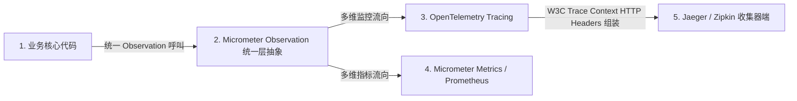
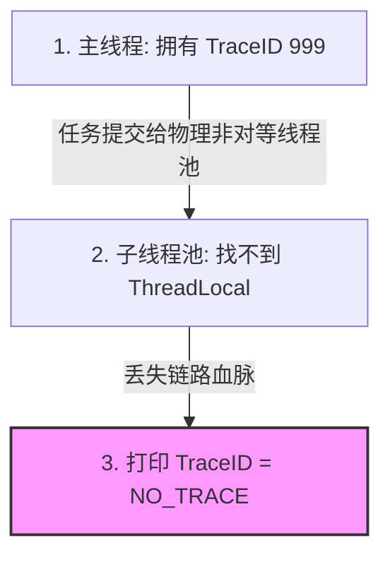

## 微服务可观测性：Spring Boot 3.x/Cloud Micrometer 与 OpenTelemetry 链路透传

在高度分散、高密度的微服务架构下（数万个并发节点在 Spring Cloud / Gateway 之间跳转呼叫），一旦一个下单服务返回了 500 错误，排障人员会面临极为头痛的窘境：
* 到底是前端网关超时、还是订单微服务被数据库拖死了、亦或是支付厂商请求不通？
* 如果各微服务日志独立存放，如何从数十亿条不相通的日志中抓出那个属于该下单请求的“元凶链路”？

要在大规模分布式战场中实现真正的、无死角的系统感知，必须依赖可观测性（Observability）体系，其由三大支柱（Three Pillars）组成： **分布式链路追踪 (Tracing)**、**系统多维时序指标 (Metrics)** 以及 **业务应用结构化日志 (Logging)**。

在现代 Java 世界的跨平台底座中，**Spring Boot 3.x 弃用了老旧的 Spring Cloud Sleuth 链路组件**，全面拥抱了基于 **Micrometer Observation API** 的可观测底座，并无缝无阻兼容了云原生基金会（CNCF）的业界标准 **OpenTelemetry (OTel)**。

---

## 一、 分布式链路追踪（Tracing）核心模型与物理模型

链路追踪的本质是：当用户发起第一次 HTTP 请求请求时，系统底层为其生成并绑定一个全局唯一的跟踪标志符号，并在接下来的 RPC（Feign、Dubbo）跳转、异步调用（ThreadPool）乃至外部消息通信（MQ）中，把这个指针像“基因”一样层层透传带到所有的子孙节点，实现跨网络连接的全链路溯源。

```mermaid
graph TD
    subgraph 用户发起请求
        Client[Client Request] -->|"生成 Trace ID: X-B3-TraceId = 999"| Gateway[1. API-Gateway]
    end

    subgraph 微服务跨网络透传 (W3C Trace Context / B3 Protocol)
        Gateway -->|"HTTP Header: TraceId=999, SpanId=001"| Order[2. Order-Service]
        Order -->|"RPC Body: TraceId=999, SpanId=002"| Pay[3. Pay-Service]
        Pay -->|"MQ Topic: TraceId=999, SpanId=003"| Notify[4. Notify-Service]
    end
```

### 1. span / Trace 概念解耦

* **`Trace`**：代表用户的一次首发分布式调用全链路全网流程。一个 Trace 仅拥有一个唯一的 **Trace ID**，用来将全子系统、全组件呼叫连成一个完美的星状或树状图；
* **`Span`**：代表这一流程中某个具体的中间步骤或某一个单一子系统中的阶段数据段。每一个 Span 拥有专属的 **Span ID**、开始时戳及终止时戳。通过在 Span 内声明 `ParentSpanId`，不同子系统即可在调用分析器中建立逻辑闭环父子结构（Parent-Child / ChildOf-Relationship）。

### 2. 国际标准 W3C Trace Context 协议报文

为了让不同厂商的软件（如 Spring Gateway、SkyWalking、Jeager、OpenTelemetry Agent）能够和谐、无阻碍地透传链路信息，W3C（万维网联盟）定义了标准的跨网络 HTTP 拦截头：

```http
traceparent: 00-4bf92f3577b34da6a3ce929d0e0e4736-00f067aa0ba902b7-01
```

拆解这组看似火星文的 HTTP Header 元信息格式：
* **`00`**：版本号（Version）。
* **`4bf92f3577b34da6a3ce929d0e0e4736`**：全球唯一的 **Trace ID**（16 字节 16 进制）。
* **`00f067aa0ba902b7`**：当前阶段的 **Parent Span ID**（8 字节 16 进制）。
* **`01`**：链路控制标志（Trace Flags）。这里其最后一个 bit `01` 代表强制采样激活（Recorded/Sampled），后台接收器将被命令把这些全指标上传存储。

---

## 二、 Spring Boot 3.x 双轮驱动底座：Micrometer 与 OpenTelemetry

在 Spring Boot 3 中，可观测性从“业务组件”提升为了“JVM 原生第一优先级功能”。
* **`Micrometer Observation`**：扮演统一的抽象控制底座。你可以只编写一套可观测埋桩代码，它能同时为你产出指标（Metrics）、链路抓取（Tracing）以及事件流（Events），让业务开发人员彻底与具体的链路中间件解耦。
* **`OpenTelemetry Bridge`**：负责物理协议层的拦截与传输。它负责在运行时对 Feign、RestTemplate 以及 Spring WebFlux 网关中的 HTTP 报文进行 W3C 协议的**注入（Inject）**与**提取（Extract）**。



---

## 三、 工业级跨拦截实战：Spring Cloud Gateway 与 Feign 极速链路透传

我们将亲手在全新的 Spring Boot 3（内置 Web 组件 + Feign 中间件）微服务群中集成 Micrometer 对 OTel W3C 协议的分布式链路透传。

### 1. Maven 统一微服务 OTel 元依赖链

在子模块及通用底层 parent 中添加以下核心可观测性 Maven POM 包：

```xml
<dependencies>
    <!-- 1. 引入 Spring Boot 统一监控底座 Actuator -->
    <dependency>
        <groupId>org.springframework.boot</groupId>
        <artifactId>spring-boot-starter-actuator</artifactId>
    </dependency>

    <!-- 2. Micrometer 对 Trace 链路透传的一致性核心桥接依赖 -->
    <dependency>
        <groupId>io.micrometer</groupId>
        <artifactId>micrometer-tracing-bridge-otel</artifactId>
    </dependency>

    <!-- 3. OpenTelemetry 核心数据报文协议打包发送器：用于将 Trace 数据实时异步上报给链路收集端（如 Jaeger） -->
    <dependency>
        <groupId>io.opentelemetry</groupId>
        <artifactId>opentelemetry-exporter-otlp</artifactId>
    </dependency>

    <!-- 4. 为 Logback 赋予将当前线程 TraceID 注入日志 %X{traceId} Mapped Diagnostic Context 的能力 -->
    <!-- 由于 Feign 在 Spring Boot 3 中基于 Micrometer 底层，故无需额外增加 Sleeuth 拦截器 -->
    <dependency>
        <groupId>io.github.openfeign</groupId>
        <artifactId>feign-micrometer</artifactId>
    </dependency>
</dependencies>
```

---

### 2. 跨网络拦截配置：可观测日志日志格式与采样率控制

在主配置文件 `application.yml` 中进行采样频度控制。因为全量采集分布式中所有的微小 Trace 会撑爆磁盘物力存储，故生产级我们通常执行比例采样：

```yaml
management:
  tracing:
    sampling:
      probability: 0.1 # 黄金比例：10% 采样。即对 10% 的请求进行分布式追踪
    enabled: true
  otlp:
    tracing:
      # 分布式链路数据异步汇总上报给本地的 OTel 收集器（Jaeger 等）
      endpoint: http://jaeger-collector:4318/v1/traces
  endpoints:
    web:
      exposure:
        include: "health,metrics,prometheus,info" # 暴露可观测终点监控站
```

---

### 3. 多日志绑定：Logback 打印 TraceId / SpanId 配置

为了让最终输出的控制台和文件日志每一行都自动附带有 TraceID，我们要利用 OTel 与 Micrometer 自带的 **MDC（Mapped Diagnostic Context，线程图存储绑定器）**在控制台日志样式（Line Pattern）中追加标记：

```xml
<?xml version="1.0" encoding="UTF-8"?>
<configuration>
    <appender name="CONSOLE" class="ch.qos.logback.core.ConsoleAppender">
        <encoder>
            <!-- 关键魔法点 %X{traceId} 与 %X{spanId} 代表自动从当前并发上下文中扣出链路标打印 -->
            <pattern>%d{yyyy-MM-dd HH:mm:ss.SSS} [%thread] %-5level %logger{36} - [TraceID: %X{traceId:-NO_TRACE}, SpanID: %X{spanId:-NO_SPAN}] - %msg%n</pattern>
        </encoder>
    </appender>

    <root level="INFO">
        <appender-ref ref="CONSOLE" />
    </root>
</configuration>
```

---

## 四、 极高危险致命盲区：大流量微服务多线程/异步线程池中的 Trace 基因丢失与自愈

在微服务开发中（如 Spring Boot 内置异步执行 `@Async` 或者高负载下自定义的线程池 `ThreadPoolTaskExecutor`），当主线程将任务提交给子线程池执行时，**由于 `ThreadLocal` 的物理边界隔离，主线程中的 TraceId 和 SpanId 信息将无法遗传给子线程，导致子线程打印的所有日志 TraceID 为 `NO_TRACE`，即链路“基因丢失”**！

如果任凭这一缺陷在生产奔行，那么链路大盘监控程序将面对一系列被“物理腰斩”的断头 Trace 报错。



### 🏆 业界顶阶无感自愈方案：基于任务装饰器（TaskDecorator）的线程克隆传递

要彻底、优雅、对架构零侵入地解决多线程链路丢失问题，必须利用 Spring 核心线程池底座自带的 `TaskDecorator`，在多线程任务交接前夕对 MDC 数据执行完美的“细胞克隆”。

```java
package com.example.config;

import org.slf4j.MDC;
import org.springframework.context.annotation.Bean;
import org.springframework.context.annotation.Configuration;
import org.springframework.core.task.TaskDecorator;
import org.springframework.scheduling.concurrent.ThreadPoolTaskExecutor;

import java.util.Map;
import java.util.concurrent.Executor;

@Configuration
public class ThreadPoolContextConfiguration {

    /**
     * 1. 核心奥义：实现任务装饰器模型
     */
    public static class MdcTaskDecorator implements TaskDecorator {
        @Override
        public Runnable decorate(Runnable runnable) {
            // [主线程执行阶段]：提取并锁存主线程在当前 MDC 绑定的 Trace 数据
            Map<String, String> contextMap = MDC.getCopyOfContextMap();
            
            return () -> {
                try {
                    // [子线程运行阶段]：执行无损克隆绑定
                    if (contextMap != null) {
                        MDC.setContextMap(contextMap);
                    }
                    runnable.run(); // 运行子线程业务逻辑
                } finally {
                    // [子线程收尾状态]：必须抹掉当前 MDC 数据，防止子线程归还线程池后污染后续运行空间
                    MDC.clear();
                }
            };
        }
    }

    /**
     * 2. 装配并绑定 Spring 全系统统一使用的并发执行线程池
     */
    @Bean(name = "concurrentTaskExecutor")
    public Executor customThreadPoolTaskExecutor() {
        ThreadPoolTaskExecutor executor = new ThreadPoolTaskExecutor();
        executor.setCorePoolSize(10);
        executor.setMaxPoolSize(20);
        executor.setQueueCapacity(200);
        executor.setThreadNamePrefix("observability-service-thread-");
        
        // 并网绑定细胞分裂器
        executor.setTaskDecorator(new MdcTaskDecorator());
        executor.initialize();
        return executor;
    }
}
```

通过这一无感装饰器方案，不管下游有多少 `@Async` 控制的底层异步分支或自定义子任务在何处并发运行，全链 TraceID 都将被无阻碍地传导和继承。这套跨系统拦截与线程池自愈的优雅架构，将为大规模生产集群保驾护航。
