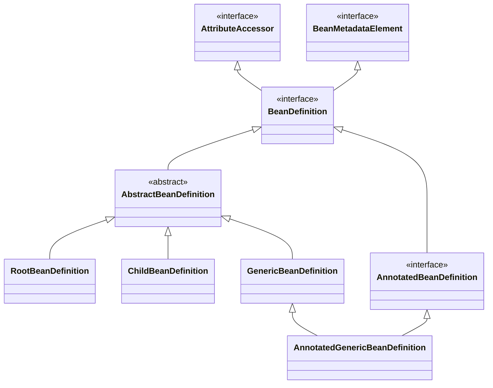
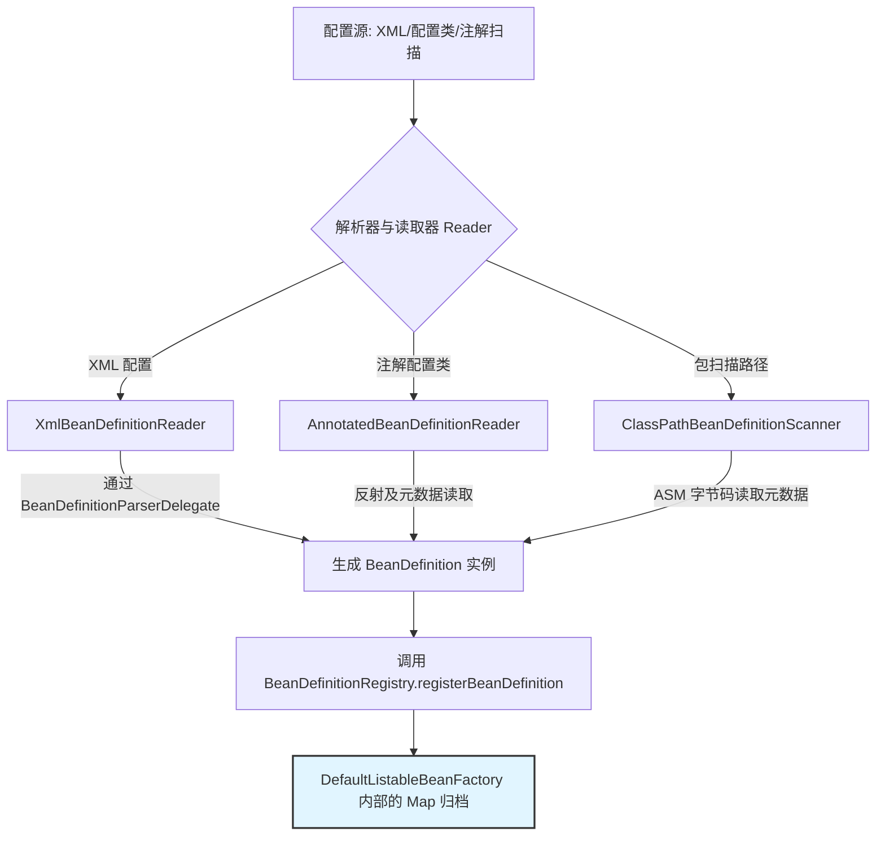

## Spring 配置类与 BeanDefinition 加载原理

Spring 容器之所以强大，是因为它将所有的配置（XML、JavaConfig、注解）统一抽象为了 **`BeanDefinition`**（Bean 定义）。理解 BeanDefinition 的生命周期与生成过程，是看懂 Spring 源码的关键。

---

## 一、 什么是 BeanDefinition？

`BeanDefinition` 接口定义了 Bean 的元数据，它是 Spring 实例化 Bean 的“图纸”。主要包含以下元数据属性：

- **`beanClassName`**：全限定类名，反射创建 Bean 实例时的依据。
- **`scope`**：作用域（`singleton`、`prototype`、`request`、`session` 等）。
- **`isLazyInit`**：是否延迟加载（仅对单例 Bean 生效）。
- **`propertyValues`**：属性注入的键值对（例如 XML 中配置的 `<property>` 或是注解配置的值）。
- **`dependsOn`**：依赖的其它 Bean，用以控制 Bean 的初始化顺序。
- **`parentName`**：父 BeanDefinition 的名称。
- **`autowireMode`**：自动装配模型（按名、按型、构造器等）。
- **`primary`**：当存在多个候选者时，是否作为首选。
- **`factoryBeanName`** 与 **`factoryMethodName`**：如果是通过工厂方法创建，则指向对应的工厂 Bean 和方法。

### 1. BeanDefinition 核心继承体系

Spring 提供了一套完善的 `BeanDefinition` 继承架构，以支持不同阶段和场景的数据表述：



- **`AbstractBeanDefinition`**：实现了 `BeanDefinition` 接口的抽象基类，封装了绝大部分公共的属性配置及默认行为（如校验方法、克隆支持等）。
- **`RootBeanDefinition`**：代表一个**根级**的 Bean 定义。
  - 在运行时，Spring 会将子定义与父定义合并，生成一个只读的合并后 Bean 定义（**MergedBeanDefinition**），其类型必然是 `RootBeanDefinition`。
  - 容器实例化 Bean 时，统一读取的都是 `RootBeanDefinition`。
- **`ChildBeanDefinition`**：代表一个**子级**的 Bean 定义，必须依赖 `parentName` 继承父定义的属性。由于设计僵化，在 Spring 2.5 之后已不再推荐显式使用，由 `GenericBeanDefinition` 取代。
- **`GenericBeanDefinition`**：**通用型** Bean 定义。
  - 允许在运行时动态设置 `parentName`，支持灵活的一级或多级继承。它是现代 Spring 内部读取配置（如 XML）时默认产生的核心类。
- **`AnnotatedBeanDefinition`** 接口：扩展了对**注解元数据（AnnotationMetadata）**的访问接口，可以直接获取类上标注的注解信息而无需提前加载对应的 Class 字节码。
  - 其主要实现类包括 **`AnnotatedGenericBeanDefinition`**（解析 `@Configuration` 或手动导入的类）以及 **`ScannedGenericBeanDefinition`**（通过类路径扫描 `@Component` 等发现的类）。

---

## 二、 加载与注册的全流程

Spring 如何将各种外源配置统一转化为容器内的 `BeanDefinition` 并在内存中归档？其核心处理流程如下：



### 1. 核心仓库：BeanDefinitionRegistry

在 Spring 的默认 IoC 容器实现类 `DefaultListableBeanFactory` 中，所有的 BeanDefinition 都存放在一个 Map 里：

```java
// 核心注册表：以 beanName 为 key，BeanDefinition 为 value
private final Map<String, BeanDefinition> beanDefinitionMap = new ConcurrentHashMap<>(256);

// 保持注册顺序的列表
private final List<String> beanDefinitionNames = new ArrayList<>(256);
```

注册操作需要确保线程安全，并通过双重检查（Double-Checked Locking）及写时复制（Copy-On-Write）技术处理并发写入与读取。

### 2. 解析器解析细节

- **`XmlBeanDefinitionReader`**：加载 XML 资源，利用 DOM 解析生成 Document 对象，然后委派给 `BeanDefinitionParserDelegate` 代理类，遍历 XML 标签并解析 `<bean>`、`<property>`、`<constructor-arg>` 等节点。
- **`ClassPathBeanDefinitionScanner`**：
  - 扫描指定 Package 路径下的所有 `.class` 文件。
  - **关键性能优化**：为了避免将未使用的 Class 强行加载进 JVM 导致永久代/元空间爆满，扫描器在底层使用 **ASM** 字节码读取框架，直接读取二进制文件的元数据信息（`SimpleMetadataReader`），如果符合 `@Component` 过滤条件，才将其转换成 `ScannedGenericBeanDefinition`。

---

## 三、 @Configuration 解析深度内幕

Spring 能够解析并生效 `@Configuration`、`@ComponentScan` 等注解，完全得益于一个极其重要的容器后置处理器：**`ConfigurationClassPostProcessor`**。它实现了 `BeanDefinitionRegistryPostProcessor` 接口。

### 1. Full 模式与 Lite 模式

Spring 会对标注了配置相关注解的类进行分类标记：

- **Full 模式**（配置类）：类上标注了 `@Configuration` 且 `proxyBeanMethods` 属性为 `true`。
  - **核心特性**：Spring 会使用 **CGLIB** 为该类生成代理子类。
  - **目的**：为了保证 Bean 的**单例机制**。当在配置类内部的一个 `@Bean` 方法中直接调用另一个 `@Bean` 方法时（例如 `methodA()` 内部调用 `methodB()`），CGLIB 代理会拦截该方法调用，转而从容器中去获取 `methodB` 产生的 Bean 实例，而不是真的执行两次方法逻辑去创建两个 Java 对象。
- **Lite 模式**（精简配置类）：类上标注了 `@Component`、`@ComponentScan`、`@Import`，或者仅仅在普通类的方法上标注了 `@Bean`。
  - **特性**：Spring 不会生成 CGLIB 代理。方法间内部调用按纯粹的 Java 语言规范执行，这意味着多次调用同一个 `@Bean` 方法会产生多个不同的 Java 实例。

### 2. 深度剖析：CGLIB 代理如何实现单例拦截？

当 `ConfigurationClassPostProcessor` 执行 `postProcessBeanFactory` 方法时，它会扫描容器中所有的 Full 模式配置类，并执行以下增强步骤：

1. **增强处理类**：调用 `ConfigurationClassEnhancer.enhance(configClass, classLoader)`。
2. **生成代理字节码**：利用 CGLIB 构建一个继承自该配置类的代理类。
3. **注入 Callback 拦截器**：
   - **`BeanMethodInterceptor`**：核心拦截器。
     - 当拦截到配置类的方法调用时，首先检查该方法是否为 `@Bean` 方法，以及当前执行的上下文。
     - 如果是在外部容器初始化或者依赖注入时调用，它会放行，真实执行方法体并创建对象。
     - 如果是在 `@Bean` 方法内部调用另一个 `@Bean` 方法，拦截器会感知到，并调用 `beanFactory.getBean(beanName)` 从 IoC 容器中寻找或实例化目标单例 Bean 并返回。

```mermaid
sequenceDiagram
    autonumber
    participant App as 业务方法
    participant Proxy as CGLIB 代理配置类
    participant Interceptor as BeanMethodInterceptor
    participant Factory as DefaultListableBeanFactory
    participant Target as 原始配置类方法体

    App->>Proxy: 调用 @Bean 方法 myService()
    Proxy->>Interceptor: 拦截方法调用
    Interceptor->>Interceptor: 检查当前线程调用栈
    alt 是普通方法内调用 (如 myController 内部调用)
        Interceptor->>Factory: beanFactory.getBean("myService")
        Factory-->>Interceptor: 返回单例对象
    else 是另一个 @Bean 方法内部直接调用
        Interceptor->>Factory: 寻找对应 Bean 是否已存在于容器
        alt 已存在
            Factory-->>Interceptor: 直接返回容器中的单例
        else 不存在
            Interceptor->>Target: 执行原始方法体代码 (new MyService())
            Target-->>Interceptor: 返回新创建的对象
            Interceptor->>Factory: 将对象注册入单例池中
        end
    end
    Interceptor-->>Proxy: 返回最终确定的单例 Bean
    Proxy-->>App: 拿到单例对象
```



---

## 四、 @Import 的三种玩法与自动装配支撑

`@Import` 注解是 Spring Boot 实现自动装配的核心机制，它允许动态地向容器中导入并注册额外的 `BeanDefinition`。

| 导入类型 | 实现方式 | 运行机制 | 适用场景 |
| :--- | :--- | :--- | :--- |
| **普通类** | `class ConfigClass` | 直接把该类当作普通 `@Component` 进行加载与注册。 | 静态引入外部组件配置。 |
| **ImportSelector** | 实现 `selectImports` 接口 | 运行期根据注解元数据，动态返回**全限定类名数组**。Spring 随后依次加载并注册这些类。 | 动态条件装配（如 Spring Boot 扫描所有 `spring.factories` 下的自动配置类）。 |
| **ImportBeanDefinitionRegistrar** | 实现 `registerBeanDefinitions` 接口 | 接口直接暴露了 `BeanDefinitionRegistry`。允许开发者直接以编程方式手动组装、定制并注册 `BeanDefinition`。 | 高级框架整合（如 MyBatis 的 `@MapperScan`，通过动态代理将 Mapper 接口注册为 MapperFactoryBean 的 BeanDefinition）。 |

---

## 五、 面试精选 Q&A

### Q1：为什么 Spring 启动时要先解析所有的 BeanDefinition，而不是直接创建 Bean？

1. **统一接口与松耦合**：Spring 必须支持多种配置源（XML、properties、Java 注解、Web 描述符等）。通过将不同的配置统一解析为 `BeanDefinition` 这一中间媒介，将“**配置定义**”与“**实例化/依赖注入**”两大生命周期阶段彻底解耦。
2. **允许在实例化前实施干预**：Spring 提供了 `BeanFactoryPostProcessor` 扩展接口。在所有 `BeanDefinition` 注册完毕、但尚未创建 Bean 实例前，允许开发者通过编写自定义处理器来读取或修改定义（例如：`PropertySourcesPlaceholderConfigurer` 在此阶段将 `${db.url}` 占位符替换为真实的数据库配置连接值）。
3. **前置合法性校验**：通过在内存中提前持有所有 Bean 的元数据，可以提早检测出属性不合规、构造器缺失、循环依赖等错误，防止在运行时执行了一半才崩溃。

### Q2：手动向容器注册 Bean 的正确姿势？

在企业级扩展开发中，如果需要手动编码注册，可采用以下标准步骤：
1. 实现 `BeanDefinitionRegistryPostProcessor` 接口（或通过 ApplicationContext 获取 BeanFactory 并强转为 `BeanDefinitionRegistry`）。
2. 使用 `BeanDefinitionBuilder` 构建具体的定义信息。
3. 设定作用域、自动装配模式等属性。
4. 调用 `registry.registerBeanDefinition(beanName, beanDefinition)` 完成注册。

```java
public class MyRegistry implements BeanDefinitionRegistryPostProcessor {
    @Override
    public void postProcessBeanDefinitionRegistry(BeanDefinitionRegistry registry) throws BeansException {
        // 1. 使用构建器创建 GenericBeanDefinition
        BeanDefinitionBuilder builder = BeanDefinitionBuilder.genericBeanDefinition(MyCustomService.class);
        // 2. 注入依赖属性
        builder.addPropertyReference("dependencyBean", "otherServiceName");
        builder.setScope(BeanDefinition.SCOPE_SINGLETON);
        // 3. 注册到容器注册表中
        registry.registerBeanDefinition("myCustomService", builder.getBeanDefinition());
    }

    @Override
    public void postProcessBeanFactory(ConfigurableListableBeanFactory beanFactory) throws BeansException {}
}
```
