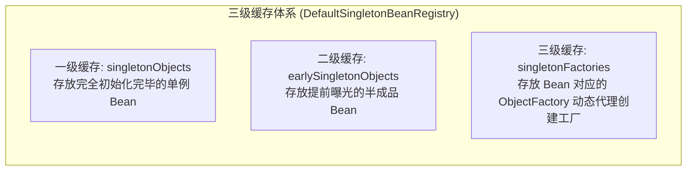
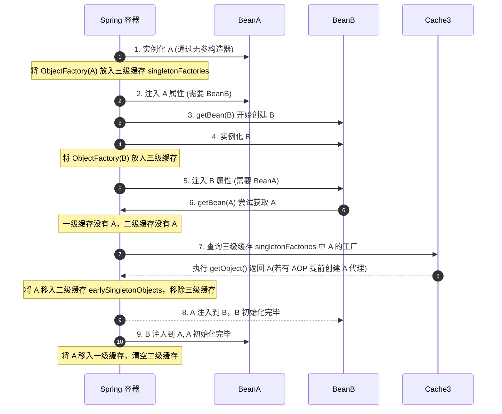
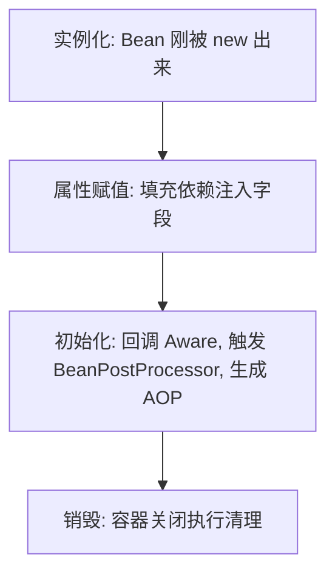

## Spring 核心与生态面试真题

本专栏致力于为中高级 Java 开发人员提供最硬核、直击底层原理、结合生产实战的 Spring 框架及微服务生态面试真题剖析。每个知识点都配有详尽的答案、核心源码流程、以及辅助理解的 IOC/AOP 依赖注入与缓存流转图。

---

## 📂 模块四：Spring 底层与微服务生态

### Q1：Spring 框架如何解决三级缓存下的循环依赖问题？只有二级缓存行不行？

在 Spring 中，单例 Bean 的创建过程被分解为：**实例化**（分配堆内存，通过构造器反射建空对象）与 **初始化**（依赖注入字段属性填入，调用配置方法）。以此为核心，Spring 提供了优雅的三级缓存。



#### 1. 经典三级缓存设计与核心流程

- **第一级缓存 `singletonObjects`**：

  存放完全属性注入、初始完成、可以直接投入业务使用的单例 Bean。

- **第二级缓存 `earlySingletonObjects`**：

  存放提前暴露的“半成品单例 Bean”（已在堆上反射创建出来，但可能还未完成字段属性 `@Autowired` 的值填入）。

- **第三级缓存 `singletonFactories`**：

  存放包装了该 Bean 构造实例的 **工厂对象 `ObjectFactory<?>`**。

#### 2. 三级缓存的核心运作逻辑



- **第一阶段（A 实例化完毕后）**：

  A 刚反射建立，Spring 通过 `addSingletonFactory` 将其生存控制权以及生成的 A 匿名构造 Lambda（`ObjectFactory`）写入**第三级缓存 `singletonFactories`** 中。

- **第二阶段（A 装配属性由于需要 B，触发 B 实例化加载）**：

  B 创建后在进行依赖注入。它也同样引用 `@Autowired A`，于是发起 `getBean("A")`。

- **第三阶段（B 反向拉取三级缓存中的 A）**：

  在三级缓存的 A 内，B 会调用 `ObjectFactory.getObject()`。在这里，Spring 的 `AbstractAutoProxyCreator` 会介入进行判断：**如果该 Bean A 需要切面代理（如 AOP），则当即生成一个 A 的动态代理（Proxy）对象返回；如果无 AOP，则原封不动将裸 Bean A 返回**。
  最后 B 将其装载，并将 A 从三级缓存挪出并存入**第二级缓存 `earlySingletonObjects`** 锁定其唯一引用。

- **第四阶段（B 成功完成注入，返回给 A 最终大功告成）**：

  B 彻底完成所有生命流程，移入一级缓存。A 获取到合法的 B 后，随之也走完余下各种 PostProcessor 初始，晋升到一级缓存，扫除临时缓存。

#### 3. 为什么只有两级缓存解决不了 AOP 场景下的循环依赖？

**结论：如果只是普通对象的互相引用，二级甚至一级就已经足够；但如果要支持“AOP 动态切面代理生成”的循环依赖，第三级缓存是不可舍去的唯一解。**

- **为什么不能直接在二级缓存中放裸对象，最后做 AOP？**：

  由于 Java 里的 AOP 代理是通过基于代理类包裹（或继承）原对象来实现的，**代理类对象（Proxy）和我们的原始裸对象在内存中是两个独立的物理引用**。如果不提早处理，B 在装载 A 时，由于 A 还未完成最终的 AOP 字节码构建，B 将会装载进一个**原始裸 A 对象**。

- **那为什么不在实例化之后立即无脑为所有 Bean 创建 AOP 代理，放入二级缓存？**：

  这严重打破了 Spring 的生命周期规范设计哲理和职责分离原则！
  在正常情况下，Spring 必须经历原始对象的属性填充 -> Aware 接口拉取 -> 全部生命流程之后，在最后一步通过 `BeanPostProcessor` 实现 AOP 代理。
  **第三级缓存（`ObjectFactory`）本质属于一种“延迟触发提前代理”的懒加载安全机制**：
  只有当且仅当“发生了实质性的循环依赖”（即 B 此时立刻需要拉取提前的 A）时，它才由第三级缓存里的 ObjectFactory 被动触发 AOP 代理生成并移入二级缓存。如果不存在循环依赖，AOP 永远是在最后一步、以最正常的生命周期标准执行代理。

---

### Q2：Spring Bean 的生命周期是怎样的？如果让你设计，你会如何划分阶段，并在其中预留哪些扩展点？

在面试中，理解 Bean 的生命周期不能死记硬背，必须将其与 Spring 的职责分离机制结合起来。

#### 1. 四大核心阶段

1. **实例化（Instantiation）**：
   通过反射或工厂方法在堆内存中为对象分配空间，生成原始的“裸对象”。对应方法：`createBeanInstance()`。
2. **属性赋值（Populate）**：
   执行依赖注入，填充该对象的属性字段。对应方法：`populateBean()`。
3. **初始化（Initialization）**：
   执行生命周期的回调、感知接口（Aware）以及代理增强。对应方法：`initializeBean()`。
4. **销毁（Destruction）**：
   容器关闭时释放资源。



#### 2. 三大核心扩展点设计

Spring 设计了极其优秀的扩展接口，允许开发者深度定制 Bean：

- **BeanFactoryPostProcessor（工厂后置处理器）**：
  在所有 Bean **实例化之前**触发。操作的是 `BeanDefinition`（元数据名册），可以动态修改 Bean 的配置属性、替换 `${...}` 占位符。
- **Aware 感知接口**：
  在初始化阶段早期触发，使 Bean 能够感知到容器本身的环境。如通过实现 `ApplicationContextAware` 获取 Spring 上下文容器。
- **BeanPostProcessor（Bean 后置处理器）**：
  作用于**每个 Bean 初始化方法的执行前后**（`postProcessBeforeInitialization` 和 `postProcessAfterInitialization`）。**AOP 动态代理的织入** 就是在初始化之后的后置处理器中完成的。

详细生命周期代码追踪与流程图，请参见 [Bean 生命周期](file:///Users/dwx/Documents/GitHub/AiDocs/docs/java/spring/bean-lifecycle.md) 与 [IoC 与 AOP 深度解析](file:///Users/dwx/Documents/GitHub/AiDocs/docs/java/spring/ioc-aop.md#一-spring-bean-的生命周期)。

---

### Q3：@Autowired 与 @Resource 有何区别？在同类型多 Bean 的情况下，Spring 又是如何决策的？

在开发中，依赖注入是非常频繁的操作。理清这两者的区别，对解决装配歧义有很大帮助。

#### 1. 核心机制对比

- **`@Autowired`**：由 Spring 原生提供，默认按照**类型（byType）**进行依赖寻找。底层由 `AutowiredAnnotationBeanPostProcessor` 实现。
- **`@Resource`**：属于 JSR-250 规范，默认按照**名称（byName）**进行依赖寻找。只有当找不到名称匹配的 Bean 时，才会回退按类型装配。底层由 `CommonAnnotationBeanPostProcessor` 实现。

#### 2. 存在同类型多 Bean 时的装配决策链

当使用 `@Autowired` 声明注入，且容器中存在多个相同类型的 Bean 时，Spring 会按照以下步骤进行裁决：

1. **基本查找**：在容器中筛选出所有匹配该类型的 Bean。
2. **唯一性判断**：若只有一个，则直接注入；若没有，且 `required = true`，则抛出异常。
3. **Primary 裁决**：检查这组同类型 Bean 中，是否有某一个标注了 `@Primary` 注解。如果有，则优先注入该主 Bean。
4. **Priority 排序**：检查是否有 JSR-250 规范中的 `@Priority` 优先级标记，数值越小优先级越高。
5. **属性名兜底匹配**：如果以上皆未成功，Spring 会尝试用**当前属性字段的变量名**去容器中匹配 Bean 的名字（即退化为 byName）。如果正好匹配上，则成功注入。
6. **Qualifier 精确匹配**：如果结合了 `@Qualifier("beanName")`，则跳过上述逻辑，直接按指定的名称在同类型中精准匹配。
7. **彻底失败**：如果上述所有关卡都未能决定唯一的 Bean，Spring 将抛出著名的 `NoUniqueBeanDefinitionException`。

有关这两个注解的源码级分析，请参考 [常用注解底层解析](file:///Users/dwx/Documents/GitHub/AiDocs/docs/java/spring/annotations.md#一-核心装配注解autowired-与-resource)。

---

### Q4：Spring 声明式事务 @Transactional 在什么情况下会失效？底层原理是什么？

这是一个极其经典的生产实践及高频面试题。Spring 事务底层基于 AOP 动态代理实现，因此绝大多数失效场景都是因为**绕过了代理对象**或**数据库/异常机制配置不合理**。

#### 1. 经典失效场景及根本原因

- **类内部自我调用（Self-Invocation）**：
  在同一个 Service 类中，非事务方法 A 内部直接调用了同一个类中的事务方法 B。
  - *原因*：方法 A 是通过 `this.B()` 调用的，`this` 代表当前裸对象本身，绕过了 Spring 生成的代理对象（Proxy），导致 B 的事务拦截器 `TransactionInterceptor` 无法被触发。
- **方法修饰符不是 public**：
  在 `private`、`protected` 或包私有的方法上标注了 `@Transactional`。
  - *原因*：Spring 事务管理器为了防止误切入，默认在解析切点时会检查方法访问权限。如果不是 `public`，则直接忽略。
- **异常被 swallow（吞掉）**：
  方法内使用 `try-catch` 捕获了异常且未重新向外抛出。
  - *原因*：Spring 事务只有在捕获到未处理的异常时，才会通过 AOP 切面触发 `rollback`。如果异常在内部被吞掉，Spring 认为方法成功结束，照常提交事务。
- **抛出了 Checked Exception（受检异常）**：
  方法抛出了 `IOException` 或 `SQLException` 等受检异常。
  - *原因*：Spring 默认只在遇到 `RuntimeException`（运行时异常）和 `Error` 时进行事务回滚。
  - *解决*：需要配置 `@Transactional(rollbackFor = Exception.class)`。
- **多线程/异步方法调用（@Async）**：
  事务方法 A 中启动了新线程去执行数据库操作。
  - *原因*：Spring 的事务上下文（包括数据库连接 Connection）是通过 `ThreadLocal` 绑定在当前线程上的。新线程无法共享父线程的 Connection，因此其操作不受原事务控制。

完整的 12 种失效场景及对应的解决方案，请参见 [事务传播与失效深度解析](file:///Users/dwx/Documents/GitHub/AiDocs/docs/java/spring/transaction.md#二-声明式事务-transactional-失效的-12-种场景)。

---

### Q5：为什么 @Configuration 注解默认是 CGLIB 代理的？如果关闭代理会有什么后果？

在 Spring 中，配置类可以用 `@Configuration` 声明，也可以用普通的 `@Component` 声明（通常称为 Lite 模式）。这两者在方法间互相调用时的行为差异极大。

#### 1. 保证单例的秘密：proxyBeanMethods = true

In `@Configuration` 中，`proxyBeanMethods` 默认是 `true`。这意味着 Spring 在加载此配置类时，会使用 CGLIB 生成配置类的子代理类（Full 模式）。

#### 2. 底层运行机制

假设我们有如下配置：

```java
@Configuration
public class MyConfig {
    @Bean
    public User user() {
        return new User();
    }

    @Bean
    public Order order() {
        // 方法内部直接调用了上面的 user() 方法
        return new Order(user()); 
    }
}
```

- **如果开启代理（默认）**：
  当执行到 `order()` 方法内部的 `user()` 调用时，CGLIB 拦截器会截获此方法调用。它不会执行 `user()` 方法本身，而是拦截并转为在 Spring 容器中调用 `beanFactory.getBean("user")`。这样保证了注入到 `order` 中的 `user` 实例和直接从容器中获取的 `user` 实例是同一个，确保了单例规范。
- **如果关闭代理（`proxyBeanMethods = false`）**：
  Spring 不会生成代理类，而是把它当作普通的 Java 对象。调用 `new Order(user())` 时，会直接进入 `user()` 方法体执行 `new User()`。这会导致 `order` 里的 `user` 是一个全新创建的对象，而容器中管理着另一个 `user`，破坏了单例模式。

#### 3. 最佳实践

如果配置类中的 `@Bean` 方法之间**不存在任何调用关系**，强烈建议配置为 `@Configuration(proxyBeanMethods = false)`。这样可以跳过 CGLIB 动态字节码的生成，使启动速度变快，并节省系统内存。

详细细节可参考 [常用注解底层解析](file:///Users/dwx/Documents/GitHub/AiDocs/docs/java/spring/annotations.md#三-配置类注解configuration-深度工作机制)。

---

### Q6：Spring Boot 自动装配原理是什么？它与 SPI 机制有什么联系？

Spring Boot 最核心的特点是“约定优于配置”和“开箱即用”，这在底层全部依赖于自动装配机制（Auto-Configuration）。

#### 1. 自动装配的核心流程

1. **入口注解**：启动类上的 `@SpringBootApplication` 是一个复合注解，其中最核心的是 `@EnableAutoConfiguration`。
2. **导入选择器**：`@EnableAutoConfiguration` 通过 `@Import` 引入了 `AutoConfigurationImportSelector`，该选择器负责动态向容器导入组件。
3. **SPI 读取**：
   - 在 Spring Boot 2.x 中，选择器通过 `SpringFactoriesLoader` 去扫描类路径下所有 jar 包里的 `META-INF/spring.factories` 文件。
   - 在 Spring Boot 3.x 中，改为读取 `META-INF/spring/org.springframework.boot.autoconfigure.AutoConfiguration.imports` 文件。
   - 读取这些文件中配置的 `EnableAutoConfiguration` 对应的自动配置类（如 `MySqlAutoConfiguration`、`RedisAutoConfiguration`）。
4. **条件裁决**：
   这些自动配置类上往往标注了大量的 `@Conditional` 条件注解（如 `@ConditionalOnClass`、`@ConditionalOnMissingBean`）。Spring 会根据当前应用中是否引入了相应的 jar 包或是否定义了相同的 Bean，来动态决定是否加载此配置类。

```mermaid
graph TD
    Start[应用启动] --> Autoconfig[@EnableAutoConfiguration 激活]
    Autoconfig --> Selector[AutoConfigurationImportSelector 扫描]
    Selector --> SPI[SPI 机制: 读取 imports 或 spring.factories]
    SPI --> LoadConfig[加载所有的 XxxAutoConfiguration 配置类]
    LoadConfig --> Condition{是否满足 @ConditionalOnXxx?}
    Condition -->|Yes| Register[注册 Bean 进 IoC 容器]
    Condition -->|No| Filter[过滤丢弃，不加载]
```

关于 Spring Boot 的 SPI 加载机制和自定义 Starter 实践，可以参考 [Boot 扩展机制与 SPI](file:///Users/dwx/Documents/GitHub/AiDocs/docs/java/spring/springboot-extension.md#一-springboot-spi-机制详解)。
