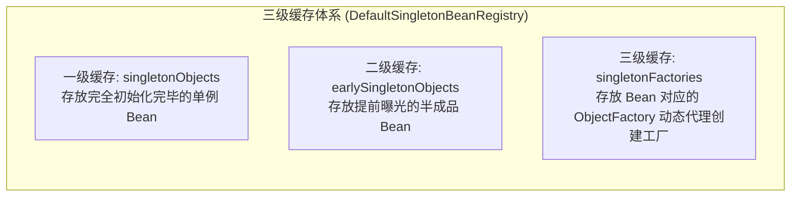
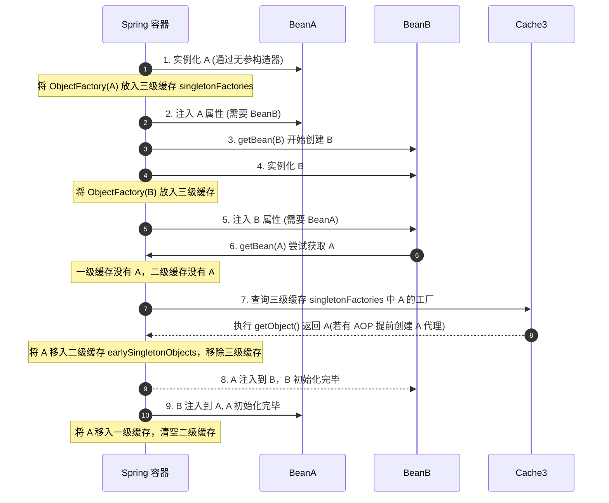

## Spring 核心与生态面试真题

本专栏致力于为中高级 Java 开发人员提供最硬核、直击底层原理、结合生产实战的 Spring 框架及微服务生态面试真题剖析。每个知识点都配有详尽的答案、核心源码流程、以及辅助理解的 IOC/AOP 依赖注入与缓存流转图。

---

## 📂 模块四：Spring 底层与微服务生态

### Q1：Spring 框架如何解决三级缓存下的循环依赖问题？只有二级缓存行不行？

在 Spring 中，单例 Bean 的创建过程被分解为：**实例化**（分配堆内存，通过构造器反射建空对象）与 **初始化**（依赖注入字段属性填入，调用配置方法）。以此为核心，Spring 提供了优雅的三级缓存。

#### 1. 经典三级缓存设计与核心流程

- **第一级缓存 `singletonObjects`**：

  存放完全属性注入、初始完成、可以直接投入业务使用的单例 Bean。

- **第二级缓存 `earlySingletonObjects`**：

  存放提前暴露的“半成品单例 Bean”（已在堆上反射创建出来，但可能还未完成字段属性 `@Autowired` 的值填入）。

- **第三级缓存 `singletonFactories`**：

  存放包装了该 Bean 构造实例的 **工厂对象 `ObjectFactory<?>`**。

#### 2. 三级缓存的核心运作逻辑

- **第一阶段（A 实例化完毕后）**：

  A 刚反射建立，Spring 通过 `addSingletonFactory` 将其生存控制权以及生成的 A 匿名构造 Lambda（`ObjectFactory`）写入**第三级缓存 `singletonFactories`** 中。

- **第二阶段（A 装配属性由于需要 B，触发 B 实例化加载）**：

  B 创建后在进行依赖注入。它也同样引用 `@Autowired A`，于是发起 `getBean("A")`。

- **第三阶段（B 反向拉取三级缓存中的 A）**：

  在三级缓存的 A 内，B 会调用 `ObjectFactory.getObject()`。在这里，Spring 的 `AbstractAutoProxyCreator` 会介入进行判断：**如果该 Bean A 需要切面代理（如 AOP），则当即生成一个 A 的动态代理（Proxy）对象返回；如果无 AOP，则原封不动将裸 Bean A 返回**。
  最后 B 将其装载，并将 A 从三级缓存挪出并存入**第二级缓存 `earlySingletonObjects`** 锁定其唯一引用。

- **第四阶段（B 成功完成注入，返回给 A 最终大功告成）**：

  B 彻底完成所有生命流程，移入一级缓存。A 获取到合法的 B 后，随之也走完余下各种 PostProcessor 初始，晋升到一级缓存，扫除临时缓存。

#### 3. 为什么只有两级缓存解决不了 AOP 场景下的循环依赖？

**结论：如果只是普通对象的互相引用，二级甚至一级就已经足够；但如果要支持“AOP 动态切面代理生成”的循环依赖，第三级缓存是不可舍去的唯一解。**

- **为什么不能直接在二级缓存中放裸对象，最后做 AOP？**：

  由于 Java 里的 AOP 代理是通过基于代理类包裹（或继承）原对象来实现的，**代理类对象（Proxy）和我们的原始裸对象在内存中是两个独立的物理引用**。如果不提早处理，B 在装载 A 时，由于 A 还未完成最终的 AOP 字节码构建，B 将会装载进一个**原始裸 A 对象**。

- **那为什么不在实例化之后立即无脑为所有 Bean 创建 AOP 代理，放入二级缓存？**：

  这严重打破了 Spring 的生命周期规范设计哲理和职责分离原则！
  在正常情况下，Spring 必须经历原始对象的属性填充 -> Aware 接口拉取 -> 全部生命流程之后，在最后一步通过 `BeanPostProcessor` 实现 AOP 代理。
  **第三级缓存（`ObjectFactory`）本质属于一种“延迟触发提前代理”的懒加载安全机制**：
  只有当且仅当“发生了实质性的循环依赖”（即 B 此时立刻需要拉取提前的 A）时，它才由第三级缓存里的 ObjectFactory 被动触发 AOP 代理生成并移入二级缓存。如果不存在循环依赖，AOP 永远是在最后一步、以最正常的生命周期标准执行代理。
