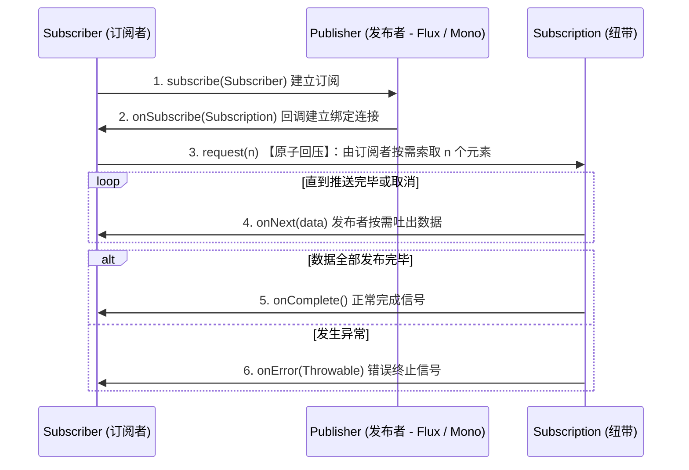

## 反应式编程规范与响应式 WebFlux 底层设计

在传统的 Servlet（如 Spring MVC）多线程阻塞模型中，每个外部 HTTP 请求都对应并强行绑定一条独立的 OS 线程（即 **Thread-per-Request** 模型）。当面对海量 I/O 并发（如慢速网络文件上传、高频微服务透传调用）时，由于大量线程因等待网络/文件读写而被迫陷入阻塞阻塞状态，线程池会被瞬间挤爆，上下文切换（Context Switch）的开销和多余的线程内存驻留成倍跃升，导致吞吐率发生严重雪崩。

为了在海量 I/O 下最大化榨干单机硬件的极限，**反应式编程规范 (Reactive Streams)**、底座实现 **Project Reactor (Flux/Mono)** 以及响应式服务端 **Spring WebFlux (基于 Netty 异步双工非阻塞)** 应运而生。

---

## 一、 Thread-per-Request (Servlet) 与 Event-Loop 线程模型对决

```mermaid
graph TD
    subgraph 传统 Servlet 阻塞模型 (Thread-per-Request)
        ClientA[请求 A] --> Thread1["线程 1: 执行 DB 查询 - 阻塞等待 100ms"]
        ClientB[请求 B] --> Thread2["线程 2: 执行 API 调用 - 阻塞等待 500ms"]
        style Thread1 fill:#f9f,stroke:#333
        style Thread2 fill:#f9f,stroke:#333
    end

    subgraph 响应式 Event-Loop 非阻塞模型
        RCA[请求 A] --> EL[Event-Loop 线程]
        RCB[请求 B] --> EL
        EL -->|1. 任务分发非阻塞| NIO["Linux epoll / Netty 堆外通道"]
        NIO -.->|2. 数据准备完毕事件通知回调| EL
        style EL fill:#bbf,stroke:#333,stroke-width:2px
    end
```

### 两种模型的物理架构决战

| 维度指标 | 传统 Spring MVC (Servlet Model) | 响应式 Spring WebFlux (Event-Loop) |
| :--- | :--- | :--- |
| **单机并发上限** | 受限于线程池容量（通常为 200）。超过则阻塞排队。 | **极高（仅受限于 OS 物理套接字上限与堆内存）**。 |
| **空载/并发系统开销** | 线程切换、线程栈内存（每个 1MB）开销极高。 | 仅需极少的 Event-Loop 核心线程（CPU 核心数）。 |
| **编程心智负担** | 串行命令式，Debug 栈链路完整，简单直观。 | 声明式、流式，回调链路高度割裂，排障复杂。 |
| **数据库/底座依赖** | 任何 JDBC/Blocking 连接均可无缝兼容。 | **必须全链路非阻塞**（如 R2DBC、响应式 Redis）。 |

> **关键认知误区：响应式编程并不能像魔法一样加快单次业务 SQL 调用的物理速度！** 它唯一的收益是：通过异步非阻塞释放本该阻塞的线程，**成倍地拉升整机服务的总体吞吐能效（QPS）并大幅度削减内存开销**。

---

## 二、 核心基石：Project Reactor 反应式框架机制

Spring WebFlux 内部默认依托 Pivotal 自研的 **Project Reactor** 库。它实现了 **Reactive Streams（反应式流规范）**，定义了四个核心接口及严格的无锁异步回压（Backpressure）机制：

* **`Publisher<T>`**：发布者。负责产生并向订阅者推送数据元素。
* **`Subscriber<T>`**：订阅者。负责接收并处理数据元素。
* **`Subscription`**：订阅绑定。它是发布者和订阅者交互的最核心纽带，订阅者通过其发送 `request(n)` 指令控制流量，或执行 `cancel()`。
* **`Processor<T, R>`**：中介处理器。既是发布者，又是订阅者。



### Reactor API 顶层承载形式：Flux 与 Mono

* **`Flux<T>`**：代表一个能够产生 **0 到 N** 个非阻塞异步发射元素的反应式数据流容器。
* **`Mono<T>`**：代表一个能且仅能产生 **0 或 1** 个特定异步元素的流容器（专门用于包裹单个实体、空值或单一异步网络报文结果）。

---

## 三、 Reactor 执行机制深水区：调度器（Schedulers）与异步无感切换

在响应式开发中，由于线程极度宝贵（通常全站只有 CPU 核心数个 Event-Loop 线程），**任何在 Event-Loop 中执行的耗时阻塞（如写同步磁盘、经典 JDBC 读取数据库）都会瞬间堵死整个 Reactor 引擎，使全站瘫痪！**
为此，Reactor 提供了极为精密和完备的调度器（Schedulers）机制，让计算密集和阻塞 I/O 运行在指定的独立线程池中。

### 1. 核心 Schedulers 策略

| 调度器 | 适用场景 | 底层物理模型 |
| :--- | :--- | :--- |
| **`Schedulers.immediate()`** | 缺省默认 | 在当前调用线程上就地运行事务。 |
| **`Schedulers.single()`** | 单一后台管理 | 一个专门的守护常驻单线程池。 |
| **`Schedulers.boundedElastic()`** | **阻塞 I/O（如传统 JDBC、同步 HTTP 调用）** | 弹性收缩、具备最大等待队列限制且可复用的阻塞任务专用线程池。 |
| **`Schedulers.parallel()`** | 计算密集型 | CPU 核心数个计算型无阻塞循环线程。 |

### 2. 调度执行流改变：`publishOn` 与 `subscribeOn` 的时空漂移

这两大算符改变了调用栈执行物理线程的边界位置：

```java
import reactor.core.publisher.Flux;
import reactor.core.scheduler.Schedulers;

public class SchedulerShiftDemo {
    public void runDemo() {
        Flux.just("任务1", "任务2")
            // A. 通过 subscribeOn 改变【源头数据发射】的发生位置
            .subscribeOn(Schedulers.boundedElastic()) // 改变上游发射线程
            .map(val -> {
                System.out.println("【读取磁盘】: " + val + " | 线程: " + Thread.currentThread().getName());
                return val.toUpperCase();
            })
            // B. 通过 publishOn 强行截断，影响其【下游算子过滤】执行的发生位置
            .publishOn(Schedulers.parallel()) // 切换下流为高性能计算核心线程池
            .map(val -> {
                System.out.println("【高算力过滤】: " + val + " | 线程: " + Thread.currentThread().getName());
                return val + "_PROCESSED";
            })
            .subscribe();
    }
}
```

* **`subscribeOn`**：无论放置在何处，它都影响且仅影响**数据源发射（最上流）**时的调用执行线程，且在其之后如果未放置 `publishOn`，全链路默认维持在该线程运行。
* **`publishOn`**：会像一堵墙一样，**强制切断**之后的运行上下文。此算符之后（下游）的所有 map/flatMap 等处理，将无缝切换在 `publishOn` 指定的调度线程池上运行。

---

## 四、 工业级排障杀手锏：利用 Reactor 调试代理追踪 Reactor StackTrace

在编写传统的阻塞代码时，若发生 NullPointerException，控制台会输出完整的、自上而下的调用层级日志，排查极其简单。
然而在响应式中，方法只是被“声明”和“拼装”装配，真正的执行发生是在未来的 `subscribe` 发生的那一秒。导致**传统的堆栈调用树（StackTrace）信息全是 Reactor 拼装链路的内部方法，根本没有引发错误的业务类与业务行数！**

### 1. 经典 Reactor 报错致命盲区（无业务堆栈）

```bash
# 毫无业务信息、宛若乱码字天书的响应式报错堆栈示例
java.lang.NullPointerException
    at reactor.core.publisher.FluxMap$MapSubscriber.onNext(FluxMap.java:101)
    at reactor.core.publisher.FluxJust$JustSubscription.request(FluxJust.java:70)
    ... (全套 Reactor 底层，丢进茫茫人海无处寻)
```

### 2. 救赎利器 1：在开发/测试阶段开启 `Hooks.onOperatorDebug()`

这是最直观的调试阀门，它会强制在流注册时装载调试代理，实时记录拼装栈元信息：

```java
import reactor.core.publisher.Hooks;

public class DebugApplication {
    public static void main(String[] args) {
        // 在最开始（如 main 函数或 Spring Boot 自启第一行）启用调试模式
        Hooks.onOperatorDebug();
        // 之后的报错，控制台会强行展现出【Assemble StackTrace】说明在哪一行 map 产生的
    }
}
```

> **注意：此手段开销极大！** 因为它每次执行算子链都会去进行一次本地线程探针采样，会导致性能发生严重倒退（吞吐率暴跌 30%-50%），因此**严禁在生产环境（Production）开启**。

---

### 3. 救赎利器 2：生产性能无损——使用 `reactor-tools` Agent 代理

在生产环境，为了在获取确切行数的同时保持 100% 的极速运行，必须采用独立的 Java 探针代理机制。在程序启动时注入 `init` 步骤：

1. 添加依赖：

   ```xml
   <dependency>
       <groupId>io.projectreactor</groupId>
       <artifactId>reactor-tools</artifactId>
       <version>3.5.0</version>
   </dependency>
   ```

2. 静态装配注册：

   ```java
   import reactor.tools.agent.ReactorDebugAgent;
   
   public class ProdApplication {
       public static void main(String[] args) {
           // 100% 生产无损：利用 Instrumentation 字节码探桩记录
           ReactorDebugAgent.init();
           SpringApplication.run(ProdApplication.class, args);
       }
   }
   ```

它利用 `Instrumentation` 动态对 Project Reactor 包中的各种 `Publisher` / `Subscriber` 的字节码做微幅改写，在不记录线程堆栈元信息的前提下，动态拦截异常并将确切的**声明行数**拼装塞入报错日志。这套方案代表着在微秒级竞争中完美排障的最佳实践！
