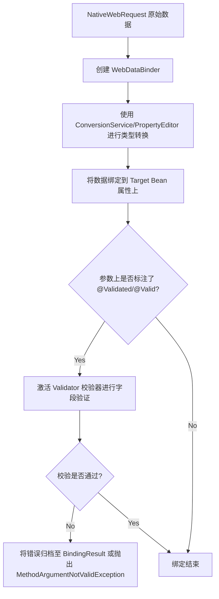
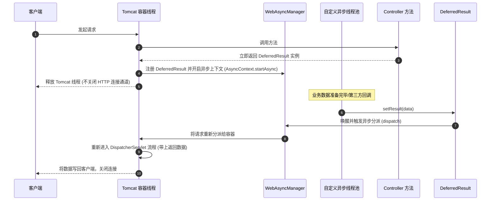

## Spring MVC 参数解析与返回值处理原理

在 Spring MVC 开发中，我们可以在 Controller 方法参数上极其自然地标注 `@RequestBody`、`@PathVariable` 或直接书写 `HttpServletRequest`。这背后的核心支撑机制是 **参数解析器（HandlerMethodArgumentResolver）**、**数据绑定与校验（WebDataBinder）** 以及 **返回值处理器（HandlerMethodReturnValueHandler）**。

---

## 一、 参数解析机制：HandlerMethodArgumentResolver

当 `DispatcherServlet` 接收到 HTTP 请求并定位到对应的 HandlerMethod（Controller 方法）后，它会委派 `HandlerAdapter`（具体为 `RequestMappingHandlerAdapter`）来执行该方法。在执行反射调用前，必须将 HTTP 原始请求（请求头、Query参数、JSON Body）转化为方法对应的入参对象。

### 1. 1 参数解析器核心接口

参数解析器采用标准的策略模式设计：

```java
public interface HandlerMethodArgumentResolver {
    // 1. 判断当前解析器是否支持解析指定的参数类型/注解
    boolean supportsParameter(MethodParameter parameter);

    // 2. 将 HTTP 请求中的数据转换为方法参数的实际对象
    @Nullable
    Object resolveArgument(MethodParameter parameter, @Nullable ModelAndViewContainer mavContainer,
            NativeWebRequest webRequest, @Nullable WebDataBinderFactory binderFactory) throws Exception;
}
```

### 2. 常见内置解析器

Spring MVC 在启动时会默认初始化数十个参数解析器，并在 `HandlerMethodArgumentResolverComposite` 中进行组合拦截：

| 解析器名称 | 对应注解/参数类型 | 转换细节与说明 |
| :--- | :--- | :--- |
| `RequestParamMethodArgumentResolver` | `@RequestParam` 或普通简单类型 | 处理查询参数（QueryString）或 `multipart/form-data` 文件上传。 |
| `PathVariableMethodArgumentResolver` | `@PathVariable` | 从请求 URI 的模板变量中提取值（如 `/users/{id}`）。 |
| `RequestResponseBodyMethodProcessor` | **`@RequestBody`** | 利用容器中的 `HttpMessageConverter` 列表，读取 HTTP 请求体（Body）输入流并反序列化为 Java 对象（常用于 JSON 数据）。 |
| `ServletRequestMethodArgumentResolver` | `HttpServletRequest`、`HttpSession` | 直接将 Servlet 原生请求或会话对象注入方法参数。 |
| `ModelAttributeMethodProcessor` | `@ModelAttribute` 或普通 POJO 对象 | 将表单数据绑定到 Java Bean 属性上。 |

---

## 二、 数据绑定、类型转换与 JSR-303 校验

在解析复杂对象（如表单或 JSON 提交的对象）时，数据绑定、类型转换与参数验证是串联在一起执行的。其核心运转体是 **`WebDataBinder`**。



### 1. 类型转换：PropertyEditor 与 ConversionService

- **`PropertyEditor`（JDK 原生）**：基于字符串的属性编辑器，主要用于将 String 转换为特定类型。因为它是**非线程安全**的，每次请求都需要重新创建。
- **`ConversionService`（Spring 3.0+）**：线程安全且高效的类型转换服务。其内部注册了大量的 `Converter`，支持任意类型之间的双向转换（如 `String` 转 `Date`、`String` 转 `CustomEnum`）。

### 2. JSR-303 / Hibernate Validator 校验联动

当参数被解析并完成赋值后，若参数上标注了 `@Validated`（Spring 提供）或 `@Valid`（JSR 标准）：
1. `WebDataBinder` 会调用注册的 `SmartValidator`（通常是 `LocalValidatorFactoryBean`，底层为 Hibernate Validator）。
2. 依次校验 Target 对象中属性上的校验注解（如 `@NotNull`、`@Size`、`@Email`）。
3. 如果发生校验失败，会将错误信息转化为 `FieldError`，塞入 `BindingResult`。
4. **异常抛出机制**：如果在方法参数列表中紧跟了 `Errors` 或 `BindingResult` 参数，Spring 会将校验结果直接注入，不抛出异常；若方法没有声明接收 `BindingResult`，Spring 会直接抛出 **`MethodArgumentNotValidException`**（对于 JSON 请求）或 **`BindException`**（对于表单请求），由全局异常处理器（`@RestControllerAdvice`）进行统一拦截响应。

---

## 三、 返回值解析机制：HandlerMethodReturnValueHandler

方法执行完成后，Spring MVC 需要决定如何处理方法返回的对象（例如：跳转页面、直接写回 JSON，或者是处理异步响应）。

### 1. 2 返回值解析器核心接口

```java
public interface HandlerMethodReturnValueHandler {
    // 1. 判断是否支持处理该返回值类型
    boolean supportsReturnType(MethodParameter returnType);

    // 2. 写入响应体或填充 ModelAndViewContainer 以供后续视图渲染
    void handleReturnValue(@Nullable Object returnValue, MethodParameter returnType,
            ModelAndViewContainer mavContainer, NativeWebRequest webRequest) throws Exception;
}
```

### 2. 常见内置处理器

- **`ViewNameMethodReturnValueHandler`**：返回 `String` 且方法上**没有** `@ResponseBody`。Spring 将返回值作为物理视图名称，配合 `ViewResolver`（视图解析器）定位 JSP、Thymeleaf 等页面。
- **`RequestResponseBodyMethodProcessor`**：当方法或类上标注了 **`@ResponseBody`** 时触发。它同样委派 `HttpMessageConverter`（如 `MappingJackson2HttpMessageConverter`）将返回值对象序列化为指定格式（如 JSON 字符串）并写入 HTTP Response 响应流。

---

## 四、 异步请求处理机制：WebAsyncManager

对于长轮询或耗时业务，若让 Servlet 容器的线程池（如 Tomcat 线程）一直阻塞等待，会迅速榨干服务器连接数。Spring MVC 基于 Servlet 3.0+ 的异步处理规范，提供了极其强大的异步请求响应支持。

### 1. 异步请求处理核心架构

当 Controller 方法返回 **`Callable`**、**`DeferredResult`**、**`WebAsyncTask`** 或 **`StreamingResponseBody`** 时，处理流程如下：



- **`Callable`**：简单异步。Controller 直接返回 `Callable`，Spring 会使用配置的 `AsyncTaskExecutor` 异步线程池去执行该 `Callable` 的内部任务，Tomcat 线程随即被释放。
- **`DeferredResult`**：解耦异步。Controller 立即返回 `DeferredResult` 实例并释放容器线程。实际的业务结果可以由**任何第三方线程**（如消息队列消费者、定时任务、外部 HTTP 回调）在任意时间调用 `deferredResult.setResult(data)` 写入。

### 2. 底层运行机制：WebAsyncManager

`WebAsyncManager` 是管理整个异步生命周期的枢纽：
1. **获取实例**：在请求到达时，通过 `WebAsyncUtils.getAsyncManager(request)` 将管理器与当前 Request 进行绑定。
2. **启动异步**：当遇到异步返回值时，激活 `startDeferredResultProcessing`。底层通过 `HttpServletRequest.startAsync()` 获取 Servlet 3.0 的 `AsyncContext`（异步上下文），使得连接通道保持长连接开启状态。
3. **完成唤醒**：当异步结果被注入后，`WebAsyncManager` 会调用 `AsyncContext.dispatch()` 将请求重新派发回 Servlet 容器。重新派发的请求会重新经过 `DispatcherServlet`，但此时会直接跳过 Controller 执行，由相应的返回值处理器（`RequestResponseBodyMethodProcessor`）直接处理结果并响应。

---

## 五、 全局统一响应与异常处理最佳实践

在现代 RESTful 架构中，企业通常会使用全局拦截器来实现统一数据格式包裹与全局异常降级：

```java
// 1. 全局异常拦截器
@RestControllerAdvice
@Slf4j
public class GlobalExceptionHandler {

    // 拦截参数校验异常 (JSR-303 JSON 提交)
    @ExceptionHandler(MethodArgumentNotValidException.class)
    @ResponseStatus(HttpStatus.BAD_REQUEST)
    public Result<Void> handleValidException(MethodArgumentNotValidException e) {
        BindingResult bindingResult = e.getBindingResult();
        String errorMsg = bindingResult.getFieldErrors().stream()
                .map(FieldError::getDefaultMessage)
                .collect(Collectors.joining("; "));
        log.warn("参数校验失败: {}", errorMsg);
        return Result.fail(400, errorMsg);
    }

    // 拦截其余未知系统异常
    @ExceptionHandler(Exception.class)
    @ResponseStatus(HttpStatus.INTERNAL_SERVER_ERROR)
    public Result<Void> handleException(Exception e) {
        log.error("系统运行发生未知异常", e);
        return Result.fail(500, "系统繁忙，请稍后再试");
    }
}
```
