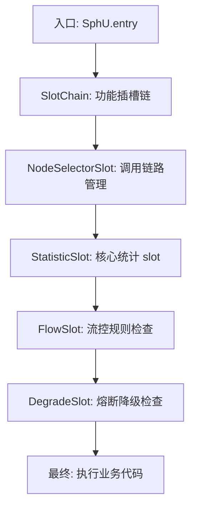

## Sentinel 核心原理：高可用流量治理与故障容错之道

在微服务拓扑中，任何一个节点的崩溃都可能引发 **“雪崩效应”**。Sentinel（“哨兵”）是阿里巴巴开源的流量治理组件，它以“流量”为切入点，提供限流、熔断、降级、热点隔离等多维度的系统保护能力。

---

## 一、 Sentinel 与 Hystrix 的巅峰对决

为什么现在大厂普遍转向 Sentinel？

| 特性 | Hystrix | **Sentinel** |
| :--- | :--- | :--- |
| **隔离策略** | 线程池信号量（开销大） | **信号量（轻量级）** |
| **熔断策略** | 基于错误率 | **基于慢调用比例/异常数** |
| **实时控制台** | 弱（Dashboard 需单独部署） | **强（支持实时修改规则并推送）** |
| **动态规则** | 不支持（需手动扩展） | **支持（集成 Nacos 实现持久化）** |
| **热点流控** | 不支持 | **支持（针对特定参数如 ID 限流）** |

---

## 二、 核心概念：资源与规则

Sentinel 的保护逻辑归纳为：**定义资源 -> 制定规则 -> 自动判定**。

1. **资源 (Resource)**：可以是方法、代码块或接口（如 `/api/orders`）。
2. **规则 (Rule)**：针对资源预设的“阈值”。若流量（QPS/并发）超过阈值，Sentinel 会执行拒绝（Block）或降级（Fallback）。

---

## 三、 四大核心流量治理场景

### 1. 流量流控（Flow Control）
防止系统因瞬时洪峰被冲击。
- **直接模式**：最简单，达到阈值直接限流。
- **关联模式**：当 A 接口负载高时，为了保证 A，限制与之竞争资源的 B 接口（如支付链路压垮时，限制查询链路）。
- **链路模式**：只记录指定链路上的流量。

### 2. 熔断降级（Circuit Breaking）
当依赖的服务（下游）出现响应慢或异常高时，**暂时切断**对该服务的调用，直接返回默认值。
- **慢调用比例**：响应时间超过阈值持续一定比例后熔断。
- **异常比例/异常数**：当调用的错误率太高，停止尝试。

### 3. 热点参数限流（Param Flow）
针对特定的商品 ID、用户 ID 进行限流。防止某个“爆款”商品拖垮整个库存中心。

### 4. 系统自适应保护
根据系统的 CPU 使用率、Load、RT 等宏观指标自动限流。

---

## 四、 实战：整合 Spring Cloud Sentinel

1. **引入依赖**：`spring-cloud-starter-alibaba-sentinel`。
2. **定义埋点**：Sentinel 默认会自动对所有 `RestController` 接口进行埋点。
3. **配置热点/限流规则**（建议通过 Sentinel 控制台动态推送）。

```java
// 配合 OpenFeign 使用熔断降级
@FeignClient(value = "product-service", fallback = ProductServiceFallback.class)
public interface ProductClient { ... }

@Component
public class ProductServiceFallback implements ProductClient {
    @Override
    public ProductDTO getProduct(Long id) {
        // 当 product-service 挂掉时，返回托底的默认信息
        return new ProductDTO(id, "暂无商品信息", 0.0);
    }
}
```

---

## 五、 Sentinel 执行流程深度拆解



**关键细节：`StatisticSlot`**。Sentinel 并不是用数据库，而是利用 **滑动窗口 (Sliding Window)** 算法在内存中实时统计秒级 QPS。这种设计使其在高并发下几乎没有性能损耗。

---

## 六、 生产环境必读：规则持久化

默认情况下，Sentinel Dashboard 修改的规则存在于微服务的内存中，重启即失。
**推荐方案**：**Sentinel Dashboard -> Nacos -> 微服务**。
通过配置 `DataSource`，我们可以在 Nacos 中定义 JSON 格式的规则，Sentinel 客户端会实时监听 Nacos 的变更并刷新内存规则，从而实现生产级的动态治理。

> 解决分布式链路中的数据最终一致性？请参考 [Seata 分布式事务全解](./seata-distributed-transaction.md)。
