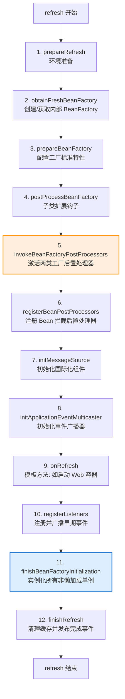
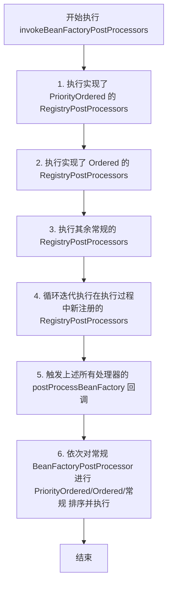

## Spring Context 刷新流程深度解析

`AbstractApplicationContext.refresh()` 是 Spring 框架中最核心的方法。它标志着 IoC 容器的启动，完成了从配置解析、Bean 定义注册、后置处理器应用到所有非懒加载单例 Bean 初始化的完整生命周期。

---

## 一、 refresh() 12 大核心步骤全景图

---

## 二、 12 大步骤源码级深度解析

### 1. `prepareRefresh()`：环境准备

- **核心操作**：
  - 记录容器启动时间与激活状态。
  - 初始化属性源（`initPropertySources()`，留给子类实现，如 Servlet 环境下初始化 ServletContext 相关的属性配置）。
  - 校验必要的环境变量是否存在（`getEnvironment().validateRequiredProperties()`）。
  - 创建早期事件存蓄集 `earlyApplicationEvents`，用以存放容器未准备好前发布的事件，以便在步骤 10 广播。

### 2. `obtainFreshBeanFactory()`：创建/刷新内部工厂

- **核心操作**：
  - 调用 `refreshBeanFactory()`：如果是 XML 类型的 ApplicationContext，此阶段会销毁旧有的 BeanFactory，并创建一只全新的 `DefaultListableBeanFactory`。
  - 调用 `loadBeanDefinitions(beanFactory)`：通过 XML 读取器将 XML 配置文件解析为 `BeanDefinition` 注册入容器。
  - 返回包装好的工厂。

### 3. `prepareBeanFactory(beanFactory)`：工厂标准特征配置

配置 BeanFactory 的基础特征，使其具备 Spring 框架的标准运行能力：
- 设置类加载器（ClassLoader）和表达式解析器（SpEL）。
- 注册特定的属性编辑器 `ResourceEditorRegistrar`。
- **添加 `ApplicationContextAwareProcessor`**：将各种 Aware 接口的回调职责委托给这个特殊的 `BeanPostProcessor`。
- **忽略特定接口的自动装配**：排除对 `EnvironmentAware`、`ApplicationContextAware` 等 Aware 接口的直接依赖注入，防止它们被重复或异常装配。
- **注册可解析的依赖**：建立类型到特定实例的直接关联映射，使得 `@Autowired` 能够直接注入 `BeanFactory`、`ResourceLoader`、`ApplicationEventPublisher`、`ApplicationContext` 本身。
- 注册默认的环境变量单例 Bean（如 `systemProperties`、`systemEnvironment`）。

### 4. `postProcessBeanFactory(beanFactory)`：子类定制钩子

- **核心操作**：
  - 模板钩子方法，允许具体子类在所有的 BeanDefinition 加载完毕、但未实例化前，对工厂进行客制化修改。
  - 例如，Web 环境下的 `GenericWebApplicationContext` 会在此处注册 Web 相关的 Scope（`request`、`session`）以及绑定 ServletContext 相关的特殊环境单例。

### 5. `invokeBeanFactoryPostProcessors(beanFactory)`：执行工厂后置处理器

这是 Spring 能够解析 `@Configuration` 配置类、处理包扫描及导入元数据的**最关键一步**。
- **核心执行类**：`PostProcessorRegistrationDelegate`。
- **执行规则**：后置处理器分为两类：`BeanDefinitionRegistryPostProcessor`（允许动态增删 Bean 定义）和 `BeanFactoryPostProcessor`（修改现有 Bean 定义的属性）。
- **极严苛的执行顺序排序规则**：

- **关键实现**：`ConfigurationClassPostProcessor` 属于 `PriorityOrdered` 的 RegistryPostProcessor，它在第一步就会被激活，从而完成对 `@ComponentScan` 和 `@Import` 的全面解析并产生新定义的 Bean。

### 6. `registerBeanPostProcessors(beanFactory)`：注册 Bean 拦截后置处理器

- **核心操作**：
  - 将所有实现了 `BeanPostProcessor` 接口的 Bean 从容器中寻找出来，并按照 `PriorityOrdered`、`Ordered` 和常规的级别进行严格排序，最后注册进 BeanFactory 的 `beanPostProcessors` 列表中。
  - **重要类**：AOP 的核心入口 `AnnotationAwareAspectJAutoProxyCreator`（自动代理创建器）就是在此处被注册的。

### 7. `initMessageSource()`：初始化国际化资源

- **核心操作**：
  - 查找容器中是否存在名称为 `messageSource` 的 Bean。若有则直接采用，若没有则在容器内新建一个 `DelegatingMessageSource` 占位，用以支持多语言翻译和资源提取。

### 8. `initApplicationEventMulticaster()`：初始化事件广播器

- **核心操作**：
  - 寻找自定义名称为 `applicationEventMulticaster` 的广播器。
  - 若无，则默认新建一个同步/单线程分发的 `SimpleApplicationEventMulticaster` 归属到容器中（参见 [spring-events.md](spring-events.md)）。

### 9. `onRefresh()`：子类特异刷新钩子

- **核心操作**：
  - 这是一个非常关键的生命周期模板方法，留给子类在特定阶段执行特定的初始化动作。
  - **Spring Boot 自动配置的桥梁**：
    在 Spring Boot 中，子类 `ServletWebServerApplicationContext` 会在此处拦截，执行 `createWebServer()` 源码。它会基于条件装配，动态从容器内找出已配置的 Tomcat、Jetty 或 Undertow 工厂类，并**启动嵌入式 Web 服务器**，实现了容器启动与 Web 服务器拉起的闭环。

### 10. `registerListeners()`：注册监听器

- **核心操作**：
  - 查找所有的 `ApplicationListener`，将其添加并注册到步骤 8 创建的广播器中。
  - **早期事件广播**：将在步骤 1 中暂存的 `earlyApplicationEvents` 列表取出，通过广播器正式向所有监听器进行广播分发。

### 11. `finishBeanFactoryInitialization(beanFactory)`：初始化所有非懒加载单例

这是整个 `refresh()` 流程中**最耗时、最复杂、最核心**的阶段。
- **核心操作**：
  - 初始化类型转换服务 `ConversionService`（用于将 HTTP 传参中的 String 自动转换为 Date 或自定义 Object）。
  - 冻结所有 BeanDefinition（`freezeConfiguration()`），不再允许任何第三方后置处理器动态修改 Bean 定义。
  - **触发核心初始化流程**：调用 `beanFactory.preInstantiateSingletons()`。
    1. 遍历所有的 `beanDefinitionNames` 列表。
    2. 如果当前 Bean 不是抽象类、是单例、且不是懒加载，则调用 `getBean(beanName)`。
    3. `getBean()` -> `doGetBean()` -> `createBean()` -> `doCreateBean()`。
    4. 依次触发 Bean 生命周期：`实例化 -> 属性注入 -> 执行 Aware 回调 -> BeanPostProcessor 前置处理 -> 激活 @PostConstruct -> InitializingBean 接口 -> 自定义 init-method -> BeanPostProcessor 后置代理生成`。

### 12. `finishRefresh()`：刷新完成收尾

- **核心操作**：
  - 清理资源缓存（如 ASM 元数据缓存）。
  - 初始化生命周期处理器 `LifecycleProcessor`（激活实现了 `SmartLifecycle` 接口的 Bean）。
  - 发布 **`ContextRefreshedEvent`** 容器刷新完成事件。

---

## 三、 面试高频问题

### Q1：BeanFactoryPostProcessor 和 BeanPostProcessor 的区别？

这是 Spring 框架设计中最经典、最容易混淆的两个拦截扩展接口：

| 维度 | `BeanFactoryPostProcessor` | `BeanPostProcessor` |
| :--- | :--- | :--- |
| **操作对象** | 针对于 **`BeanDefinition`**（Bean 元数据）。 | 针对于 **`Bean 实例对象`**（即已经 new 出来的对象）。 |
| **触发时机** | 所有 Bean 实例创建**之前**（仅触发一次）。 | 在**每一个** Bean 实例化之后，执行初始化（`init-method`）的前后（每个 Bean 创建时都会触发）。 |
| **核心职责** | 修改或注入 Bean 定义。例如：占位符解析替换、`@Configuration` 代理增强。 | 修改或代理生成的 Bean 实例。例如：动态代理（AOP）织入、`@Autowired` 属性赋值。 |
| **接口定义** | `postProcessBeanFactory(factory)` | `postProcessBeforeInitialization` / `postProcessAfterInitialization` |

### Q2：如果在 refresh() 期间，有一个 @PostConstruct 方法中调用了 getBean() 会发生什么？

- **分析**：当步骤 11 正在对 Bean A 进行初始化时，执行到 `BeanPostProcessor` 前置阶段会激活 A 上的 `@PostConstruct` 方法。若该方法内显式调用了 `applicationContext.getBean("B")`：
- **运行链路**：Spring 容器会立即中断当前 A 的生命周期流转，强行开启 Bean B 的实例化与初始化过程。
- **潜在危险**：
  1. 如果 B 尚未被创建，会进入 B 的生命周期。若 B 又反向依赖 A，极易因 A 未完全初始化（未放入一级缓存，只在二级/三级缓存中）导致未完全暴露的对象被引入。
  2. 若 B 被成功加载，A 继续执行。但在大型微服务体系中，应尽量避免在生命周期回调中加入过于繁重的外部依赖索取，防止容器刷新产生隐性死锁。
