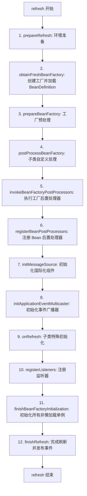

# Spring Context 刷新流程深度解析

`AbstractApplicationContext.refresh()` 是 Spring 框架中最核心的方法。它标志着 IoC 容器的启动，完成了从配置解析、Bean 定义注册到所有非懒加载单例 Bean 初始化的完整生命周期。

---

## 一、 refresh() 12 大核心步骤全景图

---

## 二、 核心关键步骤详述

### 1. obtainFreshBeanFactory (获取新的 BeanFactory)

这是容器的心脏。

- **职责**：如果已存在工厂则销毁之；创建新的 `DefaultListableBeanFactory`。
- **解析**：触发 `loadBeanDefinitions`。如果是 XML 配置，则通过 `XmlBeanDefinitionReader` 读取并解析；如果是注解配置（如 Spring Boot），则在该阶段准备好基础结构。

### 2. invokeBeanFactoryPostProcessors (解析配置的关键)

这是 Spring 能够处理 `@Configuration`、`@ComponentScan` 等注解的秘密所在。

- **职责**：调用所有的 `BeanFactoryPostProcessor`。
- **最重要实现类**：`ConfigurationClassPostProcessor`。它负责扫描类路径、解析 `@Import`、`@Bean`，并将它们转化为 `BeanDefinition`。
- **要点**：此阶段后，容器内已拥有所有 Bean 的“名册”，但尚未实例化具体的 Bean。

### 3. registerBeanPostProcessors (注册后置处理器)

- **职责**：将实现了 `BeanPostProcessor` 接口的类注册到 BeanFactory 中。
- **注意**：这些处理器在随后的 Bean 初始化阶段（实例化 -> 注入 -> 初始化）起作用。**AOP 自动代理创建器**就是在此处注册的。

### 4. finishBeanFactoryInitialization (冻结与实例化)

这是 `refresh()` 中最耗时、最重要的部分。

- **职责**：实例化所有剩余的（非懒加载）单例 Bean。
- **核心链路**：
  1. 冻结 Bean 定义（不再允许修改）。
  2. 遍历所有注册过的 Bean 名称。
  3. 调用 `getBean()` -> `doGetBean()` -> `createBean()` -> `doCreateBean()`。
  4. 触发我们在 [ioc-aop.md](ioc-aop.md) 中学习到的 **Bean 生命周期**：`实例化 -> 属性赋值 -> 初始化 -> 缓存`。

### 5. finishRefresh (收尾)

- **职责**：初始化生命周期处理器 `LifecycleProcessor`，并发布 `ContextRefreshedEvent` 事件。
- **意义**：此时容器正式处于可用状态。

---

## 三、 面试高频问题

### Q: BeanFactoryPostProcessor 和 BeanPostProcessor 的区别？

| 特点 | BeanFactoryPostProcessor | BeanPostProcessor |
| :--- | :--- | :--- |
| **操作对象** | 操作 **BeanDefinition**（Bean 的元数据） | 操作 **Bean 实例**（具体的对象） |
| **触发时机** | 所有 Bean 实例化**之前** | 每个 Bean 初始化的**前后** |
| **典型用途** | 解析配置类、替换 `${...}` 占位符 | AOP 代理生成、`@Autowired` 依赖注入处理 |

### Q: refresh() 为什么必须加锁？

`refresh()` 内部使用了 `startupShutdownMonitor` 对象锁。这是为了防止在同一个容器实例上并发调用 `refresh` 或 `close` 导致状态混乱（如 Bean 重复初始化或工厂过早销毁）。
