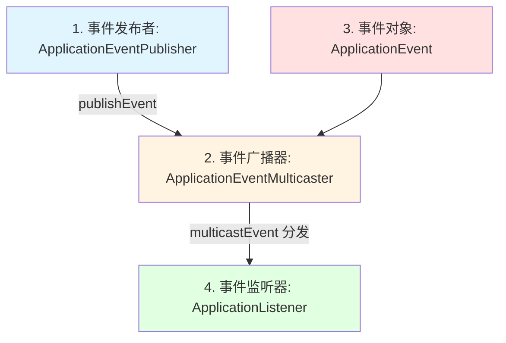

## Spring 事件驱动机制与业务解耦

在微服务和复杂单体应用中，**模块间解耦**和**异步化处理**是提升系统可维护性与吞吐量的关键手段。Spring 框架内置了强大的**事件驱动机制（Spring Events）**，它是观察者模式（Observer Pattern）在 Spring 容器内部的优雅实现。通过事件机制，我们可以轻松实现非核心业务逻辑（如发送短信、赠送优惠券、记录审计日志）与主业务流程（如用户注册、订单支付）的彻底解耦。

---

## 一、 Spring 事件的核心组件

Spring 事件机制主要由以下四个角色组成：



1. **`ApplicationEvent`（事件对象）**：
   - 承载事件数据的载体。
   - 在 Spring 4.2 之前，自定义事件类必须继承自 `ApplicationEvent`。
   - **Spring 4.2+ 支持发布任意 POJO 作为事件**，不再强制继承 `ApplicationEvent`，使用更加灵活。
2. **`ApplicationEventPublisher`（事件发布者）**：
   - 负责发布事件的接口。`ApplicationContext` 接口继承了它，因此 Spring 容器本身就是一个事件发布器。
   - 核心方法：`publishEvent(Object event)`。
3. **`ApplicationEventMulticaster`（事件广播器）**：
   - 负责把发布者发出的事件分发给所有匹配的监听器。
   - 默认实现是 `SimpleApplicationEventMulticaster`。
4. **`ApplicationListener`（事件监听器）**：
   - 负责监听并消费事件。
   - 可以通过实现 `ApplicationListener<T>` 接口，或者使用 **`@EventListener`** 注解标记方法来声明一个监听器。

---

## 二、 事件发布与广播底层原理

当我们在代码中调用 `publisher.publishEvent(event)` 时，Spring 内部是如何流转的？

### 1. 核心链路源码剖析（`SimpleApplicationEventMulticaster`）

所有的事件发布，最终都会落到 `SimpleApplicationEventMulticaster.multicastEvent()` 方法上：

```java
public class SimpleApplicationEventMulticaster extends AbstractApplicationEventMulticaster {

    // 注入的任务执行器，用于支持异步事件
    @Nullable
    private Executor taskExecutor;

    @Override
    public void multicastEvent(final ApplicationEvent event, @Nullable ResolvableType eventType) {
        ResolvableType type = (eventType != null ? eventType : resolveDefaultEventType(event));
        // 1. 获取对应的任务执行器（如果有配置，则是异步执行）
        Executor executor = getTaskExecutor();
        
        // 2. 检索并遍历所有对该事件感兴趣的监听器（基于泛型匹配）
        for (ApplicationListener<?> listener : getApplicationListeners(event, type)) {
            if (executor != null) {
                // 3.1 异步分发：将监听器调用封装为 Task 提交给线程池
                executor.execute(() -> invokeListener(listener, event));
            }
            else {
                // 3.2 同步分发：在当前发布事件的线程中直接执行监听器逻辑
                invokeListener(listener, event);
            }
        }
    }

    protected void invokeListener(ApplicationListener<?> listener, ApplicationEvent event) {
        ErrorHandler errorHandler = getErrorHandler();
        if (errorHandler != null) {
            try {
                doInvokeListener(listener, event);
            }
            catch (Throwable err) {
                // 如果配置了异常处理器，则捕获并处理监听器内部的异常
                errorHandler.handleError(err);
            }
        }
        else {
            doInvokeListener(listener, event);
        }
    }

    @SuppressWarnings({"rawtypes", "unchecked"})
    private void doInvokeListener(ApplicationListener listener, ApplicationEvent event) {
        try {
            // 4. 调用监听器的核心回调方法
            listener.onApplicationEvent(event);
        }
        catch (ClassCastException ex) {
            // ... 泛型异常兼容处理
        }
    }
}
```

### 2. 同步与异步事件切换

* **同步事件（默认）**：
  * 事件发布者线程与事件监听器线程是同一个线程。
  * **优点**：能够共享同一个数据库连接（支持事务传播），一旦监听器报错，发布者的主事务也会回滚。
  * **缺点**：如果某个监听器执行缓慢（如发送短信耗时 2s），会直接阻塞主线程，拖慢接口响应。
* **异步事件**：
  * 监听到事件后，提交给独立的线程池异步执行。
  * **开启方式**：
    1. 自定义配置 `ApplicationEventMulticaster` Bean，并为其设置 `taskExecutor`。
    2. 或者在监听器方法上标注 **`@Async`** 注解（需在启动类或配置类上标注 `@EnableAsync` 开启异步支持，推荐此方式，细粒度更佳）。

---

## 三、 事务绑定事件（`@TransactionalEventListener`）

### 1. 为什么需要事务绑定？

在日常开发中，我们经常遇到这样的场景：**用户注册成功后发送激活邮件**。
如果采用普通的 `@EventListener`（同步模式下）：
1. 注册逻辑（往 DB 插数据）执行成功。
2. 发布 `UserRegisterEvent`。
3. 监听器发送邮件成功.
4. 注册逻辑最后一步报错，导致 **DB 事务回滚**。
5. 此时**用户没有注册成功，却收到了激活邮件**。这就是经典的数据不一致问题。

为了解决这个问题，Spring 引入了 **`@TransactionalEventListener`**。它可以让事件的消费与发布者的数据库事务生命周期进行绑定。

### 2. 事务监听的 4 种传播阶段（Phase）

在 `@TransactionalEventListener` 中，可以通过 `phase` 属性控制监听器的执行时机：

| 阶段（`TransactionPhase`） | 执行时机 | 典型场景 |
| :--- | :--- | :--- |
| **`AFTER_COMMIT`（默认）** | 事务**成功提交后**才触发监听器逻辑。 | 发送短信、邮件、MQ 消息，推送外部系统。 |
| **`AFTER_ROLLBACK`** | 事务**回滚后**触发监听器。 | 记录失败日志，执行本地异常补偿逻辑。 |
| **`AFTER_COMPLETION`** | 事务**完成后**触发（无论提交还是回滚）。 | 清理本地 ThreadLocal 缓存、释放临时资源。 |
| **`BEFORE_COMMIT`** | 事务**提交前**触发。 | 校验业务约束，通过抛出异常阻断事务的提交。 |

### 3. 底层实现原理

`@TransactionalEventListener` 的核心原理基于 Spring 的 **`TransactionSynchronization`（事务同步器）**：
1. 当发布事件的方法处于一个活动事务中时，`TransactionalEventListenerMethodAdapter` 不会立即执行监听逻辑。
2. 它会通过 `TransactionSynchronizationManager.registerSynchronization()` 注册一个自定义的 `TransactionSynchronization` 回调。
3. 当底层的数据库连接（Connection）在进行 `commit` 或 `rollback` 时，Spring 事务管理器（`PlatformTransactionManager`）会回调已注册的同步器，从而触发事件监听器的执行。

> [!WARNING]
> **在 `AFTER_COMMIT` 阶段的监听器中无法修改数据库！**
> 因为此时物理数据库连接（Connection）的事务已经提交并关闭了。如果在 `AFTER_COMMIT` 监听器里继续执行 SQL 写操作，会导致异常或数据不会被持久化。如果必须在提交后修改数据库，需要显式将监听器置于一个新的事务中：`@Transactional(propagation = Propagation.REQUIRES_NEW)`。

---

## 四、 生产实战：使用 Spring Event 实现用户注册解耦

以下是使用注解方式实现用户注册主流程、发送短信和赠送优惠券解耦的完整代码。

### 1. 定义事件对象（POJO）

```java
public class UserRegisterEvent {
    private final Long userId;
    private final String username;
    private final String phoneNumber;

    public UserRegisterEvent(Long userId, String username, String phoneNumber) {
        this.userId = userId;
        this.username = username;
        this.phoneNumber = phoneNumber;
    }

    // Getters
    public Long getUserId() { return userId; }
    public String getUsername() { return username; }
    public String getPhoneNumber() { return phoneNumber; }
}
```

### 2. 编写主业务服务（事件发布）

```java
@Service
@Slf4j
public class UserService {

    @Autowired
    private UserRepository userRepository;

    @Autowired
    private ApplicationEventPublisher eventPublisher;

    @Transactional(rollbackFor = Exception.class)
    public void register(String username, String phoneNumber) {
        log.info("开始注册新用户: {}, {}", username, phoneNumber);
        
        // 1. 保存到数据库
        User user = new User(username, phoneNumber);
        userRepository.save(user);
        
        // 2. 发布注册成功事件
        UserRegisterEvent event = new UserRegisterEvent(user.getId(), username, phoneNumber);
        eventPublisher.publishEvent(event);
        
        log.info("主流程：用户注册成功写入 DB，userId = {}", user.getId());
    }
}
```

### 3. 编写监听器（事务成功提交后，异步发送短信）

```java
@Component
@Slf4j
public class SmsNotificationListener {

    @Async // 开启异步，独立线程池执行，不阻塞主注册线程
    @TransactionalEventListener(phase = TransactionPhase.AFTER_COMMIT)
    public void sendWelcomeSms(UserRegisterEvent event) {
        log.info("【短信服务】检测到用户注册成功且事务已提交，开始发送激活短信。线程: {}", Thread.currentThread().getName());
        try {
            // 模拟发送短信耗时
            Thread.sleep(1000);
            log.info("【短信服务】向手机号 {} 发送欢迎短信成功！", event.getPhoneNumber());
        } catch (InterruptedException e) {
            Thread.currentThread().interrupt();
        }
    }
}
```

### 4. 编写另一个监听器（事务成功提交后，异步赠送优惠券）

```java
@Component
@Slf4j
public class CouponListener {

    @Async
    @TransactionalEventListener(phase = TransactionPhase.AFTER_COMMIT)
    @Transactional(propagation = Propagation.REQUIRES_NEW) // 因为要写数据库，必须开启新事务
    public void grantWelcomeCoupon(UserRegisterEvent event) {
        log.info("【营销服务】检测到用户注册成功且事务已提交，开始发放新人优惠券。线程: {}", Thread.currentThread().getName());
        
        // 模拟执行数据库插入
        // couponRepository.save(new Coupon(event.getUserId(), "10元无门槛券"));
        
        log.info("【营销服务】为用户(userId = {}) 发放新人优惠券成功！", event.getUserId());
    }
}
```

---

## 五、 高频面试 Q&A

### Q1：Spring 事件的发布是同步还是异步的？

**标准回答**：
* 默认情况下是**同步**的。在发布事件的方法执行到 `publishEvent()` 时，主线程会顺次去执行所有相匹配的监听器方法，全部执行完毕后才会返回继续执行主方法剩下的逻辑。
* 如果需要**异步**，可以在监听器上标记 `@Async`，或者给广播器 `ApplicationEventMulticaster` 注入一个线程池（Executor）。

### Q2：在使用 `@TransactionalEventListener` 时，有什么需要特别注意的坑？

**标准回答**：
1. **必须处于活动事务中**：被调用的发布方法必须被 `@Transactional` 包裹，否则 `@TransactionalEventListener` 默认将不会收到任何回调（除非将 `fallbackExecution` 属性设置为 `true`，这样在没有事务时会退化为普通同步执行）。
2. **`AFTER_COMMIT` 无法直接修改数据库**：在事务提交后的监听器中，默认是不能再往数据库写数据的（即使写了也不会生效或报错），因为底层的 Connection 已经提交。如果必须要写，需要配合 `@Transactional(propagation = Propagation.REQUIRES_NEW)` 开启全新物理连接的事务。

### Q3：Spring 容器在生命周期中，自身会发布哪些核心事件？

**标准回答**：
Spring 容器在其生命周期（主要是 `refresh()` 和 `close()` 阶段）中会内置发布以下四种原生事件（可以通过实现 `ApplicationListener` 监听到）：
1. **`ContextRefreshedEvent`**：容器初始化或刷新完成时（所有非懒加载单例已全部实例化完毕）发布。
2. **`ContextStartedEvent`**：容器启动时（显式调用 `context.start()`）发布。
3. **`ContextStoppedEvent`**：容器停止时（显式调用 `context.stop()`）发布。
4. **`ContextClosedEvent`**：容器关闭时（显式调用 `context.close()`）发布，此时所有单例 Bean 尚未被销毁。
