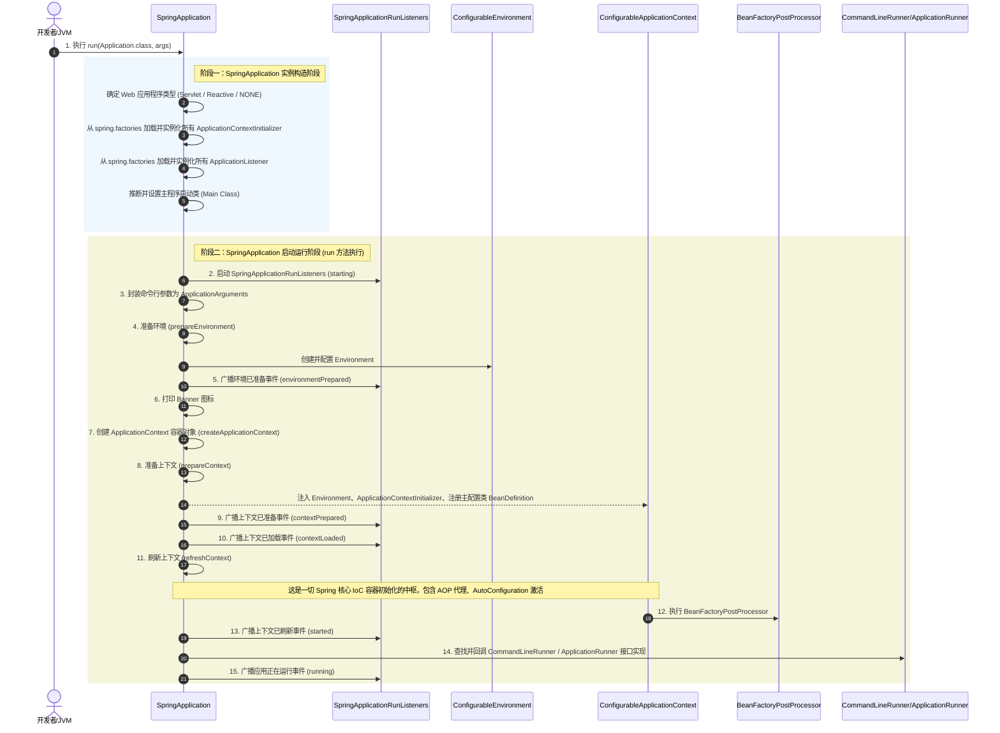
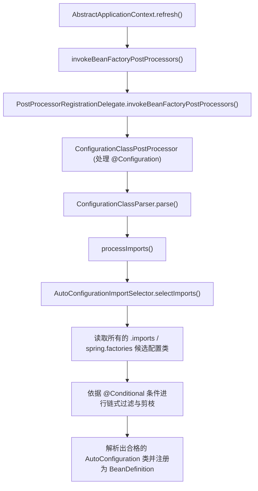
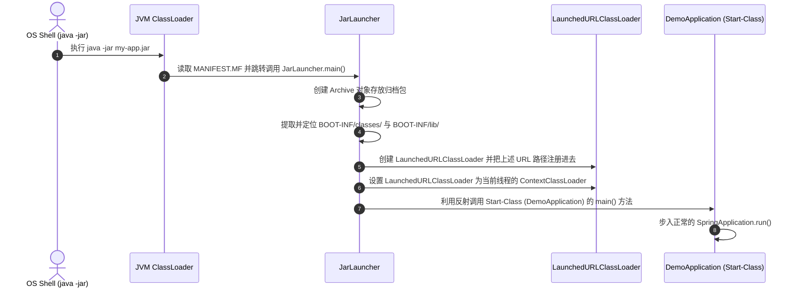

## Spring Boot 核心运行原理与启动加载机制

Spring Boot 的诞生极大地简化了新 Spring 应用的初始搭建以及开发过程。它通过**约定优于配置（Configuration Over Convention）**的理念，实现了应用的快速启动（Out of the Box）。本文将深度剖析 Spring Boot 的核心运行原理，包含**自动装配扩展机制**、**启动生命周期与事件监听器**、**内置 Web 容器的启动原理**，以及 **Loader 双亲委派双重机制**。

---

## 一、 Spring Boot 启动流程全景剖析

Spring Boot 应用的入口是 `SpringApplication.run(Application.class, args)`。下面用一张时序图详细描述完整的启动生命周期。



### 1. 初始化阶段（实例化 `SpringApplication`）

在进入 `run` 方法之前，会首先实例化 `SpringApplication` 节点，在其构造函数中进行以下几件事：

- **推断 Web 应用类型**：

  通过类路径中是否存在特定的类来推断应用类型：

  - 存在 `org.springframework.web.reactive.DispatcherHandler` 且不存在 `Servlet` 相关的类，则为 `REACTIVE` (WebFlux)。
  - 不存在 `javax.servlet.Servlet` 或 `jakarta.servlet.Servlet`，则为 `NONE` (纯后台/定时任务)。
  - 否则，为 `SERVLET` (标准 Spring MVC)。

- **加载 Initializer 与 Listener**：

  从类路径下的 `META-INF/spring.factories` 或者 Spring 3.x 指定的配置文件中，读取所有的 `ApplicationContextInitializer` 和 `ApplicationListener`，利用反射进行实例化并保存。

- **确定 `main` 方法所在的类**：

  通过遍历当前调用栈的堆栈跟踪信息（StackTrace），寻找方法名为 `main` 的类，将其作为 `mainApplicationClass`。

---

## 二、 自动装配的生命周期与初始化时机

在 [springboot-springcloud.md](springboot-springcloud.md) 中，我们学习了自动装配的核心入口 `@EnableAutoConfiguration`。本节深入剖析它在 **IoC 容器启动过程中的加载与初始化时机**。

### 1. 自动装配在 `refreshContext` 的何处触发？

自动装配类（如 `RedisAutoConfiguration`）的加载并非发生在容器启动的最初期，而是在 `AbstractApplicationContext.refresh()` 方法的 **`invokeBeanFactoryPostProcessors`** 阶段完成的。



### 2. 深入：延迟导入选择器（`DeferredImportSelector`）

`AutoConfigurationImportSelector` 实现了 `DeferredImportSelector` 接口：

```java
public interface DeferredImportSelector extends ImportSelector {
    // 专门的分组机制，用于对自动配置类进行排序和过滤
    Class<? extends Group> getImportGroup();

    interface Group {
        void process(AnnotationMetadata metadata, DeferredImportSelector selector);
        Iterable<Entry> selectImports();
    }
}
```

- **为什么不直接使用普通的 `ImportSelector`**？

  如果是普通的 `ImportSelector`，它会在解析普通 `@Configuration` 类时被立即处理。而 `DeferredImportSelector` 会在**所有其他常规 `@Configuration` 类都被解析、注册完毕之后**，才开始执行其 `selectImports` 方法。

- **这样设计的核心目的**：

  确保用户的自定义配置（例如用户显式声明的 `RedisTemplate` Bean）优先于自动配类导入。当自动配置类执行 `@ConditionalOnMissingBean` 检查时，能够准确发现用户已经声明的 Bean，从而实现**用户自定义配置覆盖自动配置**。

---

## 三、 内置 Web 容器启动原理

在传统的 Spring 应用中，我们需要将项目打包成 `war` 包，然后部署到外部的 Tomcat/Jetty 容器中。而在 Spring Boot 中，应用可以直接打包成 `jar` 包并运行，这是因为其**内置了 Web 容器**。

### 1. 核心接口及其抽象

Spring Boot 抽象了内置 Web 容器的生命周期，提供了 `WebServer` 接口：

```java
public interface WebServer {
    void start() throws WebServerException;
    void stop() throws WebServerException;
    int getPort();
}
```

其底层子类实现由于使用不同的服务器组件而有所不同，常见的实现包含 `TomcatWebServer`、`JettyWebServer`、`UndertowWebServer`。

### 2. 内置容器的创建与启动时机

内置 Tomcat 容器的创建并不是在应用最初期，而同样在 `refreshContext` 刷新上下文时：

1. **`onRefresh()` 阶段**：

   `AbstractApplicationContext` 的 `onRefresh()` 方法在基本的 BeanFactory 准备完毕后被调用。在 Web 环境下，子类 `ServletWebServerApplicationContext` 覆写了该方法：

   ```java
   @Override
   protected void onRefresh() {
       super.onRefresh();
       try {
           // 创建内置的 Web 服务器（如 Tomcat）
           createWebServer();
       } catch (Throwable ex) {
           throw new ApplicationContextException("Unable to start web server", ex);
       }
   }
   ```

2. **`createWebServer()` 逻辑**：
   - 从容器中获取 `ServletWebServerFactory`（默认是 `TomcatServletWebServerFactory`）。
   - 通过工厂类方法 `getWebServer()` 获取 `WebServer` 实例。这期间会初始化 Tomcat 相关的组件：`Engine`、`Host`、`Context` 以及 `Connector`，并且将其绑定至对应的端口。
3. **`finishRefresh()` 最终暴利激活**：

   在 `refresh` 流程的最后一步 `finishRefresh()`，会调用 `WebServer.start()` 方法，此时 Tomcat 的工作线程池正式启动，开始接受外部的 HTTP 请求。

---

## 四、 Spring Boot 可执行 Jar 的加载与类加载机制

Spring Boot 提供了一种神奇的打包方式：通过 `spring-boot-maven-plugin`，可以将整个应用打包为一个可以直接通过 `java -jar` 运行的 Fat Jar。

然而，Java 虚拟机默认的类加载器只支持从目录或者标准的外部 Jar 包中加载类，**无法直接加载嵌套在 Jar 包内部的 Jar 包（Nested Jars）的 class**。Spring Boot 是如何打破这一限制的？

### 1. 归档包结构剖析 (Fat Jar 骨架)

一个典型的 Spring Boot Fat Jar 解压后结构如下：

```text
my-app.jar
├── META-INF
│   └── MANIFEST.MF                     <- 关键元数据（定义 Main-Class 和 Start-Class）
├── org
│   └── springframework
│       └── boot
│           └── loader                  <- Spring Boot 自己的引导加载器代码 (真正的 Main-Class)
│               ├── JarLauncher.class
│               └── LaunchedURLClassLoader.class
└── BOOT-INF
    ├── classes                         <- 存放应用自身的业务代码编译点 (.class)
    └── lib                             <- 存放应用依赖的所有第三方框架 Jar 包 (.jar)
```

查看 `META-INF/MANIFEST.MF` 内容：

```manifest
Manifest-Version: 1.0
Main-Class: org.springframework.boot.loader.JarLauncher
Start-Class: com.example.demo.DemoApplication
Spring-Boot-Classes: BOOT-INF/classes/
Spring-Boot-Lib: BOOT-INF/lib/
```

- **`Main-Class`**：指向 `JarLauncher`。这是 JVM 进程启动时真正调用的入口。
- **`Start-Class`**：指向开发者编写的 `@SpringBootApplication` 类。这是业务逻辑的起点。

### 2. `LaunchedURLClassLoader` 如何打破双亲委派？

JVM 默认的加载器在其类路径（Classpath）中找不到 `BOOT-INF/lib/` 下嵌套包里的依赖。为了支持这种嵌套加载，Spring Boot 自定义了 **`LaunchedURLClassLoader`**。

#### 双亲委派双重机制

1. **Java 原生双亲委派**：

   当一个类加载器收到类加载请求时，它首先不会自己去尝试加载这个类，而是把这个请求委派给父类加载器去完成，所有加载请求最终都应该传送到最顶层的启动类加载器中。

2. **`LaunchedURLClassLoader` 的自定义寻址**：

   `LaunchedURLClassLoader` 继承自 `URLClassLoader`。它的核心变动在于重写了寻找资源的路径。

   - `JarLauncher` 启动时，会扫描 `BOOT-INF/classes/` 和 `BOOT-INF/lib/` 目录。
   - 将这些目录下的所有文件和嵌套 Jar 包，转化为自定义的 `URL` 协议支持（利用 `Handler` 扩展支持 `jar:file:xx.jar!/BOOT-INF/lib/yy.jar!/` 的感叹号级联定位）。
   - 创建 `LaunchedURLClassLoader` 并把这些特殊的 URL 注入其中。、
   - 当需要加载第三方依赖类时，`LaunchedURLClassLoader` 会先向上委托。若父加载器模块（如系统类加载器）在常规路径中找不到，它会在自己管理的 `BOOT-INF/lib/` 内部嵌套 Jar 包中进行递归搜索并成功读取字节码。

### 3. Launcher 引导启动的时序



通过这一层引导和类加载隔离，Spring Boot 既保留了 Java 标准的启动入口，又获得了极大的依赖打包高弹柔性，真正实现了“一次编译，直接处处执行（Fat Jar）”。
