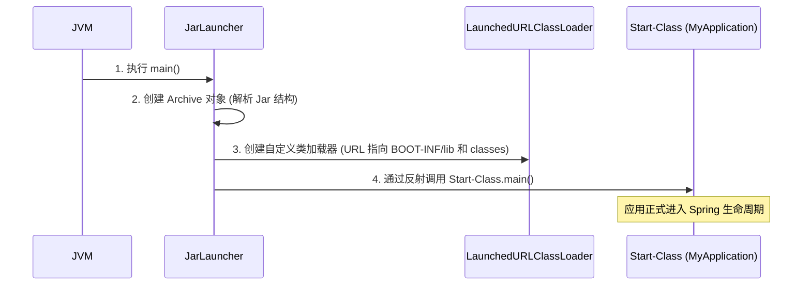

## Spring Boot Fat Jar 启动原理深度解析

Spring Boot 打包生成的 "Fat Jar"（或称 Executable Jar）可以直接通过 `java -jar` 启动。这种机制的神奇之处在于，它解决了 Java 原生类加载器无法加载嵌套 Jar 包（Jar in Jar）中类的问题。

---

## 一、 Fat Jar 的目录结构

一个典型的 Spring Boot Fat Jar 内部构造如下：

```text
example.jar
├── META-INF/
│   └── MANIFEST.MF           # 关键入口配置
├── org/
│   └── springframework/
│       └── boot/
│           └── loader/      # Spring Boot 自定义类加载器源码
└── BOOT-INF/
    ├── classes/             # 应用本身的 .class 文件
    └── lib/                 # 嵌套的第三方依赖 Jar 包
```

---

## 二、 核心启动流程

### 1. MANIFEST.MF 入口

当你运行 `java -jar` 时，JVM 会读取 `MANIFEST.MF`。Spring Boot 修改了其中的关键属性：

```properties
Main-Class: org.springframework.boot.loader.JarLauncher
Start-Class: com.example.MyApplication
```

- **`Main-Class`**：这是 JVM 真正运行的入口。`JarLauncher` 负责准备环境并启动应用。
- **`Start-Class`**：这是你定义的包含 `@SpringBootApplication` 的启动类。

### 2. JarLauncher 的工作步骤

`JarLauncher` 的生命周期可以概括为以下三个阶段：



---

## 三、 为什么需要 LaunchedURLClassLoader？

### 1. 打破双亲委派？

Spring Boot 并没有从根本上破坏双亲委派模型，而是通过其自定义的 `LaunchedURLClassLoader` 扩展了搜索路径。

- **Java 标准**：`URLClassLoader` 只能加载文件目录或直接的 Jar 包。它**不支持**读取 Jar 包内部嵌套的实体（如 `jar:file:/app.jar!/BOOT-INF/lib/log4j.jar!/`）。
- **Spring Boot 创新**：它定义了一种特殊的 URL 协议处理程序（`Handler`），使得类加载器能够定位并读取嵌套 Jar 内部的字节码流，而无需将其解压到临时目录。

### 2. 类加载优先级

1. **AppClassLoader**：加载 `org.springframework.boot.loader`（即 Spring Boot 启动器本身）。
2. **LaunchedURLClassLoader**：加载 `BOOT-INF/classes` 和 `BOOT-INF/lib` 中的所有内容。

---

## 四、 常见面试点

### Q: 为什么不能直接用 JVM 的类加载器加载 Boot 项目？

因为 JVM 的 `AppClassLoader` 并不认识 `BOOT-INF/lib` 下的嵌套 Jar 包。如果直接启动你的 `Start-Class`，会报 `NoClassDefFoundError`，因为依赖包里的类对 JVM 是不可见的。

### Q: Spring Boot 2.3+ 的分层构建（Layered Jar）是什么？

为了优化 Docker 镜像构建效率，Spring Boot 引入了分层概念：

- **dependencies**：普通的依赖。
- **spring-boot-loader**：加载器。
- **snapshot-dependencies**：快照依赖。
- **application**：应用本身。

通过分层，当只修改业务代码时，Docker 镜像只需更新最上面的 `application` 层，极大加快了 CI/CD 速度。
