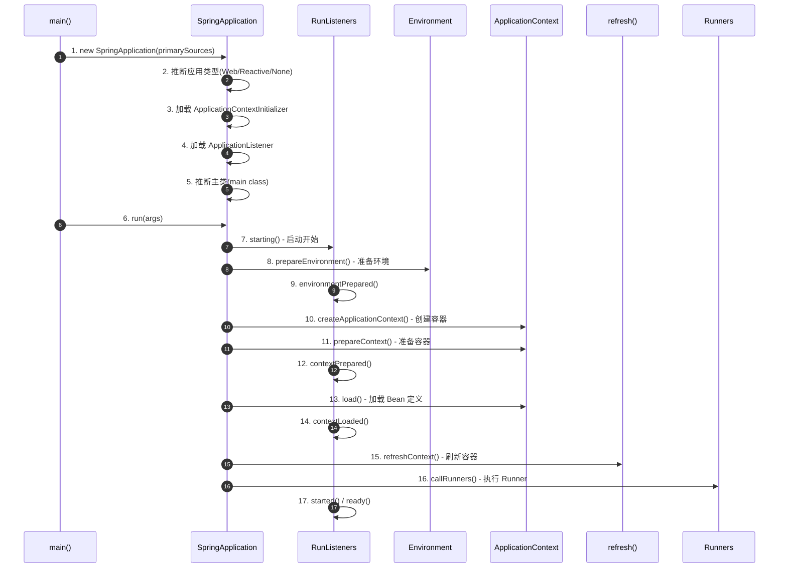
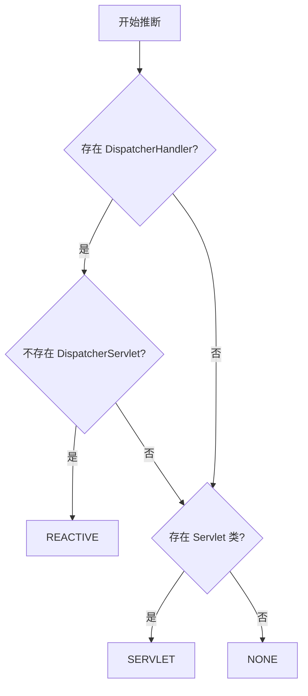
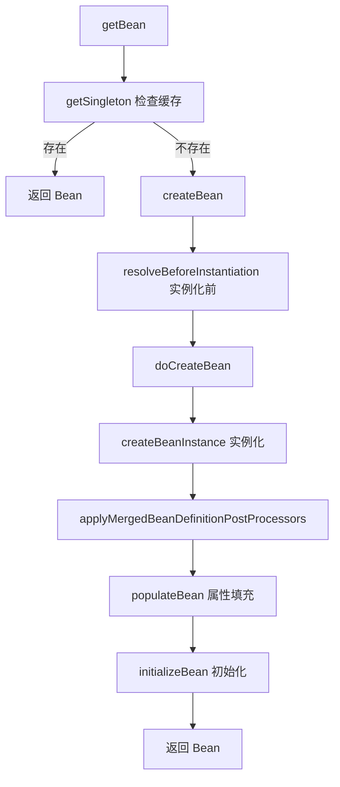
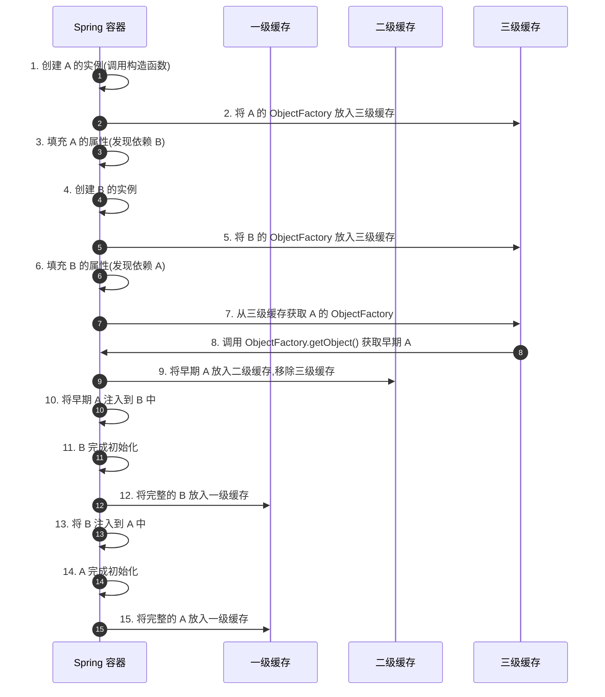

# SpringBoot 启动流程与内部机制深度剖析

SpringBoot 的启动过程看似简单,一行 `SpringApplication.run()` 就能启动整个应用。但其背后隐藏着复杂而精妙的初始化流程。本文将深入剖析 **SpringApplication.run() 的完整执行链路**、**ApplicationContext 刷新机制**、**Spring 事件发布机制**、**Bean 生命周期管理**以及**类加载与资源扫描原理**。

---

## 一、SpringApplication.run() 启动流程全景图

### 1. 启动流程整体架构



### 2. 核心源码分析

```java
public class SpringApplication {
    
    public static ConfigurableApplicationContext run(Class<?> primarySource, String... args) {
        return run(new Class<?>[] { primarySource }, args);
    }
    
    public static ConfigurableApplicationContext run(Class<?>[] primarySources, String[] args) {
        // 创建 SpringApplication 实例并运行
        return new SpringApplication(primarySources).run(args);
    }
    
    // ========== 阶段 1: 构造方法 ==========
    public SpringApplication(Class<?>... primarySources) {
        this(null, primarySources);
    }
    
    public SpringApplication(ResourceLoader resourceLoader, Class<?>... primarySources) {
        this.resourceLoader = resourceLoader;
        this.primarySources = new LinkedHashSet<>(Arrays.asList(primarySources));
        
        // 1. 推断应用类型(Web/Reactive/None)
        this.webApplicationType = WebApplicationType.deduceFromClasspath();
        
        // 2. 从 spring.factories 加载 BootstrapRegistryInitializer
        this.bootstrapRegistryInitializers = new ArrayList<>(
            getSpringFactoriesInstances(BootstrapRegistryInitializer.class)
        );
        
        // 3. 从 spring.factories 加载 ApplicationContextInitializer
        setInitializers(getSpringFactoriesInstances(ApplicationContextInitializer.class));
        
        // 4. 从 spring.factories 加载 ApplicationListener
        setListeners(getSpringFactoriesInstances(ApplicationListener.class));
        
        // 5. 推断主类(找到包含 main 方法的类)
        this.mainApplicationClass = deduceMainApplicationClass();
    }
    
    // ========== 阶段 2: run 方法 ==========
    public ConfigurableApplicationContext run(String... args) {
        long startTime = System.nanoTime();
        
        // 创建 BootstrapContext(引导上下文)
        DefaultBootstrapContext bootstrapContext = createBootstrapContext();
        ConfigurableApplicationContext context = null;
        
        // 配置 Headless 模式(适用于服务器环境,无图形界面)
        configureHeadlessProperty();
        
        // 1. 获取并启动 SpringApplicationRunListeners
        SpringApplicationRunListeners listeners = getRunListeners(args);
        listeners.starting(bootstrapContext, this.mainApplicationClass);
        
        try {
            // 2. 封装命令行参数
            ApplicationArguments applicationArguments = new DefaultApplicationArguments(args);
            
            // 3. 准备环境(Environment)
            ConfigurableEnvironment environment = prepareEnvironment(listeners, bootstrapContext, applicationArguments);
            configureIgnoreBeanInfo(environment);
            
            // 4. 打印 Banner
            Banner printedBanner = printBanner(environment);
            
            // 5. 创建 ApplicationContext
            context = createApplicationContext();
            context.setApplicationStartup(this.applicationStartup);
            
            // 6. 准备 ApplicationContext
            prepareContext(bootstrapContext, context, environment, listeners, applicationArguments, printedBanner);
            
            // 7. 刷新 ApplicationContext(核心)
            refreshContext(context);
            
            // 8. 刷新后的后置处理(默认为空,可由子类扩展)
            afterRefresh(context, applicationArguments);
            
            Duration timeTakenToStartup = Duration.ofNanos(System.nanoTime() - startTime);
            
            // 9. 通知监听器启动完成
            listeners.started(context, timeTakenToStartup);
            
            // 10. 调用 ApplicationRunner 和 CommandLineRunner
            callRunners(context, applicationArguments);
            
            Duration timeTakenToReady = Duration.ofNanos(System.nanoTime() - startTime);
            
            // 11. 通知监听器应用就绪
            listeners.ready(context, timeTakenToReady);
            
        } catch (Throwable ex) {
            // 12. 启动失败处理
            handleRunFailure(context, ex, listeners);
            throw new IllegalStateException(ex);
        }
        
        return context;
    }
}
```

---

## 二、应用类型推断

### 1. WebApplicationType 枚举

```java
public enum WebApplicationType {
    
    // 非 Web 应用
    NONE,
    
    // Servlet Web 应用(传统 Spring MVC)
    SERVLET,
    
    // 响应式 Web 应用(Spring WebFlux)
    REACTIVE;
    
    // 从 Classpath 推断应用类型
    static WebApplicationType deduceFromClasspath() {
        // 1. 检查是否存在 WebFlux 相关类
        if (ClassUtils.isPresent("org.springframework.web.reactive.DispatcherHandler", null)
                && !ClassUtils.isPresent("org.springframework.web.servlet.DispatcherServlet", null)
                && !ClassUtils.isPresent("org.glassfish.jersey.servlet.ServletContainer", null)) {
            return WebApplicationType.REACTIVE;
        }
        
        // 2. 检查是否存在 Servlet 相关类
        for (String className : SERVLET_INDICATOR_CLASSES) {
            if (!ClassUtils.isPresent(className, null)) {
                return WebApplicationType.NONE;
            }
        }
        
        return WebApplicationType.SERVLET;
    }
    
    private static final String[] SERVLET_INDICATOR_CLASSES = {
        "javax.servlet.Servlet",
        "org.springframework.web.context.ConfigurableWebApplicationContext"
    };
}
```

**推断逻辑**:



---

## 三、Environment 准备与配置加载

### 1. prepareEnvironment 方法

```java
private ConfigurableEnvironment prepareEnvironment(SpringApplicationRunListeners listeners,
        DefaultBootstrapContext bootstrapContext, ApplicationArguments applicationArguments) {
    
    // 1. 创建或获取 Environment
    ConfigurableEnvironment environment = getOrCreateEnvironment();
    
    // 2. 配置 Environment
    configureEnvironment(environment, applicationArguments.getSourceArgs());
    
    // 3. 附加 ConfigurationPropertySources(支持宽松绑定)
    ConfigurationPropertySources.attach(environment);
    
    // 4. 通知监听器 Environment 已准备好
    listeners.environmentPrepared(bootstrapContext, environment);
    
    // 5. 移动默认属性到最后(优先级最低)
    DefaultPropertiesPropertySource.moveToEnd(environment);
    
    // 6. 绑定 spring.main 配置到 SpringApplication
    bindToSpringApplication(environment);
    
    // 7. 如果不是自定义 Environment,则转换为标准类型
    if (!this.isCustomEnvironment) {
        EnvironmentConverter converter = new EnvironmentConverter(getClassLoader());
        environment = converter.convertEnvironmentIfNecessary(environment, deduceEnvironmentClass());
    }
    
    // 8. 再次附加 ConfigurationPropertySources
    ConfigurationPropertySources.attach(environment);
    
    return environment;
}
```

### 2. PropertySource 加载顺序

Spring Boot 会按以下顺序加载配置源(后加载的会覆盖先加载的):

```text
优先级从高到低:
┌─────────────────────────────┐
│ 命令行参数 --server.port=8081 │ ← 最高
├─────────────────────────────┤
│ SPRING_APPLICATION_JSON     │
├─────────────────────────────┤
│ ServletConfig/ServletContext│
├─────────────────────────────┤
│ JNDI 属性                    │
├─────────────────────────────┤
│ System.getProperties()      │
├─────────────────────────────┤
│ System.getenv()             │
├─────────────────────────────┤
│ application-{profile}.yml   │
├─────────────────────────────┤
│ application.yml             │
├─────────────────────────────┤
│ @PropertySource             │
├─────────────────────────────┤
│ SpringApplication.          │
│   setDefaultProperties()    │ ← 最低
└─────────────────────────────┘
```

---

## 四、ApplicationContext 创建与准备

### 1. createApplicationContext 方法

```java
protected ConfigurableApplicationContext createApplicationContext() {
    // 根据应用类型创建对应的 ApplicationContext
    return this.applicationContextFactory.create(this.webApplicationType);
}


// ApplicationContextFactory 默认实现
class DefaultApplicationContextFactory implements ApplicationContextFactory {
    
    @Override
    public ConfigurableApplicationContext create(WebApplicationType webApplicationType) {
        try {
            return switch (webApplicationType) {
                case SERVLET -> new AnnotationConfigServletWebServerApplicationContext();
                case REACTIVE -> new AnnotationConfigReactiveWebServerApplicationContext();
                default -> new AnnotationConfigApplicationContext();
            };
        } catch (Exception ex) {
            throw new IllegalStateException("Unable create a default ApplicationContext instance", ex);
        }
    }
}
```

### 2. prepareContext 方法

```java
private void prepareContext(DefaultBootstrapContext bootstrapContext, ConfigurableApplicationContext context,
        ConfigurableEnvironment environment, SpringApplicationRunListeners listeners,
        ApplicationArguments applicationArguments, Banner printedBanner) {
    
    // 1. 设置 Environment
    context.setEnvironment(environment);
    
    // 2. 后置处理 ApplicationContext
    postProcessApplicationContext(context);
    
    // 3. 应用 ApplicationContextInitializer
    applyInitializers(context);
    
    // 4. 通知监听器 Context 已准备好
    listeners.contextPrepared(context);
    
    // 5. 关闭 BootstrapContext
    bootstrapContext.close(context);
    
    // 6. 打印启动日志和 Profile
    if (this.logStartupInfo) {
        logStartupInfo(context.getParent() == null);
        logStartupProfileInfo(context);
    }
    
    // 7. 注册单例 Bean
    ConfigurableListableBeanFactory beanFactory = context.getBeanFactory();
    beanFactory.registerSingleton("springApplicationArguments", applicationArguments);
    if (printedBanner != null) {
        beanFactory.registerSingleton("springBootBanner", printedBanner);
    }
    
    // 8. 设置 Bean 定义覆盖策略
    if (beanFactory instanceof AbstractAutowireCapableBeanFactory autowireCapableBeanFactory) {
        autowireCapableBeanFactory.setAllowCircularReferences(this.allowCircularReferences);
        if (beanFactory instanceof DefaultListableBeanFactory listableBeanFactory) {
            listableBeanFactory.setAllowBeanDefinitionOverriding(this.allowBeanDefinitionOverriding);
        }
    }
    
    // 9. 加载启动类(主配置类)
    Set<Object> sources = getAllSources();
    load(context, sources.toArray(new Object[0]));
    
    // 10. 通知监听器 Context 已加载
    listeners.contextLoaded(context);
}
```

### 3. applyInitializers 执行顺序

```java
protected void applyInitializers(ConfigurableApplicationContext context) {
    // 获取所有 ApplicationContextInitializer
    for (ApplicationContextInitializer initializer : getInitializers()) {
        // 检查泛型类型是否匹配
        Class<?> requiredType = GenericTypeResolver.resolveTypeArgument(
            initializer.getClass(), ApplicationContextInitializer.class);
        
        Assert.isInstanceOf(requiredType, context, "Unable to call initializer.");
        
        // 执行初始化
        initializer.initialize(context);
    }
}
```

---

## 五、ApplicationContext 刷新机制

### 1. refresh() 方法核心流程

```java
@Override
public void refresh() throws BeansException, IllegalStateException {
    synchronized (this.startupShutdownMonitor) {
        StartupStep contextRefresh = this.applicationStartup.start("spring.context.refresh");
        
        // 1. 准备刷新(设置启动时间、激活状态等)
        prepareRefresh();
        
        // 2. 获取 BeanFactory(告诉子类刷新内部 Bean 工厂)
        ConfigurableListableBeanFactory beanFactory = obtainFreshBeanFactory();
        
        // 3. 准备 BeanFactory(设置类加载器、后置处理器等)
        prepareBeanFactory(beanFactory);
        
        try {
            // 4. BeanFactory 后置处理(由子类扩展)
            postProcessBeanFactory(beanFactory);
            
            StartupStep beanPostProcess = this.applicationStartup.start("spring.context.beans.post-process");
            
            // 5. 执行 BeanFactoryPostProcessor
            invokeBeanFactoryPostProcessors(beanFactory);
            
            // 6. 注册 BeanPostProcessor
            registerBeanPostProcessors(beanFactory);
            beanPostProcess.end();
            
            // 7. 初始化消息源(国际化)
            initMessageSource();
            
            // 8. 初始化事件多播器
            initApplicationEventMulticaster();
            
            // 9. 刷新特定上下文(由子类扩展,如启动 Tomcat)
            onRefresh();
            
            // 10. 注册监听器
            registerListeners();
            
            // 11. 实例化所有非懒加载的单例 Bean
            finishBeanFactoryInitialization(beanFactory);
            
            // 12. 完成刷新(发布 ContextRefreshedEvent 事件)
            finishRefresh();
            
        } catch (BeansException ex) {
            // 销毁已创建的单例 Bean
            destroyBeans();
            // 取消刷新
            cancelRefresh(ex);
            throw ex;
        } finally {
            // 清理缓存(如反射缓存、类型缓存等)
            resetCommonCaches();
            contextRefresh.end();
        }
    }
}
```

### 2. invokeBeanFactoryPostProcessors 执行顺序

**执行顺序**:

```java
// 1. 先执行 BeanDefinitionRegistryPostProcessor
// 1.1 实现 PriorityOrdered 接口的
// 1.2 实现 Ordered 接口的
// 1.3 其余的

// 2. 再执行常规 BeanFactoryPostProcessor
// 2.1 实现 PriorityOrdered 接口的
// 2.2 实现 Ordered 接口的
// 2.3 其余的
```

**关键实现 `ConfigurationClassPostProcessor`**:

```java
public class ConfigurationClassPostProcessor implements BeanDefinitionRegistryPostProcessor {
    
    @Override
    public void postProcessBeanDefinitionRegistry(BeanDefinitionRegistry registry) {
        // 处理 @Configuration 类
        processConfigBeanDefinitions(registry);
    }
    
    private void processConfigBeanDefinitions(BeanDefinitionRegistry registry) {
        // 1. 找到所有 @Configuration 类
        List<BeanDefinitionHolder> configCandidates = new ArrayList<>();
        String[] candidateNames = registry.getBeanDefinitionNames();
        
        for (String beanName : candidateNames) {
            BeanDefinition beanDef = registry.getBeanDefinition(beanName);
            if (ConfigurationClassUtils.isFullConfigurationClass(beanDef) ||
                    ConfigurationClassUtils.isLiteConfigurationClass(beanDef)) {
                configCandidates.add(new BeanDefinitionHolder(beanDef, beanName));
            }
        }
        
        // 2. 解析 @Configuration 类
        ConfigurationClassParser parser = new ConfigurationClassParser(...);
        parser.parse(configCandidates);
        
        // 3. 处理解析结果(@Bean、@Import、@ImportResource 等)
        this.reader.loadBeanDefinitions(parser.getConfigurationClasses());
    }
}
```

### 3. finishBeanFactoryInitialization 实例化 Bean

```java
protected void finishBeanFactoryInitialization(ConfigurableListableBeanFactory beanFactory) {
    
    // 1. 初始化类型转换服务
    if (beanFactory.containsBean(CONVERSION_SERVICE_BEAN_NAME)) {
        beanFactory.setConversionService(
            beanFactory.getBean(CONVERSION_SERVICE_BEAN_NAME, ConversionService.class));
    }
    
    // 2. 注册默认的嵌入式值解析器(处理 ${...} 占位符)
    if (!beanFactory.hasEmbeddedValueResolver()) {
        beanFactory.addEmbeddedValueResolver(strVal -> getEnvironment().resolvePlaceholders(strVal));
    }
    
    // 3. 提前初始化 LoadTimeWeaverAware Bean
    String[] weaverAwareNames = beanFactory.getBeanNamesForType(LoadTimeWeaverAware.class, false, false);
    for (String weaverAwareName : weaverAwareNames) {
        getBean(weaverAwareName);
    }
    
    // 4. 停止使用临时类加载器
    beanFactory.setTempClassLoader(null);
    
    // 5. 冻结配置(不允许再修改 Bean 定义)
    beanFactory.freezeConfiguration();
    
    // 6. 实例化所有非懒加载的单例 Bean
    beanFactory.preInstantiateSingletons();
}
```

**`preInstantiateSingletons` 核心逻辑**:

```java
@Override
public void preInstantiateSingletons() throws BeansException {
    List<String> beanNames = new ArrayList<>(this.beanDefinitionNames);
    
    // 1. 触发所有非懒加载单例 Bean 的初始化
    for (String beanName : beanNames) {
        RootBeanDefinition bd = getMergedLocalBeanDefinition(beanName);
        
        if (!bd.isAbstract() && bd.isSingleton() && !bd.isLazyInit()) {
            if (isFactoryBean(beanName)) {
                // FactoryBean 需要特殊处理
                Object bean = getBean(FACTORY_BEAN_PREFIX + beanName);
                if (bean instanceof FactoryBean) {
                    FactoryBean<?> factory = (FactoryBean<?>) bean;
                    if (factory.isEagerInit()) {
                        getBean(beanName);
                    }
                }
            } else {
                // 普通 Bean 直接 getBean
                getBean(beanName);
            }
        }
    }
    
    // 2. 触发所有 SmartInitializingSingleton 的回调
    for (String beanName : beanNames) {
        Object singletonInstance = getSingleton(beanName);
        if (singletonInstance instanceof SmartInitializingSingleton smartSingleton) {
            smartSingleton.afterSingletonsInstantiated();
        }
    }
}
```

---

## 六、Bean 生命周期完整流程

### 1. Bean 创建流程



### 2. initializeBean 详细流程

```java
protected Object initializeBean(String beanName, Object bean, @Nullable RootBeanDefinition mbd) {
    
    // 1. 执行 Aware 接口回调
    invokeAwareMethods(beanName, bean);
    
    // 2. 执行 BeanPostProcessor 的 postProcessBeforeInitialization
    Object wrappedBean = applyBeanPostProcessorsBeforeInitialization(bean, beanName);
    
    // 3. 执行初始化方法
    invokeInitMethods(beanName, wrappedBean, mbd);
    
    // 4. 执行 BeanPostProcessor 的 postProcessAfterInitialization(AOP 在此处生成代理)
    wrappedBean = applyBeanPostProcessorsAfterInitialization(wrappedBean, beanName);
    
    return wrappedBean;
}

// Aware 接口回调
private void invokeAwareMethods(String beanName, Object bean) {
    if (bean instanceof Aware) {
        if (bean instanceof BeanNameAware beanNameAware) {
            beanNameAware.setBeanName(beanName);
        }
        if (bean instanceof BeanClassLoaderAware beanClassLoaderAware) {
            beanClassLoaderAware.setBeanClassLoader(getBeanClassLoader());
        }
        if (bean instanceof BeanFactoryAware beanFactoryAware) {
            beanFactoryAware.setBeanFactory(this);
        }
    }
}


// 初始化方法调用
protected void invokeInitMethods(String beanName, Object bean, @Nullable RootBeanDefinition mbd) {
    // 1. 先执行 InitializingBean 接口的 afterPropertiesSet 方法
    if (bean instanceof InitializingBean initializingBean) {
        initializingBean.afterPropertiesSet();
    }
    
    // 2. 再执行自定义的 init-method
    if (mbd != null && mbd.getInitMethodName() != null) {
        invokeCustomInitMethod(beanName, bean, mbd);
    }
}
```

### 3. Bean 生命周期总结

```java
/**

 * Bean 完整生命周期(按执行顺序):
 * 
 * 1. 实例化: Constructor
 * 2. 属性赋值: populateBean (依赖注入)
 * 3. BeanNameAware.setBeanName()
 * 4. BeanFactoryAware.setBeanFactory()
 * 5. ApplicationContextAware.setApplicationContext()
 * 6. BeanPostProcessor.postProcessBeforeInitialization()
 * 7. @PostConstruct 注解的方法
 * 8. InitializingBean.afterPropertiesSet()
 * 9. init-method 自定义初始化方法
 * 10. BeanPostProcessor.postProcessAfterInitialization() (AOP 代理生成)
 * 11. Bean 可以使用了
 * 
 * 容器关闭时:
 * 12. @PreDestroy 注解的方法
 * 13. DisposableBean.destroy()
 * 14. destroy-method 自定义销毁方法

 */
```

---

## 七、Spring 事件发布机制

### 1. Spring Boot 启动事件顺序

```java
// Spring Boot 启动过程中会依次发布以下事件:

// 1. ApplicationStartingEvent - 应用启动开始
// 2. ApplicationEnvironmentPreparedEvent - 环境准备完成
// 3. ApplicationContextInitializedEvent - 上下文初始化完成
// 4. ApplicationPreparedEvent - 上下文准备完成
// 5. ContextRefreshedEvent - 上下文刷新完成(Spring 原生事件)
// 6. ApplicationStartedEvent - 应用启动完成
// 7. ApplicationReadyEvent - 应用就绪,可接收请求
// 8. ApplicationFailedEvent - 应用启动失败(如果失败)
```

### 2. 自定义事件监听

```java
// 方式 1: 实现 ApplicationListener 接口
@Component
public class MyApplicationListener implements ApplicationListener<ApplicationReadyEvent> {
    
    @Override
    public void onApplicationEvent(ApplicationReadyEvent event) {
        System.out.println("应用已就绪,启动时间: " + event.getTimeTaken().toMillis() + "ms");
    }
}


// 方式 2: 使用 @EventListener 注解
@Component
public class MyEventListener {
    
    @EventListener
    public void onApplicationReady(ApplicationReadyEvent event) {
        System.out.println("应用已就绪");
    }
    
    @EventListener
    public void onContextRefreshed(ContextRefreshedEvent event) {
        System.out.println("上下文已刷新");
    }
}
```

### 3. 事件发布流程

```java
public class SimpleApplicationEventMulticaster extends AbstractApplicationEventMulticaster {
    
    @Override
    public void multicastEvent(final ApplicationEvent event, @Nullable ResolvableType eventType) {
        ResolvableType type = (eventType != null ? eventType : resolveDefaultEventType(event));
        Executor executor = getTaskExecutor();
        
        // 获取对该事件感兴趣的所有监听器
        for (ApplicationListener<?> listener : getApplicationListeners(event, type)) {
            if (executor != null) {
                // 异步执行
                executor.execute(() -> invokeListener(listener, event));
            } else {
                // 同步执行
                invokeListener(listener, event);
            }
        }
    }
    
    protected void invokeListener(ApplicationListener<?> listener, ApplicationEvent event) {
        ErrorHandler errorHandler = getErrorHandler();
        if (errorHandler != null) {
            try {
                doInvokeListener(listener, event);
            } catch (Throwable err) {
                errorHandler.handleError(err);
            }
        } else {
            doInvokeListener(listener, event);
        }
    }
    
    private void doInvokeListener(ApplicationListener listener, ApplicationEvent event) {
        listener.onApplicationEvent(event);
    }
}
```

---

## 八、三级缓存解决循环依赖

### 1. 三级缓存机制

Spring 通过三级缓存解决单例 Bean 的循环依赖问题:

```java
public class DefaultSingletonBeanRegistry extends SimpleAliasRegistry implements SingletonBeanRegistry {
    
    // 一级缓存: 存放完全初始化好的单例 Bean
    private final Map<String, Object> singletonObjects = new ConcurrentHashMap<>(256);
    
    // 二级缓存: 存放早期暴露的单例 Bean(半成品,尚未完成属性注入和初始化)
    private final Map<String, Object> earlySingletonObjects = new ConcurrentHashMap<>(16);
    
    // 三级缓存: 存放单例 Bean 的工厂对象
    private final Map<String, ObjectFactory<?>> singletonFactories = new HashMap<>(16);
}
```

### 2. 循环依赖解决流程

**场景**: A 依赖 B,B 依赖 A

```java
@Component
public class A {
    @Autowired
    private B b;
}

@Component
public class B {
    @Autowired
    private A a;
}
```

**解决流程**:



### 3. getSingleton 源码

```java
protected Object getSingleton(String beanName, boolean allowEarlyReference) {
    // 1. 先从一级缓存获取
    Object singletonObject = this.singletonObjects.get(beanName);
    
    // 2. 一级缓存没有,且该 Bean 正在创建中
    if (singletonObject == null && isSingletonCurrentlyInCreation(beanName)) {
        // 3. 从二级缓存获取
        singletonObject = this.earlySingletonObjects.get(beanName);
        
        // 4. 二级缓存也没有,且允许早期引用
        if (singletonObject == null && allowEarlyReference) {
            synchronized (this.singletonObjects) {
                // 双重检查
                singletonObject = this.singletonObjects.get(beanName);
                if (singletonObject == null) {
                    singletonObject = this.earlySingletonObjects.get(beanName);
                    if (singletonObject == null) {
                        // 5. 从三级缓存获取 ObjectFactory
                        ObjectFactory<?> singletonFactory = this.singletonFactories.get(beanName);
                        if (singletonFactory != null) {
                            // 6. 调用 ObjectFactory.getObject() 创建早期对象
                            singletonObject = singletonFactory.getObject();
                            // 7. 放入二级缓存
                            this.earlySingletonObjects.put(beanName, singletonObject);
                            // 8. 移除三级缓存
                            this.singletonFactories.remove(beanName);
                        }
                    }
                }
            }
        }
    }
    return singletonObject;
}
```

### 4. 为什么需要三级缓存?

**问题**: 为什么不用两级缓存?

**答案**: 三级缓存是为了处理 AOP 代理对象的场景。

- **二级缓存**存放的是早期对象(原始对象)
- **三级缓存**存放的是 `ObjectFactory`,可以在获取时决定返回原始对象还是代理对象

```java
// 三级缓存中存放的 ObjectFactory
addSingletonFactory(beanName, () -> getEarlyBeanReference(beanName, mbd, bean));

protected Object getEarlyBeanReference(String beanName, RootBeanDefinition mbd, Object bean) {
    Object exposedObject = bean;
    if (!mbd.isSynthetic() && hasInstantiationAwareBeanPostProcessors()) {
        for (SmartInstantiationAwareBeanPostProcessor bp : getBeanPostProcessorCache().smartInstantiationAware) {
            // 如果有 AOP,这里会返回代理对象
            exposedObject = bp.getEarlyBeanReference(exposedObject, beanName);
        }
    }
    return exposedObject;
}
```

---

## 九、@Import 注解原理

### 1. @Import 的四种用法

```java
// 1. 导入普通配置类
@Import(MyConfig.class)

// 2. 导入 ImportSelector
@Import(MyImportSelector.class)

// 3. 导入 DeferredImportSelector(延迟导入)
@Import(MyDeferredImportSelector.class)

// 4. 导入 ImportBeanDefinitionRegistrar
@Import(MyImportBeanDefinitionRegistrar.class)
```

### 2. ImportSelector 示例

```java
public class MyImportSelector implements ImportSelector {
    
    @Override
    public String[] selectImports(AnnotationMetadata importingClassMetadata) {
        // 返回要导入的配置类全限定名
        return new String[] {
            "com.example.ConfigA",
            "com.example.ConfigB"
        };
    }
}
```

### 3. ImportBeanDefinitionRegistrar 示例

```java
public class MyImportBeanDefinitionRegistrar implements ImportBeanDefinitionRegistrar {
    
    @Override
    public void registerBeanDefinitions(AnnotationMetadata importingClassMetadata, 
                                       BeanDefinitionRegistry registry) {
        // 手动注册 BeanDefinition
        BeanDefinitionBuilder builder = BeanDefinitionBuilder
            .genericBeanDefinition(MyService.class);
        
        registry.registerBeanDefinition("myService", builder.getBeanDefinition());
    }
}
```

### 4. @Import 处理流程

```java
// ConfigurationClassParser 处理 @Import
private void processImports(ConfigurationClass configClass, SourceClass currentSourceClass,
        Collection<SourceClass> importCandidates, Predicate<String> exclusionFilter, boolean checkForCircularImports) {
    
    for (SourceClass candidate : importCandidates) {
        if (candidate.isAssignable(ImportSelector.class)) {
            // 1. 处理 ImportSelector
            Class<?> candidateClass = candidate.loadClass();
            ImportSelector selector = ParserStrategyUtils.instantiateClass(candidateClass, ImportSelector.class, ...);
            
            if (selector instanceof DeferredImportSelector) {
                // 延迟导入选择器,最后处理
                this.deferredImportSelectorHandler.handle(configClass, (DeferredImportSelector) selector);
            } else {
                // 立即处理
                String[] importClassNames = selector.selectImports(currentSourceClass.getMetadata());
                processImports(configClass, currentSourceClass, asSourceClasses(importClassNames, exclusionFilter), ...);
            }
        } 
        else if (candidate.isAssignable(ImportBeanDefinitionRegistrar.class)) {
            // 2. 处理 ImportBeanDefinitionRegistrar
            Class<?> candidateClass = candidate.loadClass();
            ImportBeanDefinitionRegistrar registrar = ParserStrategyUtils.instantiateClass(...);
            configClass.addImportBeanDefinitionRegistrar(registrar, currentSourceClass.getMetadata());
        } 
        else {
            // 3. 处理普通配置类
            processConfigurationClass(candidate.asConfigClass(configClass), exclusionFilter);
        }
    }
}
```

---

## 总结

SpringBoot 的启动流程体现了 Spring 框架的精髓:

1. **推断式设计**: 通过 Classpath 推断应用类型,无需显式配置
2. **分层初始化**: 从 Environment → Context → Bean,逐层构建
3. **扩展点丰富**: Initializer、Listener、PostProcessor 提供灵活的定制能力
4. **事件驱动**: 通过事件机制解耦启动流程各阶段
5. **生命周期管理**: Bean 的创建、初始化、销毁全流程可控
6. **循环依赖解决**: 三级缓存机制巧妙解决单例 Bean 的循环依赖问题
7. **模块化导入**: @Import 注解提供灵活的配置导入机制

掌握这些内部机制,不仅能深入理解 SpringBoot 的运行原理,更能在遇到问题时快速定位和解决。
