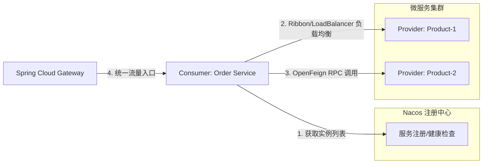

## Spring Cloud 微服务起步：架构演进与全家桶协同实战

微服务架构并非银弹，但它是应对企业级复杂业务、实现弹性伸缩的必然之路。对于初学者而言，Spring Cloud 提供了一套标准化的“全家桶”方案，让我们能够以插件化的方式集成分布式系统的核心功能。

---

## 一、 为什么是 Spring Cloud？从单体到分布式

在演进到微服务之前，我们必须理解为什么要付出“网络开销”的代价：

1.  **单体瓶颈**：牵一发而动全身，编译慢、部署难，无法针对不同任务进行垂直扩容。
2.  **微服务演进**：将应用拆分为一组小型服务。每个服务运行在自己的进程中，通过轻量级机制（通常是 HTTP/JSON）通信。

Spring Cloud 的地位：**它是分布式系统的“集成化标准库”**。它并不重复造轮子，而是通过 `SpringBoot` 的自动装配机制，将 Netflix、阿里、HashiCorp 等优秀的分布式组件封装成易用的 Starter。

---

## 二、 核心组件选型：Spring Cloud Alibaba 成为主流

随着 Netflix 家族组件的停更，**Spring Cloud Alibaba** 已成为国内事实上的首选方案，其核心对应关系如下：

| 功能维度 | Spring Cloud Netflix (旧) | Spring Cloud Alibaba (新) | 说明 |
| :--- | :--- | :--- | :--- |
| **注册中心** | Eureka | **Nacos** | Nacos 支持 CP/AP 切换，功能更全 |
| **配置中心** | Spring Cloud Config | **Nacos** | Nacos 实现配置的动态感知，无需刷新 |
| **服务调用** | Ribbon / Feign | **OpenFeign** | Feign 已整合 LoadBalancer |
| **流量治理** | Hystrix | **Sentinel** | Sentinel 流量控制维度更丰富 |
| **分布式事务** | 无 (需要 LCN/TCC) | **Seata** | 解决微服务数据一致性的核心利器 |
| **网关** | Zuul | **Spring Cloud Gateway** | 基于 WebFlux，性能更强 |

---

## 三、 实战：构建第一个微服务链路

一个典型的微服务闭环包含：**服务注册** -> **服务发现** -> **负载均衡调用**。

### 1. 服务提供者：注册到 Nacos

在 `pom.xml` 引入 `spring-cloud-starter-alibaba-nacos-discovery` 后，只需一个配置：

```yaml
spring:
  application:
    name: product-service
  cloud:
    nacos:
      discovery:
        server-addr: 127.0.0.1:8848
```

### 2. 服务消费者：通过 OpenFeign 透明化调用

使用 `OpenFeign` 时，我们只需定义一个接口，Spring Cloud 会自动生成代理类并集成负载均衡。

```java
@FeignClient(value = "product-service") // 对应 Nacos 中的服务名
public interface ProductClient {
    @GetMapping("/products/{id}")
    ProductDTO getProduct(@PathVariable("id") Long id);
}

@Service
public class OrderService {
    @Autowired
    private ProductClient productClient;

    public void createOrder(Long productId) {
        // 像调用本地方法一样调用远程服务
        ProductDTO product = productClient.getProduct(productId);
        // ...执行下单逻辑
    }
}
```

---

## 四、 微服务链路交互模型



---

## 五、 后续进阶建议

入门只是第一步。在微服务化后，您将面临更深层次的挑战，我们将在后续章节持续拆解：

- **配置管理**：如何实现生产环境配置的“秒级”生效？参考 [Nacos 高级配置管理与多环境隔离](./nacos-config-advanced.md)。
- **流量防卫**：如何防止一个服务的崩溃拖垮整个系统？参考 [Sentinel 深度实践：从限流到热点参数排队](./sentinel-governance.md)。
- **数据一致性**：分布式事务怎么搞？参考 [Seata AT 模型原理与实战](./seata-distributed-transaction.md)。

> 更多底层原理请参考：[Spring Boot 自动装配与微服务组件原理](./springboot-springcloud.md)
