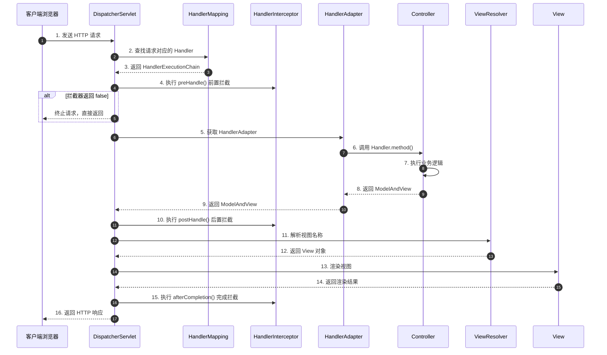

# Spring MVC 核心原理与请求处理流程

Spring MVC 是 Spring 框架中用于构建 Web 应用程序的模块，它基于 Servlet API 构建，采用 MVC（Model-View-Controller）设计模式。理解 Spring MVC 的核心原理对于掌握 Web 开发至关重要。

---

## 一、Spring MVC 核心组件

### 1. 核心组件概览

| 组件名称 | 职责说明 | 核心接口/类 |
|---------|---------|-----------|
| **DispatcherServlet** | 前端控制器，统一接收所有请求并分发 | `DispatcherServlet` |
| **HandlerMapping** | 处理器映射器，根据 URL 找到对应的 Handler | `RequestMappingHandlerMapping` |
| **HandlerAdapter** | 处理器适配器，调用 Handler 处理请求 | `RequestMappingHandlerAdapter` |
| **Handler** | 处理器（Controller），实际处理业务逻辑 | 标注 `@Controller` 的类 |
| **ViewResolver** | 视图解析器，将逻辑视图名解析为具体视图 | `InternalResourceViewResolver` |
| **View** | 视图对象，负责渲染响应内容 | `JstlView`、`ThymeleafView` |
| **HandlerInterceptor** | 拦截器，在请求处理前后执行额外逻辑 | `HandlerInterceptor` |
| **HandlerExceptionResolver** | 异常解析器，处理请求过程中的异常 | `ExceptionHandlerExceptionResolver` |

---

## 二、Spring MVC 请求处理完整流程

### 1. 请求处理时序图



### 2. 详细处理步骤

#### 步骤 1-3：请求映射

```java
// DispatcherServlet.doDispatch() 核心源码
protected void doDispatch(HttpServletRequest request, HttpServletResponse response) throws Exception {
    HttpServletRequest processedRequest = request;
    HandlerExecutionChain mappedHandler = null;
    
    try {
        ModelAndView mv = null;
        Exception dispatchException = null;
        
        try {
            // 1. 检查是否是文件上传请求
            processedRequest = checkMultipart(request);
            
            // 2. 根据请求 URL 查找对应的 Handler（核心）
            mappedHandler = getHandler(processedRequest);
            if (mappedHandler == null) {
                noHandlerFound(processedRequest, response);
                return;
            }
            
            // 3. 获取能够执行该 Handler 的适配器
            HandlerAdapter ha = getHandlerAdapter(mappedHandler.getHandler());
            
            // 4. 执行拦截器的 preHandle 方法
            if (!mappedHandler.applyPreHandle(processedRequest, response)) {
                return;
            }
            
            // 5. 真正调用 Handler 方法（Controller 方法）
            mv = ha.handle(processedRequest, response, mappedHandler.getHandler());
            
            // 6. 执行拦截器的 postHandle 方法
            mappedHandler.applyPostHandle(processedRequest, response, mv);
            
        } catch (Exception ex) {
            dispatchException = ex;
        }
        
        // 7. 处理分发结果（渲染视图或处理异常）
        processDispatchResult(processedRequest, response, mappedHandler, mv, dispatchException);
        
    } finally {
        // 8. 执行拦截器的 afterCompletion 方法
        if (mappedHandler != null) {
            mappedHandler.triggerAfterCompletion(request, response, null);
        }
    }
}
```

#### 步骤 4-6：拦截器执行

```java
public class HandlerExecutionChain {
    
    private final Object handler;
    private final List<HandlerInterceptor> interceptorList = new ArrayList<>();
    
    // 前置拦截
    boolean applyPreHandle(HttpServletRequest request, HttpServletResponse response) throws Exception {
        for (int i = 0; i < this.interceptorList.size(); i++) {
            HandlerInterceptor interceptor = this.interceptorList.get(i);
            if (!interceptor.preHandle(request, response, this.handler)) {
                triggerAfterCompletion(request, response, null);
                return false; // 有一个返回 false，就终止请求
            }
        }
        return true;
    }
    
    // 后置拦截
    void applyPostHandle(HttpServletRequest request, HttpServletResponse response, ModelAndView mv) throws Exception {
        for (int i = this.interceptorList.size() - 1; i >= 0; i--) {
            HandlerInterceptor interceptor = this.interceptorList.get(i);
            interceptor.postHandle(request, response, this.handler, mv);
        }
    }
}
```

---

## 三、HandlerMapping 映射原理

### 1. URL 映射注册流程

Spring MVC 在启动时会扫描所有标注了 `@RequestMapping` 的方法，并将 URL 和 Handler 方法的映射关系注册到 `HandlerMapping` 中。

```java
public class RequestMappingHandlerMapping extends AbstractHandlerMethodMapping<RequestMappingInfo> {
    
    @Override
    protected boolean isHandler(Class<?> beanType) {
        // 判断类是否标注了 @Controller 或 @RequestMapping
        return (AnnotatedElementUtils.hasAnnotation(beanType, Controller.class) ||
                AnnotatedElementUtils.hasAnnotation(beanType, RequestMapping.class));
    }
    
    @Override
    protected RequestMappingInfo getMappingForMethod(Method method, Class<?> handlerType) {
        // 解析方法上的 @RequestMapping 注解
        RequestMappingInfo info = createRequestMappingInfo(method);
        if (info != null) {
            // 合并类级别的 @RequestMapping
            RequestMappingInfo typeInfo = createRequestMappingInfo(handlerType);
            if (typeInfo != null) {
                info = typeInfo.combine(info);
            }
        }
        return info;
    }
}
```

### 2. URL 匹配算法

```java
// 映射关系存储结构
private final Map<String, HandlerMethod> urlLookup = new LinkedHashMap<>();
private final MultiValueMap<String, RequestMappingInfo> pathLookup = new LinkedMultiValueMap<>();

// 根据请求路径查找 Handler
public HandlerMethod getHandlerInternal(HttpServletRequest request) throws Exception {
    String lookupPath = getUrlPathHelper().getLookupPathForRequest(request);
    
    // 1. 精确匹配
    HandlerMethod handlerMethod = lookupHandlerMethod(lookupPath, request);
    
    // 2. 模糊匹配（路径变量、通配符）
    if (handlerMethod == null) {
        handlerMethod = handleNoMatch(this.mappingRegistry.getMappings().keySet(), lookupPath, request);
    }
    
    return handlerMethod;
}
```

---

## 四、HandlerAdapter 适配器原理

### 1. 适配器模式应用

Spring MVC 支持多种 Handler 类型（如标注 `@RequestMapping` 的方法、实现 `Controller` 接口的类、`HttpRequestHandler` 等），通过适配器模式统一调用。

```java
public interface HandlerAdapter {
    
    // 判断是否支持该 Handler
    boolean supports(Object handler);
    
    // 执行 Handler
    ModelAndView handle(HttpServletRequest request, HttpServletResponse response, Object handler) throws Exception;
}
```

### 2. RequestMappingHandlerAdapter 核心实现

```java
public class RequestMappingHandlerAdapter extends AbstractHandlerMethodAdapter {
    
    @Override
    protected ModelAndView handleInternal(HttpServletRequest request,
                                          HttpServletResponse response,
                                          HandlerMethod handlerMethod) throws Exception {
        ModelAndView mav;
        
        // 1. 参数解析（通过 ArgumentResolver）
        Object[] args = getMethodArgumentValues(request, response, handlerMethod);
        
        // 2. 反射调用 Controller 方法
        Object returnValue = handlerMethod.getMethod().invoke(handlerMethod.getBean(), args);
        
        // 3. 返回值处理（通过 ReturnValueHandler）
        mav = getModelAndView(returnValue, request);
        
        return mav;
    }
}
```

---

## 五、参数解析与返回值处理

### 1. 参数解析器（ArgumentResolver）

Spring MVC 通过 `HandlerMethodArgumentResolver` 接口实现参数的自动绑定。

```java
public interface HandlerMethodArgumentResolver {
    
    // 判断是否支持该参数类型
    boolean supportsParameter(MethodParameter parameter);
    
    // 解析参数值
    Object resolveArgument(MethodParameter parameter,
                           ModelAndViewContainer mavContainer,
                           NativeWebRequest webRequest,
                           WebDataBinderFactory binderFactory) throws Exception;
}
```

#### 常见参数解析器

| 参数类型 | 解析器 | 说明 |
|---------|--------|------|
| `@RequestParam` | `RequestParamMethodArgumentResolver` | 解析请求参数 |
| `@PathVariable` | `PathVariableMethodArgumentResolver` | 解析路径变量 |
| `@RequestBody` | `RequestResponseBodyMethodProcessor` | 解析请求体（JSON） |
| `@RequestHeader` | `RequestHeaderMethodArgumentResolver` | 解析请求头 |
| `HttpServletRequest` | `ServletRequestMethodArgumentResolver` | 直接注入原生对象 |
| `Model` | `ModelMethodProcessor` | 注入 Model 对象 |

### 2. 返回值处理器（ReturnValueHandler）

```java
public interface HandlerMethodReturnValueHandler {
    
    // 判断是否支持该返回值类型
    boolean supportsReturnType(MethodParameter returnType);
    
    // 处理返回值
    void handleReturnValue(Object returnValue,
                           MethodParameter returnType,
                           ModelAndViewContainer mavContainer,
                           NativeWebRequest webRequest) throws Exception;
}
```

#### 常见返回值处理器

| 返回类型 | 处理器 | 说明 |
|---------|--------|------|
| `@ResponseBody` | `RequestResponseBodyMethodProcessor` | 直接写入响应体（JSON） |
| `ModelAndView` | `ModelAndViewMethodReturnValueHandler` | 返回视图 |
| `String` | `ViewNameMethodReturnValueHandler` | 返回视图名称 |
| `void` | `ViewMethodReturnValueHandler` | 默认视图 |

---

## 六、视图解析与渲染

### 1. ViewResolver 视图解析流程

```java
public class InternalResourceViewResolver extends UrlBasedViewResolver {
    
    @Override
    protected View createView(String viewName, Locale locale) throws Exception {
        // 如果是重定向
        if (viewName.startsWith(REDIRECT_URL_PREFIX)) {
            String redirectUrl = viewName.substring(REDIRECT_URL_PREFIX.length());
            return new RedirectView(redirectUrl);
        }
        
        // 如果是转发
        if (viewName.startsWith(FORWARD_URL_PREFIX)) {
            String forwardUrl = viewName.substring(FORWARD_URL_PREFIX.length());
            return new InternalResourceView(forwardUrl);
        }
        
        // 普通视图：prefix + viewName + suffix
        return super.createView(viewName, locale);
    }
}
```

### 2. 视图渲染流程

```java
public class JstlView extends InternalResourceView {
    
    @Override
    protected void renderMergedOutputModel(Map<String, Object> model,
                                           HttpServletRequest request,
                                           HttpServletResponse response) throws Exception {
        // 1. 将 Model 中的数据设置为 request 属性
        exposeModelAsRequestAttributes(model, request);
        
        // 2. 获取 RequestDispatcher
        RequestDispatcher rd = getRequestDispatcher(request, getUrl());
        
        // 3. 转发到 JSP 页面
        rd.forward(request, response);
    }
}
```

---

## 七、拦截器 vs 过滤器

### 1. 核心区别对比

| 特性 | 拦截器（Interceptor） | 过滤器（Filter） |
|------|---------------------|-----------------|
| **规范** | Spring MVC 提供 | Servlet 规范 |
| **拦截范围** | 只拦截 Controller 请求 | 拦截所有请求（包括静态资源） |
| **执行时机** | 在 DispatcherServlet 之后 | 在 DispatcherServlet 之前 |
| **依赖注入** | 支持 Spring IoC | 不支持（需手动获取） |
| **异常处理** | 可被 Spring 异常解析器处理 | 需自行处理 |

### 2. 拦截器实现示例

```java
@Component
public class LoginInterceptor implements HandlerInterceptor {
    
    @Override
    public boolean preHandle(HttpServletRequest request, HttpServletResponse response, Object handler) {
        HttpSession session = request.getSession(false);
        if (session == null || session.getAttribute("user") == null) {
            response.sendRedirect("/login");
            return false; // 终止请求
        }
        return true;
    }
    
    @Override
    public void postHandle(HttpServletRequest request, HttpServletResponse response, 
                           Object handler, ModelAndView modelAndView) {
        // 可以在这里修改 ModelAndView
        if (modelAndView != null) {
            modelAndView.addObject("loginTime", LocalDateTime.now());
        }
    }
    
    @Override
    public void afterCompletion(HttpServletRequest request, HttpServletResponse response, 
                                Object handler, Exception ex) {
        // 清理资源、记录日志
        if (ex != null) {
            log.error("请求处理异常", ex);
        }
    }
}

@Configuration
public class WebMvcConfig implements WebMvcConfigurer {
    
    @Autowired
    private LoginInterceptor loginInterceptor;
    
    @Override
    public void addInterceptors(InterceptorRegistry registry) {
        registry.addInterceptor(loginInterceptor)
                .addPathPatterns("/**")
                .excludePathPatterns("/login", "/register", "/static/**");
    }
}
```

---

## 八、异常处理机制

### 1. 异常处理体系

```mermaid
graph TD
    A[请求执行异常] --> B{HandlerExceptionResolver}
    B --> C[ExceptionHandlerExceptionResolver]
    B --> D[ResponseStatusExceptionResolver]
    B --> E[DefaultHandlerExceptionResolver]
    C --> F[@ExceptionHandler 方法]
    D --> G[@ResponseStatus 注解]
    E --> H[默认异常处理]
```

### 2. 全局异常处理

```java
@RestControllerAdvice
public class GlobalExceptionHandler {
    
    // 处理业务异常
    @ExceptionHandler(BusinessException.class)
    public Result<Void> handleBusinessException(BusinessException e) {
        log.error("业务异常：{}", e.getMessage());
        return Result.fail(e.getCode(), e.getMessage());
    }
    
    // 处理参数校验异常
    @ExceptionHandler(MethodArgumentNotValidException.class)
    public Result<Void> handleValidationException(MethodArgumentNotValidException e) {
        String message = e.getBindingResult().getFieldErrors().stream()
                .map(FieldError::getDefaultMessage)
                .collect(Collectors.joining(", "));
        return Result.fail(400, message);
    }
    
    // 处理所有未知异常
    @ExceptionHandler(Exception.class)
    public Result<Void> handleException(Exception e) {
        log.error("系统异常", e);
        return Result.fail(500, "系统繁忙，请稍后重试");
    }
}
```

---

## 九、RestController 与 ResponseBody 原理

### 1. 消息转换器（HttpMessageConverter）

Spring MVC 通过 `HttpMessageConverter` 实现对象与 JSON/XML 等格式的自动转换。

```java
public interface HttpMessageConverter<T> {
    
    // 判断是否能读取该类型
    boolean canRead(Class<?> clazz, MediaType mediaType);
    
    // 判断是否能写入该类型
    boolean canWrite(Class<?> clazz, MediaType mediaType);
    
    // 读取请求体
    T read(Class<? extends T> clazz, HttpInputMessage inputMessage) throws IOException;
    
    // 写入响应体
    void write(T t, MediaType contentType, HttpOutputMessage outputMessage) throws IOException;
}
```

### 2. 常见消息转换器

| 转换器 | 支持类型 | 说明 |
|--------|---------|------|
| `MappingJackson2HttpMessageConverter` | `application/json` | 使用 Jackson 处理 JSON |
| `StringHttpMessageConverter` | `text/plain` | 处理字符串 |
| `ByteArrayHttpMessageConverter` | `application/octet-stream` | 处理字节数组 |
| `FormHttpMessageConverter` | `application/x-www-form-urlencoded` | 处理表单数据 |

### 3. 内容协商（Content Negotiation）

```java
public class ContentNegotiationManager implements ContentNegotiationStrategy {
    
    @Override
    public List<MediaType> resolveMediaTypes(NativeWebRequest request) {
        // 1. 从 Accept 请求头获取
        String acceptHeader = request.getHeader(HttpHeaders.ACCEPT);
        if (StringUtils.hasText(acceptHeader)) {
            return MediaType.parseMediaTypes(acceptHeader);
        }
        
        // 2. 从 URL 后缀推断（如 .json、.xml）
        String path = request.getNativeRequest(HttpServletRequest.class).getRequestURI();
        String extension = StringUtils.getFilenameExtension(path);
        if ("json".equals(extension)) {
            return Collections.singletonList(MediaType.APPLICATION_JSON);
        }
        
        // 3. 默认返回 */*
        return Collections.singletonList(MediaType.ALL);
    }
}
```

---

## 十、高频面试题

### 1. DispatcherServlet 的初始化流程是什么？

**回答要点**：
1. DispatcherServlet 继承自 `HttpServlet`，在 `init()` 方法中初始化。
2. 创建 WebApplicationContext 容器（子容器）。
3. 初始化九大核心组件：
   - MultipartResolver（文件上传解析器）
   - LocaleResolver（国际化解析器）
   - ThemeResolver（主题解析器）
   - **HandlerMapping（处理器映射器）**
   - **HandlerAdapter（处理器适配器）**
   - HandlerExceptionResolver（异常解析器）
   - RequestToViewNameTranslator（视图名称转换器）
   - **ViewResolver（视图解析器）**
   - FlashMapManager（重定向数据管理器）

### 2. Spring MVC 如何解决中文乱码问题？

**回答要点**：
1. 使用 Spring 提供的 `CharacterEncodingFilter`：

```java
@Bean
public FilterRegistrationBean<CharacterEncodingFilter> characterEncodingFilter() {
    FilterRegistrationBean<CharacterEncodingFilter> registration = new FilterRegistrationBean<>();
    CharacterEncodingFilter filter = new CharacterEncodingFilter();
    filter.setEncoding("UTF-8");
    filter.setForceEncoding(true);
    registration.setFilter(filter);
    registration.addUrlPatterns("/*");
    return registration;
}
```

2. 在 Spring Boot 中，可以在 `application.yml` 中配置：

```yaml
spring:
  http:
    encoding:
      enabled: true
      charset: UTF-8
      force: true
```

### 3. @RequestMapping 的几种用法？

**回答要点**：

```java
// 1. 基本用法
@RequestMapping("/user")

// 2. 指定请求方法
@RequestMapping(value = "/user", method = RequestMethod.POST)

// 3. 指定请求参数
@RequestMapping(value = "/user", params = "role=admin")

// 4. 指定请求头
@RequestMapping(value = "/user", headers = "Content-Type=application/json")

// 5. 路径变量
@RequestMapping("/user/{id}")

// 6. Ant 风格通配符
@RequestMapping("/user/**")

// 7. 正则表达式
@RequestMapping("/user/{id:\\d+}")
```

### 4. Forward 和 Redirect 的区别？

| 特性 | Forward（转发） | Redirect（重定向） |
|------|----------------|-------------------|
| **URL 变化** | 不变 | 改变 |
| **请求次数** | 1 次 | 2 次 |
| **数据共享** | request 域共享 | 不共享（需通过 session 或参数） |
| **服务器内部** | 是 | 否 |
| **性能** | 高 | 低 |
| **使用场景** | 内部跳转 | 外部跳转、防止表单重复提交 |

```java
// Forward
return "forward:/success";

// Redirect
return "redirect:/login";
```

---

## 总结

Spring MVC 的核心是 **DispatcherServlet**，它统一处理所有请求，并通过一系列组件协同工作完成请求的处理和响应。理解以下几个关键点：

1. **请求处理流程**：DispatcherServlet → HandlerMapping → HandlerInterceptor → HandlerAdapter → Controller → ViewResolver → View
2. **适配器模式**：通过 HandlerAdapter 支持多种 Handler 类型
3. **策略模式**：通过 ArgumentResolver 和 ReturnValueHandler 实现参数解析和返回值处理的灵活扩展
4. **拦截器链**：preHandle → Controller → postHandle → View → afterCompletion

掌握这些原理，不仅能够应对面试，更能在实际开发中灵活使用 Spring MVC，优化应用性能和架构设计。
