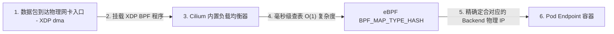

## 云原生进阶：eBPF 技术与 Cilium 极速容器网络内核架构

在传统的 Kubernetes (K8s) 容器集群网络（CNI）中，所有跨主机的 Pod 通信和 Service 负载均衡（Kube-Proxy）在默认状态下极度依赖宿主机的 Linux 内核 **Iptables** 或 **IPVS** 规则链：
* **Iptables 规则空耗**：Iptables 基于 $O(N)$ 复杂度的线性线性链表轮询匹配。当集群 Service 的 Endpoint 数量达到万级以上时，规则条数会瞬间膨胀至数十万，导致每个数据包的转发在内核中需要进行数十次乃至上百次的无谓冗长轮询，CPU 吞吐暴跌并产生高达数毫秒的网络时延抖动。
* **Sidecar 网络劫持代价**：Istio/Linkerd 等服务网格为了劫持 7 层流量，强行通过 Iptables 将容器收发的数据包 Loopback 物理透传给 Enovy 代理，使得网络包需要**重复两次穿越 Linux 用户态与内核态**，白白浪费了巨额的 CPU 指针开销。

为了彻底摧毁这一云原生网络的物理性能瓶颈，**eBPF (Extended Berkeley Packet Filter，扩展伯克利数据包过滤器)** 以及基于其构建的现代顶级 CNI 方案 **Cilium** 彻底终结了这一切。

本篇将深入 Linux 内核态底层，解密 eBPF 是如何通过在 Socket 层将网络包“抄近道零复制转发”、在旁路无无 Sidecar 侵入下完成 7 层可观测性的高能拓扑结构。

---

## 一、 eBPF 内核革命与 Cilium 零复制转发模型

eBPF 的本质是一项让开发者在 **不修改 Linux 内核源代码、不重新编译/不重启内核且 100% 物理安全的前提下，在 Linux 内核空间运行沙箱程序（eBPF Bytecode）的颠覆性技术**。

```mermaid
graph TD
    subgraph 传统 CNI 模式 (Iptables/IPVS 转发链)
        PodA[Pod A] -->|1. 经过物理 Socket VethPair| TCPOld["TCP/IP 协议栈"]
        TCPOld -->|"2. Iptables O(N) 链表轮询匹配"| NetOld[以太网卡物理卡驱动]
    end

    subgraph eBPF / Cilium 跨容器极速直连模式 (Sockmap 零复制绕过)
        PodB[Pod B] -->|"1. write() 发送"| SockA[Socket A]
        Sockmap[eBPF Sockmap BPF_MAP_TYPE_SOCKMAP] -->|"2. 内核态直接绑定/内存地址映射"| SockC[Socket C]
        SockC -->|"3. read() 极速接收"| PodC[Pod C]
    end

    style Sockmap fill:#f9f,stroke:#333,stroke-width:2px
```

### 1. Sockmap 零复制直连核心原理

在传统的底层调用中，Pod B 与 Pod C 进行同节点通信，网卡需要对数据包先后执行：IP 数据包打包 ➜ 进入套接字 ➜ 转入 Veth-Pair 发送端 ➜ 写入内核 Veth-Pair 接收端 ➜ 从底层协议栈重组回 TCP/IP 报文 ➜ 进入上游 Socket。
这其中，Linux 内核协议栈的层层包拆包开销极其繁琐。

在 Cilium 中，通过注入 eBPF 的 **`sockops` (Socket Operations) 挂钩子** 和 **`BPF_MAP_TYPE_SOCKMAP` 专用关联表**：
1. 当检测到两个同节点的 Pod 建立 TCP 握手时，`sockops` 程序在内核态瞬间捕获到两个 Socket 句柄信息。
2. 将这两个 Socket 完全绑定并存储至 eBPF 统一的 `Sockmap` 缓存结构体中。
3. 当下一次 Pod B 发送数据执行 `write()` 时，挂载在 `sk_msg`（Socket 发送挂钩）上的 eBPF 过滤程序**直接将数据包的内存指针偏置修改挂载到对应 Pod C 套接字的接收缓冲区（Receive Buffer）中！**

**整链条彻底绕过了 TCP/IP 繁冗复杂的整套协议栈、绕过内核虚似 Veth 网卡和各种 Iptables 检验，在内核态一笔重划直达，实现完美、零损耗的跨容器通信级级跃进！**

---

## 二、 破除 Kube-Proxy：eBPF Map 代替万级 Iptables

在大规模云原生集群下，原本由 `kube-proxy` 通过刷新几万条 Iptables 规则完成的 K8s Service 负载均衡（Load Balancing），被 Cilium 精简地折叠为了一个高能无锁的底层数据结构： **eBPF Map**。



### 1. 基于 XDP 的极速负载均衡

* **XDP (eXpress Data Path)**：是 Linux 内核物理网卡驱动层中最高能的数据链路截获点。数据包刚从网卡硬件 DMA（直接内存访问）拿到，**还未来得及为该数据包创建最耗费内存的 `sk_buff` 结构体内存前**，XDP 程序就已经接盘调度了。
* **$O(1)$ Hash 查表**：Cilium 在 XDP 层拦截到流入的 Service IP 流量，完全抛弃了 Iptables $O(N)$ 轮询方式，而是通过底层的 `BPF_MAP_TYPE_HASH` 表。它是纯粹的内核态哈希表，通过 **$O(1)$ 恒定时间** 的单次定位瞬间计算出真正应该派发的 Endpoint Pod 容器后台 IP。
* **防 DDo$S$ 物理级抗压**：由于该过程发生在 `sk_buff` 实例化之前，且完全是在硬件驱动层被秒级哈希重路由或阻断，使得 Cilium 在应对恶意的千万级 TCP SYN 洪水攻击（DDo$S$ 攻击）和高频访问时，能够提供近乎和裸金属交换机持平的抗压物理吞吐能效，完美释放 CPU 的无谓空转！

---

## 三、 无侵入可观测性与零信任：Cilium Hubble 架构

传统的分布式追踪和监控为了获取 RPC（如 HTTP 等七层协议）信息，或者拦截网络封包来排障，必须强制在每个 Service Pod 旁路挂载一个重型的 Sidecar Proxy（如 Envoy 代理），使每个业务 Pod 的网络物理上被分割成两个，带来了巨额的内存损耗与链路延迟损耗。

Cilium 通过在其底座集成的 **Hubble（服务网络拓扑与安全追踪器）** 完美的展现了 eBPF 的无侵入（Ambient/Sidecarless）技术：

```mermaid
graph TD
    subgraph Linux Kernel (Linux 内核态)
        SysSocket[Linux Socket - 内核态发送] -->|"eBPF kprobe / tracepoint"| HubbleAgent[Hubble BPF Controller]
    end

    subgraph User Space (用户空间)
        HubbleAgent -->|1. 内核共享环形缓冲区 Ring Buffer 零内存拷贝上报| HubbleEngine[Hubble Daemon]
        HubbleEngine -->|2. 汇聚指标| Prometheus["Prometheus / Grafana 时序看板"]
        HubbleEngine -->|3. 服务拓扑可视化| Flow["Hubble UI / Service Topology Map"]
    end
```

### 1. 旁路拦截的机制与自愈

1. **kprobe 与 Tracepoints**：eBPF 可以在内核态直接挂载到系统调用（如 `sys_enter_connect`、`sys_enter_write`）以及网络子系统关键跟踪点上。
2. **零拷贝高性能环形缓冲区（Ring Buffer）**：当网络数据通过 Socket 时，eBPF 计算程序在内核态截获当前 HTTP/GRPC 首部信息，并不进行复杂的包重组，而是通过高效的 **Ring Buffer** 零复制偏置指针迅速抛送到用户空间的 Hubble 守护进程中。
3. **无缝无感 Trace 的最终收益**：
   * **业务 100% 零修改**：业务开发人员不需要配置任何 Feign/RestTemplate 拦截器，也不需要挂载 Envoy，Hubble 直接在内核空间中将整个 K8s 集群中微服务之间的 **服务拓扑（Dependency Graph）**、**RPC 延时百分位（p99, p95）**、**HTTP 错判率（5xx 报警）** 全景测绘出来，直接省去了大厂极其头痛的网格微服务升级和资源空转代价。

---

## 四、 实战：在 K8s 中部署并启用 Cilium 极速网络模式与 Hubble 网盘

我们将描述在标准集群环境中，剔除老旧的 `kube-proxy`，部署配置 Cilium 的实战配置。

### 1. 准备条件：以 eBPF 替代 Kube-Proxy 配置部署 Cilium

为了彻底榨干性能，我们在部署 Cilium 前强制让其接管 K8s Service 代理，彻底弃用 Iptables：

```bash
# 1. 采用 Helm 官方模板部署 Cilium，显式宣告完全剔除并替代 kube-proxy
helm install cilium cilium/cilium --version 1.14.0 \
  --namespace kube-system \
  --set kubeProxyReplacement=strict \
  --set k8sServiceHost=10.0.0.10 \
  --set k8sServicePort=6443 \
  --set loadBalancer.mode=dsr \
  --set bpf.masquerade=true \
  --set hubble.enabled=true \
  --set hubble.ui.enabled=true \
  --set hubble.metrics.enabled="{dns,http,tcp,port-distribution}"
```

> **参数高维解析 (DSR 模式)**：这里设置 `--set loadBalancer.mode=dsr`（Direct Server Return，直接路由返回模式）。在该核心模式下，当外部流量流入 K8s 节点并被分配负载均衡至具体后端 Pod 时，其后续回复响应报文**直接越过代理路由节点，由后端 Pod 直接封装 IP 报文返回给真实的公网客户端！** 这样将双向网络传输直接缩减为单向，极大拉升了跨公网大流量文件的吞吐能力并彻底解决代理节点的网络上行拥堵。

---

### 2. 声明式 L7 级别的无侵入安全控制：KubernetesNetworkPolicy

由于 Cilium 底座是 native eBPF，它可以理解除 IP / Port 之外更高级的 Layer 7 七层语义。我们可以写出下面这个极具技术张力的 **七层 API 级别零信任安全隔离配置文件**，来替代粗糙的基于 IP 和基本端口封锁：

```yaml
apiVersion: "cilium.io/v2"
kind: CiliumNetworkPolicy
metadata:
  name: "restricted-api-access"
  namespace: prod-apps
spec:
  # 拦截目标：prod-apps 作用域下加有 app=order-service 的微服务 Pod
  endpointSelector:
    matchLabels:
      app: order-service
  ingress:
    # 1. 声明允许流入源头：仅限具有组件标记 app=api-gateway 的前端流量流入
    - fromEndpoints:
        - matchLabels:
            app: api-gateway
      toPorts:
        - ports:
            - port: "8080"
              protocol: TCP
          # 2. 核心七层规则控制：利用 eBPF 内核直接拦截应用 HTTP 报文，强行指定安全 API
          rules:
            http:
              - method: "GET"
                path: "/api/v1/orders/.*" # 仅允许走 /api/v1/orders/ 的 GET 订单流程
              - method: "POST"
                path: "/api/v1/orders/create" # 仅允许访问下单接口
```

当这套安全拦截注入后，如果网关组件或内部爆破者试图利用 `POST` 请求去恶意刷订单数据库其他越权敏感接口，Cilium eBPF 在内核 Linux Socket 发送端解析判定不合法后，**直接在底层掐断 TCP 的 ACK 包链路，并在用户态对其立刻返回 403 Access Denied**，物理地将黑客阻击在底层网络安全防线之外！

这正是云原生技术底座演进到神话境界的代表。理解并掌握 eBPF 和 Cilium 的零拷贝跟网状负载均衡机制，是现代资深容器运维专家和平台高级架构师攻伐云原生集群下网络高频延迟抖动与监控盲区的至高终极利刃。
