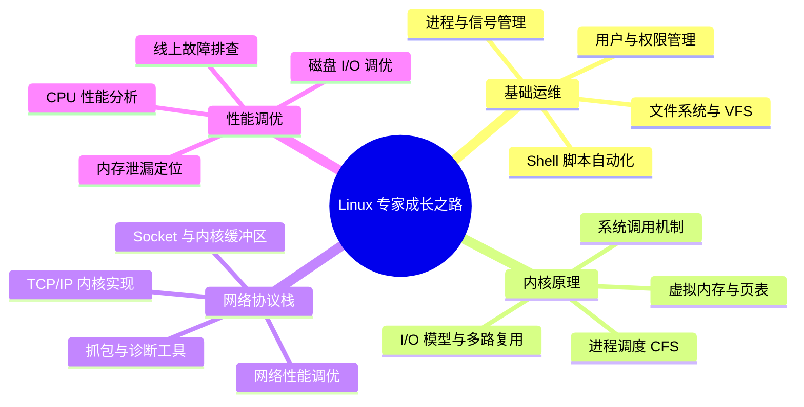

## Linux 核心技术知识体系

Linux 是现代后端工程师必须深入掌握的底层基石。无论是理解 JVM 内存管理、Netty 零拷贝，还是排查线上 CPU 飙高、网络抖动，都离不开对 Linux 内核机制的深度认知。本体系从内核原理出发，贯穿系统调用、网络协议栈，直达生产运维实战。

---

## 工程师进阶路线图

---

## 第一阶段：基础命令与系统管理

### 1.1 文件系统与核心命令

- [文件系统与核心命令速查](basic/0-filesystem-commands.md)：VFS 抽象层、inode/dentry 结构、硬链接与软链接本质，以及 find/awk/sed/xargs 生产级用法。
- [用户权限与安全模型](basic/1-user-permission.md)：DAC 自主访问控制、`rwx` 位与 `setuid/setgid/sticky` 特权位、`sudo` 提权机制与 `/etc/sudoers` 深度解析。
- [进程管理与信号机制](basic/2-process-management.md)：进程状态机（R/S/D/Z/T）、`fork/exec/wait` 调用链、信号传递模型与 `systemd` 单元管理。

---

## 第二阶段：内核原理深度剖析

### 2.1 I/O 模型

- [Linux I/O 模型与多路复用](kernel/0-io-model.md)：五种 I/O 模型对比、`select/poll/epoll` 实现差异、`epoll` LT/ET 触发模式与 `io_uring` 异步 I/O 内核原理。

### 2.2 内存管理

- [虚拟内存与内核内存管理](kernel/1-memory-management.md)：四级页表结构、`mmap/brk` 内存分配、Buddy System + Slab 分配器、OOM Killer 触发机制与 /proc/meminfo 解读。

### 2.3 进程调度

- [进程调度器 CFS 与实时调度](kernel/2-process-scheduler.md)：完全公平调度器 CFS vruntime 红黑树、调度类优先级、CPU 亲和性与 `cgroups` 资源隔离机制。

---

## 第三阶段：网络协议栈

- [TCP/IP 内核协议栈深度解析](network/0-tcp-ip-stack.md)：内核 Socket 接收发送缓冲区、TCP 三次握手/四次挥手内核状态机、TIME_WAIT 大量积压根因与 `tcp_tw_reuse` 调优。
- [网络诊断工具实战](network/1-network-tools.md)：`tcpdump` 过滤语法与抓包分析、`ss/netstat` 连接状态诊断、`iperf3` 带宽测试与 `eBPF/bcc` 动态追踪。

---

## 第四阶段：性能调优与故障排查

- [CPU 与内存性能调优](ops/0-performance-tuning.md)：`perf/flamegraph` 火焰图分析、`vmstat/mpstat/sar` 系统级监控、内存碎片与大页（HugePage）调优。
- [线上故障排查方法论](ops/1-troubleshooting.md)：CPU 100% 根因分析（`top/pidstat/strace`）、内存泄漏定位（`valgrind/smaps`）、磁盘 I/O 瓶颈排查（`iostat/iotop/blktrace`）。

---

## 关联知识推荐

- **Java NIO 与 Netty**：Linux epoll 是 Netty 高性能的底层支撑，见 [JDK NIO 核心三件套](../java/network/0-jdk-nio-fundamentals.md)。
- **容器与 K8s**：Linux cgroups/namespace 是容器隔离的基础，见 [Kubernetes 架构](../kubernetes/basic/2-architecture.md)。
- **JVM 调优**：Linux 内存管理与 JVM GC 调优紧密相关，见 [JVM 内存模型与 GC](../java/jvm/0-memory-gc.md)。
