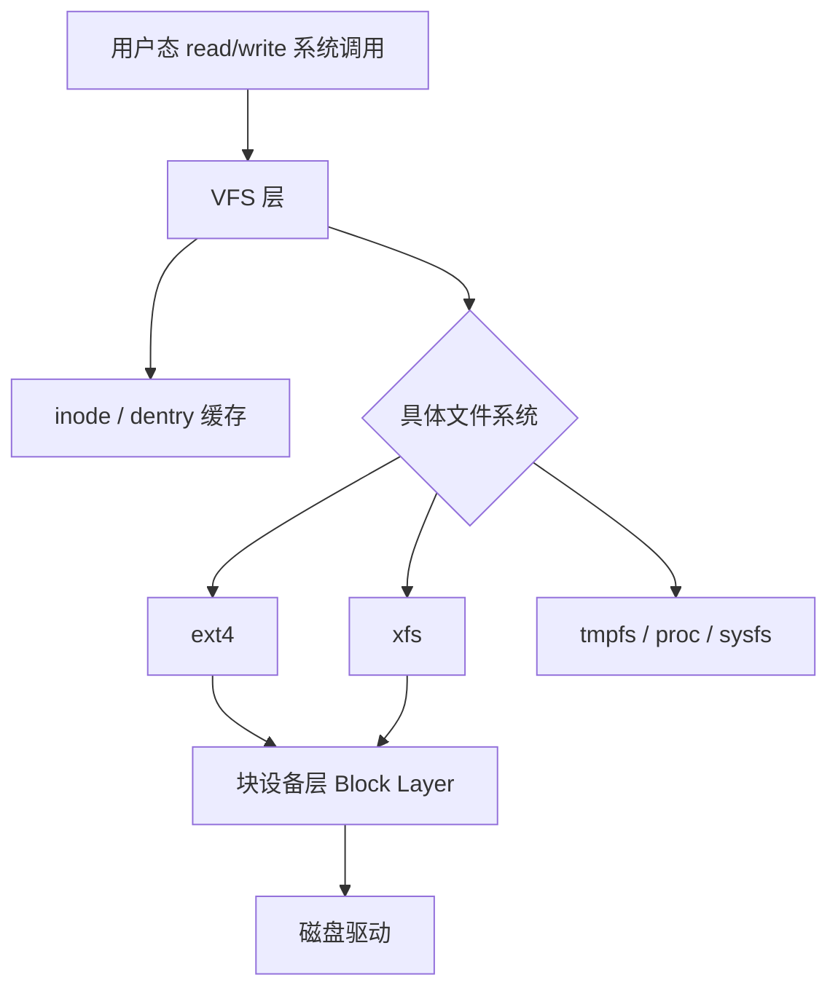

## Linux 文件系统与核心命令速查

---

## 一、VFS 虚拟文件系统抽象层

Linux 通过 **VFS（Virtual File System）** 提供统一的文件操作接口，屏蔽底层具体文件系统（ext4、xfs、tmpfs 等）的差异。



### 1.1 核心数据结构

| 结构 | 作用 | 驻留位置 |
|:---|:---|:---|
| `superblock` | 文件系统元信息（块大小、inode 总数等） | 磁盘 + 内存缓存 |
| `inode` | 文件元数据（权限、大小、时间戳、数据块指针） | 磁盘 + inode cache |
| `dentry` | 目录项，文件名 → inode 的映射 | 仅内存（dentry cache） |
| `file` | 进程打开文件的实例（偏移量、标志位） | 内核进程表 |

**关键理解**：文件名保存在 `dentry`，而非 `inode`。硬链接本质是多个 `dentry` 指向同一 `inode`；软链接是一个独立 `inode`，内容为目标路径字符串。

```bash
# 查看文件 inode 编号
ls -i /etc/hosts

# 硬链接计数
stat /etc/hosts | grep "Links"

# 创建硬链接（同文件系统）
ln source.txt hard_link.txt

# 创建软链接（跨文件系统可用）
ln -s /etc/nginx/nginx.conf /home/user/nginx.conf
```

### 1.2 文件系统挂载

```bash
# 查看已挂载文件系统
mount | column -t
df -hT

# 查看文件系统类型与挂载选项
cat /proc/mounts

# 临时挂载 ext4 磁盘
mount -t ext4 /dev/sdb1 /mnt/data

# 永久挂载（写入 /etc/fstab）
# UUID=xxxx /mnt/data ext4 defaults,noatime 0 2
```

---

## 二、目录结构与核心路径

```
/
├── bin/      → 基础用户命令（ls, cp, mv）
├── sbin/     → 系统管理命令（iptables, fdisk）
├── etc/      → 配置文件
├── var/      → 可变数据（日志、缓存、锁文件）
├── tmp/      → 临时文件（重启清空）
├── home/     → 用户主目录
├── root/     → root 用户主目录
├── proc/     → 进程与内核信息虚拟文件系统
├── sys/      → 内核设备信息（sysfs）
├── dev/      → 设备文件
├── lib/      → 共享库
└── usr/      → 用户程序（/usr/bin, /usr/lib）
```

### /proc 重点文件

| 路径 | 内容 |
|:---|:---|
| `/proc/cpuinfo` | CPU 型号、核数、频率 |
| `/proc/meminfo` | 内存使用详情 |
| `/proc/net/tcp` | TCP 连接表（16进制） |
| `/proc/sys/net/` | 内核网络参数（可动态调整） |
| `/proc/<pid>/fd/` | 进程打开的文件描述符 |
| `/proc/<pid>/maps` | 进程虚拟内存映射 |
| `/proc/<pid>/status` | 进程状态、内存占用 |

---

## 三、核心命令深度用法

### 3.1 文件查找 find

```bash
# 查找 7 天内修改的 .log 文件
find /var/log -name "*.log" -mtime -7

# 查找大于 100MB 的文件
find / -size +100M -type f 2>/dev/null

# 查找并批量删除（-exec 效率低，xargs 更快）
find /tmp -name "*.tmp" -mtime +3 | xargs rm -f

# 查找某用户的文件
find /home -user deploy -type f

# 查找有 SUID 位的危险文件（安全审计）
find / -perm -4000 -type f 2>/dev/null
```

### 3.2 文本处理三剑客

**awk — 列处理引擎**

```bash
# 打印第 1、3 列（默认空格分隔）
awk '{print $1, $3}' access.log

# 以冒号分隔，打印用户名和 shell
awk -F: '{print $1, $7}' /etc/passwd

# 统计 HTTP 状态码分布
awk '{print $9}' access.log | sort | uniq -c | sort -rn

# 累加某列求和
awk '{sum += $5} END {print "Total:", sum}' data.txt

# 条件过滤：打印响应时间 > 1s 的行
awk '$NF > 1.0' access.log
```

**sed — 流编辑器**

```bash
# 原地替换（-i 直接修改文件）
sed -i 's/old_string/new_string/g' config.conf

# 删除空行
sed -i '/^$/d' file.txt

# 删除注释行（以 # 开头）
sed -i '/^#/d' file.txt

# 在第 5 行后插入内容
sed -i '5a\new_line_content' file.txt

# 打印第 10-20 行
sed -n '10,20p' large_file.log
```

**grep — 正则搜索**

```bash
# 递归搜索，显示行号，忽略大小写
grep -rni "NullPointerException" /var/log/app/

# 排除目录
grep -r "error" /var/log --exclude-dir={.git,node_modules}

# 显示匹配行的前后 3 行（上下文）
grep -A 3 -B 3 "OutOfMemoryError" app.log

# 统计匹配行数
grep -c "ERROR" app.log

# 使用扩展正则（ERE）
grep -E "ERROR|FATAL|WARN" app.log
```

### 3.3 xargs 高效批处理

```bash
# 将 find 结果传给 grep（并行执行）
find . -name "*.java" | xargs grep -l "ThreadLocal"

# 限制每次传入参数数量
echo "a b c d e" | xargs -n 2 echo

# 并行执行（-P 4 使用 4 个并发进程）
cat urls.txt | xargs -P 4 -I {} curl -s {}

# 处理含空格的文件名（配合 -print0）
find . -name "*.log" -print0 | xargs -0 rm
```

### 3.4 磁盘与空间

```bash
# 查看磁盘空间（人类可读）
df -h

# 查看目录占用大小（按大小排序）
du -sh /* 2>/dev/null | sort -rh | head -20

# 查看指定目录下各子目录大小
du -h --max-depth=1 /var/log

# 查找磁盘占用最大的文件
find / -type f -printf '%s %p\n' 2>/dev/null | sort -rn | head -10
```

---

## 四、Shell 脚本实战

### 4.1 脚本基础模板

```bash
#!/bin/bash
set -euo pipefail  # 遇错退出(-e)、未声明变量报错(-u)、管道错误传播(-o pipefail)

# 日志函数
log()  { echo "[$(date '+%F %T')] INFO  $*"; }
warn() { echo "[$(date '+%F %T')] WARN  $*" >&2; }
die()  { echo "[$(date '+%F %T')] ERROR $*" >&2; exit 1; }

# 参数校验
[[ $# -lt 1 ]] && die "用法: $0 <config_file>"
CONFIG="$1"
[[ -f "$CONFIG" ]] || die "配置文件不存在: $CONFIG"

log "开始处理: $CONFIG"
```

### 4.2 常用模式

```bash
# 检查进程是否运行
is_running() {
    pgrep -f "$1" > /dev/null 2>&1
}

# 带超时的循环等待
wait_for_port() {
    local host=$1 port=$2 timeout=${3:-30}
    for i in $(seq 1 $timeout); do
        nc -z "$host" "$port" 2>/dev/null && return 0
        sleep 1
    done
    die "端口 $host:$port 在 ${timeout}s 内未就绪"
}

# 安全的临时目录（脚本退出自动清理）
TMPDIR=$(mktemp -d)
trap "rm -rf $TMPDIR" EXIT
```

---

## 五、文件权限深度解析

### 5.1 rwx 权限位

```
-rwxr-xr--  1 user group 1024 Jan 1 00:00 script.sh
│└┬┘└┬┘└┬┘
│ │  │  └── other: r--  (4)
│ │  └───── group: r-x  (5)
│ └──────── owner: rwx  (7)
└────────── 文件类型: - 普通文件 d 目录 l 软链接
```

### 5.2 特殊权限位

| 权限 | 数值 | 文件效果 | 目录效果 |
|:---|:---|:---|:---|
| `setuid` | 4000 | 以文件所有者身份执行（如 `/usr/bin/passwd`） | 无效 |
| `setgid` | 2000 | 以文件所属组身份执行 | 新建文件继承目录组 |
| `sticky` | 1000 | 无 | 只有文件所有者可删除（如 `/tmp`） |

```bash
# 设置 setuid
chmod u+s /usr/local/bin/my_tool
# 等价于
chmod 4755 /usr/local/bin/my_tool

# 设置目录 sticky bit（共享目录保护）
chmod +t /tmp/shared
```

### 5.3 ACL 细粒度权限

```bash
# 查看 ACL
getfacl /var/www/html

# 给特定用户加写权限（不改变原有权限）
setfacl -m u:deploy:rw /var/www/html/index.html

# 给特定组加执行权限
setfacl -m g:devops:rx /opt/scripts/

# 删除 ACL
setfacl -x u:deploy /var/www/html/index.html
```
