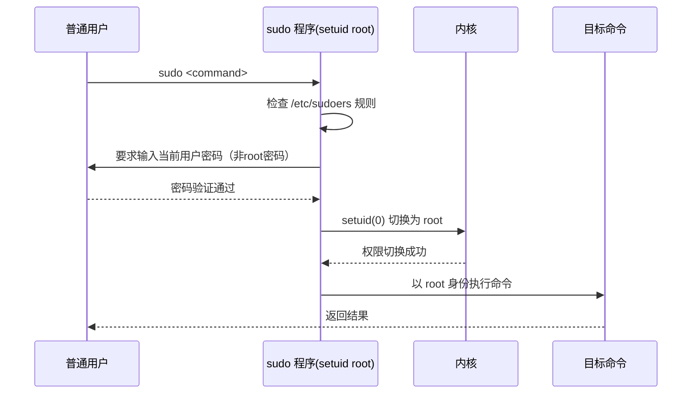

## Linux 用户权限与安全模型

---

## 一、用户与组管理

### 1.1 用户数据库文件

**`/etc/passwd`** — 用户基础信息（明文，无密码）

```
root:x:0:0:root:/root:/bin/bash
deploy:x:1001:1001::/home/deploy:/bin/bash
│      │ │    │    │  │           └── 登录 Shell
│      │ │    │    │  └── 家目录
│      │ │    │    └── 注释信息
│      │ │    └── GID（主组 ID）
│      │ └── UID（用户 ID）
│      └── 密码占位（实际在 /etc/shadow）
└── 用户名
```

**`/etc/shadow`** — 加密密码存储（仅 root 可读）

```
deploy:$6$salt$hashed_password:19000:0:99999:7:::
│      │                        │     │ │     └── 密码过期前警告天数
│      │                        │     │ └── 密码最大有效期
│      │                        │     └── 密码最小使用天数
│      │                        └── 上次修改密码的天数（从1970-01-01起）
│      └── 加密密码（$6$ = SHA-512）
└── 用户名
```

### 1.2 用户管理命令

```bash
# 创建用户（含家目录、指定 shell）
useradd -m -s /bin/bash -u 1001 -g 1001 deploy

# 修改密码
passwd deploy

# 修改用户属性
usermod -aG docker deploy   # 追加到 docker 组（-a 必须配合 -G）
usermod -s /sbin/nologin deploy  # 禁止登录

# 删除用户（-r 同时删除家目录）
userdel -r deploy

# 查看用户所属组
id deploy
groups deploy

# 切换用户（- 加载完整环境变量）
su - deploy

# 查看当前登录用户
who
w
last | head -20
```

### 1.3 组管理

```bash
# 创建组
groupadd devops

# 查看组成员
getent group docker

# 修改用户主组
usermod -g devops deploy

# 删除组
groupdel devops
```

---

## 二、sudo 提权机制深度解析

### 2.1 工作原理



**核心安全点**：sudo 本身是 `setuid root` 程序，任何用户都能启动它，但它严格校验 `/etc/sudoers` 授权规则和用户自身密码，而不是 root 密码。

### 2.2 /etc/sudoers 配置语法

```bash
# 用 visudo 编辑（语法校验，防止配置错误锁死系统）
visudo

# 语法格式：
# who  where=(as_whom)  what
# 用户 主机=(代理用户)  允许的命令

# 允许 deploy 用户免密执行所有命令
deploy  ALL=(ALL) NOPASSWD: ALL

# 只允许执行特定命令
deploy  ALL=(ALL) NOPASSWD: /usr/bin/systemctl restart nginx, /usr/bin/systemctl status *

# 允许 devops 组执行 docker 命令
%devops ALL=(ALL) NOPASSWD: /usr/bin/docker

# 使用 Alias 简化复杂规则
Cmnd_Alias SERVICES = /usr/bin/systemctl start *, /usr/bin/systemctl stop *, /usr/bin/systemctl restart *
deploy ALL=(ALL) NOPASSWD: SERVICES

# 包含目录下的配置文件（推荐方式，避免直接修改主文件）
#includedir /etc/sudoers.d
```

### 2.3 sudo 日志审计

```bash
# 查看 sudo 操作记录
grep sudo /var/log/auth.log      # Debian/Ubuntu
grep sudo /var/log/secure        # RHEL/CentOS

# 典型日志格式
# Jan 01 12:00:00 host sudo: deploy : TTY=pts/0 ;
#   PWD=/home/deploy ; USER=root ; COMMAND=/usr/bin/systemctl restart nginx
```

---

## 三、PAM 可插拔认证模块

PAM（Pluggable Authentication Modules）是 Linux 认证体系的核心框架，`sudo`、`su`、`sshd`、`login` 等程序都通过 PAM 完成认证。

```
/etc/pam.d/
├── sudo        → sudo 认证规则
├── sshd        → SSH 认证规则
├── login       → 控制台登录规则
└── common-auth → 通用认证规则（Debian 系）
```

### 3.1 PAM 配置格式

```
module_type  control_flag  module_path  [arguments]
```

| 字段 | 含义 |
|:---|:---|
| `module_type` | `auth`/`account`/`password`/`session` |
| `control_flag` | `required`/`requisite`/`sufficient`/`optional` |

```bash
# /etc/pam.d/sshd 典型配置
auth       required     pam_sepermit.so
auth       substack     password-auth
auth       include      postlogin

# 限制 SSH 登录失败次数（防暴力破解）
# /etc/pam.d/sshd 添加：
auth       required     pam_tally2.so deny=5 unlock_time=600 onerr=fail

# 查看失败计数
pam_tally2 --user=deploy
# 手动解锁
pam_tally2 --user=deploy --reset
```

---

## 四、SSH 安全加固

### 4.1 密钥认证

```bash
# 生成 Ed25519 密钥（推荐，比 RSA 更安全且密钥更短）
ssh-keygen -t ed25519 -C "deploy@prod-server" -f ~/.ssh/id_ed25519

# 复制公钥到服务器
ssh-copy-id -i ~/.ssh/id_ed25519.pub deploy@192.168.1.100

# 手动方式（等价于上面的命令）
cat ~/.ssh/id_ed25519.pub >> ~/.ssh/authorized_keys
chmod 600 ~/.ssh/authorized_keys
chmod 700 ~/.ssh/

# 多服务器 SSH 配置（~/.ssh/config）
Host prod-web
    HostName 192.168.1.100
    User deploy
    IdentityFile ~/.ssh/id_ed25519
    ServerAliveInterval 60
    ServerAliveCountMax 3
```

### 4.2 sshd 安全配置 /etc/ssh/sshd_config

```bash
# 禁止 root 直接登录
PermitRootLogin no

# 禁止密码登录（仅密钥）
PasswordAuthentication no
ChallengeResponseAuthentication no

# 修改默认端口（减少扫描）
Port 2222

# 限制允许登录的用户/组
AllowUsers deploy jenkins
AllowGroups sshusers

# 空闲超时（秒）
ClientAliveInterval 300
ClientAliveCountMax 2

# 禁用不安全的旧版协议特性
X11Forwarding no
PermitEmptyPasswords no
MaxAuthTries 3

# 重载配置（不中断现有连接）
systemctl reload sshd
```

---

## 五、SELinux / AppArmor 强制访问控制

### 5.1 SELinux 基础（RHEL/CentOS）

SELinux 在 DAC（自主访问控制）之上增加了一层 MAC（强制访问控制），即使 root 也受策略约束。

```bash
# 查看 SELinux 状态
getenforce          # Enforcing / Permissive / Disabled
sestatus

# 临时切换为 Permissive（排查问题时用）
setenforce 0

# 查看文件 SELinux 上下文
ls -Z /var/www/html/
# -rw-r--r--. root root system_u:object_r:httpd_sys_content_t:s0 index.html

# 修改文件 SELinux 上下文
chcon -t httpd_sys_content_t /opt/myapp/public/
# 或永久标记（恢复后仍有效）
semanage fcontext -a -t httpd_sys_content_t "/opt/myapp/public(/.*)?"
restorecon -Rv /opt/myapp/public/

# 查看 SELinux 拒绝日志
grep "denied" /var/log/audit/audit.log | tail -20
# 生成允许规则建议
audit2allow -a
```

### 5.2 常见 SELinux 导致服务异常的场景

| 场景 | 错误现象 | 解决方式 |
|:---|:---|:---|
| Nginx 访问非标准端口 | 连接被拒绝 | `semanage port -a -t http_port_t -p tcp 8080` |
| Nginx 反向代理后端 | 502 Bad Gateway | `setsebool -P httpd_can_network_connect 1` |
| 文件上传目录权限问题 | Permission denied | 修正 fcontext 为 `httpd_sys_rw_content_t` |
| Cron 执行脚本失败 | 无输出无日志 | 检查 `crond_t` 域的策略限制 |
