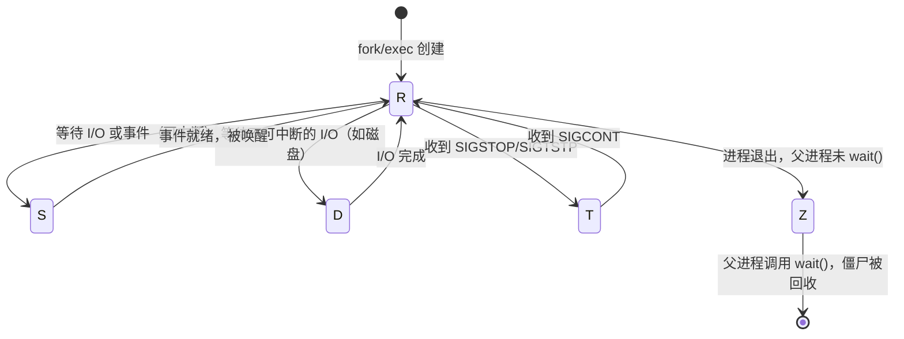
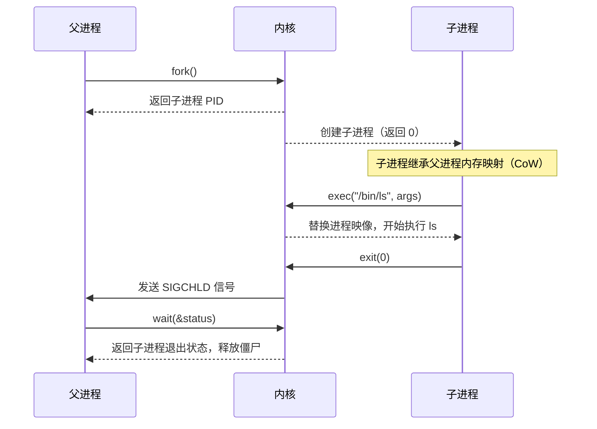

## Linux 进程管理与信号机制

---

## 一、进程状态机

Linux 进程在生命周期中经历多种状态转换：



| 状态码 | 名称 | 说明 |
|:---|:---|:---|
| `R` | Running | 正在运行或在运行队列中等待 CPU |
| `S` | Sleeping | 可中断睡眠，等待事件（最常见） |
| `D` | Disk Sleep | 不可中断睡眠，通常等待磁盘 I/O，**无法 kill** |
| `T` | Stopped | 被信号暂停（SIGSTOP/SIGTSTP） |
| `Z` | Zombie | 已退出但父进程未回收，占用进程表项 |
| `I` | Idle | 内核空闲线程（Kernel 5.x+） |

### D 状态（不可中断睡眠）的危害

进程卡在 D 状态通常意味着底层 I/O 长时间无响应（NFS 挂载失败、磁盘故障）。此时 `kill -9` 无效，只能等待 I/O 超时或重启系统。

```bash
# 查看 D 状态进程
ps aux | awk '$8 == "D" {print}'

# 查看进程系统调用栈（找卡点）
cat /proc/<pid>/wchan      # 等待在哪个内核函数
cat /proc/<pid>/stack      # 完整内核调用栈
```

---

## 二、fork / exec / wait 调用链



**Copy-on-Write（CoW）**：`fork()` 后父子进程共享物理内存页，只有在某一方写入时才复制该页。大进程 fork 因此几乎是瞬时的。

**僵尸进程产生原因**：子进程已退出，内核保留其 PCB（进程控制块）等待父进程通过 `wait()` 读取退出状态。若父进程不调用 `wait()`，子进程成为僵尸，长期占用进程表项。

```bash
# 查看僵尸进程
ps aux | grep ' Z '

# 找出僵尸进程的父进程 PID
ps -eo pid,ppid,stat,cmd | awk '$3 ~ /Z/ {print}'

# 向父进程发送 SIGCHLD，触发其调用 wait()
kill -CHLD <父进程PID>
# 若父进程无法处理，只能终止父进程
```

---

## 三、信号机制

### 3.1 常用信号表

| 信号 | 编号 | 默认行为 | 典型用途 |
|:---|:---|:---|:---|
| `SIGHUP` | 1 | 终止 | 重新加载配置（nginx -s reload 等效） |
| `SIGINT` | 2 | 终止 | Ctrl+C，用户中断 |
| `SIGQUIT` | 3 | 核心转储 | Ctrl+\，调试用 |
| `SIGKILL` | 9 | 终止（**不可捕获**） | 强制终止，**无法忽略** |
| `SIGTERM` | 15 | 终止 | 优雅终止（可被捕获做清理） |
| `SIGSTOP` | 19 | 暂停（**不可捕获**） | 暂停进程，等待 SIGCONT |
| `SIGCONT` | 18 | 继续 | 恢复被暂停的进程 |
| `SIGCHLD` | 17 | 忽略 | 子进程状态变化通知父进程 |
| `SIGUSR1` | 10 | 终止 | 用户自定义信号（常用于触发日志轮转） |
| `SIGUSR2` | 12 | 终止 | 用户自定义信号 |

### 3.2 发送信号

```bash
# 优雅终止（进程可捕获并清理）
kill -15 <pid>
kill -TERM <pid>

# 强制终止（不可抗拒）
kill -9 <pid>
kill -KILL <pid>

# 按进程名发送信号
pkill -15 java
killall -9 nginx

# 向进程组发送信号（负号表示进程组）
kill -15 -<pgid>

# 发送信号给特定用户所有进程
pkill -u deploy -TERM
```

### 3.3 进程的信号处理

```bash
# 查看进程的信号掩码（阻塞、忽略、挂起的信号）
cat /proc/<pid>/status | grep -E "Sig(Blk|Ign|Cgt|Pnd)"

# SigCgt: 已捕获信号的位掩码（十六进制）
# 例：SigCgt: 0000000180014a03
# 转换：echo "ibase=16; 180014A03" | bc | python3 -c "import sys; n=int(sys.stdin.read()); [print(i) for i in range(64) if n & (1<<i)]"
```

### 3.4 trap 在脚本中捕获信号

```bash
#!/bin/bash
# 优雅退出处理
cleanup() {
    echo "收到退出信号，清理临时文件..."
    rm -f /tmp/my_lock_file
    exit 0
}

trap cleanup SIGTERM SIGINT SIGHUP

# 长时间运行的任务
while true; do
    do_work
    sleep 5
done
```

---

## 四、进程监控与管理工具

### 4.1 ps 详细用法

```bash
# 显示所有进程（BSD 风格）
ps aux

# 显示所有进程（SysV 风格，更多字段）
ps -ef

# 自定义字段显示（PID、CPU、内存、命令）
ps -eo pid,pcpu,pmem,stat,cmd --sort=-pcpu | head -20

# 显示进程树
ps auxf
ps -ejH

# 查看特定进程的线程
ps -T -p <pid>
ps -eLf | grep <pid>
```

### 4.2 top / htop 实时监控

```bash
# top 关键快捷键
# P: 按 CPU 排序
# M: 按内存排序
# T: 按运行时间排序
# k: 向进程发送信号
# 1: 展开显示每个 CPU 核
# H: 显示线程（而非进程）
# u: 只显示特定用户进程

# 非交互式获取一次快照
top -bn 1 | head -30

# 获取特定进程状态
top -p <pid1>,<pid2>
```

### 4.3 systemd 服务管理

```bash
# 服务生命周期管理
systemctl start nginx
systemctl stop nginx
systemctl restart nginx
systemctl reload nginx    # 重载配置（不中断现有连接）
systemctl status nginx

# 开机自启
systemctl enable nginx
systemctl disable nginx

# 查看所有失败的服务
systemctl --failed

# 查看服务依赖树
systemctl list-dependencies nginx

# 查看服务日志（实时跟踪）
journalctl -u nginx -f

# 查看最近 100 行日志
journalctl -u nginx -n 100

# 查看最近 1 小时日志
journalctl -u nginx --since "1 hour ago"

# 查看开机以来的日志
journalctl -b
```

### 4.4 自定义 systemd Unit 文件

```ini
# /etc/systemd/system/myapp.service
[Unit]
Description=My Java Application
After=network.target
Wants=network-online.target

[Service]
Type=simple
User=deploy
Group=deploy
WorkingDirectory=/opt/myapp
ExecStart=/usr/bin/java -Xmx2g -jar /opt/myapp/app.jar --spring.profiles.active=prod
ExecStop=/bin/kill -TERM $MAINPID
Restart=on-failure
RestartSec=10s
StandardOutput=journal
StandardError=journal
SyslogIdentifier=myapp

# 资源限制
LimitNOFILE=65536
LimitNPROC=4096

# 安全加固
NoNewPrivileges=yes
ProtectSystem=full
PrivateTmp=yes

[Install]
WantedBy=multi-user.target
```

```bash
# 重新加载 unit 文件（修改后必须执行）
systemctl daemon-reload
systemctl enable --now myapp
```

---

## 五、后台任务管理

```bash
# 在后台运行（&）
./long_running_script.sh &

# 查看后台任务
jobs

# 将后台任务切回前台
fg %1

# 将前台任务切到后台（先 Ctrl+Z 暂停，再 bg）
bg %1

# nohup：忽略 SIGHUP（终端关闭后继续运行）
nohup ./script.sh > /var/log/script.log 2>&1 &

# screen：终端复用器（SSH 断开后进程继续）
screen -S mysession          # 新建命名会话
screen -ls                   # 列出会话
screen -r mysession          # 重连会话
# Ctrl+A, D 分离会话

# tmux：更现代的终端复用器
tmux new -s deploy           # 新建会话
tmux ls                      # 列出会话
tmux attach -t deploy        # 重连
# Ctrl+B, D 分离会话
```
