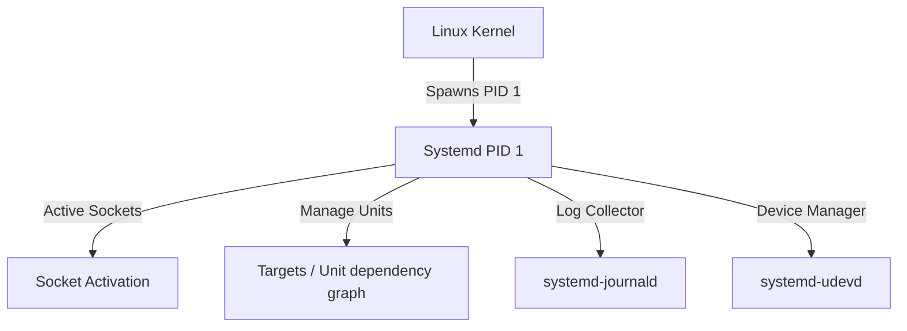
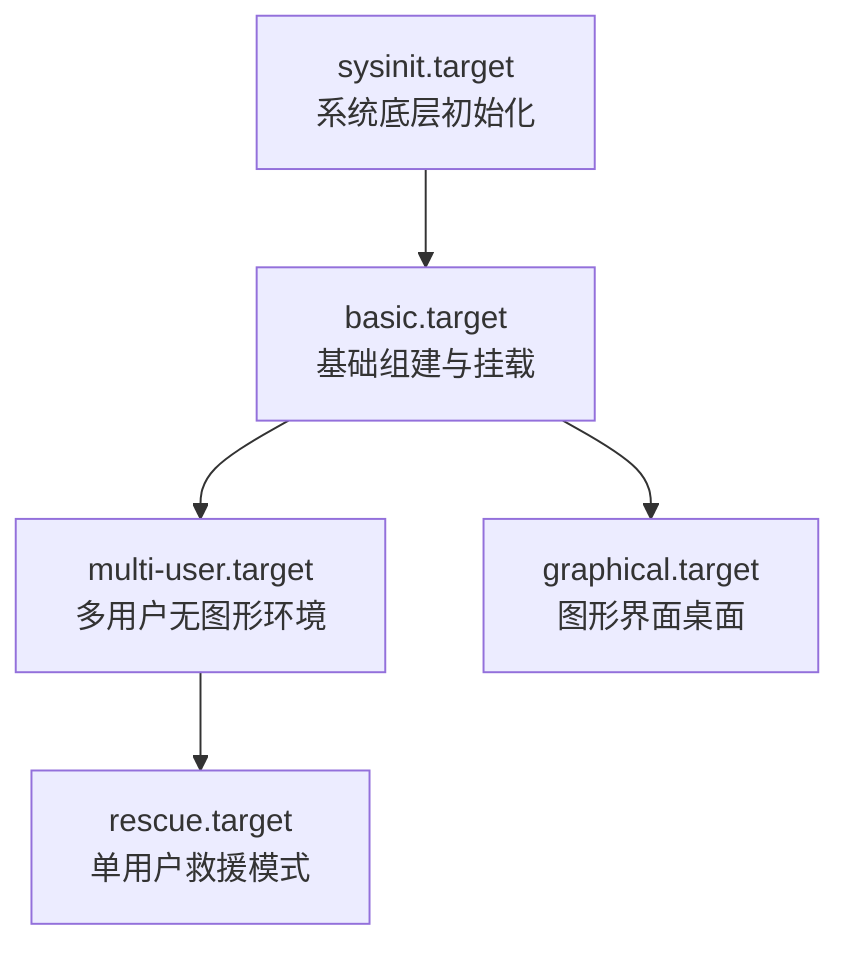

## Systemd 概述

Systemd 是现代 Linux 操作系统的系统与服务管理器。作为内核启动后运行的第一个进程（PID = 1），它是所有用户态进程的根源。Systemd 采用并发管理设计，通过套接字激活（Socket Activation）和 D-Bus 激活技术，极大缩短了系统的启动时间，并提供了一整套对进程生命周期、系统状态和硬件事件的监控机制。



---

## 1. Systemd 架构与引导生命周期

### 1.1 PID 1 职责与序列化机制

当内核完成初始化并挂载根文件系统后，它会调用 `/usr/lib/systemd/systemd` 作为 PID 1。PID 1 处于最核心地位，主要负责：
- **孤儿进程收养**：自动收养被父进程遗弃的主动脱离控制台的孤儿进程并进行资源清理。
- **状态序列化**：当 systemd 需要自我升级或重载（`systemctl daemon-reexec`）时，它会执行**状态序列化（Serialization）**。通过将当前运行的 Unit 依赖树、套接字文件描述符状态写入到临时内存文件中，在极短时间内启动新版本 systemd 并完成**反序列化（Deserialization）**，从而在主守护进程替换时确保系统业务不中断。

### 1.2 System 引导 Target 状态流转

Systemd 放弃了传统的 SysVinit 运行级别（Runlevels），引入了 **Targets（目标单元）** 概念。Targets 本质上是一组 Unit 的聚合点。

启动时的核心 Target 状态流转如下：



#### 核心引导阶段解析

1. **`sysinit.target`**：初始化最底层的硬件、挂载虚拟文件系统（如 `/proc`、`/sys`、`/dev`）、交换分区（Swap）、以及执行加密盘初始化和磁盘检查。
2. **`basic.target`**：启动基础核心服务，如防火墙、套接字服务、总线服务（D-Bus）、硬件事件守护（udev）和基础定时任务。
3. **`multi-user.target`**：启动支持多用户网络登录的服务体系（类似 SysV 运行级别 3），大部分后端生产服务器最终引导并停留在此状态。
4. **`graphical.target`**：在多用户环境之上，初始化显示管理器并拉起 GUI 图形显示（类似运行级别 5）。

---

## 2. Unit 声明详情与服务类型深度比对

Systemd 将所有系统对象抽象为 **Unit（单元）**，最常见的是 `.service`。

### 2.1 Service 核心配置模板

以下是一个企业级高性能服务配置范例 `/etc/systemd/system/myapp.service`：

```ini
[Unit]
Description=高性能企业级微服务守护进程
After=network.target syslog.target
Wants=db.service
Requires=auth.service

[Service]
Type=notify
Environment=NODE_ENV=production
WorkingDirectory=/var/www/myapp
ExecStartPre=/usr/bin/install -d -m 0755 -o myuser -g mygroup /var/run/myapp
ExecStart=/usr/local/bin/myapp --port 8080
ExecReload=/bin/kill -HUP $MAINPID
TimeoutStopSec=10s
Restart=on-failure
RestartSec=5s

# 资源硬限额限制
LimitNOFILE=65535
LimitNPROC=10240

[Install]
WantedBy=multi-user.target
```

### 2.2 核心指令依赖关系：Wants vs Requires vs BindsTo vs PartOf

Systemd 的 Unit 间依赖非常严格，混淆它们会导致系统服务启动顺序混乱或意外下线：

| 依赖指令 | 语义描述 | 独立性 | 连锁下线行为 |
| :--- | :--- | :--- | :--- |
| **`After`** | 仅控制**启动顺序**。若 `A` After `B`，则 A 会在 B 完成启动后才执行。 | 两者无强制存在依赖，A 与 B 仍可独立运行。 | 无任何连锁停止。 |
| **`Wants`** | **弱依赖**。启动 A 时，会异步触发启动 B。 | 极强独立性，若 B 启动失败，A 依然能正常启动和建立。 | B 挂掉不影响 A 的持续运行。 |
| **`Requires`** | **强依赖**。启动 A 时，**必须**同步且成功启动 B。 | 强耦合。如果 B 无法被调起或未能加载成功，A 将被阻止运行。 | 若 B 被手动关停，A 会被**强制一同停机（下线）**。 |
| **`BindsTo`** | **绑定物理生命周期**。比 Requires 更进一层。 | 通常用于与网卡或挂载盘绑定（如 `sys-subsystem-net-devices-eth0.device`）。 | 如果 B 消失（如拔网线、拔硬盘），A 将**即刻被强行终止**。 |
| **`PartOf`** | **联合依赖定义**。 | 仅对**停止**或**重启**行为进行级联合并。 | 启动 A 时不强求 B。但如果 B 被 `stop` 或 `restart`，A 会随之同步运行 `stop` / `restart`。 |

---

### 2.3 启动类型深度比对：Type 的选择

服务启动类型（`Type=`）决定了 Systemd 如何判断服务已经“成功启动过”，这会直接影响后续依赖这一服务的其他 Unit 的执行时机：

| 类型 (Type) | 判断成功启动的标志 | 适用场景 | 关键风险点 |
| :--- | :--- | :--- | :--- |
| **`simple`** | (默认) **`execve` 调用成功** 后，Systemd 即认为该服务就绪。 | 传统的、无法脱离控制台前台阻塞的服务。 | 即使程序在其端口绑定或配置文件解析阶段失败崩溃，后续服务已被早早拉起，易产生依赖死锁。 |
| **`forking`** | 主进程拉起子进程后自己**主动退出（`exit 0`）**。Systemd 将跟踪其子进程。 | 传统的传统双分叉后台守护程序（如 Nginx, MySQL）。 | 必须在 Unit 中指定正确的 `PIDFile=`，否则 Systemd 可能丢失对主进程追踪。 |
| **`oneshot`** | 进程启动、**执行完毕并退出**后，Systemd 才认为就绪。 | 阶段性一次执行脚本（如清理缓存、初始化挂载）。 | 若程序卡死无法正常 exit，系统启动链会被无限阻塞。常合用 `RemainAfterExit=yes`。 |
| **`notify`** | 进程需要调用 `sd_notify()` 库，通知 Systemd **“我已准备就绪”**。 | 现代化鲁棒服务（如 Etcd, systemd-journald）。 | 进程必须实现 sd_notify 协议。若未配置通知并超过 `TimeoutStartSec`，Systemd 会强杀其进程。 |

---

## 3. 现代化 systemd 沙箱隔离加固体系

生产中为了防止远程攻击穿透业务进程拿到系统 root 权限，可以利用 Systemd 提供的容器化轻量沙箱选项，对进程进行物理资源与运行命名空间隔绝（运行类似无容器下的伪 Cgroups / Namespaces）：

```ini
[Service]
# 只读挂载核心系统路径：阻止黑客篡改二进制可执行文件
ProtectSystem=full
# 隔离家目录：阻止应用进程读写主机 `/home` 及 `/root` 目录
ProtectHome=true
# 隔离私有临时空间：进程拥有完全独立无共享的 `/tmp` 目录
PrivateTmp=true
# 建立专用虚拟网络网络空间：只允许服务通过 Unix 域套接字通信或禁止一切物理网卡
# PrivateNetwork=true

# 禁止获取新控制权：禁用一切 SetUID 可执行文件（如 sudo/passwd）防止内核提权攻击
NoNewPrivileges=true

# 受限系统调用集
# 只允许基础文件读写和系统操作，禁用内核模块加载和复杂 raw I/O
SystemCallFilter=@system-service
```

---

## 4. 日志高吞吐落盘与优化 (Journald)

`systemd-journald` 是全权负责底层内核及用户态系统日志拉取整合（包含 stdout/stderr、syslog、kernel ring buffer）的守护进程。

### 4.1 核心配置调优路径 `/etc/systemd/journald.conf`

在高吞吐分布式集群下，日志直接落入低速磁盘容易引发应用 I/O 阻塞。以下为生产调优版本配置：

```ini
[Journal]
# 设定日志持久化落盘（volatile为仅内存，persistent物理机硬盘）
Storage=persistent
# 启用严重崩溃发生时内存应急写盘
SyncIntervalSec=5m

# 资源限额：限制 Journal 系统占用最大磁盘空间
SystemMaxUse=4G
# 限制日志切片文件最大空间上限
SystemMaxFileSize=500M
# 日志回滚清理机制：最少保留 200M 空余容量配置
SystemKeepFree=1G

# 节流机制：10 秒内同一服务日志数超过 2000条 则开始丢弃
RateLimitIntervalSec=10s
RateLimitBurst=2000
```

### 4.2 高效查询实战 (Journalctl)

```bash
# 查看系统本次启动（Current Boot）以来的所有警告及以上异常
journalctl -b 0 -p warning

# 查看指定服务特定时间段区间的日志，不中断后台输出
journalctl -u myapp.service --since "2026-07-21 10:00:00" --until "2026-07-21 12:00:00" -f

# 立即物理回收/释放旧的 journal 空间文件，直至占用小于 1G
journalctl --vacuum-size=1G

# 实时查看内核事件（Dmesg 替代）
journalctl -k -f
```

---

## 5. 生产实践：无干扰平滑热加载

在高可用服务架构下，重新部署配置文件不应重启进程导致存量连接丢弃。

### 实战：利用优雅热加载

1. **信号配置**：确保你的应用中绑定了自定义信号监听（例如 C 程序通过 `signal(SIGHUP, reload_config)`，或 Go 语言 `os/signal` 抓取 SIGHUP 信号重新拉起加载解析流程）。
2. **Systemd 定义**：在 Unit service 的 `ExecReload` 绑定此信号：

   ```ini
   ExecReload=/bin/kill -SIGHUP $MAINPID
   ```

3. **安全操作重载**：

   ```bash
   # 更新完配置文件后，通知 systemd 更新缓存的 Unit 设置
   systemctl daemon-reload
   # 使用 reload 命令平滑优雅热加载，不影响现有进程套接字
   systemctl reload myapp.service
   ```

   如果是使用 JVM 或 Spring Boot 系列需要全重启（不得不中断），可配置：

   ```ini
   KillMode=control-group
   TimeoutStopSec=15s
   ```

   让 Systemd 接管依赖子进程组的全部正常析构，提供安全停服过渡。
