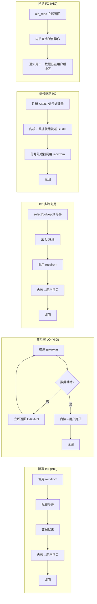
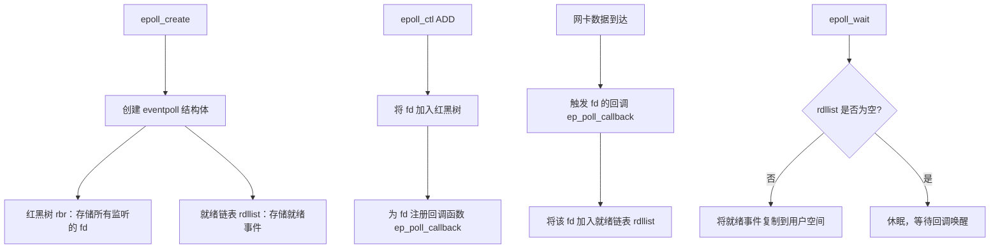
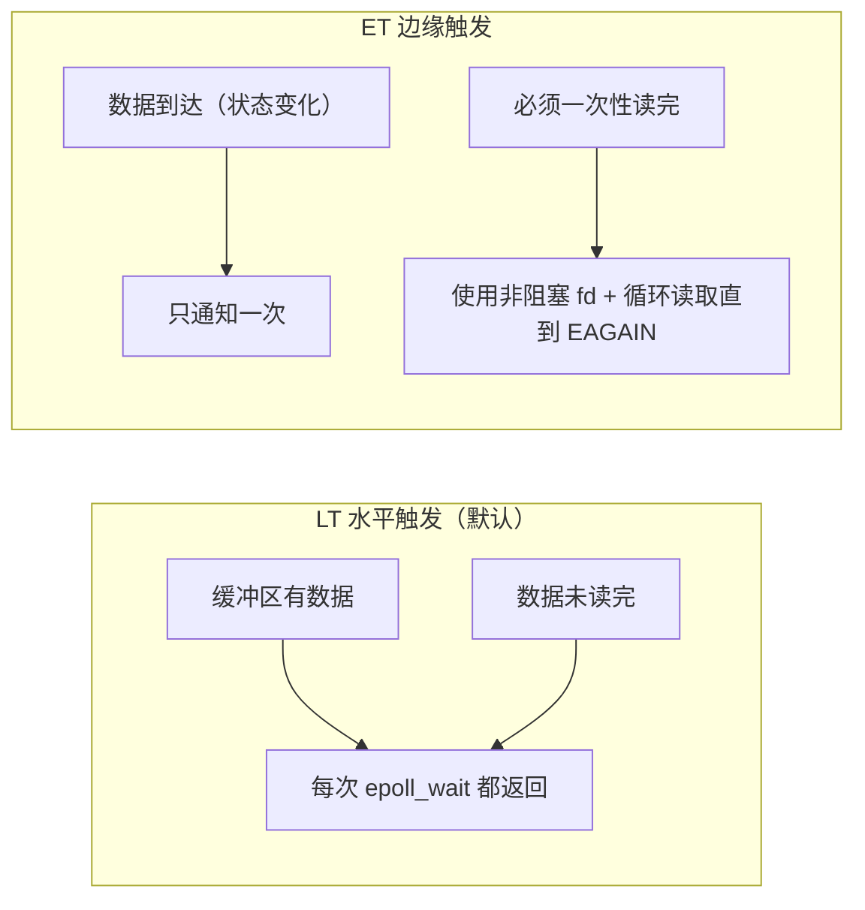
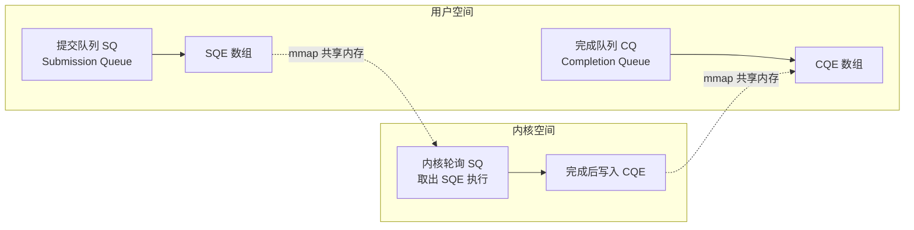

## Linux I/O 模型与多路复用

I/O 模型是高性能网络编程的理论基础。理解 Linux 的五种 I/O 模型，特别是 epoll 的实现原理，是深入理解 Netty、Redis、Nginx 等高性能组件的钥匙。

---

## 一、五种 I/O 模型对比

一次 I/O 操作分为两个阶段：
1. **等待数据就绪**（数据从网卡 DMA 到内核缓冲区）
2. **数据从内核拷贝到用户空间**

### 1.1 模型总览



| 模型 | 等待阶段 | 拷贝阶段 | 适用场景 |
|:---|:---|:---|:---|
| 阻塞 I/O | 阻塞 | 阻塞 | 简单应用，每连接一线程 |
| 非阻塞 I/O | 非阻塞（轮询） | 阻塞 | 需配合 I/O 多路复用 |
| I/O 多路复用 | 阻塞（在 select/epoll） | 阻塞 | 高并发服务器（Nginx/Redis） |
| 信号驱动 | 非阻塞 | 阻塞 | 少量使用 |
| 异步 I/O | 非阻塞 | **非阻塞** | io_uring、Windows IOCP |

---

## 二、select / poll / epoll 深度对比

### 2.1 select

```c
// select 系统调用签名
int select(int nfds, fd_set *readfds, fd_set *writefds,
           fd_set *exceptfds, struct timeval *timeout);
```

**工作流程**：
1. 用户将需要监听的 fd 集合（`fd_set` 位图）**复制到内核**
2. 内核遍历所有 fd，检查是否就绪
3. 将就绪状态写回 `fd_set`，**再次复制到用户空间**
4. 用户遍历所有 fd 找出就绪的

**缺陷**：
- fd 数量限制：默认 1024（由 `FD_SETSIZE` 宏决定）
- 每次调用都需要从用户态将 fd 集合复制到内核态（O(n) 复制）
- 内核轮询方式，时间复杂度 O(n)
- fd_set 不可复用，每次 select 后需重置

### 2.2 poll

```c
int poll(struct pollfd *fds, nfds_t nfds, int timeout);

struct pollfd {
    int   fd;
    short events;   // 关注的事件
    short revents;  // 返回的就绪事件
};
```

**改进**：使用链表（pollfd 数组），无 fd 数量上限。

**仍有缺陷**：每次调用仍需 O(n) 复制和 O(n) 遍历。

### 2.3 epoll — 事件驱动的突破

```c
// epoll 三个核心 API
int epoll_create1(int flags);           // 创建 epoll 实例（返回 epfd）
int epoll_ctl(int epfd, int op,         // 注册/修改/删除 fd
              int fd, struct epoll_event *event);
int epoll_wait(int epfd,                // 等待就绪事件
               struct epoll_event *events,
               int maxevents, int timeout);
```

**内核实现原理**：



**epoll 优势**：

| 特性 | select/poll | epoll |
|:---|:---|:---|
| fd 上限 | 1024 / 无限制 | 无限制（受系统内存） |
| fd 传递方式 | 每次调用都复制全量 | `epoll_ctl` 一次注册，无需反复复制 |
| 就绪检测 | O(n) 轮询所有 fd | O(1) 直接从就绪链表取 |
| 内存映射 | 不支持 | 支持 mmap 零拷贝传递事件 |

### 2.4 LT（水平触发）vs ET（边缘触发）



**LT 模式**（Level Triggered，默认）：只要 fd 缓冲区有数据，每次 `epoll_wait` 都会返回该 fd。适合一般场景，不易出错。

**ET 模式**（Edge Triggered）：只在数据到达（状态从无到有）时通知一次。必须配合非阻塞 fd 循环读取，否则数据丢失。性能更高，Nginx 使用此模式。

```c
// ET 模式正确读取姿势
struct epoll_event ev;
ev.events = EPOLLIN | EPOLLET;  // 设置 ET 模式
ev.data.fd = fd;
epoll_ctl(epfd, EPOLL_CTL_ADD, fd, &ev);

// 读取时必须循环到 EAGAIN
while (1) {
    ssize_t n = read(fd, buf, sizeof(buf));
    if (n == -1) {
        if (errno == EAGAIN || errno == EWOULDBLOCK)
            break;  // 数据读完
        // 真实错误
        break;
    }
    if (n == 0) break;  // 连接关闭
    process_data(buf, n);
}
```

---

## 三、io_uring — 下一代异步 I/O

`io_uring`（Linux 5.1+）是真正意义上的异步 I/O，通过共享内存环形队列避免系统调用开销。



**核心优势**：
- 零系统调用：开启 `IORING_SETUP_SQPOLL` 后内核线程主动轮询，应用层无需调用 `io_uring_enter`
- 批量提交：一次提交多个 I/O 操作
- 支持任意文件操作（不限于 socket）

```c
// io_uring 基本使用（liburing 库）
struct io_uring ring;
io_uring_queue_init(32, &ring, 0);

// 提交读操作
struct io_uring_sqe *sqe = io_uring_get_sqe(&ring);
io_uring_prep_read(sqe, fd, buf, sizeof(buf), 0);
io_uring_sqe_set_data(sqe, user_data);
io_uring_submit(&ring);

// 等待完成
struct io_uring_cqe *cqe;
io_uring_wait_cqe(&ring, &cqe);
// cqe->res 是读取字节数
io_uring_cqe_seen(&ring, cqe);
```

---

## 四、与 Java NIO / Netty 的对应关系

| Linux 机制 | Java 对应 | Netty 对应 |
|:---|:---|:---|
| `epoll` | `java.nio.Selector`（Linux 下底层用 epoll） | `EpollEventLoop` |
| ET 触发模式 | — | `EpollChannelOption.EPOLLET` |
| 非阻塞 fd | `SocketChannel.configureBlocking(false)` | 默认非阻塞 |
| `accept` 就绪 | `SelectionKey.OP_ACCEPT` | `ServerBootstrap.bind()` |
| `read` 就绪 | `SelectionKey.OP_READ` | `ChannelHandler.channelRead()` |
| `io_uring` | — | `IOUringEventLoopGroup`（Netty 5） |

```java
// Java NIO 底层对应 epoll_wait
Selector selector = Selector.open();  // → epoll_create
channel.register(selector, SelectionKey.OP_READ);  // → epoll_ctl ADD
int ready = selector.select();  // → epoll_wait
```
