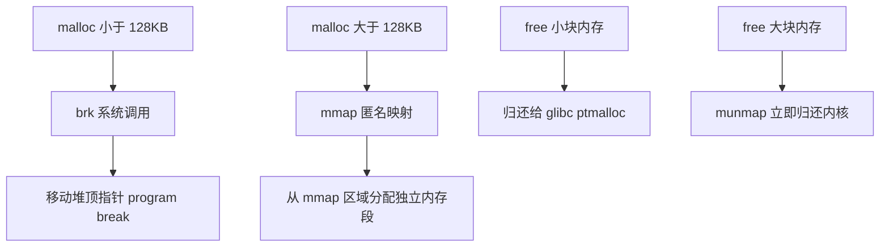
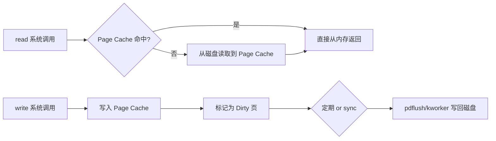

## Linux 虚拟内存与内核内存管理

---

## 一、虚拟内存地址空间布局

64 位 Linux 进程的虚拟地址空间划分（x86_64）：

```
高地址
┌─────────────────────────────┐  0xFFFFFFFFFFFFFFFF
│       内核空间 (128TB)       │  仅内核可访问
├─────────────────────────────┤  0xFFFF800000000000
│     不可访问空洞（规范漏洞）  │
├─────────────────────────────┤  0x00007FFFFFFFFFFF
│         栈 Stack            │  向下增长，RLIMIT_STACK 限制
│              ↓               │
│       mmap 映射区域          │  动态库、匿名映射、文件映射
│              ↑               │
│         堆 Heap              │  brk()/mmap() 向上增长
├─────────────────────────────┤
│         BSS 段               │  未初始化全局变量（清零）
│         数据段 Data          │  已初始化全局/静态变量
│         代码段 Text          │  只读，可执行
└─────────────────────────────┘  0x0000000000400000
低地址
```

---

## 二、四级页表结构

Linux x86_64 使用四级（内核 5.x+ 支持五级）页表将虚拟地址映射到物理地址：

```
虚拟地址 (64 bit)
┌─────┬─────────┬─────────┬─────────┬─────────┬────────────┐
│保留位│  PGD    │  PUD    │  PMD    │  PTE    │  页内偏移  │
│16位 │  9位    │  9位    │  9位    │  9位    │   12位     │
└─────┴─────────┴─────────┴─────────┴─────────┴────────────┘
         ↓           ↓           ↓           ↓
    页全局目录   页上层目录   页中间目录   页表项
    (PGD)       (PUD)        (PMD)        (PTE)
```

**TLB（Translation Lookaside Buffer）**：CPU 中的页表缓存，避免每次地址转换都走内存中的多级页表。进程切换时 TLB 需要刷新（`cr3` 寄存器切换），这是上下文切换有代价的原因之一。

---

## 三、内存分配机制

### 3.1 brk / mmap 系统调用



```bash
# 查看进程内存映射
cat /proc/<pid>/maps
# 或更详细的
cat /proc/<pid>/smaps

# 示例输出
# 7f8b1234-7f8b5678 r-xp 00000000 08:01 1234567 /usr/lib/x86_64/libc.so.6
# 地址范围  权限     偏移      设备    inode    文件路径
```

### 3.2 Buddy System 伙伴算法（物理内存分配）

内核以 **page（4KB）** 为最小单位管理物理内存，Buddy System 将连续物理页组织为 2^n（n=0~10）大小的块：

```
阶  块大小    空闲链表
0   4KB       [page1] → [page2] → ...
1   8KB       [pages] → ...
2   16KB      ...
...
10  4MB       ...
```

分配时找最小满足需求的阶，多余部分拆分后放回对应阶的空闲链表；释放时检查伙伴页是否空闲，若空闲则合并上升到更高阶。

```bash
# 查看 Buddy System 状态
cat /proc/buddyinfo
# Node 0, zone DMA32: 1 2 3 4 5 6 7 8 9 10 11
# 每个数字表示对应阶的空闲块数量
```

### 3.3 Slab/Slub 分配器（内核对象缓存）

Buddy System 管理大块内存，Slab 分配器在此基础上提供细粒度的内核对象缓存（task_struct、inode、dentry 等）：

```bash
# 查看 Slab 使用情况
cat /proc/slabinfo | head -20
# 或使用 slabtop（实时，按占用排序）
slabtop

# 重点关注字段：name / active_objs / total_objs / objsize
```

---

## 四、/proc/meminfo 关键字段解读

```bash
cat /proc/meminfo
```

| 字段 | 含义 | 生产关注点 |
|:---|:---|:---|
| `MemTotal` | 物理内存总量 | — |
| `MemFree` | 完全空闲内存 | 低不代表问题，Linux 会充分利用内存 |
| `MemAvailable` | **实际可用内存**（含可回收缓存）| **监控告警的正确字段** |
| `Buffers` | 块设备缓冲区（磁盘元数据） | — |
| `Cached` | 文件页缓存（Page Cache） | 大量 Cached 是正常且有益的 |
| `SwapCached` | 从 Swap 换入后仍在 Swap 的页 | — |
| `Active` | 最近使用的内存（不易回收） | — |
| `Inactive` | 较久未用的内存（可回收） | — |
| `Dirty` | 待写回磁盘的脏页 | 过大说明 I/O 跟不上 |
| `Writeback` | 正在写回的脏页 | — |
| `Slab` | 内核 Slab 分配器占用 | 异常增大可能有内核对象泄漏 |
| `SReclaimable` | 可回收的 Slab（如 dentry/inode 缓存） | — |
| `SUnreclaim` | 不可回收的 Slab | 持续增大需关注 |
| `VmallocUsed` | vmalloc 分配的虚拟内存 | — |
| `HugePages_Total` | 大页总数 | 数据库/JVM 常用大页优化 |

```bash
# 快速查看可用内存（推荐脚本监控用此字段）
awk '/MemAvailable/ {printf "%.1fGB\n", $2/1024/1024}' /proc/meminfo

# 查看内存使用概况（human-readable）
free -h
```

---

## 五、OOM Killer 机制

当系统内存严重不足时，内核 OOM Killer 选择并杀死进程以释放内存。

### 5.1 OOM Score 计算

每个进程有一个 `oom_score`（0-1000），值越高越容易被杀死。计算基于进程内存占用比例，可通过 `oom_score_adj` 调整：

```bash
# 查看某进程的 OOM 分数
cat /proc/<pid>/oom_score

# 调整 OOM 倾向（-1000 = 永不杀死，1000 = 优先杀死）
echo -1000 > /proc/<pid>/oom_score_adj

# 永久保护关键进程（如数据库）
# 在 systemd unit 中添加：
# OOMScoreAdjust=-1000
```

### 5.2 OOM 日志分析

```bash
# 查看 OOM 触发记录
dmesg | grep -A 20 "Out of memory"
# 或
journalctl -k | grep -i "oom"

# 典型 OOM 日志
# Out of memory: Kill process 12345 (java) score 892 or sacrifice child
# Killed process 12345 (java) total-vm:8388608kB, anon-rss:6291456kB

# oom_kill_process 输出的内存统计说明：
# total-vm: 进程虚拟内存总量
# anon-rss: 匿名内存驻留集大小（实际物理内存占用）
# file-rss: 文件映射的驻留集大小
```

### 5.3 预防 OOM 的生产实践

```bash
# 1. 设置进程内存软硬限制（cgroups v2）
# /sys/fs/cgroup/myapp/memory.max = 4G

# 2. JVM 必须显式设置 -Xmx，防止堆无限增长
# java -Xms2g -Xmx2g -XX:MaxMetaspaceSize=512m ...

# 3. 监控 MemAvailable，低于阈值告警
# 4. vm.overcommit_memory 参数调整
sysctl vm.overcommit_memory        # 0=启发式，1=总是允许，2=严格限制
sysctl vm.overcommit_ratio         # mode=2 时，允许 RAM*ratio%+SWAP 的超分配

# 5. 开启 swap 作为 OOM 缓冲（不是替代 RAM，而是争取时间告警）
```

---

## 六、Page Cache 与内存回收

### 6.1 Page Cache 工作原理



```bash
# 手动刷写脏页到磁盘
sync
echo 1 > /proc/sys/vm/drop_caches  # 清除 Page Cache（生产环境谨慎）

# 调整脏页写回参数
sysctl vm.dirty_ratio          # 脏页占总内存的比例上限，超过则阻塞写
sysctl vm.dirty_background_ratio  # 后台开始写回的阈值
sysctl vm.dirty_writeback_centisecs  # 写回间隔（1/100秒）
```

### 6.2 mmap 文件映射

`mmap` 将文件直接映射到进程虚拟地址空间，读写文件等同读写内存，内核管理 Page Cache 的加载与写回。

```c
// 典型 mmap 用法
int fd = open("/data/large_file", O_RDONLY);
void *addr = mmap(NULL, file_size, PROT_READ, MAP_SHARED, fd, 0);
// 直接访问 addr，内核按需从磁盘加载页
memcpy(dest, addr + offset, len);
munmap(addr, file_size);
```

**Java 中的 MappedByteBuffer** 底层即是 `mmap`，Kafka 用它实现消息的零拷贝读写。
