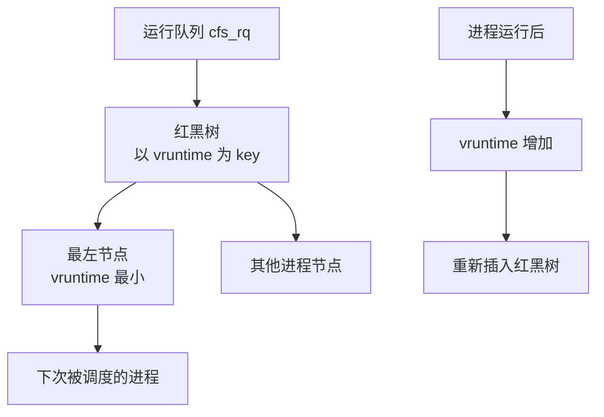

## Linux 进程调度器 CFS 与实时调度

---

## 一、Linux 调度类层次

Linux 采用模块化调度类设计，不同类型的任务使用不同调度策略，优先级从高到低：

```
停止类 (stop_sched_class)      → 迁移线程，最高优先级
   ↓
截止时间类 (dl_sched_class)    → SCHED_DEADLINE，实时截止时间调度
   ↓
实时类 (rt_sched_class)        → SCHED_FIFO / SCHED_RR，实时任务
   ↓
公平类 (fair_sched_class)      → SCHED_NORMAL / SCHED_BATCH，普通进程 ← 大多数进程
   ↓
空闲类 (idle_sched_class)      → SCHED_IDLE，CPU 空闲时运行
```

---

## 二、CFS 完全公平调度器

CFS（Completely Fair Scheduler，Linux 2.6.23+）的核心思想：**模拟一个理想的多任务 CPU，让每个进程得到完全相等的 CPU 时间**。

### 2.1 vruntime 虚拟运行时间

CFS 不直接按时间片分配 CPU，而是追踪每个进程的 **vruntime（虚拟运行时间）**：

```
vruntime += delta_exec × (NICE_0_LOAD / se->load.weight)
```

- `delta_exec`：进程实际运行的物理时间
- `NICE_0_LOAD`：nice=0 的标准权重（1024）
- `se->load.weight`：进程的调度权重（由 nice 值决定）

**效果**：nice 值低（优先级高）的进程，权重大，相同物理时间产生的 vruntime 增量小，因此 vruntime 增长慢，在红黑树中靠左，被更频繁调度。

### 2.2 nice 值与权重对应关系

| nice 值 | 权重 | 相对比例 |
|:---|:---|:---|
| -20 | 88761 | ~87x |
| -10 | 9548 | ~9x |
| 0 | 1024 | 1x（基准） |
| 10 | 110 | ~0.1x |
| 19 | 15 | ~0.015x |

相邻 nice 值之间权重比约为 1.25，意味着 nice 值每降低 1，获得约 25% 更多 CPU 时间。

### 2.3 红黑树调度队列



**调度决策**：每次调度时，选择红黑树最左节点（vruntime 最小的进程）执行。

```bash
# 查看进程调度信息
cat /proc/<pid>/sched
# 输出包含：nr_voluntary_switches（主动切换次数）、nr_involuntary_switches、vruntime 等

# 查看进程 nice 值和调度策略
ps -eo pid,ni,cls,cmd | head -20
# CLS 列：TS=SCHED_NORMAL, FF=SCHED_FIFO, RR=SCHED_RR, B=SCHED_BATCH, IDL=SCHED_IDLE

# 修改进程 nice 值
renice -n 10 -p <pid>       # 降低优先级
nice -n -5 ./my_command     # 以指定 nice 值启动
```

---

## 三、实时调度策略

### 3.1 SCHED_FIFO

- 同优先级按先入先出顺序执行
- 高优先级实时进程抢占低优先级进程
- 运行直到主动放弃 CPU 或被更高优先级进程抢占
- 实时优先级：1-99（数字越大优先级越高）

### 3.2 SCHED_RR（Round Robin）

- 与 SCHED_FIFO 类似，但同优先级之间有时间片轮转
- 时间片耗尽后移到同优先级队列末尾

```bash
# 设置实时优先级（需要 CAP_SYS_NICE 权限）
chrt -f 50 ./realtime_app       # SCHED_FIFO，优先级 50
chrt -r 50 ./realtime_app       # SCHED_RR，优先级 50

# 查看进程调度策略和优先级
chrt -p <pid>

# 修改运行中进程的实时优先级
chrt -f -p 99 <pid>
```

### 3.3 实时进程 CPU 限制（防止饿死普通进程）

```bash
# 内核参数：实时进程在每 1 秒中最多占用 950ms CPU
sysctl kernel.sched_rt_period_us    # 默认 1000000 (1s)
sysctl kernel.sched_rt_runtime_us   # 默认 950000 (0.95s)

# 完全取消限制（危险！实时进程可能挂死系统）
echo -1 > /proc/sys/kernel/sched_rt_runtime_us
```

---

## 四、CPU 亲和性与 NUMA

### 4.1 CPU 亲和性绑定

```bash
# 查看进程当前 CPU 亲和性掩码
taskset -p <pid>

# 将进程绑定到 CPU 0 和 CPU 1
taskset -cp 0,1 <pid>

# 以绑定 CPU 的方式启动程序
taskset -c 0,1 ./my_app

# 查看 CPU 拓扑
lscpu
cat /sys/devices/system/cpu/cpu0/topology/core_id
cat /sys/devices/system/cpu/cpu0/topology/physical_package_id
```

### 4.2 NUMA 架构

多路服务器（2 路、4 路 CPU）通常是 NUMA（Non-Uniform Memory Access）架构，每个 CPU Socket 有本地内存，访问远端内存延迟更高。

```bash
# 查看 NUMA 节点信息
numactl --hardware
numastat

# 将进程绑定到 NUMA 节点 0 的 CPU 和内存
numactl --cpunodebind=0 --membind=0 ./my_app

# 查看进程 NUMA 内存分布
numastat -p <pid>
```

---

## 五、cgroups 资源隔离

cgroups（Control Groups）是 Linux 容器（Docker/K8s）的底层基础，提供 CPU、内存、I/O、网络等资源的精细控制。

### 5.1 cgroups v2 基础

```bash
# 查看 cgroup 挂载点
mount | grep cgroup
ls /sys/fs/cgroup/

# 创建 cgroup（cgroups v2）
mkdir /sys/fs/cgroup/myapp

# 限制 CPU（最多使用 2 个 CPU 的 50% = 100000/200000）
echo "100000 200000" > /sys/fs/cgroup/myapp/cpu.max

# 限制内存上限为 4GB
echo "4294967296" > /sys/fs/cgroup/myapp/memory.max

# 将进程加入 cgroup
echo <pid> > /sys/fs/cgroup/myapp/cgroup.procs
```

### 5.2 systemd 通过 cgroups 管理资源

```ini
# /etc/systemd/system/myapp.service
[Service]
# CPU 配额（单位：1/1000000 秒，200% = 2个核心）
CPUQuota=200%

# 内存上限
MemoryMax=4G
MemorySwapMax=0    # 禁止 Swap

# I/O 权重（相对值，默认 100）
IOWeight=50

# 绑定 CPU
CPUAffinity=0 1 2 3
```

```bash
# 查看服务的 cgroup 资源使用
systemctl status myapp
# 或直接查看 cgroup 统计
cat /sys/fs/cgroup/system.slice/myapp.service/cpu.stat
cat /sys/fs/cgroup/system.slice/myapp.service/memory.current
```

---

## 六、上下文切换分析

```bash
# 查看系统级上下文切换
vmstat 1
# cs 列：每秒上下文切换次数（正常 < 10000/s）

# 查看某进程的上下文切换（自愿 vs 非自愿）
pidstat -w -p <pid> 1
# cswch/s：自愿上下文切换（I/O 等待、sleep 等）
# nvcswch/s：非自愿上下文切换（时间片耗尽被抢占）

# 非自愿切换过多 → 说明进程竞争 CPU，考虑增加 CPU 或绑核
# 自愿切换过多 → 说明进程频繁等待 I/O 或锁
```
