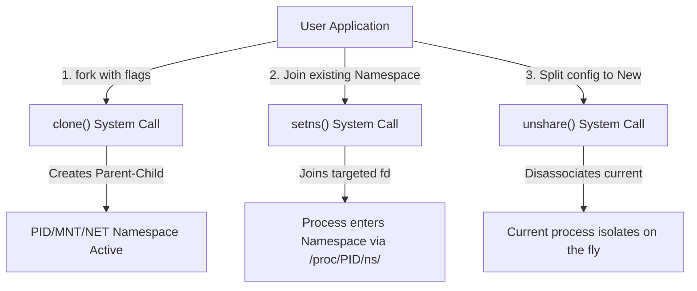

## 命名空间与控制组概述

在现代云计算与微服务架构中，Docker 容器与 Kubernetes（K8s）已经成为绝对的核心基础设施。然而，世界上并没有真正的“容器”这种物理实体。所谓的**容器（Container）**，本质上是 Linux 内核通过**命名空间（Namespaces）**实现“资源视图隔离”，再通过**控制组（Cgroups）**实现“资源配额限制”的一个普通用户态进程。

本篇将自底向上、从内核源码与系统调用的视角，深度拆解容器底层的这两大基石。

---

## 1. 资源视图隔离：Linux 命名空间 (Namespaces)

Linux Namespaces 在内核中实现了对系统资源的虚拟化，让每个容器进程在其独立的虚拟环境里，看起来就像拥有整台 Linux 物理机一样。

目前内核支持的 6 大核心命名空间（以及 2 个新增高级空间）如下：

| 命名空间类型 (Flag) | 隔离级别/隔离对象 | 内核引入版本 | 生产级核心作用 |
| :--- | :--- | :--- | :--- |
| **`CLONE_NEWPID` (PID)** | 进程编号标识空间 | 2.6.24 | 容器内 PID 1 作为 init 进程，外部看是普通宿主机 PID。 |
| **`CLONE_NEWNET` (NET)** | 网络协议栈与设备 | 2.6.29 | 容器拥有独立的虚拟网卡（`eth0`）、路由表、iptables 以及独立端口绑定。 |
| **`CLONE_NEWNS` (MNT)** | 文件系统挂载点 | 2.4.19 | 隔离不同的挂载目录视图，配合 `pivot_root` 形成独立的容器 rootfs。 |
| **`CLONE_NEWIPC` (IPC)** | 进程间通信资源 | 2.6.19 | 隔离 System V IPC 和 POSIX 消息队列，防止跨容器窃听数据。 |
| **`CLONE_NEWUTS` (UTS)** | 主机名与域名标签 | 2.6.19 | 容器可以设定和修改自有的 Hostname，不干扰宿主机。 |
| **`CLONE_NEWUSER` (USER)** | 用户与用户组映射 | 3.8 | 容器内的 root 账号可以被映射为宿主机的一般免权限普通用户，保障物理机安全。 |
| `CLONE_NEWCGROUP` (CGROUP)| cgroup 根路径视图 | 4.6 | 隐藏或限制容器对自身 cgroup 文件系统的读取权限。 |
| `CLONE_NEWTIME` (TIME) | 系统单调与启动时间 | 5.6 | 隔离系统时钟信息，允许容器自由改写系统本地时间属性。 |

### 1.1 Namespaces 的控制原语与系统调用

通过在编程或运行中调用以下 3 个关键系统调用，就可以控制 and 操作 Linux 的 Namespace：



#### 1. `clone()` — 创建进程并开启新的 Namespace

类似原生的 `fork()` 系统调用，但在分叉子进程时，可以传入各种 `CLONE_NEW*` 标志位。

```c
// 开辟全新的 PID 和 Net 命名空间
int child_pid = clone(child_main, child_stack + STACK_SIZE, CLONE_NEWPID | CLONE_NEWNET | SIGCHLD, NULL);
```

#### 2. `setns()` — 加入一个已经存在的 Namespace

这就是像 `docker exec -it <container> bash` 的底层核心实现。它将当前的进程附着到另一个已有进程的虚拟空间中：

```c
int fd = open("/proc/1234/ns/net", O_RDONLY); // 1234位已有容器的主进程 PID
setns(fd, CLONE_NEWNET); // 将当前进程强制移入到该进程的网络命名空间中
```

#### 3. `unshare()` — 在宿主机当前进程中直接剥离

使当前普通进程单方面与其父进程或原有环境脱离，即刻创建并加入全新的 Namespace。

---

## 2. 容器网络基石：veth-pair 与虚拟网桥拓扑

由于 `CLONE_NEWNET` 为进程带来了完全纯净的网络命名空间，没有任何物理网卡绑定，甚至连 `lo` 接口默认都处于 `DOWN` 状态。那么容器与其宿主机或者是其他容器之间又是如何快速交换 IP 数据包的呢？

```mermaid
graph TD
    subgraph Host Network Namespace (Standard Root)
        Bridge["Linux Virtual Bridge: docker0"]
        Host_Eth["Physical NIC: eth0"]
        veth0[veth_host_A]
        veth1[veth_host_B]
        
        Bridge --- veth0
        Bridge --- veth1
        Bridge -->|"SNAT / Routing Table"| Host_Eth
    end

    subgraph Container A (CLONE_NEWNET)
        App_A["Nginx / Go App"] --> eth0_A[eth0 inside Container A]
    end

    subgraph Container B (CLONE_NEWNET)
        App_B[Redis Container] --> eth0_B[eth0 inside Container B]
    end

    eth0_A <===>|Veth tunnel wire 1| veth0
    eth0_B <===>|Veth tunnel wire 2| veth1
```

### 虚拟管道 veth-pair 原理

1. **虚拟对线机制**：内核提供 `veth`（Virtual Ethernet）驱动，它总是成对出现。你可以认为它是一根“虚拟双绞网线”。
2. **两端各自连入**：一端留在宿主机的网络命名空间中，通常桥接到宿主机的网桥 `docker0` / `cni0`；另一端则移入容器的隔离网络空间中，改名为 `eth0`。
3. **极速数据穿越**：凡是从容器 `eth0` 发送出来的数据包，都会直接越过一切 IP 重定向运算逻辑，由内核直接通过 veth 管道物理拷贝投递给宿主机端的 `veth_host`，再由宿主机虚拟网桥（Bridge）投递往宿主机网卡或对端容器，完成亚微秒级的极速本地局部回环网络路由。

---

## 3. 资源配额限额：控制组 (Cgroups v1 vs v2)

Namespace 仅仅完成了**视图的隔离**，如果没有对物理资源（CPU, Memory, IO 吞吐）进行硬限额配置，容器里一旦出现高负载、死循环或内存泄露，就会疯狂抢夺宿主机资源甚至将其彻底打挂。这就需要控制组（Cgroups, Control Groups）大显身手。

### 3.1 Cgroups 核心四大子系统与工作树

Cgroups 的设计理念是使用**多阶层目录树结构**绑定硬件内核驱动属性。最底层的子系统（Subsystems/Controllers）主要负责对特定的物理设备进行隔离和监控：

- **`cpu`**：控制进程对 CPU 的使用时间配额。
- **`cpuset`**：将指定进程精确绑定到宿主机的某些核心上（如绑定到 0-3 号 CPU）。
- **`memory`**：限制进程物理内存、交换内存（Swap）的物理上限及 OOM 回锁。
- **`blkio`**：限制块设备 I/O 读写吞吐上限（BPS/IOPS 带宽限制）。

---

### 3.2 时代革命：Cgroups v1 与 v2 彻底大对比

Linux 4.5 内核引入了重构后的 **Cgroups v2**，并从 2021-2022 年左右（如 Kubernetes v1.25+, Docker v20.10+）开始成为现代操作系统的默认规范。

```mermaid
graph TD
    subgraph Cgroups v1 (Multi-Hierarchy Chaos)
        root_v1_cpu[Root CPU Controller] ---> groupA_cpu[Group A Process Group]
        root_v1_mem[Root Memory Controller] ---> groupB_mem[Group B Process Group]
        Note over Cgroups v1: Process 123 can belong to cpu/GroupA<br/>BUT memory/GroupB. Hard to coordinate.
    end

    subgraph Cgroups v2 (Unified Hierarchy Tree)
        root_v2[Root Directory] ---> nodeA["Group A folder: Process 123"]
        nodeA ---> c_cpu[Enable CPU Controller]
        nodeA ---> c_mem[Enable Memory Controller]
        Note over Cgroups v2: Single unified process hierarchy.<br/>A single process is in exactly one group.
    end
```

### Cgroups v1 vs v2 架构对账

| 特性对比维度 | Cgroups v1 的痛点与缺陷 | Cgroups v2 的完全体解决方案 |
| :--- | :--- | :--- |
| **拓扑树结构** | **多层树分离模式**。每个子系统都有一棵完全独立的树（cpu/ 是一棵树，memory/ 是另一棵树）。 | **统一层级目录树（Unified Hierarchy）**。系统只有一棵树，一个进程在树上只能且必须处于一个节点文件夹中。 |
| **协同资源处理** | 极度难以协调控制。例如，当内存系统由于回写发生 OOM，想要反向查找其磁盘 I/O 子系统（blkio）配合降速限流时，因不同树的进程难以映射，从而由于子系统不联动引发内核阻塞。 | 完美协调。CPU、内存与 I/O 处于完全一致的进程组节点中，多维度资源关联可以进行精细调优（例如，当触发 Memory limit 预警时，系统能精准判定其 blkio 的读写优先级从而阻止 OOM 恶化）。 |
| **内核态实现成本** | 复杂性高。每个控制器各自造轮子。 | 极致扁平。大量控制代码被内核团队精简整合（例如精简了近 30% 代码行数）。 |
| **内存页追踪** | 无法做到完好追溯。 | **完美追踪内核缓冲页 I/O（Kernel Buffers Writeback Tracking）**。即，直接把进程主动刷盘落文件系统（Page Cache 回写）引发的隐式内核 I/O 流量划入该容器的 blkio 资源组配额核算（v1 绝无可能实现）。 |

---

## 4. 生产配置指南：CPU 与内存资源内核限额配比

### 4.1 CPU 资源控制：Cfs_quota 与 Shares

在 cgroups 中，CPU 资源有两个极其核心的底层参数用来精确控制调度周期配额：

- **`cpu.cfs_period_us`**：CFS 调度周期长度，单位为微秒（默认一般是 `100000` = 即 100 毫秒）。
- **`cpu.cfs_quota_us`**：在该周期内本 cgroup 节点组下的所有进程在各核上享有的最高累加运行时间上限。

#### 示例

如果我们将参数配置为：
- `cpu.cfs_period_us = 100000` (100ms)
- `cpu.cfs_quota_us = 200000` (200ms)

哪怕是在一台 16 核宿主机下，该容器的全部进程组在 100ms 周期内最多也只能累加跑 200ms CPU。这意味它的**计算上限被牢牢限制在： 2 个物理核心（200% 使用率）**。
若运行超过 limit 水平线，进程会被内核强制挂起进行 **CPU 节流（Throttle）**，直接表现形式为调用性能产生毛刺巨幅下降或高延迟。

---

### 4.2 内存资源控制：Memory.limit vs Memory.high (v2)

在 v1 中，由于只有 `memory.limit_in_bytes` 的单线硬限制，当容器内使用的物理内存一触碰到 limit 红线，内核会在下一微秒直接暴躁地调起 `OOM Killer` 机制干净利索地强杀进程，造成企业微服务发生服务瞬时不可用。

而在 **Cgroups v2** 底层支持的多段“预警软限制”弹性控制中：

```text
                        ┌───────────────────────────────┐
                        │        Cgroups v2             │
                        │                               │
                        │    memory.limit (OOM Killer!) │
                        ├───────────────────────────────┤ ▲
                        │  memory.high (软预警/内核回收) │ │ 挤压物理空间
                        ├───────────────────────────────┤ │ 触发内核主动
                        │  memory.low  (保护保底可用内存)│ │ 回收缓存
                        └───────────────────────────────┘
```

#### Cgroups v2 内存三阶控制线

1. **`memory.low`**：物理保底保护内存数值。低于该水位时，其内核页面有最高豁免权，严禁被内核剥离、丢弃或强制回收交换（Swap Out）。
2. **`memory.high`**：**软预警水位红线**。一旦容器使用的内存超越此阈值，内核**不会杀死进程**，而是提前异步拉起内核回收回收清理机制，回收非必要的 Page Cache，甚至对该 cgroup 下的当前写盘 and 计算操作施加微小的时钟周期阻塞，通过“软着陆”抑制内存恶化暴涨，平稳度过高并发业务高峰。
3. **`memory.max`**：**真硬终极防御边界限制线**。如果该硬限制最终失守打爆，才会祭出 OOM Killer 强杀掉最贪婪的高内存进程。由此设计的保护链路使得服务高可用性大为增强。
