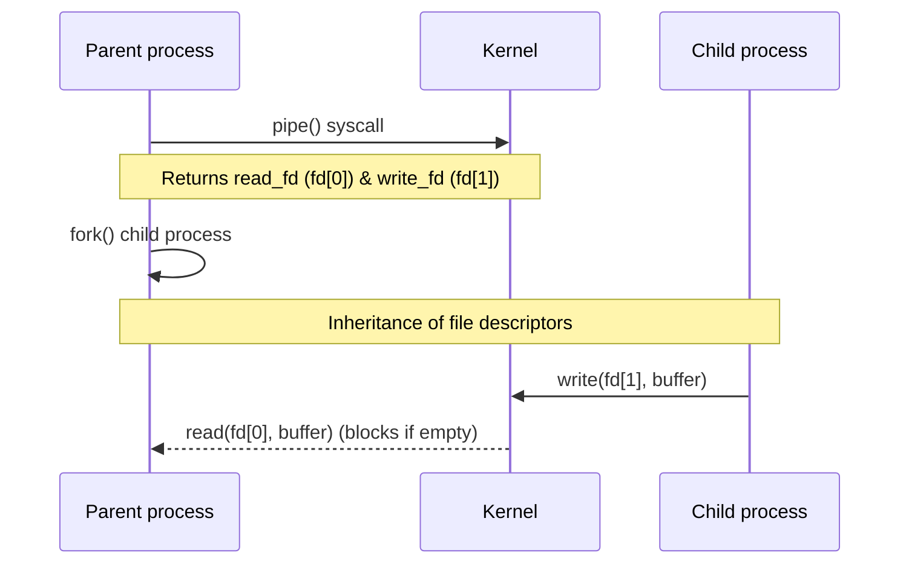

## Linux IPC 概述

在多进程微服务、高性能网关、内存数据库等复杂应用中，进程数据隔离是现代操作系统的安全底座，但同时这也引入了对**进程间通信 (IPC, Inter-Process Communication)** 的硬性要求。Linux 基于分级存储页表和虚拟地址空间隔离提供了一套精密的 IPC 体系。

```mermaid
graph TD
    A[Process A] -->|"Shared Memory: Zero-Copy"| SHM[Physical Memory Page]
    B[Process B] -->|"Shared Memory: Zero-Copy"| SHM

    C[Process C] -->|write sys_call| Pipe["Kernel Buffer: Pipe"]
    pipe_read[Process D] <--|read sys_call| Pipe

    E[Process E] -->|No TCP cost| UDS[Unix Domain Socket]
    F[Process F] -->|Fast local loop| UDS
```

本篇重点攻坚管道、共享内存、系统信号量、消息队列与本地 Unix Domain Sockets 的技术原委、底层资源限制和性能考量。

---

## 1. 匿名管道与命名管道 (Pipes & FIFOs)

### 1.1 匿名管道 (Anonymous Pipe)

匿名管道利用 `pipe(int pipefd[2])` 系统调用创建。它在内核空间开辟一段高速环形数据缓存，并返回两个虚拟文件描述符：`pipefd[0]` 为读端，`pipefd[1]` 为写端。

- **半双工机制**：单向数据流。
- **关联关系**：只能在父子、兄弟进程（具有公共祖先亲缘关系）之间传递。
- **底层环形缓冲区**：在内核中基于 `struct pipe_inode_info` 结构体的双指针循环链表维护（默认在 `/proc/sys/fs/pipe-max-size` 中维护，一般是 64KB）。



### 1.2 命名管道 (FIFO)

打破亲缘关系局限，利用 `mkfifo` 显式创建，并在物理文件系统上注册为一个命名文件节点（文件属性为 `p`）。
- **进程协同**：不同进程只需打开同一个路径的 FIFO 文件。
- **内核机制**：在文件打开（`open`）时，内核不在实际物理介质分配块，而直接将读写请求跳转 to 内存管道环形区。

### 1.3 管道的底层原子性风险：`PIPE_BUF` 控制

在并发多路写入管道时，必须明确 **`PIPE_BUF`** 限制：
- **原子性写入**：若单次写入大小 $\le PIPE\_BUF$（x86 Linux 内核标准默认为 `4096 字节` ），内核会保证操作是原子不可分割的；多进程并发写入数据相互之间绝不穿插混淆。
- **乱序覆写**：若单次写大小 $> PIPE\_BUF$，内核在通道满时将执行睡眠，多个进程的写操作会在并发时被**交叉拆分写入**，导致读出来的流数据发生严重篡改破坏。

---

## 2. 共享内存 (Shared Memory)：最快 IPC 原理

共享内存是**非网络级最高性能**的 IPC 技术，几乎没有任何额外的 CPU 拷贝耗费。

### 2.1 底层内存映射机制

普通 I/O 是通过读取磁盘/网络，经历：网卡/驱动 $\rightarrow$ 内核缓冲区 $\rightarrow$ 用户态缓冲区进行两次物理 Copy。
共享内存通过将**同一块真实物理内存（Physical Page）分别映射到不同进程各自的虚拟地址空间区域（VAS）**中。任何进程写这块内存，其他进程瞬时即可直观读取：

```mermaid
graph LR
    subgraph Process 1 (User Space)
        VAS1[Virtual Address Space V1]
    end
    subgraph Kernel Page Table Mapping
        PT["MMU / Page Table"]
    end
    subgraph Shared Physical Frame
        PF[Linux Physical Memory Frame]
    end
    subgraph Process 2 (User Space)
        VAS2[Virtual Address Space V2]
    end

    VAS1 --> PT
    VAS2 --> PT
    PT --> PF
```

### 2.2 POSIX (`shm_open`) 与 System V (`shmget`) 接口对比

| 技术体系 | 标识符机制 | 对应内核实现与可见度 | 兼容性与易用性 |
| :--- | :--- | :--- | :--- |
| **System V IPC** | 基于 `key_t` 与 ID 标识控制。 | 内核通过内部整数、信号环全局全局跟踪，需手动通过 `ipcs`/`ipcrm` 排查释放。 | 传统接口（`shmget`/`shmat`），不易结合标准 file descriptor API。 |
| **POSIX IPC** | 基于标准物理路径名（如 `/dev/shm/*`）。 | 原生映射到 Linux 底层虚拟 tmpfs 文件系统，直接支持标准文件语义控制。 | 现代接口（`shm_open`/`mmap`），可以使用 `select/poll` 以及 `close` 统一处理，更加安全和便于统一管理。 |

### 2.3 实战：POSIX 高效共享内存 C 语言 Demo

```c
#include <stdio.h>
#include <stdlib.h>
#include <fcntl.h>
#include <sys/mman.h>
#include <unistd.h>
#include <string.h>

#define SHM_NAME "/my_fast_shm"
#define SHM_SIZE 4096

int main() {
    // 1. 创建共享内存节点
    int shm_fd = shm_open(SHM_NAME, O_CREAT | O_RDWR, 0666);
    if (shm_fd == -1) {
        perror("shm_open 失败");
        return 1;
    }

    // 2. 设定虚文件物理大小
    ftruncate(shm_fd, SHM_SIZE);

    // 3. 将物理页映射到本进程的虚拟内存空间
    char *ptr = (char *)mmap(0, SHM_SIZE, PROT_READ | PROT_WRITE, MAP_SHARED, shm_fd, 0);
    if (ptr == MAP_FAILED) {
        perror("mmap 失败");
        return 1;
    }

    // 4. 直接像管理本地内存一样管理共享数据
    strcpy(ptr, "Hello, IPC Shared Memory Frame!");
    printf("已写入内存数据: %s\n", ptr);

    // 5. 解除物理页绑定并关闭节点
    munmap(ptr, SHM_SIZE);
    close(shm_fd);

    // 6. 清理虚拟文件系统项
    // shm_unlink(SHM_NAME);
    return 0;
}
```

---

## 3. 信号量 (Semaphores) 与本地竞争锁

共享内存读写极大提速，但由于**其自身不支持原子互斥控制机制**，高并发下多进程同时修改同一字段会导致**脏读脏写**。因此必须伴生**信号量（Semaphores）**或**互斥锁（Mutexes）**。

### 3.1 信号量概念与 P/V 原子操作

信号量是维持各并发实体临界区访问的整数计数器：

- **P (Wait) 原语**：申请资源。若值 $>0$ 则值减一，正常执行；若值为 $0$ 则进程挂起加入阻塞等待队列。
- **V (Signal) 原语**：释放并归还资源。将值加一，并自愿自动激活等待队列中的挂起进程。

### 3.2 共享内存锁实践：互斥共享量的进程一致性

要在多进程（不可见共享线程变量锁）中安全控制共享临界区，必须共享同一个**锁体本身**（即锁必须初始化在共享内存区域内），并使用 **`PTHREAD_PROCESS_SHARED`** 进行属性控制：

```c
#include <pthread.h>
#include <sys/mman.h>
// 假设 shm_ptr 已经正常挂载。
pthread_mutex_t *mutex = (pthread_mutex_t *)shm_ptr;

pthread_mutexattr_t attr;
pthread_mutexattr_init(&attr);
// 核心重点：配置跨进程一致性锁语义属性
pthread_mutexattr_setpshared(&attr, PTHREAD_PROCESS_SHARED);

// 在共享内存第一个字节中初始化一致性锁
pthread_mutex_init(mutex, &attr);
pthread_mutexattr_destroy(&attr);
```

---

## 4. 消息队列 (Message Queues) 的优缺点

消息队列是操作系统内核所拥有的一系列消息链表，它属于自带同步解耦结构的离散包装缓冲通信机制。

- **优势（结构高度格式化）**：进程每次投递或读取的数据自带完好的数据类型标签划分（不需要通过序列化打断或自己处理粘包切包）。
- **劣势（系统边界上下文切换频繁）**：每次入队（`msgsnd`）与出队（`msgrcv`）都会强行触发一次完整的用户态与内核虚拟空间边界的上下文切换（Context Switch），其并发传输效率难以企及共享内存。在海量微服务场景被内存共享内存队列（如 LMAX Disruptor 的 IPC 移植版）广泛击溃并替代。

---

## 5. 本地最高性能选择：Unix Domain Socket (UDS)

尽管 TCP 能够提供极强的网络互通性，但是在同一台 Linux 单机各模块通信下，使用 UDS 套接字具有无可比拟的高性能表现。

### 5.1 相比传统 TCP Loopback 环回套接字的性能开销差

本地环回（TCP `127.0.0.1`）在执行发包时不得不完全经历一系列极为臃肿的网络层、传输层逻辑包装：
- 需要计算握手确认、对齐 seq 序号、计算校验及。
- 包进入内核路由决策树寻路，触发环回驱动（Loopback Driver）回调。
- 至少产生两次上下文切换及完整的网卡软中断 NAPI 处理。

```mermaid
graph TD
    subgraph TCP Loopback 127.0.0.1
        TCP_Send[App Write] --> TCP_Layer[TCP Stream System Call]
        TCP_Layer --> IP_Route[IP Routing & IP Checksum]
        IP_Route --> Loop_Drv[Loopback Driver Virtual Card]
        Loop_Drv --> IRQ[Soft IRQ Network Thread]
        IRQ --> TCP_Recv[App Read]
    end

    subgraph Unix Domain Sockets (UDS)
        UDS_Send[App Write] --> Mem_Copy[Kernel Ring Buffer memory copy]
        Mem_Copy --> UDS_Recv[App Read]
    end
```

**Unix Domain Sockets** 完全抛弃了 TCP/IP 网络层逻辑：
- 采用一个物理文件系统的本地套接字节点（例如 `/var/run/mysql.sock`）作为命名锚点。
- **无协议栈封装**：内核省略了所有 IP 头部决策、TCP 控制环计算、三次握手确认。
- **单拷贝极速直达**：在内核中将写进程的数据直接拷贝到目的进程的 Socket 内存缓冲区中。在系统单机通信高频压测下，UDS 相比 localhost TCP 可提升近 2 到 3 倍的吞吐量，且 CPU 占用率大幅下降。

### 5.2 生产参数调优 (/proc/sys/net/core)

虽然 UDS 免除了 TCP 逻辑，但是在极高瞬时包并发（如 Consul / Nginx 本地反代 upstream）场景，依然容易打满 UDS 的缓存。必须调整 Linux 系统核心缓冲水线：

```bash
# 放大 UNIX 系统内核下最大队列长度深度限制（默认 128）
echo "4096" > /proc/sys/net/core/somaxconn

# 优化系统的单套接字高频接收和发送最大、最优缓冲区，以保证大包不产生分片降速
sysctl -w net.core.rmem_max=16777216
sysctl -w net.core.wmem_max=16777216
```
