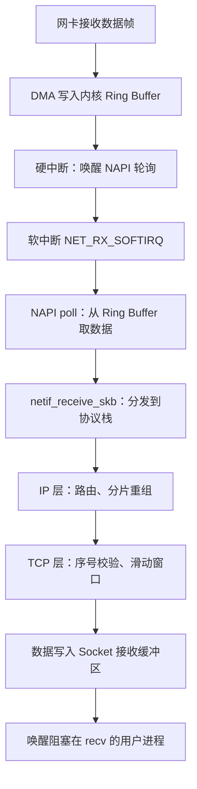
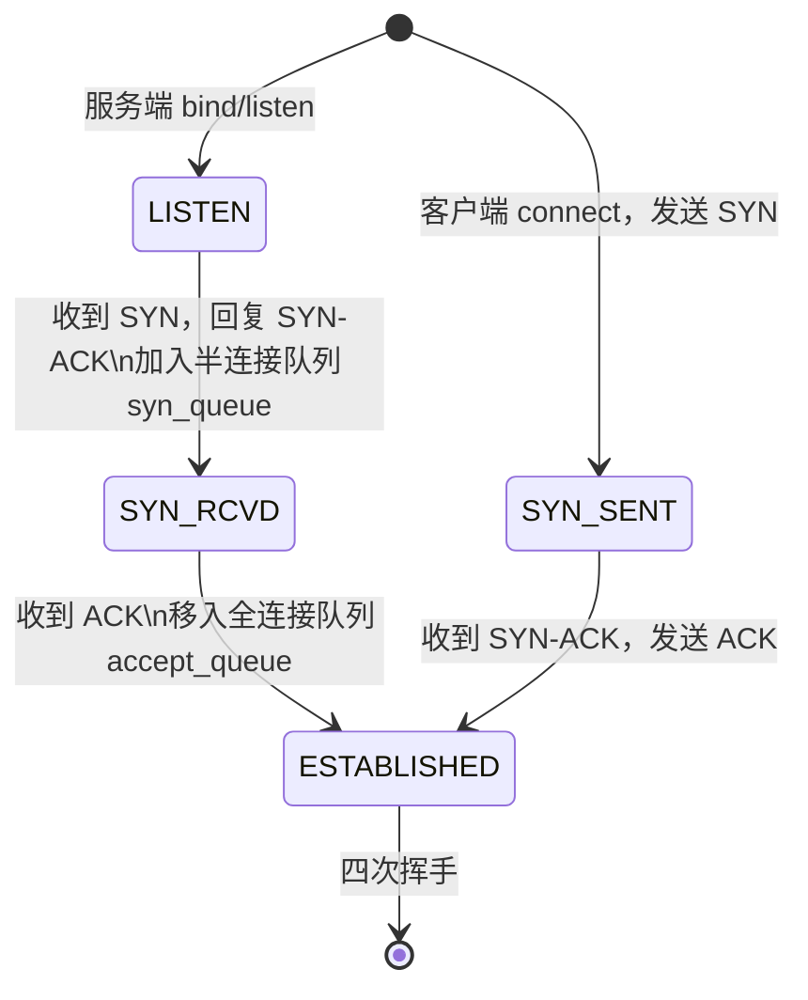
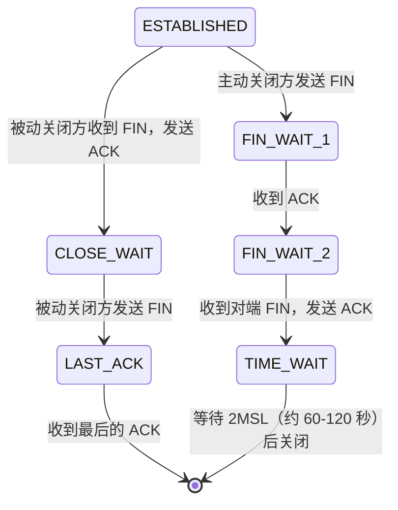

## Linux TCP/IP 内核协议栈深度解析

---

## 一、数据包在内核中的完整路径

### 1.1 接收路径（RX）



```bash
# 查看网卡中断统计
cat /proc/interrupts | grep eth

# 查看 NAPI 软中断统计
cat /proc/net/softnet_stat
# 每行对应一个 CPU：总处理数、被丢弃数、时间片耗尽次数

# 查看 Socket 接收缓冲区使用情况
ss -tmn  # -m 显示内存占用
```

### 1.2 发送路径（TX）

```
用户态 send() → 拷贝到 Socket 发送缓冲区 → TCP 封装（序号、ACK）
→ IP 封装（路由查找）→ 邻居子系统（ARP）→ 网卡驱动发送队列
→ DMA 发送到网络
```

---

## 二、TCP 三次握手内核状态机



### 2.1 半连接队列与全连接队列

```bash
# 半连接队列大小（SYN 洪泛攻击防御关键参数）
sysctl net.ipv4.tcp_max_syn_backlog   # 默认 1024，高并发服务器建议 65535

# 全连接队列大小 = min(backlog, somaxconn)
sysctl net.core.somaxconn             # 默认 128，建议 65535
# listen(fd, backlog) 的 backlog 参数也影响全连接队列大小

# 查看队列溢出情况
netstat -s | grep -i "listen\|overflow\|dropped\|syn"
# 关注：
# SYNs to LISTEN sockets dropped → 半连接队列溢出
# times the listen queue of a socket overflowed → 全连接队列溢出
```

### 2.2 SYN Cookies 防御 SYN 洪泛

```bash
# 开启 SYN Cookies（半连接队列满时绕过队列，用算法验证客户端合法性）
sysctl net.ipv4.tcp_syncookies   # 默认 1（已开启）
# 注意：SYN Cookies 模式下 TCP 选项（如 Window Scale、SACK）可能丢失
```

---

## 三、TCP 四次挥手与 TIME_WAIT

### 3.1 四次挥手状态机



### 3.2 TIME_WAIT 大量积压

**TIME_WAIT 存在的原因**：
1. 确保对端收到最后的 ACK（防止最后 ACK 丢失后对端重传 FIN 时无法响应）
2. 让网络中残留的旧数据包自然消亡（防止新连接收到旧连接的数据）

**高并发短连接场景（如 HTTP 服务）TIME_WAIT 大量积累**：

```bash
# 查看 TIME_WAIT 连接数
ss -s | grep TIME-WAIT
# 或
netstat -n | awk '/^tcp/ {print $6}' | sort | uniq -c | sort -rn

# 解决方案 1：开启 tcp_tw_reuse（客户端发起连接时复用 TIME_WAIT）
sysctl net.ipv4.tcp_tw_reuse=1   # 仅对发起连接方有效，配合 timestamp 使用
sysctl net.ipv4.tcp_timestamps=1  # 必须同时开启（tcp_tw_reuse 依赖时间戳）

# 解决方案 2：缩短 TIME_WAIT 等待时间（内核硬编码 2MSL，无法直接修改）
# 实际可通过减少 tcp_fin_timeout 加速 FIN_WAIT_2 → TIME_WAIT
sysctl net.ipv4.tcp_fin_timeout   # 默认 60 秒

# 解决方案 3：增加可用端口范围（客户端）
sysctl net.ipv4.ip_local_port_range   # 默认 32768-60999，可扩展到 1024-65000

# 解决方案 4：使用长连接（HTTP Keep-Alive、连接池）—— 根本解法
```

---

## 四、Socket 缓冲区调优

```bash
# 查看 Socket 缓冲区大小
sysctl net.core.rmem_default   # 默认接收缓冲区（212992 = 208KB）
sysctl net.core.rmem_max       # 最大接收缓冲区
sysctl net.core.wmem_default   # 默认发送缓冲区
sysctl net.core.wmem_max       # 最大发送缓冲区

# TCP 专属缓冲区（三个值：最小/默认/最大）
sysctl net.ipv4.tcp_rmem       # 默认：4096 131072 6291456
sysctl net.ipv4.tcp_wmem       # 默认：4096 16384 4194304

# 高带宽场景（万兆网卡 + 高延迟链路）调优
cat >> /etc/sysctl.conf << 'EOF'
net.core.rmem_max = 134217728
net.core.wmem_max = 134217728
net.ipv4.tcp_rmem = 4096 87380 134217728
net.ipv4.tcp_wmem = 4096 65536 134217728
net.ipv4.tcp_window_scaling = 1
net.ipv4.tcp_timestamps = 1
net.ipv4.tcp_sack = 1
EOF
sysctl -p
```

---

## 五、TCP Keepalive

TCP Keepalive 用于检测长时间空闲连接的对端是否存活：

```bash
# 系统级 keepalive 参数
sysctl net.ipv4.tcp_keepalive_time      # 空闲多久后开始探测（默认 7200s = 2小时）
sysctl net.ipv4.tcp_keepalive_intvl     # 探测间隔（默认 75s）
sysctl net.ipv4.tcp_keepalive_probes    # 最大探测次数（默认 9 次）

# 实战：数据库连接池场景，防止连接被防火墙静默关闭
cat >> /etc/sysctl.conf << 'EOF'
net.ipv4.tcp_keepalive_time = 600
net.ipv4.tcp_keepalive_intvl = 30
net.ipv4.tcp_keepalive_probes = 3
EOF
```

---

## 六、常用网络内核参数汇总

```bash
# 查看所有网络相关内核参数
sysctl -a | grep net.ipv4.tcp | grep -v "#"

# 生产高并发服务器推荐配置
cat >> /etc/sysctl.conf << 'EOF'
# 连接队列
net.core.somaxconn = 65535
net.ipv4.tcp_max_syn_backlog = 65535

# TIME_WAIT 优化
net.ipv4.tcp_tw_reuse = 1
net.ipv4.tcp_timestamps = 1
net.ipv4.ip_local_port_range = 1024 65000

# 文件描述符
fs.file-max = 1000000

# 内存
net.core.rmem_max = 134217728
net.core.wmem_max = 134217728

# 其他
net.ipv4.tcp_syn_retries = 3
net.ipv4.tcp_synack_retries = 3
net.ipv4.tcp_max_orphans = 262144
EOF

sysctl -p
```
