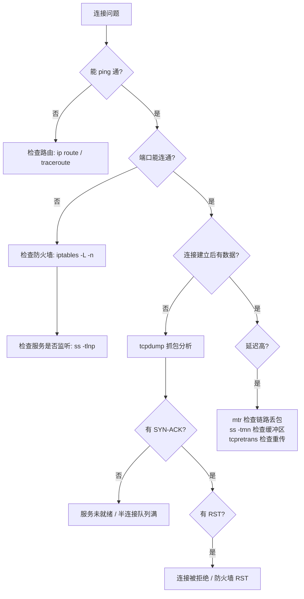

## Linux 网络诊断工具实战

---

## 一、ss / netstat — 连接状态诊断

`ss`（Socket Statistics）是 `netstat` 的现代替代，直接读取内核数据，速度更快。

```bash
# 查看所有 TCP 连接
ss -tnp
# -t TCP  -n 不解析域名  -p 显示进程

# 查看监听端口
ss -tlnp

# 统计各连接状态数量
ss -s

# 查看 TIME_WAIT 连接（高并发诊断）
ss -tn state time-wait | wc -l

# 过滤特定端口
ss -tnp 'dport = :8080'
ss -tnp 'sport = :3306'

# 查看 Socket 内存占用（排查缓冲区积压）
ss -tmn

# 查看特定进程的连接
ss -tnp | grep java

# 查看 UDP
ss -unp
```

### 连接状态速查

```bash
# 各状态连接数汇总
ss -tan | awk 'NR>1 {print $1}' | sort | uniq -c | sort -rn

# 与特定 IP 的连接
ss -tn dst 192.168.1.100
```

---

## 二、tcpdump — 抓包分析

```bash
# 基础抓包（抓 eth0 上所有包）
tcpdump -i eth0

# 抓指定端口的包（详细输出 + 十六进制）
tcpdump -i eth0 port 8080 -v -X

# 保存到文件（用 Wireshark 分析）
tcpdump -i eth0 -w /tmp/capture.pcap

# 读取已保存的文件
tcpdump -r /tmp/capture.pcap

# 抓 TCP 三次握手（SYN 包）
tcpdump -i eth0 'tcp[tcpflags] & (tcp-syn) != 0'

# 抓特定主机间的 HTTP 流量
tcpdump -i eth0 host 192.168.1.100 and port 80 -A

# 抓 TCP RST 包（排查连接异常重置）
tcpdump -i any 'tcp[tcpflags] & tcp-rst != 0'

# 抓 DNS 查询
tcpdump -i eth0 port 53 -v

# 限制抓包数量（避免文件过大）
tcpdump -i eth0 port 8080 -c 1000 -w capture.pcap

# 抓包同时过滤本机 SSH（避免 tcpdump 流量污染）
tcpdump -i eth0 port not 22
```

### 常用过滤表达式

```bash
# 复合条件（and/or/not）
tcpdump 'host 192.168.1.100 and (port 80 or port 443)'

# 按 IP 段
tcpdump net 192.168.1.0/24

# 指定协议
tcpdump icmp
tcpdump udp and port 53

# TCP 标志位过滤
# tcp-syn=0x02 tcp-ack=0x10 tcp-fin=0x01 tcp-rst=0x04
tcpdump 'tcp[13] == 0x12'   # SYN-ACK（0x02|0x10）
```

---

## 三、iperf3 — 网络带宽测试

```bash
# 服务端启动
iperf3 -s -p 5201

# 客户端测试 TCP 带宽（默认 10 秒）
iperf3 -c 192.168.1.100 -p 5201

# 测试 UDP 带宽（指定目标带宽 1Gbps）
iperf3 -c 192.168.1.100 -u -b 1G

# 并发 4 个流（模拟多线程传输）
iperf3 -c 192.168.1.100 -P 4

# 反向测试（服务端发，客户端收）
iperf3 -c 192.168.1.100 -R

# 测试 30 秒并显示每秒统计
iperf3 -c 192.168.1.100 -t 30 -i 1

# 输出 JSON 格式（便于脚本解析）
iperf3 -c 192.168.1.100 -J | jq '.end.sum_received.bits_per_second'
```

---

## 四、ping / traceroute — 连通性诊断

```bash
# 基础连通测试
ping -c 4 192.168.1.100

# 指定包大小（测试 MTU）
ping -s 1472 192.168.1.100   # 1472 + 28(IP+ICMP头) = 1500（标准 MTU）

# 快速洪泛测试（需 root）
ping -f -c 10000 192.168.1.100

# 路由追踪
traceroute 8.8.8.8
# 使用 TCP SYN（更容易穿越防火墙）
traceroute -T -p 80 8.8.8.8

# mtr：综合 ping + traceroute（实时丢包统计）
mtr 8.8.8.8 --report --report-cycles 100
```

---

## 五、nmap — 端口扫描与服务发现

```bash
# 扫描单个主机的常用端口
nmap 192.168.1.100

# 扫描指定端口范围
nmap -p 1-1000 192.168.1.100

# 扫描特定端口，检测服务版本
nmap -sV -p 22,80,443,3306,6379 192.168.1.100

# 扫描整个网段（发现存活主机）
nmap -sn 192.168.1.0/24

# TCP SYN 扫描（半开放，更快更隐蔽）
nmap -sS 192.168.1.100

# 检测防火墙规则（发 RST 包）
nmap --scanflags RST 192.168.1.100
```

---

## 六、eBPF / bcc — 动态内核追踪

eBPF（extended Berkeley Packet Filter）是 Linux 5.x 时代最强大的内核观测技术，`bcc` 工具集提供开箱即用的脚本。

```bash
# 安装 bcc 工具集（Ubuntu）
apt-get install bpfcc-tools linux-headers-$(uname -r)

# 追踪 TCP 连接建立（connect/accept 系统调用）
tcpconnect              # 显示新建的 TCP 连接（四元组 + 进程）
tcpaccept               # 显示接受的 TCP 连接

# 追踪 TCP 连接关闭（包含 RTT 统计）
tcplife -d              # 显示连接生命周期和传输量

# 追踪 TCP 重传（网络质量诊断）
tcpretrans              # 实时显示每次 TCP 重传

# 追踪系统调用延迟
syscount                # 统计每类系统调用次数
funclatency -u do_sys_open  # 统计 open 系统调用延迟（微秒）

# 追踪磁盘 I/O 延迟
biolatency              # 块设备 I/O 延迟直方图
biosnoop                # 每个 I/O 操作详情

# 追踪 CPU 调度延迟
runqlat                 # 进程在运行队列中等待的延迟

# 追踪内存分配
memleak -p <pid>        # 检测用户态内存泄漏
```

### perf + 火焰图

```bash
# 采样 CPU 调用栈（60秒）
perf record -F 99 -p <pid> -g -- sleep 60

# 生成报告
perf report --stdio | head -50

# 生成火焰图（需要 FlameGraph 工具）
git clone https://github.com/brendangregg/FlameGraph
perf script | ./FlameGraph/stackcollapse-perf.pl | ./FlameGraph/flamegraph.pl > flamegraph.svg

# 直接对整个系统采样
perf record -F 99 -a -g -- sleep 30
```

---

## 七、网络故障快速诊断流程



```bash
# 一键网络状态汇总脚本
echo "=== 网卡状态 ===" && ip link show
echo "=== 路由表 ===" && ip route
echo "=== 监听端口 ===" && ss -tlnp
echo "=== TCP 连接状态统计 ===" && ss -s
echo "=== 丢包统计 ===" && netstat -s | grep -E "failed|error|drop|overflow"
echo "=== 网络参数 ===" && sysctl net.ipv4.tcp_max_syn_backlog net.core.somaxconn net.ipv4.tcp_tw_reuse
```
