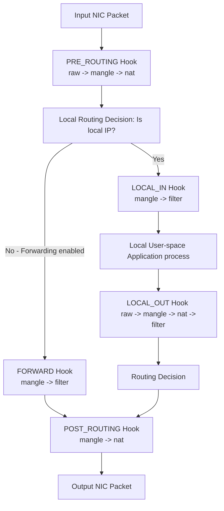

## Netfilter 与防火墙概述

在高并发网络网关、负载均衡服务器和容器调度集群（如 Kubernetes）中，Linux 的报文包处理性能起着决定性作用。Linux 的网络流量拦截、NAT 精确映射及网络层过滤规则的真正内核实现层并不是外挂的应用工具程序，而是完全根植在 Linux 内核协议栈中的高效拦截框架 —— **Netfilter**。

本篇我们将解构 Netfilter 的核心表链跳转机理，深度对比传统 `iptables` 服务与现代 `nftables` 新时代防火墙的区别，并专注于高负载状态下 `conntrack` 连接跟踪表爆满而引发在大并发生产环境中丢包挂机根因诊断及策略路由控制。

---

## 1. Netfilter 内核框架与五表五链路由包传输全景图

Netfilter 是一套在 Linux 内核网络协议栈的特定关键切入位置（Hooks）挂载回调函数处理逻辑的底层框架。

### 1.1 Netfilter 五大核心 Hook 拦截挂载锚点 (Chains)

1. **`NF_INET_PRE_ROUTING`**：报文从物理网卡接收进来、**还未进入系统路由判决树（Routing Table）之前**的最先捕获阶段。
2. **`NF_INET_LOCAL_IN`**：经路由判断后，确定该报文的目的 IP 就是本机的本机进程，报文会被派发至用户态应用程序之前执行。
3. **`NF_INET_FORWARD`**：经路由判定，目的地址并非物理机，内核负责开启 IP 转发（Forward）功能后，包进行转发路由投递阶段。
4. **`NF_INET_LOCAL_OUT`**：本机应用程序或守护进程主动向外部环境发送包时的最先捕获拦截处理阶段。
5. **`NF_INET_POST_ROUTING`**：路由确定后、报文**真正通过物理或虚拟网线驱动向外溢出并飞向物理网卡芯片之前**的最后一个出口阶段。

---

### 1.2 Netfilter 完整表链跳转与处理逻辑全景图

为了精细应对各种网络操作分类，Netfilter 在不同的 Hooks 上注册了不同的功能模块。这些模块按照优先级、逻辑功能归入不同的“表（Tables）”。最常用的五张表如下：

- **`raw`**：最高优先级，绕开底层 conntrack 连接跟踪。
- **`mangle`**：控制并允许任意更改 IP 首部字段属性（如调整 TTL, TOS, 或服务控制标志 Mark）。
- **`nat`**：网络地址地址转换（实现 SNAT/DNAT 及端口转发）。
- **`filter`**：传统的封锁、安全拒绝包控制规则表。
- **`security`**：配合 SELinux 实现自主安全标签管控（极少手动控制）。



---

## 2. 时代飞跃：Iptables 与 Nftables 底层大对账

大部分工程师对网络安全规则仍停留于敲写 `iptables`。然而从 CentOS 8+, Ubuntu 20.04+, 乃至后端的底层 Docker/Kubernetes 已经完成了向新一代高效率包处理框架 **Nftables** 的底座切换。

### 2.1 Iptables 性能滑坡的根本性原因

- **庞大规则线性搜寻（$O(N)$ 复杂时间度性能开销）**：Iptables 中的规则是纯链表扁平排齐。如果服务器被添加了多达 10 万条防火墙黑白单控制规则，每一个从网卡流入的包都必须自上而下**线性地从第 1 条遍历检索配对到第 10 万条**。这在极高频率包压力下会造成极大的 CPU 软件中断队列打满。
- **配置一致性原子性残缺**：Iptables 不支持局部、有选择性的无缝热更新。每次 `iptables-restore` 必须先把整个系统的内核规则彻底整体置换清理，造成内核底层频繁短暂的锁和规则状态锁中断。
- **底层架构垃圾代码沉淀**：由于 IPv4 与 IPv6，甚至 ARP 等协议内部字段被底层防火墙各自硬编码剥离（由 `iptables`、`ip6tables`、`arptables` 各自独立控制），代码逻辑高度同质、冗杂，使得其难以做进一步重构和零拷贝提速。

### 2.2 Nftables 高性能引擎机制

- **内核轻量级 Bytecode 虚拟机（NFT VM）**：Nftables 在内核中运行了一套精练的高吞吐安全虚拟机。所有的用户规则并非扁平线性堆砌，而是先通过用户态（`nft` 命令行）解析，将其编译为**高效精典的虚拟字节码（Bytecode）**。进入内核后，虚拟机通过 JIT 或跳转映射执行，过滤效率高。
- **哈希、多维映射高级数据查找（$O(1)$ 查找时间）**：Nftables 内部天然完美支持高速集（Sets）和字典映射（Maps）体系结构。在拥有 10 万条 IP 限额匹配的超大型服务器上，可以使用类似 $O(1)$ 级别极速的 Hash Map 直接一键寻址匹配成功，不需要经历遍历搜寻，大幅节省计算资源。
- **无缝原子更新**：支持局部热加载。可以在极短周期内完成向指定表中动态增量添加、移除某一索引树，高并发连接不抖动。

---

## 3. conntrack（连接跟踪）爆满与丢包实战诊断

在大规模企业应用或大规模微服务暴露中（如容器云的 Ingress 节点），工程师常会遇到服务器端连接经常性网络卡死、随机性丢包、长连接抖动超时的情况。如果检查物理网卡，发现系统 CPU 的 `%si`（软件中断）很高，通常由于发生了核心的 **`conntrack`（连接跟踪表）满导致的丢包异常**。

### 3.1 核心概念：什么是 conntrack (连接跟踪)

Netfilter 为了实现状态检测防火墙和高性能 NAT（即记住谁发起的请求，好正确还原响应 IP），内核必须对每一条经过的 IP 连接状态（无论是个性的 TCP，还是无连接的 UDP、ICMP）建立完整的生存期跟踪状态跟踪表。

每一条追踪记录都在内存中占用一块 `struct nf_conn` 底层结构体，记录的信息类似于：
`[TCP] src=192.168.1.10 dst=8.8.8.8 sport=52120 dport=53 [UNREPLIED] src=8.8.8.8 dst=192.168.1.10 sport=53 dport=52120`

### 3.2 诊断与排查全链路

当你怀疑连接跟踪爆满时，通过以下物理管道抓取系统核心参数状态：

```bash
# 判断连接跟踪表当前存储容量上限
sysctl net.netfilter.nf_conntrack_max

# 查看系统当前一瞬间正在追踪存量的连接真实总数
sysctl net.netfilter.nf_conntrack_count

# 排查内核是否存在 conntrack 异常分配不进去导致的掉包丢失统计日志
# 若有大量的 "nf_conntrack: table full, dropping packet" 报错即证明已打爆
dmesg -T | grep -i "conntrack"
```

### 3.3 终极生产应急调优方案

一旦遭遇突发连接容量穿透：

1. **紧急拉高水位线**（通常将系统最大的容量提升至 100 到 200 万之间，不推荐设置过大大，防止引发物理机 kernel 内存被耗光发生 OOM 崩溃）：

   ```bash
   sysctl -w net.netfilter.nf_conntrack_max=1048576
   ```

2. **加速缩容收回**：对长周期处于 TIME_WAIT/ESTABLISHED 的跟踪记录进行强制短周期老化释放设置：

   ```bash
   # 收窄默认的 TCP established 连接跟踪最大物理生命保持周期（系统默认甚至高达 5 天 = 432000s）
   sysctl -w net.netfilter.nf_conntrack_tcp_timeout_established=1200
   
   # 控制 TIME_WAIT 状态追踪的保活老化周（默认为 120 秒）
   sysctl -w net.netfilter.nf_conntrack_tcp_timeout_time_wait=30
   ```

3. **设置不跟踪豁免（Raw Bypass）**：针对对内/外网超大业务量的高性能端口服务（如负载均衡 HAProxy/Nginx 本身），其本身已做了极完善的连接逻辑，无需防火墙多此一举做 NAT。可以直接加入 RAW 表跳过跟踪注册流程：

   ```bash
   # 任何流入/流出 80 端口的高清大流量连接豁免入跟踪表
   iptables -t raw -A PREROUTING -p tcp --dport 80 -j NOTRACK
   iptables -t raw -A OUTPUT -p tcp --sport 80 -j NOTRACK
   ```

---

## 4. 双网卡/多通路策略路由控制

生产级高容灾服务器往往需要对接双运营商链路和内网专属千兆网、局域隔离网。如果多张网卡只是纯配网关，就会因路由出口冲突导致**“进包接口正常，出包方向混乱跳错，导致网络间歇性彻底熔断”**。必须采用**策略路由（Policy Routing）**。

### 4.1 核心命令：策略表和路由控制规则

Linux 内核可以维护 255 张相对独立的路由表，可以通过指定源 IP、出入接口和协议标志位选择特定的路由寻路径路。

#### 实战场景

服务器配备双网卡：

- `eth0`：电信内网段，IP: `10.10.0.10` / 网关: `10.10.0.1`
- `eth1`：电信外网段，IP: `220.181.1.10` / 网关: `220.181.1.1`

#### 配置双系统出路

```bash
# 1. 声明和新增两个自定义策略路由表（向 /etc/iproute2/rt_tables 中写入名称映射，其真实 ID 只要在 1-255 即可）
echo "100 telecom_internal" >> /etc/iproute2/rt_tables
echo "200 telecom_public" >> /etc/iproute2/rt_tables

# 2. 为 telecom_internal 路由表添加局域网网关及路由
ip route add 10.10.0.0/24 dev eth0 src 10.10.0.10 table telecom_internal
ip route add default via 10.10.0.1 dev eth0 table telecom_internal

# 3. 为 telecom_public 路由表添加外网默认出路
ip route add 220.181.1.0/24 dev eth1 src 220.181.1.10 table telecom_public
ip route add default via 220.181.1.1 dev eth1 table telecom_public

# 4. 配置物理规则绑定（策略：只要数据报文是从指定网卡发出或由指定网段发出的，强制通过专门独立的策略表转发）
ip rule add from 10.10.0.10 table telecom_internal
ip rule add from 220.181.1.10 table telecom_public

# 5. 立即彻底清除和刷新内核缓存以启用配置
ip route flush cache
```

由此即可完美实现双通路在收发报文时的独立各走各走，双向流量对齐。
