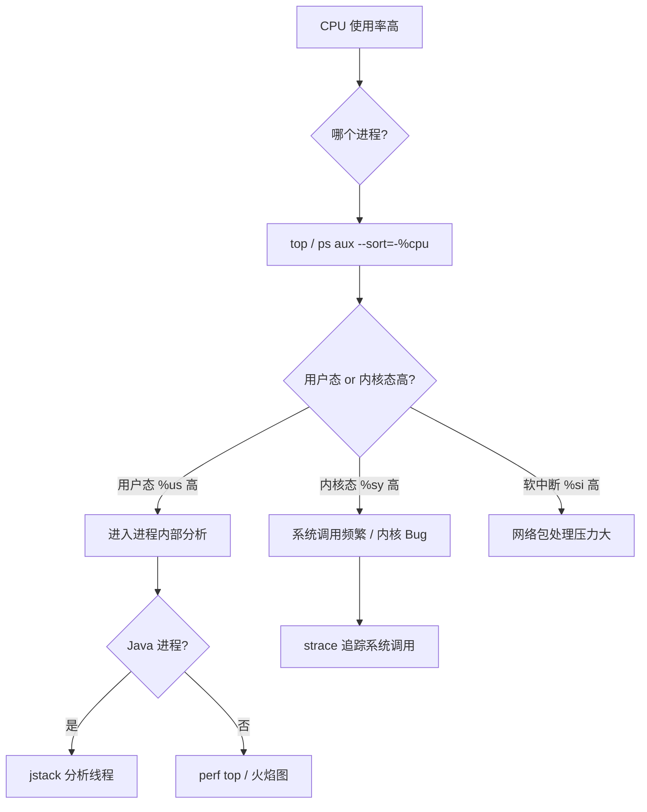

## Linux 线上故障排查方法论

---

## 一、CPU 100% 根因排查

### 1.1 排查流程



### 1.2 Java 进程 CPU 100% 定位

```bash
# 步骤 1：找到高 CPU 的 Java 进程
top -bn 1 | grep java

# 步骤 2：找到该进程内高 CPU 的线程（H 显示线程）
top -H -p <pid>
# 或
ps -T -p <pid> -o pid,tid,pcpu,cmd --sort=-%cpu | head -20

# 步骤 3：将线程 ID（十进制）转换为十六进制
printf "%x\n" <tid>   # 例如：12345 → 3039

# 步骤 4：jstack 获取线程快照，搜索该十六进制 ID
jstack <pid> | grep -A 30 "0x3039"
# 找到对应线程的调用栈，分析是死循环、正则回溯还是 GC 线程

# 快速脚本：自动找高 CPU Java 线程
#!/bin/bash
PID=$(pgrep -f "java.*app.jar")
TID=$(top -H -bn1 -p $PID | awk 'NR>7 && $9>10 {print $1; exit}')
TIDHEX=$(printf "%x" $TID)
echo "高 CPU 线程 TID: $TID (0x$TIDHEX)"
jstack $PID | grep -A 30 "0x$TIDHEX"
```

### 1.3 非 Java 进程 CPU 100%

```bash
# strace：追踪进程系统调用（有性能开销，谨慎用于生产）
strace -p <pid> -c   # 统计各系统调用次数（-c = 汇总统计）
strace -p <pid> -T   # 显示每次调用耗时

# perf：采样调用栈（低开销，生产可用）
perf top -p <pid>
perf record -g -p <pid> sleep 10 && perf report

# 常见高 CPU 场景
# 1. 死循环（while true）→ 持续满载一个核
# 2. 大量正则回溯 → CPU 高 + 线程卡在 regex 相关调用
# 3. GC 线程飙高 → Full GC 频繁（jstat -gcutil <pid> 1000）
# 4. 序列化/反序列化热点 → 火焰图找到具体方法
```

---

## 二、内存问题排查

### 2.1 内存泄漏排查流程

```bash
# 步骤 1：确认内存持续增长
watch -n 10 "free -h; ps aux --sort=-%mem | head -5"

# 步骤 2：确定泄漏进程
# RSS 持续增长（而非 VSZ），且 OOM 后重启又复现

# 步骤 3：Java 内存分析
# 查看堆内存占用趋势
jstat -gcutil <pid> 5000 20   # 每 5 秒输出一次 GC 统计
# 如果 Old 区持续增长且 Full GC 后不降 → 堆内存泄漏

# 导出堆转储
jmap -dump:live,format=b,file=/tmp/heap_$(date +%F).hprof <pid>
# live 参数先触发 Full GC，只导出存活对象

# 用 MAT 分析：找 Retained Heap 最大的对象
# 常见泄漏：ThreadLocal 未 remove、静态 Map 持续增加、监听器未注销

# 步骤 4：非 Java 进程
valgrind --leak-check=full --track-origins=yes ./app  # 开发环境
# 生产：对比 /proc/<pid>/smaps 在不同时间的 anon 段大小变化
```

### 2.2 系统内存不足（OOM）

```bash
# 查看 OOM 历史
dmesg -T | grep -i "out of memory\|oom-kill" | tail -20

# 分析 OOM 选中的进程
dmesg -T | grep "Killed process"

# 查看当前内存压力
cat /proc/meminfo | grep -E "MemAvailable|MemFree|SwapFree|Dirty"

# 找内存大户（按 RSS 排序）
ps aux --sort=-%mem | awk 'NR<=20 {printf "%s\t%s\t%sMB\t%s\n",$1,$2,$6/1024,$11}'

# 查看内核 Slab 是否异常增大
slabtop -s c | head -20   # 按 Cache Size 排序

# 临时释放缓存（谨慎：影响性能）
echo 1 > /proc/sys/vm/drop_caches   # 释放 page cache
echo 2 > /proc/sys/vm/drop_caches   # 释放 slab cache
echo 3 > /proc/sys/vm/drop_caches   # 释放所有缓存
```

---

## 三、磁盘 I/O 瓶颈排查

### 3.1 排查流程

```bash
# 步骤 1：确认 I/O 瓶颈
iostat -x 1 5
# %util 接近 100% 且 await 高（> 20ms for SSD, > 50ms for HDD）→ I/O 饱和

# 步骤 2：找到 I/O 热点进程
iotop -o -d 1

# 步骤 3：找到 I/O 热点文件
# 方法 1：通过文件描述符
ls -la /proc/<pid>/fd | grep -v "pipe\|socket\|anon"
# 方法 2：使用 lsof
lsof -p <pid> | grep REG   # 只显示普通文件

# 步骤 4：追踪具体 I/O 操作（strace）
strace -p <pid> -e trace=read,write,pread64,pwrite64 -c
# 统计各 I/O 系统调用次数和耗时

# 步骤 5：blktrace 精细块设备追踪
blktrace -d /dev/sda -o trace
blkparse trace -i trace -d trace.bin
btt -i trace.bin    # 分析队列延迟、服务时间

# 步骤 6：查看脏页积压（写 I/O 瓶颈）
cat /proc/meminfo | grep Dirty
# Dirty > 1GB 说明写 I/O 跟不上
```

### 3.2 常见 I/O 问题解决

```bash
# 问题 1：日志写入成为瓶颈
# 解法：异步日志框架（Log4j2 AsyncAppender / Logback AsyncAppender）
# 或临时关闭 sync（危险：可能丢日志）

# 问题 2：频繁随机小 I/O（数据库场景）
# 解法：增大 InnoDB buffer pool，利用写缓冲合并 I/O
# 监控：iostat 看 rrqm/s（读合并数）和 wrqm/s（写合并数）

# 问题 3：临时文件爆满（/tmp 或 /var）
df -h   # 查看各分区使用情况
du -sh /tmp/* | sort -rh | head -20

# 问题 4：inode 耗尽（小文件过多）
df -i   # 查看 inode 使用情况
# 找 inode 最多的目录
for i in /*; do echo $(find $i -maxdepth 3 | wc -l) $i; done | sort -rn | head
```

---

## 四、网络问题排查

### 4.1 连接超时 / 连接被拒绝

```bash
# 快速检查
telnet <host> <port>         # 测试 TCP 连通性
curl -v -m 5 http://<host>   # HTTP 层面连通测试
nc -zv <host> <port>         # 更简洁的端口连通测试

# 排查步骤
# 1. 确认服务是否监听
ss -tlnp | grep <port>

# 2. 确认防火墙是否放行
iptables -L -n -v | grep <port>
firewall-cmd --list-all

# 3. 确认连接队列是否满
netstat -s | grep "listen queue"
ss -s

# 4. 查看路由
ip route get <dst_ip>

# 5. 抓包确认 SYN 是否到达
tcpdump -i any host <dst_ip> and port <port> -c 20
```

### 4.2 连接数暴增 / TIME_WAIT 过多

```bash
# 快速统计各状态连接数
ss -tan | awk 'NR>1{print $1}' | sort | uniq -c | sort -rn

# TIME_WAIT 根因：短连接 + 主动关闭方 → 必然产生 TIME_WAIT
# 解法优先级：
# 1. 改用长连接（连接池）
# 2. 服务端让客户端主动关闭（客户端的 TIME_WAIT 不影响服务端新连接）
# 3. 开启 tcp_tw_reuse（仅客户端角色有效）

# CLOSE_WAIT 过多 → 服务端程序 Bug（收到 FIN 后未调用 close()）
# 排查：找对应进程，查代码或 jstack 是否有线程阻塞在 I/O
```

---

## 五、一分钟故障快速定位

```bash
#!/bin/bash
# 60 秒系统健康快速扫描

echo "=== 1. 基本负载 ==="
uptime

echo "=== 2. 内存概况 ==="
free -h

echo "=== 3. 磁盘空间 ==="
df -h | awk '$5+0>80{print}'

echo "=== 4. CPU 高使用率进程 TOP10 ==="
ps aux --sort=-%cpu | head -11

echo "=== 5. 内存高使用率进程 TOP10 ==="
ps aux --sort=-%mem | head -11

echo "=== 6. 磁盘 I/O ==="
iostat -x 1 3 | tail -10

echo "=== 7. 网络连接状态 ==="
ss -s

echo "=== 8. 最近系统错误日志 ==="
journalctl -k --since "10 min ago" | grep -i "error\|warn\|fail\|oom" | tail -20

echo "=== 9. 最近的 OOM ==="
dmesg -T | grep -i "oom\|killed" | tail -5

echo "=== 10. inode 使用率 ==="
df -i | awk '$5+0>80{print}'
```

---

## 六、常用工具速查表

| 场景 | 工具 | 关键命令 |
|:---|:---|:---|
| CPU 使用率 | top/htop | `top -bn1 \| head` |
| CPU 热点函数 | perf | `perf top -p <pid>` |
| 内存概况 | free/vmstat | `free -h` |
| 内存泄漏（Java） | jmap | `jmap -dump:live,format=b,file=h.hprof <pid>` |
| 进程 I/O | iotop | `iotop -o` |
| 磁盘 I/O 统计 | iostat | `iostat -x 1` |
| 网络连接状态 | ss | `ss -s ; ss -tnp` |
| 抓包分析 | tcpdump | `tcpdump -i eth0 port 8080 -w cap.pcap` |
| 系统调用追踪 | strace | `strace -p <pid> -c` |
| 内核函数追踪 | perf/eBPF | `perf trace -p <pid>` |
| 日志分析 | journalctl | `journalctl -u myapp -f` |
| 文件占用 | lsof | `lsof -p <pid>` |
| 进程线程 | ps | `ps -eLf \| grep <pid>` |
