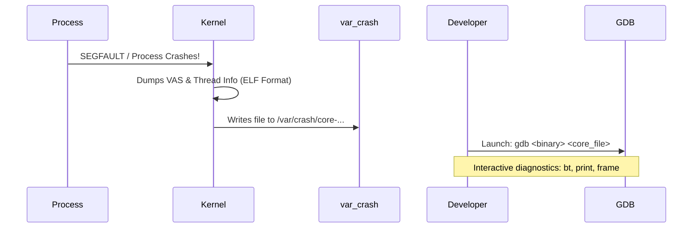

## 恢复与调试概述

在生产环境的高频运转或者底层 C/C++ 业务、系统中间件的高压力运行下，应用可能会遭遇由于内存踩踏、内存越界、死锁等问题导致的不可挽回的主动崩溃。而在内核级别，更有可能由于某些驱动故障或硬死锁引发系统级 **Kernel Panic (内核崩溃恐慌)**。

为了能在事后查明灾难发生的精确第一案发现场，Linux 提供了强大的**崩溃现场转储保全机制**：应用层的 **`Core Dump`**，以及内核级别的 **`KDUMP`**，并配合强大的调试工具 **GDB** 和 **Crash** 完成最高级别的故障溯源调试。

---

## 1. 应用层崩溃转储 (Core Dump) 控制与高吞吐调优

当进程因某些信号（如段错误 `SIGSEGV`，非法指令 `SIGILL`、中断中止 `SIGABRT`）崩溃退出时，内核能将该进程崩溃瞬间的虚拟内存空间、堆、栈区分配、以及寄存器状态和线程序列，完全转录打包保存成一个名为 `core` 的二进制 ELF 格式文件。

### 1.1 核心配置与防丢设计

在生产环境下，如果对 Core Dump 的物理落盘管理粗糙，极易引发存储空间打满、或由于环境对 Core 大小设限导致文件截断而彻底失去调试利用价值。

#### 生产加固步骤

1. **解除容量硬限额限制**（在环境会话配置文件 `/etc/security/limits.conf` 或在服务 Unit 的启动 `LimitCORE=infinity` 中）：

    ```bash
    # 为所有登录运行的用户临时接触限制（设为 unlimited 是允许写任意大小的文件）
    ulimit -c unlimited
    ```

2. **安全自定义输出落盘命名格式与集中规整**：

    默认情况下，Core Dump 会直接散乱保存在崩溃进程工作的当前 Working Directory 下并覆盖重名，造成归档麻烦。更改配置以实现优雅全局命名：
    通过配置内核参数，在 `/etc/sysctl.conf` 下追加自定义命名规范：

    ```ini
    # 设定 Core 文件全部重定向规整至 /var/crash 集中目录，并注入系统参数特征，避免同名文件覆写：
    # %e: 可执行文件名, %p: 崩溃的进程 PID, %t: 崩溃时刻的 unix 时间戳, %s: 引发奔溃的信号信号量
    kernel.core_pattern = /var/crash/core-%e-%p-%t-%s
    # 若配置启用此参数为 1，则所有发生崩溃的多线程子进程在映射时，其 PID 都将展示为最底层主线程 ID 映射
    kernel.core_uses_pid = 1
    ```

    *注意：目录 `/var/crash` 必须被预先创建，并确保有全用户写权限（例如 `chmod 1777 /var/crash`）。*

3. **立即加载刷新生效**：

    ```bash
    sysctl -p
    ```

---

## 2. GDB（GNU 调试器）定位 Core Dump 实操

二进制 Core dump 只能配合带调试符号信息的应用执行。



### 2.1 极速定位段错误 (Segment Fault) 五步走

假设由于 C 代码中发生空指针引用：

```c
int *ptr = NULL;
*ptr = 100; // SIGSEGV (段错误)
```

当程序 `./bad_program` 崩坏并成功输出 `/var/crash/core-bad_program-12345`。

#### 1. 挂载进入调试器

```bash
# 启动 GDB：指定当时的二进制应用的可执行程序，以及收集出来的 Core 镜像
gdb ./bad_program /var/crash/core-bad_program-12345
```

#### 2. 一秒定位具体报错行

```bash
(gdb) bt
# 看到详细调用堆栈 (Call Stack) 类似：
# #0  0x00000000004005b4 in main (argc=1, argv=0x7fffffffe058) at main.c:12
# 此时，第 12 行 main.c 即被内核牢牢抓获为破坏元凶。```

#### 3. 溯源变量内部取值状态
```bash
# 切换堆栈至对应受害Frame层次中（例如 #0 是第0层执行栈）
(gdb) frame 0

# 打印致命参数及其当时内部的内存数值：
(gdb) print ptr
# 输出：$1 = (int *) 0x0
# 彻底真相大白：发现 ptr 内部的确等于 NULL！```

#### 4. 查看发生异常指令处的汇编还原（如果源码不在场时可用）
```bash
(gdb) disassemble
# 发现箭头指向： movl $0x64, (%rax)  # 即：试图往寄存器 rax 保存的地址（0x00）写入值(100) 导致物理缺页出错，芯片产生硬件软硬件中断保护```

#### 5. 优雅退出 GDB
```bash
(gdb) quit```

---

## 3. 内核级崩溃现场保护：KDUMP 核心工作流

在一些极端由于内核模块、内存保护机制不一致或者底层磁盘驱动产生故障时，整个宿主机内核可能立即发生 `Kernel Panic`，甚至锁死中断。由于整个当前内核协议栈已发生重创，系统无法指望其运行当前内核的文件系统进行 I/O 保存 Core，因为底层写可能触发更大规模的数据损坏。

为了实现零风险的内核 Panic 转储，Linux 独创了 **`KDUMP`** 崩溃双内核保护技术机制。
``
`mermaid
graph TD
    subgraph RAM [Physical System RAM]
        subgraph Normal_Kernel [1. Primary Production Kernel]
            User_App[Database/User App Runs]
            Kernel_Core[Production Kernel Code]
        end
        subgraph Reserved_RAM [2. Crash Kernel Pre-Reserved Area]
            Mini_Kernel[Kdump Crash-capture Kernel]
            M_initrd[Minimal Initrd System + makedumpfile]
        end
    end

    Normal_Kernel -->|System Panic / Death| Crash_Event[CPU executing kexec_crash]
    Crash_Event -->|Instant takeover without HW reset| Reserved_RAM
    Reserved_RAM -->|Write Raw Image| Disk_Crash[Write /var/crash/vmcore]```

### 3.1 kdump 核心组件构成
- **生产主执行内核 (Production Kernel)**：正常的 CentOS / Ubuntu 的业务运转系统的当前内核。
- **崩溃捕获次内核 (Crash-capture Kernel)**：由 `kexec` 在内核引导阶段（如配置引导加载项中）预留的一段物理内存区（例如 `crashkernel=256M`）。这个位置放着一个精简的、自带微小磁盘驱动及内存操作协议的物理内核镜像。
- **`kexec` 底层跳转**：kdump 极度核心的内核功能。当生产内核发生 Panic、或是通过硬件 NMI 中断强制崩溃（NMI watchdog 认定死锁）时，CPU 会**跳过所有标准硬件重启、主板 BIOS 引导检测动作（防止现场数据由于硬件复位被清除）**，由内核直接将 CPU 的执行上下文和寄存器控制权**瞬时秒级平滑平移切换**到崩溃捕获内核的引导加载区中。

### 3.2 实战：Kdmp 在 CentOS/RHEL 的完整极速配置路径

1. **预配置内核引导保留物理容量**：

    修改系统启动引导文件 `/etc/default/grub`，在内核初始化属性 `GRUB_CMDLINE_LINUX` 中尾部追加声明所锁死的崩溃内核独享区大小：

    ```bash
    # 为抓取内核独占 256M 专用内存空间
    GRUB_CMDLINE_LINUX="crashkernel=256M elevator=noop rhgb quiet"
    ```

2. **更新并生成最新引导镜像**：

    ```bash
    grub2-mkconfig -o /boot/grub2/grub.cfg
    ```

3. **完成配置内核捕获后的写盘控制**：

    在配置文件 `/etc/kdump.conf` 设定发生崩溃后如何归档和压缩输出：

    ```ini
    # 发生 Panic 后将 vmcore 二进制保存至本地磁盘下的这个目录下
    path /var/crash

    # makedumpfile 工具过滤掉冗余内核内存页调优设定：
    # -d 31: 过滤零页、空闲物理页、缓存、用户态物理页，将原本 128G 的内核内存瞬间压缩精简到仅数百M大，加快落盘
    core_collector makedumpfile -l --message-level 1 -d 31
    ```

4. **启动服务并注册内核崩溃钩子**：

    ```bash
    # 启动并配置开机自启动
    systemctl start kdump.service
    systemctl enable kdump.service
    ```

5. **严禁在生产中执行：强制手段，检验一键触发崩溃**

    一旦确认部署完毕且需要真实检验捕获配置是否正常：

    ```bash
    # 通过 Linux 魔术键 SysRq，直接在物理层面朝内核注入 Null 指针崩坏：
    echo 1 > /proc/sys/kernel/sysrq
    echo c > /proc/sysrq-trigger
    # 此时，系统控制台可能卡顿，随后主板不灭，直接跳出 Kdump 的 Kexec 打印，并在 /var/crash 下落出一个 `vmcore` 精典镜像并成功自动重启。
    ```

---

## 4. Crash 工具高级定位内核 Panic

一旦收集到内核崩溃生成的物理快照后，普通 GDB 已无法对整个复杂的系统进程、网络槽、模块进行解析，必须采用专用的 **`Crash`** 调试分析工具。

### 4.1 挂载内核符号及 vmcore

```bash
# 启动 crash 分析，必须传入当时的内核符号文件（若缺少需要事先安装 kernel-debuginfo 包）以及那个 vmcore 的物理大镜像
crash /usr/lib/debug/lib/modules/$(uname -r)/vmlinux /var/crash/127.0.0.1-20260721/vmcore
```

### 4.2 诊断常用高阶指令集表格

一旦挂载成功，进入 crash 交互行界面，以下三板斧指令可绝杀绝大部分内核段错误死锁：

| 交互诊断命令 | 语义及核心数据排查方法 | 生产排查神功演示 |
| :--- | :--- | :--- |
| **`sys`** | 展示当时系统崩溃时刻的最底层系统概要信息。 | 直接显示当时是什么原因导致的崩溃（例：`PANIC: "BUG: unable to handle kernel NULL pointer dereference at 0000000000000010"`）。 |
| **`bt`** | **最核心第一命令**。一键抓取崩溃瞬间所有核心上运行的系统级内核函数的完全调用栈。 | 可以看到当时是哪个驱动、或者是调了哪些底层 `vfs_write` 函数发生了内存地址异常，直接找出最上层爆掉的模块名。 |
| **`ps`** | 打印发生 Panic 的那一刻，系统内存中存留的所有进程的层级链。 | 用 `>` 标记出在崩溃一瞬间正在被 CPU 执行调度、真正引发了 Panic 的那一个进程名称及它的 pid 宿。 |
| **`files`** | 打印指定进程下的打开文件描述符及节点指向。 | 查看当时是不是由于进程写了错误的、破损的设备虚拟文件。 |
| **`dmesg`** | 从 vmcore 中，直接将当时由于内核挂掉而未能落盘、只驻留在内核 ring buffer 环上的最后日志彻底打印还原。 | 直接看到最后几句内核驱动所报警和抛出的底层驱动致命错误警告。 |
| **`log`** | 汇总并显示近半个小时内核的 Dmesg 缓冲区全轨迹。 | 帮助观察内核是不是频繁发生内存超限导致硬件驱动连锁锁中断。 |
