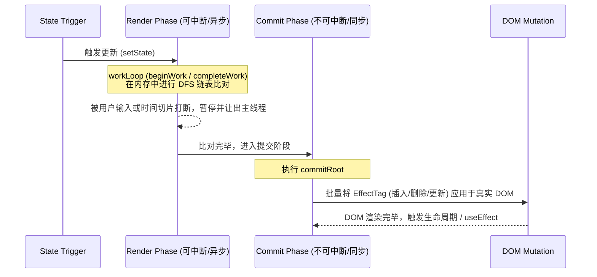

# Fiber 架构剖析

React 16 引入的 **Fiber 架构**是其底层渲染引擎的一次彻底重构。它将 React 从传统的同步渲染框架，升级为支持可中断渲染、并发调度的现代化引擎。要成为一名高级/资深 React 开发者，深刻理解 Fiber 的设计与运行机制是不可或缺的。

---

## 1. 传统 Stack Reconciler 的瓶颈

在 React 15 及以前，React 的比对过程 (Reconciliation) 是基于类似操作系统的**同步函数调用栈 (Call Stack)** 进行的，被称为 **Stack Reconciler**。

### 为什么 Stack Reconciler 会导致卡顿？

1. **递归过程无法中断**：一旦执行 `setState` 触发更新，React 会从根节点开始，通过深度优先遍历（DFS）递归地对整棵 Virtual DOM 树进行比对并同步更新 DOM。
2. **主线程被独占**：如果页面非常复杂，组件层级过深，这个递归过程可能会持续几十甚至上百毫秒。在此期间，浏览器的主线程完全被 JavaScript 独占，无法响应用户的点击、输入事件，也无法进行帧重绘，导致界面出现明显的丢帧（掉下 `16.6ms` 的黄金及格线）和卡顿。

---

## 2. 什么是 Fiber？

“Fiber” 这个词在英文里是“纤维”的意思。在 React 中，它代表着：
1. **一个执行单元**：每次处理一个 Fiber 节点，React 会检查是否还有剩余时间，有则继续，无则把控制权交还给浏览器。
2. **一种数据结构**：它是一个虚拟栈帧，保存了组件的类型、对应的 DOM 节点、状态以及要执行的工作。

### Fiber 节点的数据结构

React 将树状结构的 Virtual DOM 拍平，转换为以 `child`（第一个子节点）、`sibling`（右侧第一个兄弟节点）和 `return`（父节点）为指针连接的**单链表**结构：

```typescript
type Fiber = {
  // 1. 组件元数据
  tag: WorkTag;                  // 标识 Fiber 的类型（函数组件、类组件、原生 DOM 节点等）
  type: any;                     // 原生标签名（如 'div'）或自定义组件类/函数
  stateNode: any;                // 对应的真实 DOM 节点或 class 组件实例

  // 2. 指向其他 Fiber 节点构建链表树
  return: Fiber | null;          // 指向父 Fiber 节点
  child: Fiber | null;           // 指向第一个子 Fiber 节点
  sibling: Fiber | null;         // 指向右侧第一个兄弟 Fiber 节点
  index: number;                 // 兄弟节点中的索引位置

  // 3. 状态与工作队列
  memoizedState: any;            // 组件的状态（在函数组件中指向 Hook 链表）
  updateQueue: mixed;            // 存放待执行更新的队列
  memoizedProps: any;            // 上一次渲染时的 props
  pendingProps: any;             // 这一次渲染传入的最新 props

  // 4. 并发与优先级
  lanes: Lanes;                  // 当前 Fiber 上的任务优先级标记
  childLanes: Lanes;             // 子树上的任务优先级标记

  // 5. 双缓冲树的备用节点
  alternate: Fiber | null;       // 指向另一棵树上对应的 Fiber 节点
};
```

通过这套单向链表，React 可以不需要借助 JS 自身的递归调用栈，而是纯手工用 `while` 循环遍历节点。因为指针在内存里是持久化的，遍历过程随时可以停下来，记录下断点，下次空闲时再继续往下走。

---

## 3. 双缓冲树机制 (Double Buffering)

为了避免在比对过程中，用户看到不完整的、残缺的 UI 渲染效果，React 在内存中同时维护了两棵 Fiber 树，这被称为**双缓冲树**机制。

1. **Current Tree（当前树）**：代表当前正呈现在屏幕上的 UI 对应的 Fiber 结构。
2. **WorkInProgress Tree（WIP 树，工作草稿树）**：当有状态更新发生时，React 会在内存中以 Current 树为蓝本，暗暗计算并构建出一棵全新的 WIP 树。

两棵树的对应节点通过 `alternate` 属性互相指向：

```text
  [Current Fiber Node]  <--- alternate --->  [WIP Fiber Node]
```

当整个 WIP 树在内存中构建、比对完毕后，React 会在瞬间将根节点的指针指向 WIP 树，使其成为最新的 Current 树。这种无感切换就像显卡渲染画面时的双缓冲技术，保证了界面的流畅度。

---

## 4. Reconciliation 协调的两个核心阶段

更新过程被划分为两个截然不同的阶段：**Render 阶段（渲染阶段）** 和 **Commit 阶段（提交阶段）**。



### 1) Render 阶段：构建与比对（可中断）

Render 阶段的主要任务是构建 WIP 树，并计算出哪些 DOM 节点需要被更新，为它们打上副作用标记（`flags`/`effectTag`，如 Placement、Update、Deletion）。

#### 工作循环：workLoop

```javascript
function workLoopConcurrent() {
  // 只要还有工作，并且当前帧还有剩余时间，就继续执行
  while (workInProgress !== null && !shouldYield()) {
    performUnitOfWork(workInProgress);
  }
}
```

#### performUnitOfWork：双向工作流

在遍历每个 Fiber 节点时，有“递”和“归”两个步骤：

- **“递” 阶段 —— beginWork**：
  - 自顶向下。
  - 比较新旧 props 和 state，决定该组件是否需要更新。
  - 创建或复用子 Fiber 节点，并将其挂载在当前节点上。
- **“归” 阶段 —— completeWork**：
  - 自底向上。
  - 当一个节点的所有子节点都处理完毕后，执行 `completeWork`。
  - 如果是原生 DOM 组件，会在此处创建对应的真实 DOM 节点（如果初次挂载），或者计算出属性的变化集（Update Queue）。
  - 将子节点的副作用标记向上冒泡合并到父节点。

### 2) Commit 阶段：执行变更（不可中断）

一旦 Render 阶段完成，WIP 树构建完毕，React 会拿到一棵带有完整副作用标记的 WIP 树，然后进入 Commit 阶段。

Commit 阶段是**绝对同步、不可中断**的，因为这个阶段会直接修改真实的 DOM 树。如果在此处中断，用户就会在屏幕上看到半截渲染的残破界面。

#### Commit 阶段的三个子阶段

1. **Before Mutation 阶段**：DOM 节点被实际修改前，触发 `getSnapshotBeforeUpdate` 等生命周期。
2. **Mutation 阶段**：遍历所有副作用标记，执行真实的 DOM 插入、更新、删除操作。
3. **Layout 阶段**：DOM 修改完毕。此时可以安全读取最新的 DOM 属性，触发 `useLayoutEffect`、生命周期回调，并安排 `useEffect` 的异步调用。

---

## 5. Fiber 与时间切片 (Time Slicing)

可中断渲染的基础是**时间切片**。在 Concurrent 模式下，React 会向浏览器申请“空闲时间（RequestIdleCallback / MessageChannel）”。

在每一帧的 16.6ms 内：
1. 浏览器先处理输入事件、执行 JS、计算样式和布局、进行重绘。
2. 结束后如果还有富余时间（比如 5ms），浏览器会将控制权交给 React。
3. React 执行 `workLoopConcurrent`，利用这 5ms 进行比对。
4. 一旦 5ms 用完，`shouldYield()` 返回 `true`，React 立即暂停 WIP 树的遍历，保存当前正在比对的 Fiber 节点指针，让出主线程给浏览器。
5. 下一帧空闲时，React 再从保存的节点继续往下比对。

通过这种“细粒度切片 + 优先级调度（Lanes 模型）”，React 保证了即使在极端庞大的组件树下，页面依然能够对用户的输入和操作保持秒级响应。
