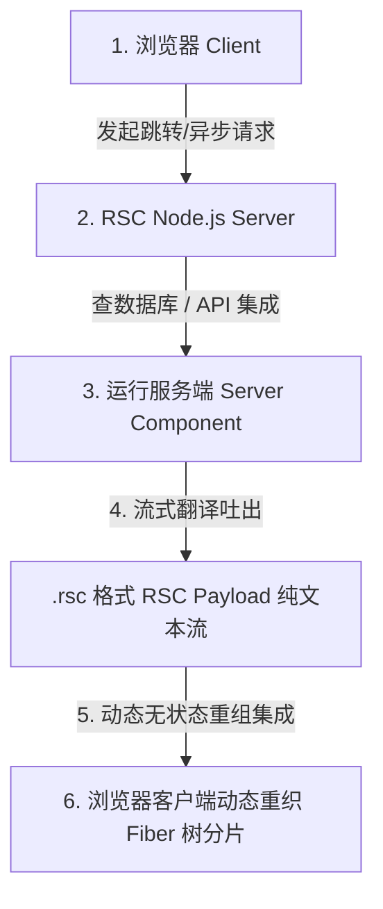
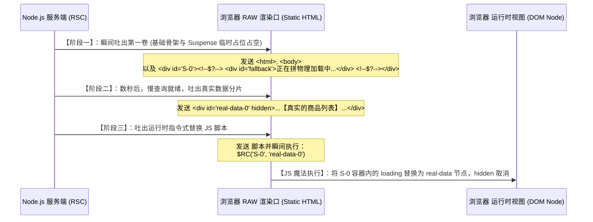
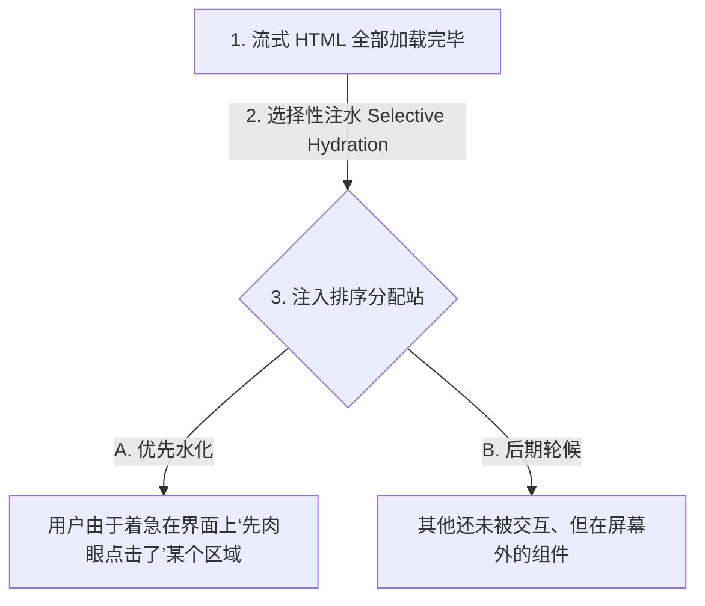
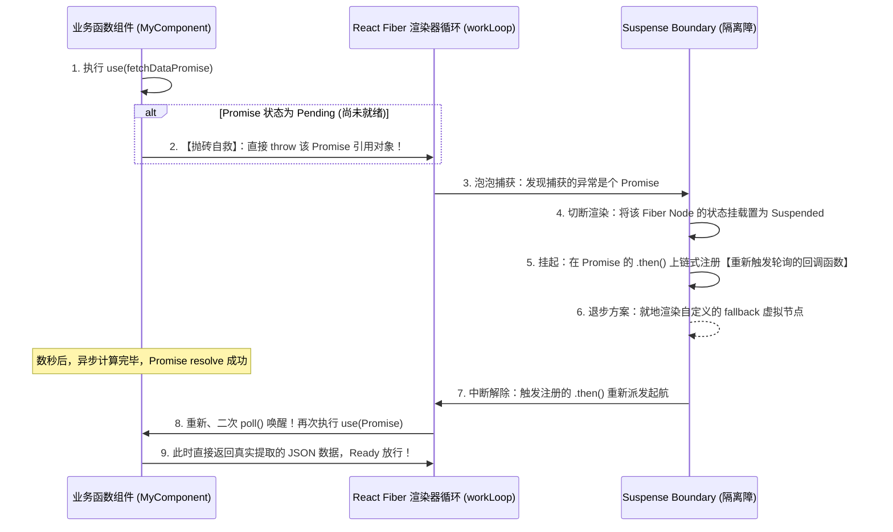

## React 19 进阶：RSC 协议、流式渲染（Streaming HTML）与 Suspense 挂起底层机制

在 React 的早期服务端渲染（SSR）中，系统执行的是整体、同步的 **“全量渲染”**：
1. 服务端一次性将所有组件渲染成纯静态 HTML 页面（此时页面无交互性）；
2. 浏览器下载并渲染此庞大 HTML 文件（此时用户在屏幕上看到静态内容，但点击无反应）；
3. **全量下载 JavaScript Bundle** 后，浏览器执行 **全量注水（Hydration）**（将 JavaScript 事件处理程序与 DOM 节点重新绑定，使页面具备交互能力）。

这一老旧架构存在致命的 **“全或无（All-or-Nothing）”瓶颈**：只要任何一个小卡片（如推荐商品列表）的后台 SQL 变慢，整整一页 HTML 就会处于挂起状态卡死传输，导致用户看到长时间白屏；且必须等待全量 JS 字节包下载完毕才能开始 Hydration，严重拖慢首屏可交互时间（TTI）。

为了彻底打碎这一技术壁垒，React 18-19 精心引入了 **React Server Components (RSC，服务端组件) 模型**、**流式 HTML 渲染（Streaming HTML）** 与 变革性的 **Suspense 挂起与 Selective Hydration（选择性注水）内核**。

---

## 一、 RSC 协议深度拆解：RSC Payload 流式格式

RSC 允许将部分的轻量无状态组件完全禁锢在 Node.js 服务端进行纯编译运算，只把计算结果输送给客户端，从而物理、强力地减少客户端打包体积（Bundle Size）。

RSC 服务端计算返回给浏览器的，并不是 HTML 字符串，而是一种专有的、面向流式排布的数据协议： **RSC Payload（.rsc）**。



### 1. 真实 RSC Payload 数据格式透视

如果我们查看网络传输面板（Content-Type 为 `text/x-component`），会看到形如这样的流式明文数据：

```text
M1:{"id":"/client-app.js","chunks":["client-app"],"name":"ProductCard"}
J0:["$","div",null,{"className":"container","children":[["$","h1",null,{"children":"商城列表"}],["$","@1",null,{"productId":"1001","price":"$99"}]]}]
```

我们对这套精妙的紧凑树协议格式进行高能拆解：
* **`M` 系列（Module Reference，客户端组件镜像注册引用）**：
  * **`M1`**：声明该位置引用了一个客户端组件（Client Component）。它强行指定了 JavaScript 的线上 CDN 地址 `client-app.js` 及其对应的打包分片名 `ProductCard`。它并不传输具体代码。
* **`J` 系列（JSON-like UI 虚拟节点树分片描述）**：
  * **`J0`**：代表整棵树的结构映射（虚拟 DOM 描述分片）。
  * **`$`**：指代一个 React 要素（或一个 Fiber 节点元数据）。
  * **`@1`**：**重磅奥义！它是一个高能引用符指针。指代前面声明的 `M1` 客户端组件实例。**
  * 浏览器接收到 J0 行时，只要读取到 `@1` 这一指针，就会自动在对应的位置留空并拉起浏览器并行下载 `client-app.js` JS 字节包，随后将其套进 J0 指定的容器内正确渲染。

---

## 二、 突破性的流式 HTML 协议（Streaming HTML）

流式渲染不再等候全站就绪，它利用 HTTP 标准传输协议中的 **`Transfer-Encoding: chunked`（分卷传输）**，像剥洋葱一样，在同一个物理连接中，先后将计算完毕的 HTML 分块拼装吐出给浏览器。

### 1. 流式时空流转步轨

当网页中有慢速慢数据组件（被 `Suspense` 包裹）时，其流式渲染经历了以下三个精密的时空步轨：



### 2. 脚本替换的底层自愈：核心 `$RC` 指令

当我们在网络包最末端看到来自服务端的注入脚本：

```html
<script>$RC('S-0', 'real-data-0')</script>
```

这里的 `$RC` 是 **`ReactComplete`** 的缩写：
1. 浏览器内的 React 骨架程序在收到此 HTML 片段并载入 `script` 时，立刻就地同步解释执行。
2. 该函数直接执行原生 DOM 操作：

   ```javascript
   function $RC(placeholderId, dataId) {
       var placeholder = document.getElementById(placeholderId);
       var data = document.getElementById(dataId);
       if (placeholder && data) {
           placeholder.replaceWith(data); // 物理元素极速替代
           data.removeAttribute('hidden'); // 显示视图
       }
   }
   ```

3. 这个物理替换是在**没有任何 JS 运行时体积和 React Hydration 执行的前提下，纯靠内嵌极小原生 JS 跑完的**。也就是说，用户在全量 React 代码还未下载前，其眼前的 Loading 已经无缝地变成实物商品，体感速度提升数倍！

---

## 三、 选择性注水（Selective Hydration）高能架构

即使客户端收到了流式传递来的零星 HTML 结构，如果没有 JS 的绑定绑定，页面依然无法进行交互。
传统的 SSR 会执行“同步全包水洗（Block Hydration）”阻塞。React 19 通过 **选择性注水 (Selective Hydration)** 切断了这一瓶颈。



### 1. 优先级夺取原理：`onPaint` 的临时重击

如果在全站 JS 包下载完毕、正准备对整个页面进行低优先级的深度 Hydration 时，用户突然用鼠标先去点击了处于页面下半部分的“评论框卡片”（该区正处于 Suspense 等待水化排队进程中）。
1. React 19 在该卡片的外层挂载了**全局捕获阶段的事件监听监听处理器**。
2. 当拦截到用户的 `Click` 点击动作时，React 判定这是一个紧急事件，立刻**中断当前正在进行的、其他非关键区域的 Hydration 算力**。
3. 强行将该评论框对应的 Fiber 状态机的优先级在车道管理器（Lane）中拉至 **`SyncLane`（同步最高优先级车道）**。
4. 抢先给这部分 HTML 注入执行事件，完成局部水解。
5. **在 10 毫秒内，用户完成了对该评论框的数据输入动作**，对首屏其他地方的延迟毫无知觉！

---

## 四、 变革：`Suspense` 抛出并捕获 Promise 时的 Fiber 挂起重建原理

在 React 开发或面试中，我们经常需要在组件中直接通过类似 `use()` 新特写来读取异步 Promise：

```javascript
// React 19 动态非阻塞读取
const data = use(fetchDataPromise);
```

要弄清楚这个组件在第一次加载时，是如何能够“瞬间中断并等候、且在数据到来时自愈恢复”的，我们必须精剖 **Fiber 挂起重建底层实现**。

### 1. 极致底层捕获机制：Fiber Suspended Pipeline



### 2. 挂起断裂自愈伪代码内核深度揭秘

在 React 的 Fiber 循环逻辑（`workLoopConcurrent`）中，对该 “Throw-and-Retry（抛出与重试）” 架构的处理极其精妙：

```javascript
function renderWithHooks(current, workInProgress, Component, props, nextRenderLanes) {
    try {
        // 执行函数内质，触发 Hook 链表
        return Component(props);
    } catch (thrownValue) {
        // 关键底层处理拦截！
        if (typeof thrownValue === 'object' && thrownValue !== null && typeof thrownValue.then === 'function') {
            // 这不是一个普通的 JS 代码常规报错，而是一个【未决异步的 Promise】！
            var suspensyPromise = thrownValue;
            
            // 1. 将当前的 Fiber 节点与该 Promise 进行深度指针挂载，标志为 Suspended 状态
            workInProgress.flags |= NeedToSuspend;
            
            // 2. 将运行时 Waker 钩子通过 then 链挂载进去：
            suspensyPromise.then(
                function() {
                    // 当异步资源到手 resolution 时，重新向当前的这部分 Lane 派发高优先级重刷调度
                    ensureRootIsScheduled(root, now());
                }
            );
        }
        // 重新向外抛出，让外层的 Suspense 隔离界限组件捕获，以便转入 fallback 视图
        throw thrownValue;
    }
}
```

这正是 React 19 彻底重构、最引以为傲的“零摩擦异步感知底座”。它让复杂的跨网络多级数据延迟加载，优雅地化简为在内核层面通过 Fiber 标志位进行挂起和 self-retry 唤醒。理解、掌握这套流式协议与 Selective Hydration 架构，是现代大前端平台工程师通往顶阶技术之巅的必备圣经。
