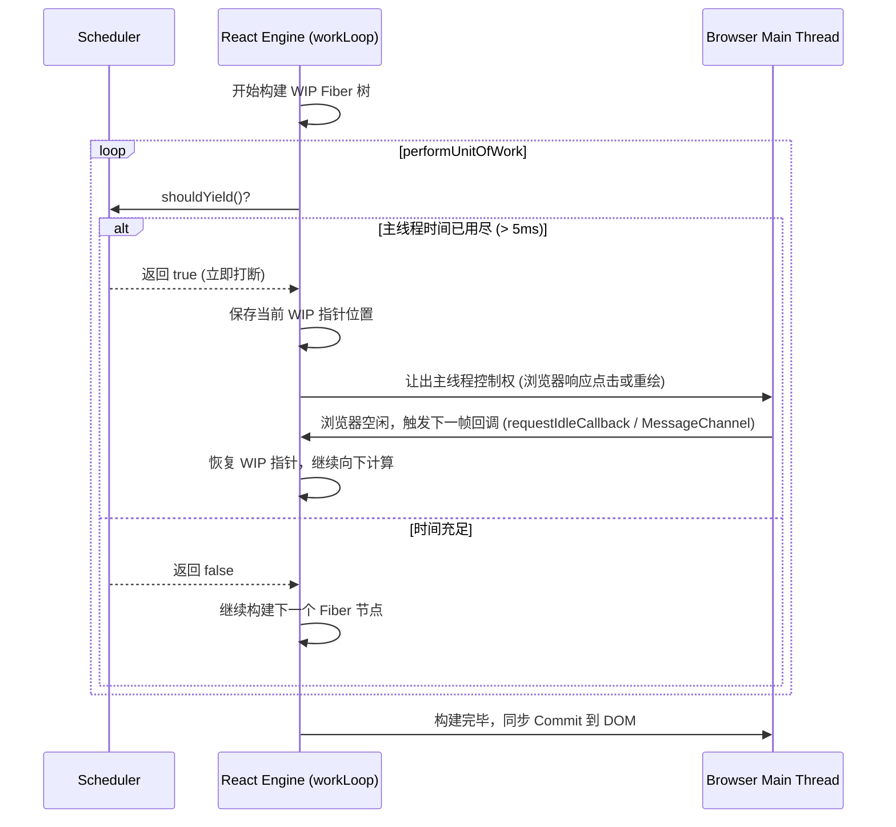

# 并发模式与时间切片

并发模式（Concurrent Mode）是现代 React（React 18+）最底层的运行架构。它颠覆了原本“一旦开始、必须同步完成”的渲染模式，让 React 能够“在多项任务之间切换调度”，并根据任务优先级来中断或恢复页面的更新，从而为用户提供极其流畅的交互体验。

---

## 1. 为什么需要并发模式？

在传统的同步更新模式下，如果执行了一个计算量极其庞大的页面重渲染：
- 渲染线程一旦启动就会霸占主线程，直到所有组件渲染完毕。
- 用户在此期间的所有点击、滚动、输入事件都会被挂起排队，导致浏览器出现几百毫秒甚至数秒的卡顿假死。

并发模式的核心目标是**解决 CPU 瓶颈与 I/O 瓶颈**。它的核心策略是：
1. **时间切片 (Time Slicing)**：将单一长渲染任务切碎为多帧微型子任务。
2. **优先级调度 (Priority-based Scheduling)**：根据任务的紧急程度决定谁先执行，且高优先级的任务可以打断正在执行的低优先级任务。

---

## 2. 优先级标尺：Lane 模型 (The Lane Model)

在 React 16 中，任务优先级采用的是 **ExpirationTime（过期时间）** 模型，数值越小代表优先级越高。但这一模型无法直观地表达“任务批处理、任务组合”的场景。

React 17 起全面引入了 **Lane 模型**。Lane 意为“车道”，React 使用了一个 **32 位二进制的整型数（Bitmask）** 来代表任务的优先级和类别。

### Lane 优先级位图划分（简化版）

每个“车道”都是二进制中的一位（1 bit）：

```typescript
// 💡 Lane 优先级位图常量定义
export const NoLanes: Lanes =             0b0000000000000000000000000000000;
export const SyncLane: Lane =             0b0000000000000000000000000000001; // 同步车道（如输入框即时反馈、flushSync）
export const InputContinuousLane: Lane =  0b0000000000000000000000000000010; // 连续输入车道（如滚动、拖拽）
export const DefaultLane: Lane =          0b0000000000000000000000000010000; // 默认车道（如普通的 setState 状态修改）
export const TransitionLane: Lane =       0b0000000000000000000000001000000; // 转换车道（如 startTransition、useDeferredValue）
export const OffscreenLane: Lane =        0b1000000000000000000000000000000; // 后台/离屏车道（如隐藏的 Tab 预加载）
```

### Lane 模型的位运算应用

因为使用了二进制表示，React 可以极其快速、轻量地通过 **位运算** 来合并、剥离或筛选出高优先级的任务车道：

```javascript
// 1. 合并两个车道的任务（位或操作）
const mergedLanes = laneA | laneB;

// 2. 判断某个车道是否在待处理集合中（位与操作）
const isLaneContained = (mergedLanes & SyncLane) !== 0;

// 3. 提取出当前最高优先级的单个车道（获取二进制中最低位的 1：lanes & -lanes）
const highestPriorityLane = mergedLanes & -mergedLanes;
```

---

## 3. 并发更新中断与恢复流程 (Reconciliation Interruption)

并发模式的核心奥秘在于 `workLoopConcurrent` 循环。当 React 渲染一个组件时，会调用 Scheduler（调度器）来判断是否需要把主线程控制权归还给浏览器。



### 并发任务打断的完整场景

1. **低优先级渲染启动**：用户点击“加载更多商品”，触发 `DefaultLane` 更新。React 启动 `workLoopConcurrent` 在内存中慢慢计算。
2. **紧急任务突袭**：计算到一半时，用户在搜索框里输入了一个字母，触发 `SyncLane` 更新。
3. **调度器决策**：Scheduler 检测到有高优先级的 `SyncLane` 挂起，且 `SyncLane < DefaultLane`（优先级高于默认车道），立刻强行打断当前 WIP 树的计算。
4. **优先处理紧急任务**：React 丢弃或挂起刚才计算到一半的低优先级 WIP 树，重新以最新输入值构建一棵全新的 `SyncLane` WIP 树，并以最快速度 Commit 到真实 DOM，呈现用户的输入反馈。
5. **恢复低优先级任务**：紧急任务渲染完毕后，Scheduler 在下一次空闲时间里，重新安排并恢复低优先级 `DefaultLane` 任务的计算。

---

## 4. 并发 API：useTransition / startTransition 与 useDeferredValue

并发模式的底层原理为我们提供了几个可以显著提升页面流畅度的 API：

### 1) startTransition 与 useTransition 的应用与原理解析

在 React 18+ 中，非紧急更新的过渡任务可以通过两种方式开启：
- **`startTransition` 函数**：直接导入的独立函数。当你在非 React 组件树内部（例如在第三方状态管理器订阅中，或普通的 utility 函数里）想要触发过渡更新时使用。
- **`useTransition` Hook**：在 React 函数组件内使用的首选 Hook，它不仅包含 `startTransition`，还能够智能返回过渡任务的执行状态。

#### 💡 核心示例：useTransition 捕获加载状态

`useTransition` 返回一个包含两个成员的数组：
1. `isPending`：布尔值，指示过渡更新的 Promise 或任务是否还在挂起、计算中。
2. `startTransition`：用于启动过渡任务的函数包装器。

```tsx
import { useState, useTransition } from 'react';

function TabContainer() {
  const [tab, setTab] = useState('about');
  // isPending 会在非紧急更新渲染计算期间自动置为 true
  const [isPending, startTransition] = useTransition();

  const selectTab = (nextTab: string) => {
    // 启动非紧急更新
    startTransition(() => {
      setTab(nextTab);
    });
  };

  return (
    <div>
      <div className="tab-buttons">
        <button onClick={() => selectTab('about')}>关于</button>
        <button onClick={() => selectTab('posts')}>
          博客文章 (内含上万个 DOM 节点的重渲染)
        </button>
      </div>
      
      {/* 渲染 Pending 提示，避免页面完全假死且没有任何交互反馈 */}
      {isPending && <div className="loading-spinner">正在渲染大数据视图中...</div>}
      
      <div style={{ opacity: isPending ? 0.6 : 1 }}>
        {tab === 'about' && <AboutTab />}
        {tab === 'posts' && <ExpensivePostsTab />}
      </div>
    </div>
  );
}
```

### 2) useDeferredValue 的应用与原理解析

`useDeferredValue` 接受一个值，并返回该值的一个“延迟版本”。它非常适用于：你无法直接控制状态修改的来源（如数据直接来自于 Props），但依然希望推迟其渲染以防页面假死的场景。

```tsx
import { useState, useDeferredValue } from 'react';

function ProductList({ rawData }: { rawData: string[] }) {
  // 获取数据的延迟副本。当 rawData 频繁变化时，deferredData 会滞后更新，优先保证首屏渲染流畅
  const deferredData = useDeferredValue(rawData);

  return (
    <div className="list-container">
      {deferredData.map((item, i) => (
        <div key={i} className="list-item">{item}</div>
      ))}
    </div>
  );
}
```
