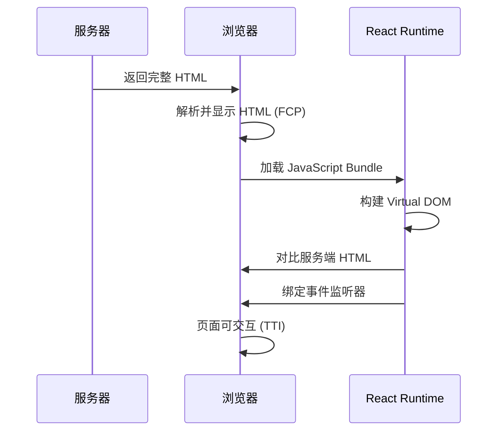

# SSR/SSG 架构与 Hydration 机制

服务端渲染 (SSR) 与静态站点生成 (SSG) 是现代 React 应用的重要渲染模式。本文将深入剖析两种模式的区别、Hydration 注水机制以及常见错误的防范策略。

---

## 1. 渲染模式对比

### CSR (Client-Side Rendering)

**工作流程**：

1. 服务器返回空白的 HTML 壳
2. 浏览器下载 JavaScript Bundle
3. React 在客户端完整渲染整个应用

```html
<!-- 服务器返回的 HTML -->
<!DOCTYPE html>
<html>
  <head>
    <title>My App</title>
  </head>
  <body>
    <div id="root"></div>
    <script src="/bundle.js"></script>
  </body>
</html>
```

**优势**：
- 服务器压力小
- 开发体验简单

**劣势**：
- 首屏加载慢（白屏时间长）
- SEO 不友好
- TTI (Time to Interactive) 时间长

### SSR (Server-Side Rendering)

**工作流程**：

1. 服务器执行 React 渲染，生成完整 HTML
2. 浏览器接收带内容的 HTML，立即显示
3. JavaScript 加载完成后进行 Hydration（注水）

```html
<!-- 服务器返回的 HTML -->
<!DOCTYPE html>
<html>
  <head>
    <title>My App</title>
  </head>
  <body>
    <div id="root">
      <h1>Hello World</h1>
      <p>This is server-rendered content</p>
    </div>
    <script src="/bundle.js"></script>
  </body>
</html>
```

**优势**：
- 首屏加载快（FCP 优化）
- SEO 友好
- 社交媒体分享预览完美

**劣势**：
- 服务器压力大
- TTFB (Time to First Byte) 可能较慢
- 开发复杂度高

### SSG (Static Site Generation)

**工作流程**：

1. 构建时（Build Time）预渲染所有页面为静态 HTML
2. 部署到 CDN
3. 用户访问时直接返回静态 HTML
4. JavaScript 加载后进行 Hydration

**优势**：
- 性能最优（CDN 直接返回）
- 服务器压力最小
- SEO 完美

**劣势**：
- 只适合内容不频繁变化的页面
- 构建时间可能很长（大量页面）
- 动态内容需要客户端获取

---

## 2. Hydration 注水机制

### 什么是 Hydration？

Hydration 是指在服务端已经渲染好的 HTML 基础上，React 在客户端"激活"这些静态内容，绑定事件监听器和状态管理。



### Hydration 的底层原理

```tsx
// 服务端渲染
import { renderToString } from 'react-dom/server';

function App() {
  return <button onClick={() => alert('clicked')}>点击我</button>;
}

const html = renderToString(<App />);
// 生成：<button>点击我</button>（注意：没有事件监听器）

// 客户端 Hydration
import { hydrateRoot } from 'react-dom/client';

const root = document.getElementById('root');
hydrateRoot(root, <App />);
// React 会：
// 1. 对比服务端生成的 HTML 与客户端 Virtual DOM
// 2. 如果匹配，复用现有 DOM 节点
// 3. 绑定事件监听器（onClick）
```

---

## 3. Hydration 错误与防范

### 常见错误 1：服务端与客户端内容不一致

```tsx
// ❌ 错误示范：使用客户端专属 API
function Component() {
  return (
    <div>
      当前时间: {new Date().toLocaleString()}
    </div>
  );
}
```

**问题**：服务端和客户端执行时间不同，生成的 HTML 内容不一致，导致 Hydration 错误。

**错误信息**：

```text
Warning: Text content did not match. Server: "2024-01-01 10:00:00" Client: "2024-01-01 10:00:05"
```

#### 解决方案 1：useEffect 延迟渲染

```tsx
// ✅ 正确：客户端专属逻辑放在 useEffect 中
function Component() {
  const [time, setTime] = useState<string | null>(null);

  useEffect(() => {
    // useEffect 只在客户端执行
    setTime(new Date().toLocaleString());
  }, []);

  return (
    <div>
      当前时间: {time || '加载中...'}
    </div>
  );
}
```

#### 解决方案 2：Suppresshydrationwarning

```tsx
// ✅ 正确：明确告知 React 这里允许不一致
function Component() {
  return (
    <div suppressHydrationWarning>
      当前时间: {new Date().toLocaleString()}
    </div>
  );
}
```

### 常见错误 2：访问客户端专属 API

```tsx
// ❌ 错误示范：服务端没有 window 对象
function Component() {
  const width = window.innerWidth;
  return <div>视口宽度: {width}</div>;
}
```

**错误信息**：

```text
ReferenceError: window is not defined
```

#### 解决方案 1：类型守卫

```tsx
// ✅ 正确：检查运行环境
function Component() {
  const [width, setWidth] = useState(0);

  useEffect(() => {
    if (typeof window !== 'undefined') {
      setWidth(window.innerWidth);
    }
  }, []);

  return <div>视口宽度: {width || '未知'}</div>;
}
```

#### 解决方案 2：BrowserOnly 组件（Docusaurus）

```tsx
import BrowserOnly from '@docusaurus/BrowserOnly';

function Component() {
  return (
    <BrowserOnly>
      {() => {
        // 这里的代码只在浏览器中执行
        const width = window.innerWidth;
        return <div>视口宽度: {width}</div>;
      }}
    </BrowserOnly>
  );
}
```

### 常见错误 3：服务端无法访问的第三方库

```tsx
// ❌ 错误：某些库依赖 DOM API
import SomeLibrary from 'some-library';

function Component() {
  return <SomeLibrary />;
}
```

#### 解决方案：动态导入

```tsx
// ✅ 正确：使用 React.lazy 动态导入
import { lazy, Suspense } from 'react';

const SomeLibrary = lazy(() => import('some-library'));

function Component() {
  return (
    <Suspense fallback={<div>加载中...</div>}>
      <SomeLibrary />
    </Suspense>
  );
}
```

### 常见错误 4：localStorage / sessionStorage

```tsx
// ❌ 错误：服务端没有 localStorage
function Component() {
  const [user, setUser] = useState(() => {
    return JSON.parse(localStorage.getItem('user') || 'null');
  });

  return <div>{user?.name}</div>;
}
```

#### 解决方案：延迟初始化

```tsx
// ✅ 正确：使用 useEffect 初始化
function Component() {
  const [user, setUser] = useState<User | null>(null);

  useEffect(() => {
    const stored = localStorage.getItem('user');
    if (stored) {
      setUser(JSON.parse(stored));
    }
  }, []);

  return <div>{user?.name || '未登录'}</div>;
}
```

---

## 4. Next.js 服务端渲染实践

### App Router 架构（Next.js 13+）

```tsx
// app/page.tsx (Server Component)
async function HomePage() {
  // 服务端直接获取数据
  const response = await fetch('https://api.example.com/posts', {
    cache: 'force-cache' // SSG
  });
  const posts = await response.json();

  return (
    <div>
      <h1>博客列表</h1>
      <ul>
        {posts.map((post) => (
          <li key={post.id}>
            <a href={`/posts/${post.id}`}>{post.title}</a>
          </li>
        ))}
      </ul>
    </div>
  );
}

export default HomePage;
```

### Server Components vs Client Components

```tsx
// app/server-component.tsx
// 默认是 Server Component，无需标记
async function ServerComponent() {
  const data = await fetchData(); // 服务端执行
  
  return <div>{data.title}</div>;
}

// app/client-component.tsx
'use client'; // 明确标记为 Client Component

import { useState } from 'react';

function ClientComponent() {
  const [count, setCount] = useState(0);
  
  return (
    <button onClick={() => setCount(count + 1)}>
      Count: {count}
    </button>
  );
}
```

### 渲染策略选择

```tsx
// 策略 1：静态生成（SSG）
export default async function Page() {
  const data = await fetch('https://api.example.com/data', {
    cache: 'force-cache' // 默认行为
  });
  return <div>{data.title}</div>;
}

// 策略 2：服务端渲染（SSR）
export default async function Page() {
  const data = await fetch('https://api.example.com/data', {
    cache: 'no-store' // 每次请求都重新获取
  });
  return <div>{data.title}</div>;
}

// 策略 3：增量静态再生（ISR）
export default async function Page() {
  const data = await fetch('https://api.example.com/data', {
    next: { revalidate: 60 } // 60 秒后重新验证
  });
  return <div>{data.title}</div>;
}

// 策略 4：动态路由静态生成
export async function generateStaticParams() {
  const posts = await fetch('https://api.example.com/posts').then(r => r.json());
  
  return posts.map((post) => ({
    id: post.id.toString()
  }));
}

export default async function Post({ params }: { params: { id: string } }) {
  const post = await fetch(`https://api.example.com/posts/${params.id}`).then(r => r.json());
  return <div>{post.title}</div>;
}
```

---

## 5. Docusaurus 静态生成实践

### Docusaurus 的 SSG 机制

Docusaurus 在 Build 时会：

1. 执行所有组件的 Node.js 渲染
2. 生成静态 HTML 文件
3. 生成对应的 JavaScript Bundle
4. 部署后进行 Hydration

### 防空设计模式

```tsx
import useDocusaurusContext from '@docusaurus/useDocusaurusContext';
import BrowserOnly from '@docusaurus/BrowserOnly';
import { useEffect, useState } from 'react';

function SafeComponent() {
  const { siteConfig } = useDocusaurusContext();
  const [clientData, setClientData] = useState<string | null>(null);

  // ✅ useEffect 只在客户端执行
  useEffect(() => {
    // 安全访问客户端 API
    setClientData(window.location.href);
    
    // 访问 localStorage
    const saved = localStorage.getItem('theme');
    console.log(saved);
  }, []);

  return (
    <div>
      {/* 服务端安全的内容 */}
      <h1>{siteConfig.title}</h1>
      
      {/* 客户端专属内容 */}
      {clientData && <p>当前 URL: {clientData}</p>}
      
      {/* BrowserOnly 包裹 */}
      <BrowserOnly>
        {() => {
          const width = window.innerWidth;
          return <p>视口宽度: {width}px</p>;
        }}
      </BrowserOnly>
    </div>
  );
}

export default SafeComponent;
```

### 动态导入第三方库

```tsx
import { lazy, Suspense } from 'react';

// ✅ 动态导入依赖 DOM 的库
const Chart = lazy(() => import('react-chartjs-2'));

function ChartComponent() {
  return (
    <BrowserOnly fallback={<div>加载图表中...</div>}>
      {() => (
        <Suspense fallback={<div>加载中...</div>}>
          <Chart data={chartData} />
        </Suspense>
      )}
    </BrowserOnly>
  );
}
```

### useBaseUrl 静态资源管理

```tsx
import useBaseUrl from '@docusaurus/useBaseUrl';

function ImageComponent() {
  // ✅ 使用 useBaseUrl 确保路径正确
  const imageUrl = useBaseUrl('/img/logo.png');
  
  return ;
}

// ❌ 避免硬编码路径
function BadImageComponent() {
  return ;
}
```

---

## 6. 性能优化策略

### 1. 流式渲染 (Streaming SSR)

React 18+ 支持流式渲染，允许服务器逐步发送 HTML 片段。

```tsx
import { renderToPipeableStream } from 'react-dom/server';

function App() {
  return (
    <html>
      <body>
        <header>快速显示的头部</header>
        <Suspense fallback={<div>加载中...</div>}>
          <SlowComponent />
        </Suspense>
      </body>
    </html>
  );
}

// 服务端
const { pipe } = renderToPipeableStream(<App />, {
  onShellReady() {
    // Shell（基础结构）准备好后立即发送
    pipe(response);
  }
});
```

### 2. Selective Hydration

React 18 支持选择性注水，优先级高的组件先 Hydrate。

```tsx
import { lazy, Suspense } from 'react';

const HeavyComponent = lazy(() => import('./HeavyComponent'));

function App() {
  return (
    <div>
      {/* 关键交互组件先 Hydrate */}
      <button onClick={() => alert('clicked')}>
        立即可交互
      </button>
      
      {/* 非关键组件延迟 Hydrate */}
      <Suspense fallback={<div>加载中...</div>}>
        <HeavyComponent />
      </Suspense>
    </div>
  );
}
```

### 3. 数据预取与缓存

```tsx
// Next.js App Router
export default async function Page() {
  // 并行获取多个数据
  const [user, posts, comments] = await Promise.all([
    fetch('/api/user').then(r => r.json()),
    fetch('/api/posts').then(r => r.json()),
    fetch('/api/comments').then(r => r.json())
  ]);

  return (
    <div>
      <UserProfile user={user} />
      <PostList posts={posts} />
      <CommentList comments={comments} />
    </div>
  );
}
```

---

## 7. 调试与诊断

### 检测 Hydration 错误

```tsx
// 开发环境自动检测
// 生产环境需要手动监控
if (typeof window !== 'undefined') {
  window.addEventListener('error', (event) => {
    if (event.message.includes('Hydration')) {
      console.error('Hydration 错误:', event);
      // 上报到监控平台
    }
  });
}
```

### 性能指标监控

```tsx
import { useEffect } from 'react';

function PerformanceMonitor() {
  useEffect(() => {
    // 监控 FCP (First Contentful Paint)
    const observer = new PerformanceObserver((list) => {
      for (const entry of list.getEntries()) {
        if (entry.name === 'first-contentful-paint') {
          console.log('FCP:', entry.startTime);
        }
      }
    });
    
    observer.observe({ entryTypes: ['paint'] });

    // 监控 TTI (Time to Interactive)
    if ('PerformanceObserver' in window) {
      const observer = new PerformanceObserver((list) => {
        for (const entry of list.getEntries()) {
          console.log('TTI:', entry.processingStart);
        }
      });
      observer.observe({ entryTypes: ['event'] });
    }
  }, []);

  return null;
}
```

---

## 8. 最佳实践清单

| 实践 | 说明 |
| ------ | ------ |
| 环境检测 | 使用 `typeof window !== 'undefined'` 判断运行环境 |
| useEffect 隔离 | 将客户端逻辑放在 useEffect 中 |
| BrowserOnly 包裹 | 使用框架提供的客户端专属组件 |
| 动态导入 | 使用 React.lazy 导入依赖 DOM 的库 |
| Suspense 边界 | 为异步组件提供加载状态 |
| suppressHydrationWarning | 允许特定内容不一致（谨慎使用） |
| 数据预取 | 在服务端并行获取数据 |
| 流式渲染 | 使用 Suspense 实现逐步渲染 |
| 性能监控 | 监控 FCP、TTI 等关键指标 |

---

## 总结

SSR 和 SSG 是现代 React 应用的核心渲染模式，Hydration 机制是连接服务端与客户端的桥梁。理解其工作原理并遵循最佳实践，能够构建出性能卓越、SEO 友好的企业级应用。

在 Docusaurus 等 SSG 框架中，必须严格隔离客户端专属逻辑，使用 `useEffect`、`BrowserOnly` 等防空设计模式，确保构建过程顺利完成。
