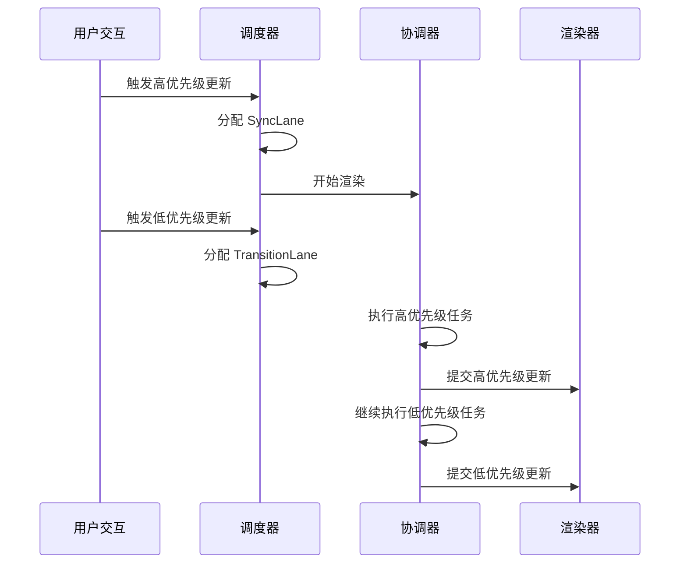

# 并发模式与时间切片调度

React 18 引入的并发模式 (Concurrent Mode) 是 React 架构的重大革新，它使得 React 能够同时处理多个任务，并根据优先级智能调度，从而实现更流畅的用户体验。

---

## 1. 并发模式的设计动机

### 传统同步渲染的问题

在 React 17 及之前的版本中，一旦渲染开始，React 会同步执行整个组件树的渲染，直到完成才会将控制权交还给浏览器。

```tsx
// 同步渲染示例
function HeavyComponent() {
  // 复杂的计算
  const result = expensiveComputation(); // 阻塞主线程
  
  return <div>{result}</div>;
}
```

**问题**：

- 长时间占用主线程，导致页面卡顿
- 无法中断正在进行的渲染
- 用户交互（如输入、点击）被延迟响应

### 并发模式的解决方案

并发模式允许 React 在渲染过程中暂停、恢复甚至放弃渲染工作，优先处理更紧急的任务。

```mermaid
gantt
    title 同步渲染 vs 并发渲染
    dateFormat X
    axisFormat %L
    
    section 同步渲染
    长任务渲染 :a1, 0, 100
    用户输入被阻塞 :crit, a2, 100, 120
    
    section 并发渲染
    渲染切片 1 :b1, 0, 20
    处理用户输入 :b2, 20, 30
    渲染切片 2 :b3, 30, 50
    处理用户输入 :b4, 50, 60
    渲染切片 3 :b5, 60, 80
```



---

## 2. 时间切片 (Time Slicing)

### Scheduler 调度器

React 使用内部的 Scheduler 包来实现时间切片，将长任务拆分为多个小任务，在浏览器空闲时执行。

```tsx
// React 内部的时间切片机制（简化版）
function workLoop(deadline) {
  let shouldYield = false;
  
  while (nextUnitOfWork && !shouldYield) {
    // 执行一小块工作
    nextUnitOfWork = performUnitOfWork(nextUnitOfWork);
    
    // 检查是否需要让出控制权
    shouldYield = deadline.timeRemaining() < 1;
  }
  
  if (nextUnitOfWork) {
    // 还有工作未完成，继续调度
    requestIdleCallback(workLoop);
  } else {
    // 工作完成，提交更新
    commitRoot();
  }
}
```

### 优先级模型

React 根据任务的紧急程度分配不同的优先级：

| 优先级 | 场景 | 过期时间 |
| -------- | ------ | ---------- |
| Immediate | 用户输入、点击 | 立即 |
| UserBlocking | 滚动、动画 | 250ms |
| Normal | 数据获取、异步更新 | 5s |
| Low | 日志、分析 | 10s |
| Idle | 不紧急的任务 | 永不过期 |

---

## 3. startTransition：标记低优先级更新

`startTransition` 允许你将某些更新标记为"过渡更新"（低优先级），从而保证紧急更新（如用户输入）不被阻塞。

### 基础使用

```tsx
import { useState, startTransition } from 'react';

function SearchComponent() {
  const [input, setInput] = useState('');
  const [results, setResults] = useState([]);

  const handleChange = (e) => {
    // 高优先级：立即更新输入框
    setInput(e.target.value);
    
    // 低优先级：延迟更新搜索结果
    startTransition(() => {
      const filteredResults = heavySearch(e.target.value);
      setResults(filteredResults);
    });
  };

  return (
    <div>
      <input value={input} onChange={handleChange} />
      <ul>
        {results.map(result => (
          <li key={result.id}>{result.name}</li>
        ))}
      </ul>
    </div>
  );
}
```

### 性能对比

```tsx
// ❌ 不使用 startTransition：两个更新都是高优先级
const handleChange = (e) => {
  setInput(e.target.value);
  setResults(heavySearch(e.target.value)); // 阻塞输入框更新
};

// ✅ 使用 startTransition：输入框立即响应
const handleChange = (e) => {
  setInput(e.target.value); // 立即执行
  startTransition(() => {
    setResults(heavySearch(e.target.value)); // 可中断执行
  });
};
```

### useTransition Hook

```tsx
import { useState, useTransition } from 'react';

function TabContainer() {
  const [activeTab, setActiveTab] = useState('home');
  const [isPending, startTransition] = useTransition();

  const handleTabClick = (tab) => {
    startTransition(() => {
      setActiveTab(tab); // 低优先级更新
    });
  };

  return (
    <div>
      <button onClick={() => handleTabClick('home')}>首页</button>
      <button onClick={() => handleTabClick('profile')}>个人资料</button>
      
      {isPending && <Spinner />}
      
      {activeTab === 'home' && <HomeContent />}
      {activeTab === 'profile' && <ProfileContent />}
    </div>
  );
}
```

---

## 4. useDeferredValue：延迟派生值

`useDeferredValue` 用于延迟更新派生值，保证 UI 的响应性。

### useDeferredValue 基础使用

```tsx
import { useState, useDeferredValue, memo } from 'react';

function SearchResults({ query }: { query: string }) {
  // 执行昂贵的搜索操作
  const results = heavySearch(query);
  
  return (
    <ul>
      {results.map(result => (
        <li key={result.id}>{result.name}</li>
      ))}
    </ul>
  );
}

const MemoizedResults = memo(SearchResults);

function App() {
  const [input, setInput] = useState('');
  
  // 延迟派生值
  const deferredInput = useDeferredValue(input);

  return (
    <div>
      {/* 输入框立即响应 */}
      <input
        value={input}
        onChange={(e) => setInput(e.target.value)}
      />
      
      {/* 搜索结果使用延迟的值 */}
      <MemoizedResults query={deferredInput} />
    </div>
  );
}
```

### useDeferredValue vs startTransition

| 特性 | useDeferredValue | startTransition |
| ------ | ------------------ | ------------------ |
| 使用场景 | 延迟派生值 | 标记低优先级更新 |
| 返回值 | 延迟的值 | isPending 状态 |
| 控制粒度 | 自动 | 手动 |
| 适用场景 | 搜索框、过滤器 | 标签页切换、路由导航 |

---

## 5. Suspense：异步组件加载

`Suspense` 允许组件在渲染时"挂起"，等待异步数据加载完成。

### 代码分割

```tsx
import { lazy, Suspense } from 'react';

const HeavyComponent = lazy(() => import('./HeavyComponent'));

function App() {
  return (
    <Suspense fallback={<div>加载中...</div>}>
      <HeavyComponent />
    </Suspense>
  );
}
```

### 数据获取

```tsx
// 使用 React 19 的 use() Hook
import { use, Suspense } from 'react';

function UserProfile({ userPromise }: { userPromise: Promise<User> }) {
  // use() 会挂起组件，直到 Promise resolve
  const user = use(userPromise);
  
  return <div>{user.name}</div>;
}

function App() {
  const userPromise = fetch('/api/user').then(r => r.json());
  
  return (
    <Suspense fallback={<div>加载用户信息...</div>}>
      <UserProfile userPromise={userPromise} />
    </Suspense>
  );
}
```

### 嵌套 Suspense

```tsx
function App() {
  return (
    <Suspense fallback={<PageSkeleton />}>
      <Header />
      
      <Suspense fallback={<div>加载内容...</div>}>
        <MainContent />
      </Suspense>
      
      <Suspense fallback={<div>加载侧边栏...</div>}>
        <Sidebar />
      </Suspense>
    </Suspense>
  );
}
```

---

## 6. Lane 模型：细粒度优先级调度

React 内部使用 Lane 模型来管理任务优先级，每个 Lane 代表一个优先级通道。

### Lane 的位运算表示

```tsx
// React 内部的 Lane 定义（简化版）
const SyncLane = 0b0000000000000000000000000000001;
const InputContinuousLane = 0b0000000000000000000000000000100;
const DefaultLane = 0b0000000000000000000000000010000;
const TransitionLane = 0b0000000000000000000001000000000;
const IdleLane = 0b0100000000000000000000000000000;

// 判断是否包含某个 Lane
function includesSomeLane(set, subset) {
  return (set & subset) !== 0;
}

// 合并多个 Lane
function mergeLanes(a, b) {
  return a | b;
}
```

### Lane 优先级调度流程



---

## 7. 并发渲染的最佳实践

### 1. 合理使用 startTransition

```tsx
// ✅ 适合使用 startTransition 的场景
function SearchComponent() {
  const [query, setQuery] = useState('');
  const [results, setResults] = useState([]);

  const handleSearch = (value) => {
    setQuery(value); // 立即更新输入框
    
    startTransition(() => {
      // 复杂的搜索逻辑
      const filtered = expensiveFilter(data, value);
      setResults(filtered);
    });
  };

  return (
    <div>
      <input value={query} onChange={(e) => handleSearch(e.target.value)} />
      <ResultsList results={results} />
    </div>
  );
}

// ❌ 不适合使用 startTransition 的场景
function Counter() {
  const [count, setCount] = useState(0);

  const handleClick = () => {
    // 简单的更新不需要 startTransition
    startTransition(() => {
      setCount(count + 1);
    });
  };

  return <button onClick={handleClick}>{count}</button>;
}
```

### 2. 配合 Suspense 使用

```tsx
import { Suspense, startTransition } from 'react';

function App() {
  const [page, setPage] = useState('home');

  const navigate = (newPage) => {
    startTransition(() => {
      setPage(newPage);
    });
  };

  return (
    <div>
      <nav>
        <button onClick={() => navigate('home')}>首页</button>
        <button onClick={() => navigate('profile')}>个人资料</button>
      </nav>
      
      <Suspense fallback={<PageLoader />}>
        {page === 'home' && <HomePage />}
        {page === 'profile' && <ProfilePage />}
      </Suspense>
    </div>
  );
}
```

### 3. 避免过度使用

```tsx
// ❌ 过度使用：每个状态更新都用 startTransition
function Component() {
  const [a, setA] = useState(0);
  const [b, setB] = useState(0);

  const handleClick = () => {
    startTransition(() => setA(1));
    startTransition(() => setB(2));
  };
}

// ✅ 合理使用：只标记真正需要延迟的更新
function Component() {
  const [userInput, setUserInput] = useState('');
  const [searchResults, setSearchResults] = useState([]);

  const handleInputChange = (value) => {
    setUserInput(value); // 立即更新
    
    startTransition(() => {
      // 只有昂贵的搜索操作才需要延迟
      setSearchResults(expensiveSearch(value));
    });
  };
}
```

---

## 8. 性能监控与调试

### React DevTools Profiler

```tsx
import { Profiler } from 'react';

function App() {
  const onRenderCallback = (
    id,
    phase,
    actualDuration,
    baseDuration,
    startTime,
    commitTime
  ) => {
    console.log(`${id} 的 ${phase} 阶段耗时 ${actualDuration}ms`);
  };

  return (
    <Profiler id="App" onRender={onRenderCallback}>
      <ExpensiveComponent />
    </Profiler>
  );
}
```

### 检测并发模式是否启用

```tsx
import { createRoot } from 'react-dom/client';

// React 18+ 默认启用并发模式
const root = createRoot(document.getElementById('root'));
root.render(<App />);

// React 17 兼容模式（禁用并发特性）
import { render } from 'react-dom';
render(<App />, document.getElementById('root'));
```

---

## 9. 总结

| 特性 | 用途 | 适用场景 |
| ------ | ------ | ---------- |
| startTransition | 标记低优先级更新 | 搜索、过滤、标签页切换 |
| useTransition | 获取 isPending 状态 | 需要显示加载状态的场景 |
| useDeferredValue | 延迟派生值 | 搜索框、实时过滤 |
| Suspense | 异步加载 | 代码分割、数据获取 |
| use() Hook | 消费 Promise | 数据获取、异步资源 |

并发模式是 React 18 的核心特性，它使得 React 应用能够在保证流畅用户体验的同时，处理复杂的渲染任务。理解并合理使用这些 API，能够显著提升应用的响应性和性能。
