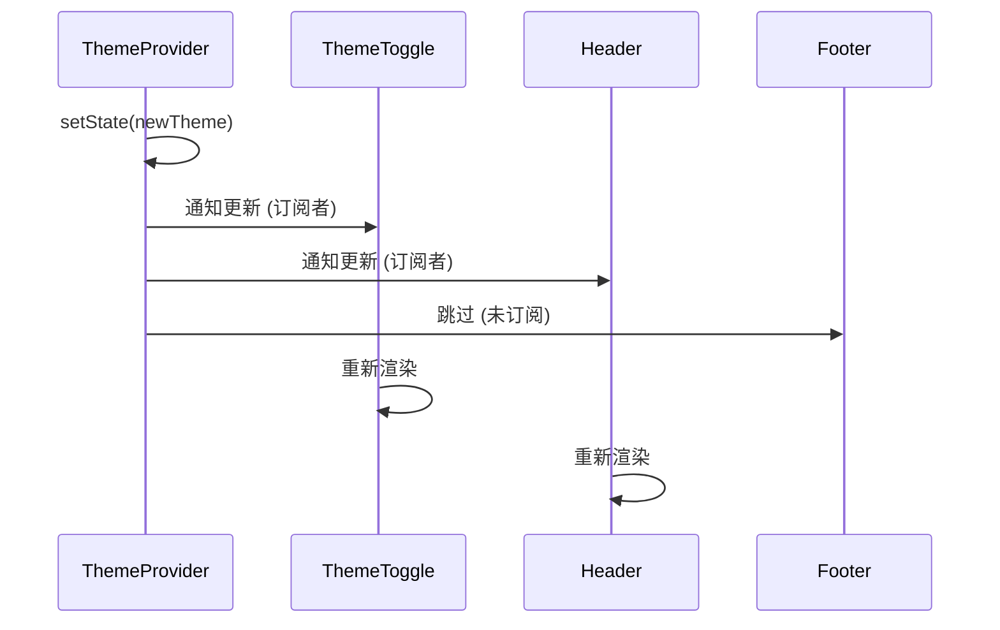

# Context API 与 useReducer 模式

Context API 是 React 官方提供的跨组件状态共享方案，结合 `useReducer` 可以构建可预测的复杂状态机。本文将深入剖析 Context 的订阅更新机制、性能陷阱与优化方案。

---

## 1. Context API 的设计动机

### Props Drilling 的痛点

在传统的 Props 传递模式下，深层嵌套的组件需要通过中间层逐级透传数据：

```tsx
function App() {
  const [theme, setTheme] = useState('dark');
  
  return <Layout theme={theme} setTheme={setTheme} />;
}

function Layout({ theme, setTheme }) {
  return <Sidebar theme={theme} setTheme={setTheme} />;
}

function Sidebar({ theme, setTheme }) {
  return <ThemeToggle theme={theme} setTheme={setTheme} />;
}

function ThemeToggle({ theme, setTheme }) {
  return (
    <button onClick={() => setTheme(theme === 'dark' ? 'light' : 'dark')}>
      切换主题
    </button>
  );
}
```

**问题**：中间层组件（Layout、Sidebar）并不需要 `theme` 和 `setTheme`，却不得不传递它们。

### Context 解决方案

```tsx
import { createContext, useContext, useState } from 'react';

// 创建 Context
const ThemeContext = createContext(null);

function App() {
  const [theme, setTheme] = useState('dark');
  
  return (
    <ThemeContext.Provider value={{ theme, setTheme }}>
      <Layout />
    </ThemeContext.Provider>
  );
}

function Layout() {
  // 中间层无需接收和传递 Props
  return <Sidebar />;
}

function Sidebar() {
  return <ThemeToggle />;
}

function ThemeToggle() {
  // 直接从 Context 读取数据
  const { theme, setTheme } = useContext(ThemeContext);
  
  return (
    <button onClick={() => setTheme(theme === 'dark' ? 'light' : 'dark')}>
      切换主题
    </button>
  );
}
```

---

## 2. Context 的底层订阅机制

### 订阅与通知流程

当 Context 的 `value` 发生变化时，React 会：

1. 遍历所有使用了 `useContext(ThemeContext)` 的组件。
2. 标记这些组件为需要重新渲染。
3. 触发组件的更新流程。



### 浅比较的陷阱

Context 使用 **Object.is** 进行浅比较，只要 `value` 的引用发生变化，所有订阅者都会重新渲染。

```tsx
function App() {
  const [user, setUser] = useState({ name: '张三', age: 25 });
  
  return (
    <UserContext.Provider value={{ user, setUser }}>
      <Dashboard />
    </UserContext.Provider>
  );
}

function Dashboard() {
  const [count, setCount] = useState(0);
  
  return (
    <div>
      <button onClick={() => setCount(count + 1)}>
        Count: {count}
      </button>
      {/* ❌ 问题：每次 Dashboard 重渲染，都会创建新的 value 对象 */}
      {/* 即使 user 没有变化，所有 UserContext 的订阅者都会重渲染 */}
    </div>
  );
}
```

**解决方案**：使用 `useMemo` 缓存 Context 的 `value`

```tsx
function App() {
  const [user, setUser] = useState({ name: '张三', age: 25 });
  
  // ✅ 缓存 value，只有 user 变化时才更新
  const contextValue = useMemo(() => ({ user, setUser }), [user]);
  
  return (
    <UserContext.Provider value={contextValue}>
      <Dashboard />
    </UserContext.Provider>
  );
}
```

---

## 3. Context 的性能陷阱与优化

### 陷阱 1：订阅了整个 Context 对象

```tsx
const AppContext = createContext(null);

function App() {
  const [user, setUser] = useState({ name: '张三' });
  const [theme, setTheme] = useState('dark');
  
  const value = useMemo(() => ({
    user,
    setUser,
    theme,
    setTheme
  }), [user, theme]);
  
  return (
    <AppContext.Provider value={value}>
      <UserProfile />
      <ThemeToggle />
    </AppContext.Provider>
  );
}

function UserProfile() {
  // ❌ 问题：即使只需要 user，但 theme 变化也会导致此组件重渲染
  const { user } = useContext(AppContext);
  
  return <div>{user.name}</div>;
}
```

### 优化方案 1：拆分 Context

```tsx
// ✅ 将不同关注点拆分为多个 Context
const UserContext = createContext(null);
const ThemeContext = createContext(null);

function App() {
  const [user, setUser] = useState({ name: '张三' });
  const [theme, setTheme] = useState('dark');
  
  const userValue = useMemo(() => ({ user, setUser }), [user]);
  const themeValue = useMemo(() => ({ theme, setTheme }), [theme]);
  
  return (
    <UserContext.Provider value={userValue}>
      <ThemeContext.Provider value={themeValue}>
        <UserProfile />
        <ThemeToggle />
      </ThemeContext.Provider>
    </UserContext.Provider>
  );
}

function UserProfile() {
  // ✅ 只订阅 UserContext，theme 变化不会影响此组件
  const { user } = useContext(UserContext);
  return <div>{user.name}</div>;
}

function ThemeToggle() {
  // ✅ 只订阅 ThemeContext
  const { theme, setTheme } = useContext(ThemeContext);
  return <button onClick={() => setTheme('light')}>{theme}</button>;
}
```

### 优化方案 2：使用组件组合 + children

```tsx
function App() {
  const [theme, setTheme] = useState('dark');
  
  return (
    <ThemeContext.Provider value={{ theme, setTheme }}>
      {/* ✅ ExpensiveComponent 作为 children，不会因为 theme 变化而重渲染 */}
      <Layout>
        <ExpensiveComponent />
      </Layout>
    </ThemeContext.Provider>
  );
}

function Layout({ children }) {
  const { theme } = useContext(ThemeContext);
  
  return (
    <div className={`layout-${theme}`}>
      {children}
    </div>
  );
}
```

### 优化方案 3：使用 Context Selector 模式

```tsx
import { createContext, useContext, useRef, useSyncExternalStore } from 'react';

function createContextSelector(defaultValue) {
  const Context = createContext(null);
  
  function Provider({ value, children }) {
    const valueRef = useRef(value);
    const subscribersRef = useRef(new Set());
    
    valueRef.current = value;
    
    const contextValue = useRef({
      subscribe: (callback) => {
        subscribersRef.current.add(callback);
        return () => subscribersRef.current.delete(callback);
      },
      getValue: () => valueRef.current
    });
    
    return (
      <Context.Provider value={contextValue.current}>
        {children}
      </Context.Provider>
    );
  }
  
  function useSelector(selector) {
    const context = useContext(Context);
    
    return useSyncExternalStore(
      context.subscribe,
      () => selector(context.getValue())
    );
  }
  
  return { Provider, useSelector };
}

// 使用示例
const { Provider: AppProvider, useSelector: useAppSelector } = createContextSelector({
  user: null,
  theme: 'dark'
});

function UserProfile() {
  // ✅ 只订阅 user，theme 变化不会触发重渲染
  const user = useAppSelector(state => state.user);
  return <div>{user.name}</div>;
}
```

---

## 4. useReducer：可预测的状态管理

`useReducer` 是 `useState` 的高级版本，适合管理复杂的状态逻辑。

### 基础使用

```tsx
import { useReducer } from 'react';

// 定义 Action 类型
type Action =
  | { type: 'increment' }
  | { type: 'decrement' }
  | { type: 'reset'; payload: number };

// 定义 State 类型
interface State {
  count: number;
}

// 定义 Reducer 函数
function counterReducer(state: State, action: Action): State {
  switch (action.type) {
    case 'increment':
      return { count: state.count + 1 };
    case 'decrement':
      return { count: state.count - 1 };
    case 'reset':
      return { count: action.payload };
    default:
      return state;
  }
}

function Counter() {
  const [state, dispatch] = useReducer(counterReducer, { count: 0 });
  
  return (
    <div>
      <p>Count: {state.count}</p>
      <button onClick={() => dispatch({ type: 'increment' })}>+1</button>
      <button onClick={() => dispatch({ type: 'decrement' })}>-1</button>
      <button onClick={() => dispatch({ type: 'reset', payload: 0 })}>重置</button>
    </div>
  );
}
```

### useReducer vs useState

| 场景 | 推荐使用 |
| ------ | --------- |
| 简单的独立状态 | `useState` |
| 多个相关联的状态 | `useReducer` |
| 复杂的状态转换逻辑 | `useReducer` |
| 需要状态历史回溯 | `useReducer` |
| 状态更新依赖前一个状态 | 两者皆可 |

---

## 5. Context + useReducer：全局状态管理方案

结合 Context 和 useReducer，可以构建一个轻量级的全局状态管理系统。

### 完整示例：购物车管理

```tsx
import { createContext, useContext, useReducer, ReactNode } from 'react';

// 定义类型
interface Product {
  id: string;
  name: string;
  price: number;
}

interface CartItem extends Product {
  quantity: number;
}

interface CartState {
  items: CartItem[];
}

type CartAction =
  | { type: 'ADD_ITEM'; payload: Product }
  | { type: 'REMOVE_ITEM'; payload: string }
  | { type: 'UPDATE_QUANTITY'; payload: { id: string; quantity: number } }
  | { type: 'CLEAR_CART' };

// Reducer 函数
function cartReducer(state: CartState, action: CartAction): CartState {
  switch (action.type) {
    case 'ADD_ITEM': {
      const existingItem = state.items.find(item => item.id === action.payload.id);
      
      if (existingItem) {
        return {
          items: state.items.map(item =>
            item.id === action.payload.id
              ? { ...item, quantity: item.quantity + 1 }
              : item
          )
        };
      }
      
      return {
        items: [...state.items, { ...action.payload, quantity: 1 }]
      };
    }
    
    case 'REMOVE_ITEM':
      return {
        items: state.items.filter(item => item.id !== action.payload)
      };
    
    case 'UPDATE_QUANTITY':
      return {
        items: state.items.map(item =>
          item.id === action.payload.id
            ? { ...item, quantity: action.payload.quantity }
            : item
        )
      };
    
    case 'CLEAR_CART':
      return { items: [] };
    
    default:
      return state;
  }
}

// 创建 Context
interface CartContextValue {
  state: CartState;
  dispatch: React.Dispatch<CartAction>;
  // 派生的计算属性
  totalItems: number;
  totalPrice: number;
}

const CartContext = createContext<CartContextValue | null>(null);

// Provider 组件
export function CartProvider({ children }: { children: ReactNode }) {
  const [state, dispatch] = useReducer(cartReducer, { items: [] });
  
  // 计算派生状态
  const totalItems = state.items.reduce((sum, item) => sum + item.quantity, 0);
  const totalPrice = state.items.reduce(
    (sum, item) => sum + item.price * item.quantity,
    0
  );
  
  const value = {
    state,
    dispatch,
    totalItems,
    totalPrice
  };
  
  return (
    <CartContext.Provider value={value}>
      {children}
    </CartContext.Provider>
  );
}

// 自定义 Hook
export function useCart() {
  const context = useContext(CartContext);
  
  if (!context) {
    throw new Error('useCart 必须在 CartProvider 内部使用');
  }
  
  return context;
}

// 使用示例
function ProductList() {
  const { dispatch } = useCart();
  
  const products = [
    { id: '1', name: 'MacBook Pro', price: 12999 },
    { id: '2', name: 'iPhone 15', price: 5999 }
  ];
  
  return (
    <div>
      {products.map(product => (
        <div key={product.id}>
          <h3>{product.name}</h3>
          <p>¥{product.price}</p>
          <button onClick={() => dispatch({ type: 'ADD_ITEM', payload: product })}>
            加入购物车
          </button>
        </div>
      ))}
    </div>
  );
}

function Cart() {
  const { state, dispatch, totalItems, totalPrice } = useCart();
  
  return (
    <div>
      <h2>购物车 ({totalItems} 件商品)</h2>
      {state.items.map(item => (
        <div key={item.id}>
          <span>{item.name}</span>
          <span>x {item.quantity}</span>
          <button onClick={() => dispatch({ type: 'REMOVE_ITEM', payload: item.id })}>
            删除
          </button>
        </div>
      ))}
      <p>总价: ¥{totalPrice}</p>
      <button onClick={() => dispatch({ type: 'CLEAR_CART' })}>
        清空购物车
      </button>
    </div>
  );
}

function App() {
  return (
    <CartProvider>
      <ProductList />
      <Cart />
    </CartProvider>
  );
}
```

---

## 6. useReducer 的惰性初始化

对于初始状态的计算开销较大的场景，可以使用惰性初始化。

```tsx
// ❌ 每次渲染都会执行 computeExpensiveInitialState
function Component() {
  const [state, dispatch] = useReducer(
    reducer,
    computeExpensiveInitialState()
  );
}

// ✅ 只在初始渲染时执行一次
function Component() {
  const [state, dispatch] = useReducer(
    reducer,
    null,  // 初始参数
    (initialArg) => {
      // 惰性初始化函数
      return computeExpensiveInitialState();
    }
  );
}
```

### 实际应用：从 localStorage 恢复状态

```tsx
function init(storageKey: string) {
  const saved = localStorage.getItem(storageKey);
  return saved ? JSON.parse(saved) : { items: [] };
}

function Component() {
  const [state, dispatch] = useReducer(
    cartReducer,
    'cart-data',  // 传递给 init 的参数
    init          // 惰性初始化函数
  );
  
  // 持久化到 localStorage
  useEffect(() => {
    localStorage.setItem('cart-data', JSON.stringify(state));
  }, [state]);
}
```

---

## 7. Context 的最佳实践

### 1. 提供默认值

```tsx
// ✅ 提供有意义的默认值
const ThemeContext = createContext({
  theme: 'light',
  setTheme: () => {}
});

// ❌ 避免使用 null 作为默认值（需要额外的类型守卫）
const ThemeContext = createContext<ThemeContextValue | null>(null);
```

### 2. 封装 Provider 和自定义 Hook

```tsx
// ✅ 将 Provider 和 Hook 封装在同一个文件中
// ThemeContext.tsx
const ThemeContext = createContext(null);

export function ThemeProvider({ children }) {
  const [theme, setTheme] = useState('light');
  const value = useMemo(() => ({ theme, setTheme }), [theme]);
  
  return (
    <ThemeContext.Provider value={value}>
      {children}
    </ThemeContext.Provider>
  );
}

export function useTheme() {
  const context = useContext(ThemeContext);
  
  if (!context) {
    throw new Error('useTheme 必须在 ThemeProvider 内部使用');
  }
  
  return context;
}
```

### 3. 避免在 Context 中存储频繁变化的值

```tsx
// ❌ 不推荐：鼠标位置频繁变化，会导致所有订阅者频繁重渲染
function App() {
  const [mousePos, setMousePos] = useState({ x: 0, y: 0 });
  
  return (
    <MouseContext.Provider value={mousePos}>
      <ExpensiveComponent />
    </MouseContext.Provider>
  );
}

// ✅ 推荐：使用自定义 Hook 直接订阅事件
function useMousePosition() {
  const [pos, setPos] = useState({ x: 0, y: 0 });
  
  useEffect(() => {
    const handleMouseMove = (e) => setPos({ x: e.clientX, y: e.clientY });
    window.addEventListener('mousemove', handleMouseMove);
    return () => window.removeEventListener('mousemove', handleMouseMove);
  }, []);
  
  return pos;
}
```

---

## 总结

| 技术 | 适用场景 | 注意事项 |
| ------ | ---------- | --------- |
| Context API | 跨组件共享不频繁变化的状态 | 使用 useMemo 缓存 value |
| useReducer | 复杂状态逻辑、多个相关状态 | 配合 TypeScript 定义 Action |
| Context + useReducer | 轻量级全局状态管理 | 拆分多个 Context 避免性能问题 |
| Context Selector | 细粒度订阅优化 | 使用 useSyncExternalStore |
| 组件组合 | 避免 Context 性能问题 | 利用 children 隔离更新 |

Context API 结合 useReducer 是 React 官方推荐的状态管理方案，适合中小型应用。对于超大型应用，可以考虑 Redux Toolkit 或 Zustand 等第三方状态管理库。
