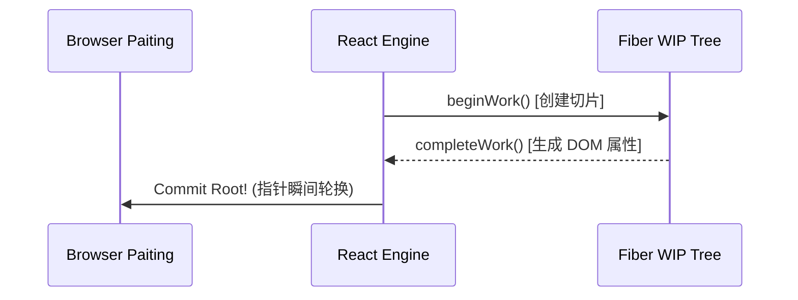

# Fiber 架构剖析

## 1. 传统 Stack Reconciler 的瓶颈

在 React 15 及以前，React 的比对过程 (Reconciliation) 是基于类似操作系统的**同步函数调用栈 (Call Stack)** 进行的深度优先遍历。

一旦遇到节点数量庞大、组件层级深的项目：
- 渲染线程一旦开始就**无法中断**。
- 同步执行会导致主线程长期被阻塞，浏览器丢帧 (掉下 `16.6ms` 的及格线)。

## 2. Fiber 引擎的心跳机制

React 16 引入了全新的 Fiber 架构。Fiber 是一种纯手工模拟的“虚拟栈帧”，让 React 获取了控制 JS 运行切片的时空之力。

### a) 链表结构代替调用栈

React 将树状结构的 Virtual DOM 打散，转化为以 `child` / `sibling` / `return` 为指针的**单链表**结构 (Fiber Node)。使得执行过程随时可以暂停并记录断点。

### b) 双缓冲树 (Double Buffering)

在任何时候，React 的内存中都最多存在两棵 Fiber Tree：
1. **Current Tree**: 代表当前正呈现在屏幕上的 UI。
2. **WorkInProgress Tree (WIP)**: 正在内存中暗暗计算着下一次更新的草稿树。

一次复杂的渲染在 Fiber 的拆解下，就成了浏览器空闲时间 (RequestIdleCallback 或 MessageChannel) 里一帧一帧完成的**并发切片操作 (Concurrent Mode)**。
