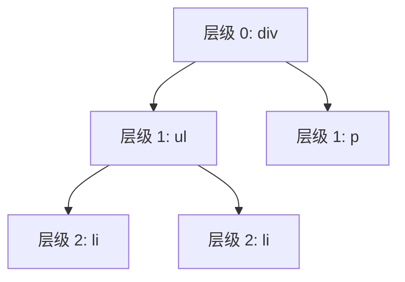

# Virtual DOM 与 Diff 算法优化

Virtual DOM 是 React 高性能的核心基石之一。通过在内存中维护一棵轻量级的 JavaScript 对象树，React 能够高效地计算出最小化的 DOM 变更集，避免昂贵的直接 DOM 操作。

---

## 1. Virtual DOM 的设计动机

### 直接操作 DOM 的性能瓶颈

浏览器的 DOM 是一个庞大的对象模型，每次读写 DOM 属性都可能触发：

- **重排 (Reflow)**：元素的几何属性变化，浏览器需要重新计算布局。
- **重绘 (Repaint)**：元素的视觉属性变化（如颜色），浏览器需要重新绘制像素。

频繁的 DOM 操作会导致浏览器主线程被阻塞，用户体验极差。

### Virtual DOM 的优势

1. **批量更新**：React 将多次状态变更合并为一次 DOM 操作。
2. **最小化 Diff**：通过高效的 Diff 算法计算出最小变更集。
3. **跨平台抽象**：Virtual DOM 作为中间层，可以渲染到 Web、Native、Canvas 等多种平台。

---

## 2. Virtual DOM 的数据结构

Virtual DOM 本质上是一个描述真实 DOM 结构的 JavaScript 对象：

```tsx
// JSX 代码
<div className="container">
  <h1>标题</h1>
  <p>段落内容</p>
</div>

// 对应的 Virtual DOM 结构（简化版）
{
  type: 'div',
  props: {
    className: 'container',
    children: [
      {
        type: 'h1',
        props: { children: '标题' }
      },
      {
        type: 'p',
        props: { children: '段落内容' }
      }
    ]
  }
}
```

在 Fiber 架构中，每个 Virtual DOM 节点会被转换为一个 Fiber Node，包含更丰富的元数据（如优先级、副作用标记等）。

---

## 3. Diff 算法的三大核心策略

传统的树结构 Diff 算法时间复杂度为 $O(n^3)$（需要对两棵树的每个节点进行匹配）。React 通过以下三个假设将复杂度优化到 $O(n)$：

### 策略 1：树分层比较 (Tree Level Comparison)

React 只会对同一层级的节点进行比较，不会跨层级移动节点。



**假设**：跨层级移动 DOM 节点的情况极其罕见，开发者通常会通过修改数据来实现，而非直接移动节点。

**结果**：如果某个节点在新树中不存在，React 会直接删除该节点及其所有子树，不会尝试复用。

### 策略 2：组件类型判断 (Component Type Check)

如果两个节点的类型不同（如从 `<div>` 变为 `<span>`，或从 `ComponentA` 变为 `ComponentB`），React 会直接卸载旧节点并挂载新节点。

```tsx
// 旧 Virtual DOM
<div>内容</div>

// 新 Virtual DOM
<span>内容</span>

// React 的处理：销毁 div 及其子树，创建全新的 span
```

**结果**：即使内容相同，组件类型变化也会触发完整的卸载/挂载流程，包括执行 `useEffect` 清理函数和重新初始化状态。

### 策略 3：Key 属性优化列表 Diff

在渲染列表时，React 通过 `key` 属性来识别哪些元素发生了变化、新增或删除。

---

## 4. Key 属性的深度剖析

### 4.1 为什么需要 Key？

考虑以下场景：在列表头部插入一个新元素。

```tsx
// 旧列表
<ul>
  <li>A</li>
  <li>B</li>
  <li>C</li>
</ul>

// 新列表（在头部插入 Z）
<ul>
  <li>Z</li>
  <li>A</li>
  <li>B</li>
  <li>C</li>
</ul>
```

**没有 Key 的情况**：React 会按索引逐一比较：

1. 索引 0：`A` → `Z`（内容不同，更新文本内容）
2. 索引 1：`B` → `A`（内容不同，更新文本内容）
3. 索引 2：`C` → `B`（内容不同，更新文本内容）
4. 索引 3：无 → `C`（新增节点）

结果：**所有节点都被更新了**，性能极差！

**有 Key 的情况**：React 通过 Key 精准识别节点身份：

```tsx
<ul>
  <li key="z">Z</li>
  <li key="a">A</li>
  <li key="b">B</li>
  <li key="c">C</li>
</ul>
```

React 识别出 `key="a"`, `key="b"`, `key="c"` 的节点位置发生了移动，但内容未变，只需调整 DOM 顺序即可，无需重新渲染。

结果：**只插入一个新节点，复用其他所有节点**，性能最优！

### 4.2 Key 的正确使用

#### ✅ 推荐：使用稳定的唯一标识符

```tsx
// 使用数据库 ID 或唯一标识
const users = [
  { id: 'user-1', name: '张三' },
  { id: 'user-2', name: '李四' }
];

<ul>
  {users.map(user => (
    <li key={user.id}>{user.name}</li>
  ))}
</ul>
```

#### ❌ 反模式 1：使用数组索引作为 Key

```tsx
// 错误示范
{items.map((item, index) => (
  <li key={index}>{item}</li>
))}
```

**问题**：当列表顺序发生变化（如排序、插入、删除）时，索引会发生错位，导致：

1. **状态错乱**：组件内部的状态可能会绑定到错误的数据上。
2. **性能下降**：React 无法正确识别节点移动，导致不必要的重渲染。

#### 示例：状态错乱

```tsx
function TodoList() {
  const [todos, setTodos] = useState([
    { id: 1, text: '学习 React' },
    { id: 2, text: '写博客' }
  ]);

  return (
    <ul>
      {todos.map((todo, index) => (
        // ❌ 使用索引作为 Key
        <TodoItem key={index} todo={todo} />
      ))}
    </ul>
  );
}

function TodoItem({ todo }) {
  const [isEditing, setIsEditing] = useState(false);
  // 如果在列表中插入新项，isEditing 状态会错位到其他项！
}
```

**正确做法**：使用数据的唯一 ID

```tsx
{todos.map(todo => (
  <TodoItem key={todo.id} todo={todo} />
))}
```

#### ❌ 反模式 2：使用随机数或时间戳作为 Key

```tsx
// 错误示范
{items.map(item => (
  <li key={Math.random()}>{item}</li>
))}
```

**问题**：每次渲染都会生成新的 Key，React 会认为所有节点都是新的，导致：

1. 完全销毁并重新创建所有 DOM 节点（极差的性能）。
2. 组件内部状态完全丢失。

#### ✅ 特殊场景：静态列表使用索引

如果列表满足以下**所有条件**，可以使用索引作为 Key：

1. 列表是静态的，不会发生增删改操作。
2. 列表项没有内部状态（如表单输入）。
3. 列表顺序永远不会改变。

```tsx
// 静态展示列表，可以使用索引
const staticCategories = ['前端', '后端', '运维'];

<ul>
  {staticCategories.map((category, index) => (
    <li key={index}>{category}</li>
  ))}
</ul>
```

### 4.3 Key 的作用域

Key 只需要在兄弟节点之间保持唯一，不需要全局唯一。

```tsx
// ✅ 正确：不同父节点下的子节点可以使用相同的 Key
<div>
  <ul>
    {users.map(user => <li key={user.id}>{user.name}</li>)}
  </ul>
  
  <ul>
    {products.map(product => <li key={product.id}>{product.name}</li>)}
  </ul>
</div>
```

---

## 5. Diff 算法的实现细节

### 单节点 Diff

当新旧节点都是单一元素时，React 会比较：

1. **Key 是否相同**：Key 不同直接替换。
2. **类型是否相同**：类型不同直接替换。
3. **属性是否相同**：仅更新变化的属性。

```tsx
// 场景 1：Key 不同，直接替换
<div key="old">旧内容</div>  →  <div key="new">新内容</div>

// 场景 2：类型不同，直接替换
<div>内容</div>  →  <span>内容</span>

// 场景 3：仅属性变化，复用节点
<div className="old">内容</div>  →  <div className="new">内容</div>
```

### 多节点 Diff（列表 Diff）

React 对列表进行 Diff 时，会经过以下步骤：

#### 步骤 1：第一轮遍历（处理更新节点）

从头开始遍历新旧两个列表，逐一比较：

- 如果 Key 和类型都相同，复用节点并更新属性。
- 如果 Key 或类型不同，结束第一轮遍历。

```tsx
// 旧列表：[A, B, C]
// 新列表：[A, B, D, E]

// 第一轮遍历：
// A vs A: 复用
// B vs B: 复用
// C vs D: Key 不同，结束第一轮遍历
```

#### 步骤 2：处理节点新增与删除

- **旧列表已遍历完**：新列表剩余的节点全部是新增节点，直接插入。
- **新列表已遍历完**：旧列表剩余的节点全部是删除节点，直接删除。

#### 步骤 3：处理节点移动（构建 Key-Index 映射）

如果新旧列表都有剩余节点，React 会：

1. 将旧列表剩余节点构建为 `Map<Key, Index>`。
2. 遍历新列表剩余节点，查找是否存在相同 Key 的旧节点。
3. 如果找到，标记为移动；否则标记为新增。

```tsx
// 旧列表：[A, B, C, D]
// 新列表：[A, C, B, E]

// 第一轮遍历：A vs A 复用，结束
// 剩余旧列表：[B, C, D]，构建映射 { B: 1, C: 2, D: 3 }
// 剩余新列表：[C, B, E]
//   - C 在映射中存在（索引 2），标记为移动
//   - B 在映射中存在（索引 1），标记为移动
//   - E 不在映射中，标记为新增
//   - D 未被访问，标记为删除
```

### Diff 算法的时间复杂度分析

- **单节点 Diff**：$O(1)$
- **列表 Diff**：$O(n)$，其中 $n$ 为列表长度
- **整棵树 Diff**：$O(n)$，其中 $n$ 为节点总数

相比传统树结构 Diff 的 $O(n^3)$ 复杂度，React 的优化堪称惊艳。

---

## 6. 性能优化建议

### 6.1 避免在渲染函数中创建新对象

```tsx
// ❌ 反模式：每次渲染都创建新对象，导致子组件不必要的重渲染
function Parent() {
  return <Child config={{ theme: 'dark' }} />;
}

// ✅ 最佳实践：提取到组件外部或使用 useMemo
const config = { theme: 'dark' };

function Parent() {
  return <Child config={config} />;
}

// 或者使用 useMemo
function Parent() {
  const config = useMemo(() => ({ theme: 'dark' }), []);
  return <Child config={config} />;
}
```

### 6.2 避免在列表中使用内联函数

```tsx
// ❌ 反模式：每次渲染都创建新函数，导致子组件重渲染
{items.map(item => (
  <Item key={item.id} onClick={() => handleClick(item.id)} />
))}

// ✅ 最佳实践：使用 useCallback 或将事件处理下沉到子组件
function ItemList({ items, onItemClick }) {
  const handleClick = useCallback((id) => {
    onItemClick(id);
  }, [onItemClick]);

  return (
    <>
      {items.map(item => (
        <Item key={item.id} id={item.id} onClick={handleClick} />
      ))}
    </>
  );
}
```

### 6.3 合理拆分组件

将大组件拆分为多个小组件，减少单次渲染的计算量，同时利用 `React.memo` 避免不必要的重渲染。

```tsx
// ✅ 拆分后，ListHeader 不会随着 items 变化而重渲染
const ListHeader = React.memo(function ListHeader({ title }) {
  return <h1>{title}</h1>;
});

function TodoList({ items }) {
  return (
    <div>
      <ListHeader title="待办事项" />
      <ul>
        {items.map(item => <TodoItem key={item.id} item={item} />)}
      </ul>
    </div>
  );
}
```

---

## 7. Virtual DOM 的局限性

### 局限 1：初始渲染性能不如直接操作 DOM

Virtual DOM 需要额外的内存开销来维护虚拟树，对于首次渲染大量静态内容的场景，直接生成 HTML 字符串（SSR）性能更优。

### 局限 2：细粒度响应式更新不如 Vue 3 / Solid.js

React 的更新是**组件级别**的，即使只有一个状态变化，整个组件函数都会重新执行。

相比之下，Vue 3 的 Proxy 响应式系统和 Solid.js 的细粒度反应性能够实现**变量级别**的精准更新，性能更优。

React 通过 **React Compiler**（React 19）来自动优化这一问题，编译器会自动插入 `useMemo` 和 `useCallback` 来减少不必要的重渲染。

---

## 总结

| 概念 | 核心原理 | 优化建议 |
| ------ | ---------- | ---------- |
| Virtual DOM | 内存中的轻量级 JS 对象树 | 避免频繁创建新对象 |
| Diff 算法 | $O(n)$ 复杂度的三大策略 | 合理使用 Key 属性 |
| Key 属性 | 唯一标识符，用于节点复用 | 使用稳定的唯一 ID |
| 树分层比较 | 只比较同层级节点 | 避免跨层级移动节点 |
| 组件类型判断 | 类型不同直接替换 | 避免频繁切换组件类型 |
| 列表 Diff | 三轮遍历处理更新/新增/移动 | 避免使用索引作为 Key |

Virtual DOM 与高效的 Diff 算法是 React 性能的基石，但仅仅依赖框架层面的优化是不够的，开发者需要深入理解其工作原理，才能写出真正高性能的 React 应用。
