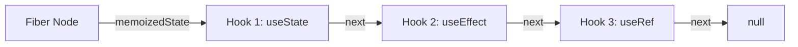

# 常用 Hooks 深度解析

在 React 16.8 版本中，Hooks 的引入带来了函数组件的革命。它让函数组件具备了持久化的状态、副作用处理等能力，无需再编写繁琐的 class 组件。本章我们将对最常用的核心 Hooks 进行深度解析，并剖析其底层的链表机制。

---

## 1. 为什么是 Hooks？

在 Hooks 诞生之前，React 组件的逻辑复用和状态管理存在若干痛点：
- **`this` 绑定地狱**：在 class 组件中，需要频繁绑定 `this`。
- **Wrapper Hell（嵌套地狱）**：使用高阶组件（HOC）或 Render Props 进行逻辑复用时，会导致组件层级深，难以调试。
- **生命周期逻辑分散**：在 class 组件中，同一业务逻辑的初始化和销毁代码（例如事件订阅）被迫拆分到 `componentDidMount` 和 `componentWillUnmount` 中。

Hooks 的诞生让函数组件终于有了持久化的心跳，能够以逻辑为维度组织代码，而不是按照生命周期。

---

## 2. 核心常用 Hooks 详解

### 1) useState：组件状态之源

`useState` 用于在函数组件中声明状态。

```tsx
import { useState } from 'react';

function Counter() {
  const [count, setCount] = useState(0);
  
  return (
    <button onClick={() => setCount(prev => prev + 1)}>
      点击了 {count} 次
    </button>
  );
}
```

- **惰性初始状态**：如果初始状态需要通过复杂计算获得，可以给 `useState` 传入一个函数。该函数只会在组件初次渲染时执行一次，避免重复计算。

  ```tsx
  const [data, setData] = useState(() => {
    return someExpensiveComputation();
  });
  ```

### 2) useEffect：与外部系统同步

`useEffect` 专门用来处理副作用（如数据请求、DOM 操作、事件订阅等）。它在组件渲染完成后异步执行。

```tsx
import { useState, useEffect } from 'react';

function UserProfile({ userId }) {
  const [user, setUser] = useState(null);

  useEffect(() => {
    let isMounted = true;
    
    // 1. 执行副作用：请求数据
    fetchUserData(userId).then(data => {
      if (isMounted) setUser(data);
    });

    // 2. 清理函数 (Cleanup)：在组件卸载或下一次 effect 执行前触发
    return () => {
      isMounted = false;
    };
  }, [userId]); // 依赖项：只有当 userId 变化时，才会重新运行 effect

  return user ? <div>{user.name}</div> : <div>加载中...</div>;
}
```

- **空依赖项数组 `[]`**：Effect 只会在组件挂载（Mount）时执行一次，清理函数只在卸载时执行。
- **有依赖项**：当依赖项列表中的任何值发生改变时，React 都会先执行上一次 Effect 的清理函数，然后执行当前周期的 Effect。

#### ⚠️ 进阶：开发环境下的双重渲染与 StrictMode

在 React 18+ 的开发环境（Development Mode）下，如果组件包裹在 `<React.StrictMode>` 中，你会发现 `useEffect` 的挂载与销毁逻辑会**执行两次**（Mount -> Unmount -> Mount）。

**为什么 React 要这样做？**
这是 React 故意引入的设计，目的是为了帮助开发者**提前发现并修复副作用清理不当导致的 Bug**。例如：
1. 定时器没有在清理函数中 `clearInterval`。
2. 全局事件监听没有在清理函数中 `removeEventListener`。
3. 网络请求可能发生竞态问题（未做 cancel 或 `isMounted` 标记）。

**如何应对？**
你不应该尝试“关闭”双重渲染，而应当确保你的副作用是**幂等的**，即它的挂载与清理是配对的。每次挂载后必须在清理函数中将副作用恢复如初：

```tsx
useEffect(() => {
  const handleScroll = () => console.log(window.scrollY);
  window.addEventListener('scroll', handleScroll);

  // 必须提供清理函数，否则开发环境下会绑定两个监听器导致内存泄漏
  return () => window.removeEventListener('scroll', handleScroll);
}, []);
```

### 3) useRef：跨渲染周期的共享引用

`useRef` 返回一个可变的 ref 对象，其 `.current` 属性被初始化为传入的参数。它有两个核心用途：

1. **获取真实 DOM 节点的引用**：

   ```tsx
   import { useRef, useEffect } from 'react';

   function AutoFocusInput() {
     const inputRef = useRef<HTMLInputElement>(null);

     useEffect(() => {
       inputRef.current?.focus(); // 自动聚焦
     }, []);

     return <input ref={inputRef} type="text" />;
   }
   ```

2. **保存跨渲染周期的持久化变量**：修改 `ref.current` **不会触发组件的重新渲染**。可以用它来保存定时器 ID、上一次的状态等。

   ```tsx
   const timerRef = useRef<NodeJS.Timeout | null>(null);
   // 即使 timerRef.current 被赋值，组件也不会重新渲染
   ```

3. **搭配 `useImperativeHandle` 限制暴露子组件方法**：

   在 React 19 中，`ref` 会像普通的 prop 一样直接传递给子组件（无需 `forwardRef` 包装）。默认情况下，如果把 `ref` 绑定给子组件的原生 DOM，父组件将拥有该 DOM 的全部操作权限。

   如果我们想**限制暴露的权限**，或者在函数式子组件中**向父组件暴露自定义的实例方法**，必须配合 `useImperativeHandle`：

   ```tsx
   import { useRef, useImperativeHandle } from 'react';

   interface FancyInputRef {
     focusAndClear: () => void;
   }

   // 子组件（React 19 风格：直接接收 ref 属性）
   function FancyInput({ label, ref }: { label: string; ref: React.Ref<FancyInputRef> }) {
     const inputRef = useRef<HTMLInputElement>(null);

     // 限制父组件通过 ref 能访问到的成员
     useImperativeHandle(ref, () => ({
       focusAndClear: () => {
         inputRef.current?.focus();
         if (inputRef.current) {
           inputRef.current.value = '';
         }
       }
     }), []); // 依赖项数组

     return (
       <label>
         {label}
         <input ref={inputRef} type="text" />
       </label>
     );
   }

   // 父组件使用
   function Parent() {
     const fancyInputRef = useRef<FancyInputRef>(null);

     return (
       <div>
         <FancyInput label="机密输入框" ref={fancyInputRef} />
         <button onClick={() => fancyInputRef.current?.focusAndClear()}>
           聚焦并清空
         </button>
       </div>
     );
   }
   ```

### 4) useContext：无感知的全局上下文

`useContext` 用于跨越组件层级直接读取祖先组件共享的 Context 数据，避免了“Props Drill（层层透传）”。

```tsx
import { createContext, useContext } from 'react';

const ThemeContext = createContext('light');

function App() {
  return (
    <ThemeContext.Provider value="dark">
      <Toolbar />
    </ThemeContext.Provider>
  );
}

function Toolbar() {
  return <ThemeButton />;
}

function ThemeButton() {
  // 直接消费 Context，跨越了 Toolbar 组件的层级
  const theme = useContext(ThemeContext);
  return <button className={`button--${theme}`}>当前主题: {theme}</button>;
}
```

### 5) useId：稳定唯一的标识符

`useId` 是 React 18 引入的 Hook，用于生成在服务端渲染（SSR）和客户端激活（Hydration）之间保持绝对稳定、唯一的 ID。

- **痛点**：在传统开发中，如果直接使用 `Math.random()` 来生成元素的 ID，在服务端渲染出的 HTML 与客户端重新渲染（Hydration）时的 ID 极大概率不一致，从而导致 **Hydration Mismatch（注水失败）** 报错。
- **应用场景**：为表单控件关联 `<label>` 与 `<input>` 的 `id`/`htmlFor` 属性，或者为无障碍辅助功能（ARIA）配置关联 ID。

```tsx
import { useId } from 'react';

function LoginForm() {
  // 生成唯一的 ID 前缀，例如 ":r0:"
  const usernameId = useId();
  const passwordId = useId();

  return (
    <form>
      <div>
        <label htmlFor={usernameId}>用户名：</label>
        <input id={usernameId} type="text" />
      </div>
      <div>
        <label htmlFor={passwordId}>密码：</label>
        <input id={passwordId} type="password" />
      </div>
    </form>
  );
}
```

### 6) 库级底层 Hooks：useSyncExternalStore 与 useInsertionEffect

这两个 Hook 主要面向**库（Libraries）开发者**，在日常业务开发中较少直接使用，但在现代 React 渲染引擎中起着关键支撑作用。

#### useSyncExternalStore：订阅外部数据源

在 Concurrent Mode（并发模式）下，React 可能会暂停、中断或恢复组件的渲染。如果在此期间外部非 React 的状态源（如 Redux store、Zustand、window 属性）发生变化，不同的组件可能会读取到不一致的数据，产生 **Tearing（屏幕撕裂）** 现象。

`useSyncExternalStore` 强制要求在读取外部数据时保持同步，彻底规避了撕裂风险：

```tsx
import { useSyncExternalStore } from 'react';

// 订阅浏览器在线状态示例
function OnlineStatus() {
  const isOnline = useSyncExternalStore(
    // 1. subscribe：订阅函数，当数据改变时调用 callback 触发组件重渲染
    (callback) => {
      window.addEventListener('online', callback);
      window.addEventListener('offline', callback);
      return () => {
        window.removeEventListener('online', callback);
        window.removeEventListener('offline', callback);
      };
    },
    // 2. getSnapshot：获取当前状态快照的函数
    () => navigator.onLine,
    // 3. getServerSnapshot：(可选) 服务端渲染时获取状态的函数
    () => true
  );

  return <h1>当前网络状态：{isOnline ? '🟢 在线' : '🔴 离线'}</h1>;
}
```

#### useInsertionEffect：注入动态 CSS

`useInsertionEffect` 的调用时机在 **DOM 突变（Mutations）之前**。它比 `useLayoutEffect` 执行得还要早。

- **作用**：主要用于 CSS-in-JS 库（如 Styled Components、Emotion）在组件渲染时动态向文档中插入 `<style>` 标签。
- **为什么不用 useEffect/useLayoutEffect？**：如果在 `useLayoutEffect` 中动态注入样式，由于 DOM 已经生成，浏览器将被迫进行一次额外的**重排与重绘（Reflow & Repaint）**，导致严重的性能损耗。在 DOM 突变前注入则可以规避此问题。

```tsx
import { useInsertionEffect } from 'react';

function StyledButton({ children }) {
  useInsertionEffect(() => {
    // 在这里动态插入样式表
    const styleRule = `.dynamic-btn { background: hotpink; color: white; }`;
    const styleNode = document.createElement('style');
    styleNode.innerHTML = styleRule;
    document.head.appendChild(styleNode);
    
    return () => {
      document.head.removeChild(styleNode);
    };
  }, []); // 仅在挂载时运行

  return <button className="dynamic-btn">{children}</button>;
}
```

---

## 3. Hooks 链表底层原理 (The Fiber Chain)

在函数组件中，多次调用相同或不同的 Hooks，React 是如何识别并精准分配对应的状态内存的？

### 1) 单向循环链表结构

在 Fiber 架构中，每个组件的 Fiber Node 内部都有一个 `memoizedState` 字段。对于函数组件，它并非用来存储单一数值，而是指向了一个由 Hook 对象组成的**单向链表**：



每一个 Hook 对象具有以下基础属性：
- `memoizedState`：该 Hook 自身持久化的状态（例如 `useState` 存状态值，`useEffect` 存 Effect 对象及依赖项）。
- `queue`：该 Hook 所排队的更新队列。
- `next`：指向下一个 Hook 对象的指针。

### 2) 为什么 Hooks 严禁在 if/for 或嵌套函数中使用？

当 React 在进行渲染（Render Phase）时，有一个内部的全局工作指针叫 `workInProgressHook`。
- **初次挂载（Mount）**：按代码调用顺序依次创建 Hook 节点并将其串联入链表：
  `HookA -> HookB -> HookC`
- **增量更新（Update）**：React **严格按照调用顺序复用原本建立的链表节点**，完全不依赖名称。
  1. 执行第一行 Hooks，指针指向 Hook 1。
  2. 执行第二行 Hooks，指针指向 Hook 2。

**打破顺序引发的数据错乱**：
如果把 `HookB` 塞入了 `if (condition)` 中，当前次渲染不符合条件，导致 `HookB` 未被调用：

```text
挂载链：[HookA] -> [HookB] -> [HookC]
更新调用：执行 HooksA (复用 HookA) -> 执行 HooksC (此时 React 指针复用了 HookB 的内存！)
```

这会导致极其严重的后果：HooksC 意外读写了原本属于 HookB 的持久化状态数据（导致类型错乱，状态漂移，UI 崩溃）。这就是 Hooks 必须遵守**“只在最外层、无条件地使用”**铁律的技术内幕

---

## 🧪 Hooks 自检清单

在继续学习之前，检查以下几点你是否都掌握了：

- [ ] **useState 基本用法**：能够声明状态和正确更新状态
- [ ] **惰性初始化**：理解何时使用函数形式的初始值
- [ ] **useEffect 依赖项**：知道如何正确设置依赖项数组
- [ ] **清理函数**：理解何时需要清理函数以及如何编写
- [ ] **useRef 两种用途**：DOM引用和持久化变量的区别
- [ ] **useContext 使用**：能够跨组件消费Context数据
- [ ] **Hooks 规则**：理解为什么不能在条件语句中使用Hooks
- [ ] **闭包陷阱**：理解Hooks闭包问题及解决方案

如果有任何不清楚的地方，建议再读一遍相关章节。

---

## ⚠️ 常见误区与陷阱

### 误区 1：在条件语句中使用 Hooks

```tsx
// ❌ 错误：Hooks 在条件语句中调用
function BadComponent({ shouldFetch }) {
  const [data, setData] = useState(null);
  
  if (shouldFetch) {
    // 违反 Hooks 规则！会导致 Hook 链表顺序混乱
    useEffect(() => {
      fetchData().then(setData);
    }, []);
  }
  
  return <div>{data}</div>;
}

// ✅ 正确：条件逻辑放在 Hook 内部
function GoodComponent({ shouldFetch }) {
  const [data, setData] = useState(null);
  
  useEffect(() => {
    if (shouldFetch) {
      fetchData().then(setData);
    }
  }, [shouldFetch]);
  
  return <div>{data}</div>;
}
```

### 误区 2：useEffect 依赖项缺失导致的过期闭包

```tsx
// ❌ 错误：依赖项缺失，count 永远是初始值 0
function Counter() {
  const [count, setCount] = useState(0);
  
  useEffect(() => {
    const timer = setInterval(() => {
      console.log(count); // 永远输出 0
      setCount(count + 1); // count 是闭包中的旧值
    }, 1000);
    
    return () => clearInterval(timer);
  }, []); // 依赖项为空，effect 只执行一次
  
  return <div>{count}</div>;
}

// ✅ 正确方案 1：添加依赖项
function Counter() {
  const [count, setCount] = useState(0);
  
  useEffect(() => {
    const timer = setInterval(() => {
      console.log(count); // 每次都能拿到最新值
      setCount(count + 1);
    }, 1000);
    
    return () => clearInterval(timer);
  }, [count]); // 添加 count 到依赖项
  
  return <div>{count}</div>;
}

// ✅ 正确方案 2：使用函数式更新
function Counter() {
  const [count, setCount] = useState(0);
  
  useEffect(() => {
    const timer = setInterval(() => {
      setCount(prev => prev + 1); // 函数式更新，不依赖外部 count
    }, 1000);
    
    return () => clearInterval(timer);
  }, []); // 依赖项为空也没问题
  
  return <div>{count}</div>;
}
```

### 误区 3：忘记清理 useEffect 中的副作用

```tsx
// ❌ 错误：没有清理定时器，导致内存泄漏
function Timer() {
  const [seconds, setSeconds] = useState(0);
  
  useEffect(() => {
    setInterval(() => {
      setSeconds(s => s + 1);
    }, 1000);
    // 缺少清理函数！组件卸载后定时器仍在运行
  }, []);
  
  return <div>{seconds}秒</div>;
}

// ✅ 正确：返回清理函数
function Timer() {
  const [seconds, setSeconds] = useState(0);
  
  useEffect(() => {
    const timer = setInterval(() => {
      setSeconds(s => s + 1);
    }, 1000);
    
    return () => {
      clearInterval(timer); // 清理定时器
    };
  }, []);
  
  return <div>{seconds}秒</div>;
}
```

### 误区 4：useRef 修改后期待重新渲染

```tsx
// ❌ 错误：修改 ref.current 不会触发重渲染
function BadCounter() {
  const countRef = useRef(0);
  
  const increment = () => {
    countRef.current += 1; // 修改了，但 UI 不会更新
  };
  
  return (
    <div>
      <p>{countRef.current}</p> {/* UI 不会更新 */}
      <button onClick={increment}>增加</button>
    </div>
  );
}

// ✅ 正确：需要触发渲染就用 useState
function GoodCounter() {
  const [count, setCount] = useState(0);
  
  const increment = () => {
    setCount(c => c + 1); // 会触发重渲染
  };
  
  return (
    <div>
      <p>{count}</p>
      <button onClick={increment}>增加</button>
    </div>
  );
}
```

### 误区 5：useState 的惰性初始化使用不当

```tsx
// ❌ 错误：每次渲染都执行昂贵计算
function ExpensiveComponent() {
  const [data, setData] = useState(expensiveComputation()); // 每次渲染都计算
  
  return <div>{data}</div>;
}

// ✅ 正确：使用函数形式的惰性初始化
function ExpensiveComponent() {
  const [data, setData] = useState(() => expensiveComputation()); // 只在首次渲染时计算
  
  return <div>{data}</div>;
}
```

### 误区 6：useEffect 依赖项使用对象或数组

```tsx
// ❌ 错误：每次渲染都创建新对象，导致 effect 重复执行
function UserProfile({ userId }) {
  const [user, setUser] = useState(null);
  const config = { id: userId }; // 每次渲染都是新对象
  
  useEffect(() => {
    fetchUser(config).then(setUser);
  }, [config]); // config 引用每次都变，effect 重复执行
  
  return <div>{user?.name}</div>;
}

// ✅ 正确方案 1：直接依赖基本类型
function UserProfile({ userId }) {
  const [user, setUser] = useState(null);
  
  useEffect(() => {
    fetchUser({ id: userId }).then(setUser);
  }, [userId]); // 只依赖 userId
  
  return <div>{user?.name}</div>;
}

// ✅ 正确方案 2：使用 useMemo 缓存对象
import { useMemo } from 'react';

function UserProfile({ userId }) {
  const [user, setUser] = useState(null);
  const config = useMemo(() => ({ id: userId }), [userId]); // 缓存对象
  
  useEffect(() => {
    fetchUser(config).then(setUser);
  }, [config]);
  
  return <div>{user?.name}</div>;
}
```

### 误区 7：useContext 过度使用导致性能问题

```tsx
// ❌ 错误：所有状态都放在一个 Context 中
const AppContext = createContext({
  user: null,
  theme: 'light',
  notifications: [],
  settings: {},
  // ... 更多状态
});

function SomeComponent() {
  const context = useContext(AppContext);
  // 即使只用 theme，但任何 context 变化都会导致重渲染
  return <div className={context.theme}>内容</div>;
}

// ✅ 正确：拆分 Context，按职责分离
const UserContext = createContext(null);
const ThemeContext = createContext('light');
const NotificationContext = createContext([]);

function SomeComponent() {
  const theme = useContext(ThemeContext); // 只订阅 theme 变化
  return <div className={theme}>内容</div>;
}
```

### 误区 8：自定义 Hook 命名不规范

```tsx
// ❌ 错误：不以 use 开头，ESLint 无法检测
function fetchUser(userId) {
  const [user, setUser] = useState(null);
  
  useEffect(() => {
    fetch(`/api/users/${userId}`)
      .then(res => res.json())
      .then(setUser);
  }, [userId]);
  
  return user;
}

// ✅ 正确：自定义 Hook 必须以 use 开头
function useFetchUser(userId) {
  const [user, setUser] = useState(null);
  
  useEffect(() => {
    fetch(`/api/users/${userId}`)
      .then(res => res.json())
      .then(setUser);
  }, [userId]);
  
  return user;
}
```

### 误区 9：在循环、条件或嵌套函数中调用 Hooks

```tsx
// ❌ 错误：在循环中调用 Hooks
function BadList({ items }) {
  return items.map(item => {
    const [selected, setSelected] = useState(false); // 违反 Hooks 规则
    return <div onClick={() => setSelected(!selected)}>{item.name}</div>;
  });
}

// ✅ 正确：每个列表项单独封装为组件
function ListItem({ item }) {
  const [selected, setSelected] = useState(false);
  return <div onClick={() => setSelected(!selected)}>{item.name}</div>;
}

function GoodList({ items }) {
  return items.map(item => <ListItem key={item.id} item={item} />);
}
```

### 误区 10：useEffect 执行时机理解错误

```tsx
// ❌ 错误：期望 useEffect 在渲染前同步执行
function BadComponent() {
  const [width, setWidth] = useState(0);
  
  useEffect(() => {
    setWidth(window.innerWidth);
  }, []);
  
  // 首次渲染时 width 是 0，而不是窗口宽度
  return <div style={{ width }}>内容</div>;
}

// ✅ 正确方案 1：使用 useLayoutEffect 同步执行
import { useLayoutEffect } from 'react';

function GoodComponent() {
  const [width, setWidth] = useState(0);
  
  useLayoutEffect(() => {
    setWidth(window.innerWidth); // 在浏览器绘制前同步执行
  }, []);
  
  return <div style={{ width }}>内容</div>;
}

// ✅ 正确方案 2：使用惰性初始化
function GoodComponent() {
  const [width, setWidth] = useState(() => window.innerWidth);
  
  return <div style={{ width }}>内容</div>;
}
```

---

## 📖 进阶思考

### 为什么 Hooks 要设计成链表结构？

1. **固定顺序保证稳定性**：通过严格的调用顺序，React 可以精准地复用上一次渲染的 Hook 状态
2. **轻量级数据结构**：链表只需要一个 next 指针，内存开销小
3. **易于遍历**：渲染时从头到尾遍历链表，逻辑简单高效

### useEffect vs useLayoutEffect 的区别

| 特性 | useEffect | useLayoutEffect |
| ----- | ----------- | ----------------- |
| **执行时机** | 浏览器绘制**之后**异步执行 | 浏览器绘制**之前**同步执行 |
| **阻塞渲染** | 不阻塞 | 会阻塞 |
| **使用场景** | 数据请求、事件订阅等异步操作 | DOM 测量、同步修改 DOM |
| **性能影响** | 较小 | 可能导致卡顿 |

**使用建议**：99% 的情况使用 `useEffect`，只有在需要同步读取或修改 DOM 时才用 `useLayoutEffect`。

---

## 🎯 实战练习

### 练习 1：实现一个倒计时 Hook

需求：
- 创建 `useCountdown` Hook
- 接收初始秒数
- 返回当前剩余秒数和重置函数
- 自动倒计时，到 0 停止

<details>
<summary>参考答案</summary>

```tsx
import { useState, useEffect, useCallback } from 'react';

function useCountdown(initialSeconds: number) {
  const [seconds, setSeconds] = useState(initialSeconds);
  const [isRunning, setIsRunning] = useState(true);

  useEffect(() => {
    if (!isRunning || seconds <= 0) return;

    const timer = setInterval(() => {
      setSeconds(prev => {
        if (prev <= 1) {
          setIsRunning(false);
          return 0;
        }
        return prev - 1;
      });
    }, 1000);

    return () => clearInterval(timer);
  }, [isRunning, seconds]);

  const reset = useCallback(() => {
    setSeconds(initialSeconds);
    setIsRunning(true);
  }, [initialSeconds]);

  return { seconds, reset, isRunning };
}

// 使用示例
function CountdownTimer() {
  const { seconds, reset, isRunning } = useCountdown(60);

  return (
    <div>
      <h2>倒计时：{seconds} 秒</h2>
      {!isRunning && <p>时间到！</p>}
      <button onClick={reset}>重置</button>
    </div>
  );
}
```

</details>

### 练习 2：实现一个窗口尺寸监听 Hook

需求：
- 创建 `useWindowSize` Hook
- 返回当前窗口宽度和高度
- 窗口大小变化时自动更新

<details>
<summary>参考答案</summary>

```tsx
import { useState, useEffect } from 'react';

interface WindowSize {
  width: number;
  height: number;
}

function useWindowSize(): WindowSize {
  const [size, setSize] = useState<WindowSize>({
    width: window.innerWidth,
    height: window.innerHeight,
  });

  useEffect(() => {
    const handleResize = () => {
      setSize({
        width: window.innerWidth,
        height: window.innerHeight,
      });
    };

    window.addEventListener('resize', handleResize);

    // 清理函数：移除事件监听
    return () => {
      window.removeEventListener('resize', handleResize);
    };
  }, []); // 空依赖项，只在挂载和卸载时执行

  return size;
}

// 使用示例
function ResponsiveComponent() {
  const { width, height } = useWindowSize();

  return (
    <div>
      <p>窗口宽度：{width}px</p>
      <p>窗口高度：{height}px</p>
      {width < 768 && <p>当前是移动端视图</p>}
    </div>
  );
}
```

</details>

---

## 📚 关键概念总结表

| Hook | 用途 | 注意事项 |
| ------ | ------ | --------- |
| **useState** | 声明组件状态 | 使用函数式更新避免闭包陷阱 |
| **useEffect** | 处理副作用（含 StrictMode 下的开发环境双重渲染调试） | 正确设置依赖项，记得清理 |
| **useRef** | DOM引用或持久化变量 | 修改不触发重渲染 |
| **useContext** | 跨组件消费Context | 避免过度使用导致性能问题 |
| **useMemo** | 缓存计算结果 | 只在性能优化时使用 |
| **useCallback** | 缓存函数引用 | 配合 React.memo 使用 |
| **useLayoutEffect** | 同步DOM操作 | 会阻塞渲染，谨慎使用 |
| **useImperativeHandle** | 自定义暴露给父组件的 ref 属性/方法 | 配合子组件的 ref 属性使用 |
| **useId** | 生成 SSR 安全的稳定唯一 ID | 避免 Hydration Mismatch |
| **useSyncExternalStore** | 订阅外部非 React 状态源 | 解决并发模式下的屏幕“撕裂”问题 |
| **useInsertionEffect** | 动态注入 CSS 样式表 | 仅供 CSS-in-JS 库在 DOM 突变前使用 |

---

## 🔗 下一步

掌握了核心 Hooks 后，你已经可以构建复杂的React应用了。建议继续学习：
1. [组件设计模式](6-component-patterns.md)：设计高复用组件
2. [Context与useReducer](../advanced/5-context-reducer.md)：复杂状态管理
3. [性能优化](../advanced/3-performance-optimization.md)：useMemo与useCallback深度应用
