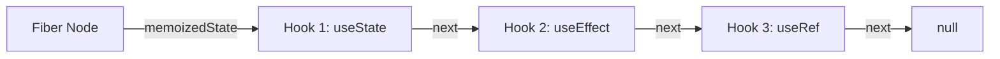

# 常用 Hooks 深度解析

在 React 16.8 版本中，Hooks 的引入带来了函数组件的革命。它让函数组件具备了持久化的状态、副作用处理等能力，无需再编写繁琐的 class 组件。本章我们将对最常用的核心 Hooks 进行深度解析，并剖析其底层的链表机制。

---

## 1. 为什么是 Hooks？

在 Hooks 诞生之前，React 组件的逻辑复用和状态管理存在若干痛点：
- **`this` 绑定地狱**：在 class 组件中，需要频繁绑定 `this`。
- **Wrapper Hell（嵌套地狱）**：使用高阶组件（HOC）或 Render Props 进行逻辑复用时，会导致组件层级深，难以调试。
- **生命周期逻辑分散**：在 class 组件中，同一业务逻辑的初始化和销毁代码（例如事件订阅）被迫拆分到 `componentDidMount` 和 `componentWillUnmount` 中。

Hooks 的诞生让函数组件终于有了持久化的心跳，能够以逻辑为维度组织代码，而不是按照生命周期。

---

## 2. 核心常用 Hooks 详解

### 1) useState：组件状态之源

`useState` 用于在函数组件中声明状态。

```tsx
import { useState } from 'react';

function Counter() {
  const [count, setCount] = useState(0);
  
  return (
    <button onClick={() => setCount(prev => prev + 1)}>
      点击了 {count} 次
    </button>
  );
}
```

- **惰性初始状态**：如果初始状态需要通过复杂计算获得，可以给 `useState` 传入一个函数。该函数只会在组件初次渲染时执行一次，避免重复计算。
  ```tsx
  const [data, setData] = useState(() => {
    return someExpensiveComputation();
  });
  ```

### 2) useEffect：与外部系统同步

`useEffect` 专门用来处理副作用（如数据请求、DOM 操作、事件订阅等）。它在组件渲染完成后异步执行。

```tsx
import { useState, useEffect } from 'react';

function UserProfile({ userId }) {
  const [user, setUser] = useState(null);

  useEffect(() => {
    let isMounted = true;
    
    // 1. 执行副作用：请求数据
    fetchUserData(userId).then(data => {
      if (isMounted) setUser(data);
    });

    // 2. 清理函数 (Cleanup)：在组件卸载或下一次 effect 执行前触发
    return () => {
      isMounted = false;
    };
  }, [userId]); // 依赖项：只有当 userId 变化时，才会重新运行 effect

  return user ? <div>{user.name}</div> : <div>加载中...</div>;
}
```

- **空依赖项数组 `[]`**：Effect 只会在组件挂载（Mount）时执行一次，清理函数只在卸载时执行。
- **有依赖项**：当依赖项列表中的任何值发生改变时，React 都会先执行上一次 Effect 的清理函数，然后执行当前周期的 Effect。

### 3) useRef：跨渲染周期的共享引用

`useRef` 返回一个可变的 ref 对象，其 `.current` 属性被初始化为传入的参数。它有两个核心用途：

1. **获取真实 DOM 节点的引用**：
   ```tsx
   import { useRef, useEffect } from 'react';

   function AutoFocusInput() {
     const inputRef = useRef<HTMLInputElement>(null);

     useEffect(() => {
       inputRef.current?.focus(); // 自动聚焦
     }, []);

     return <input ref={inputRef} type="text" />;
   }
   ```
2. **保存跨渲染周期的持久化变量**：修改 `ref.current` **不会触发组件的重新渲染**。可以用它来保存定时器 ID、上一次的状态等。
   ```tsx
   const timerRef = useRef<NodeJS.Timeout | null>(null);
   // 即使 timerRef.current 被赋值，组件也不会重新渲染
   ```

### 4) useContext：无感知的全局上下文

`useContext` 用于跨越组件层级直接读取祖先组件共享的 Context 数据，避免了“Props Drill（层层透传）”。

```tsx
import { createContext, useContext } from 'react';

const ThemeContext = createContext('light');

function App() {
  return (
    <ThemeContext.Provider value="dark">
      <Toolbar />
    </ThemeContext.Provider>
  );
}

function Toolbar() {
  return <ThemeButton />;
}

function ThemeButton() {
  // 直接消费 Context，跨越了 Toolbar 组件的层级
  const theme = useContext(ThemeContext);
  return <button className={`button--${theme}`}>当前主题: {theme}</button>;
}
```

---

## 3. Hooks 链表底层原理 (The Fiber Chain)

在函数组件中，多次调用相同或不同的 Hooks，React 是如何识别并精准分配对应的状态内存的？

### 1) 单向循环链表结构

在 Fiber 架构中，每个组件的 Fiber Node 内部都有一个 `memoizedState` 字段。对于函数组件，它并非用来存储单一数值，而是指向了一个由 Hook 对象组成的**单向链表**：



每一个 Hook 对象具有以下基础属性：
- `memoizedState`：该 Hook 自身持久化的状态（例如 `useState` 存状态值，`useEffect` 存 Effect 对象及依赖项）。
- `queue`：该 Hook 所排队的更新队列。
- `next`：指向下一个 Hook 对象的指针。

### 2) 为什么 Hooks 严禁在 if/for 或嵌套函数中使用？

当 React 在进行渲染（Render Phase）时，有一个内部的全局工作指针叫 `workInProgressHook`。
- **初次挂载（Mount）**：按代码调用顺序依次创建 Hook 节点并将其串联入链表：
  `HookA -> HookB -> HookC`
- **增量更新（Update）**：React **严格按照调用顺序复用原本建立的链表节点**，完全不依赖名称。
  1. 执行第一行 Hooks，指针指向 Hook 1。
  2. 执行第二行 Hooks，指针指向 Hook 2。

**打破顺序引发的数据错乱**：
如果把 `HookB` 塞入了 `if (condition)` 中，当前次渲染不符合条件，导致 `HookB` 未被调用：

```text
挂载链：[HookA] -> [HookB] -> [HookC]
更新调用：执行 HooksA (复用 HookA) -> 执行 HooksC (此时 React 指针复用了 HookB 的内存！)
```

这会导致极其严重的后果：HooksC 意外读写了原本属于 HookB 的持久化状态数据（导致类型错乱，状态漂移，UI 崩溃）。这就是 Hooks 必须遵守**“只在最外层、无条件地使用”**铁律的技术内幕。
