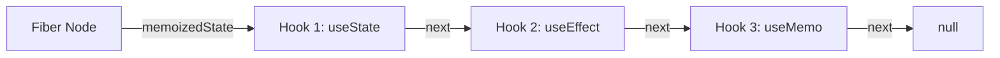

# Hooks 与函数式组件

## 1. 为什么是 Hooks？

在 React 16.8 之前，具备自身状态和生命周期的组件必须以**类 (Class)** 的形式编写，导致了：
- `this` 绑定地狱。
- 高阶组件 (HOC) 嵌套过深带来的 "Wrapper Hell"。
- 复杂组件内部各个生命周期逻辑非常分散。

Hooks 的诞生让函数组件终于有了持久的心跳。

## 2. 核心 Hooks 解析

### 1) useState

构建函数组件最基础的心跳：负责触发 React 调度更新的核心接口。

```tsx
import { useState } from 'react';

function Counter() {
  const [count, setCount] = useState(0);
  
  return (
    <button onClick={() => setCount(prev => prev + 1)}>
      Clicked {count} times
    </button>
  );
}
```

### 2) useEffect

专门用来将组件与**外部系统** (API 请求，DOM 订阅，非 React 环境的实例) 同步的副作用工具。

> **防空设计提示**: 在通过 Docusaurus 等 SSG 框架进行预渲染时，`useEffect` 绝不会在 Node.js 编译期被触发，适合将使用了 `window` 或 `localStorage` 的逻辑封装在其中。

---

## 三、 Hooks 链表底层原理 (The Fiber Chain)

在函数组件中，多次调用相同或不同的 Hooks（如三次 `useState`），React 是如何识别并精准分配对应的状态内存的？

### 1. 单向循环链表结构

在 Fiber 架构中，每个组件的 Fiber Node 内部都有一个 `memoizedState` 字段。它并非用来存储单一数值，而是指向了一个由 Hooks 对象组成的**单向链表**：



每一个 Hook 对象具有以下基础属性：
- `memoizedState`：该 Hook 自身持久化的状态（例如 `useState` 存状态值，`useEffect` 存 Effect 对象及依赖项）。
- `queue`：该 Hook 所排队的更新队列（存放尚未执行的 `setCount` 操作）。
- `next`：指向下一个 Hook 对象的指针。

### 2. 为什么 Hooks 严禁在 if/for 或嵌套函数中使用？

当 React 在进行渲染（Render Phase）时，有一个专门的全局工作指针叫 `workInProgressHook`。
- **初次挂载（Mount）**：按代码调用顺序依此创建 Hook 节点并将其串联入链表：
  `HookA -> HookB -> HookC`
- **增量更新（Update）**：React **按顺序复用原本依此建立的链表节点**，完全不依赖名称：
  1. 执行第一行 Hooks，指针向后跨越一步。
  2. 执行第二行 Hooks，指针再向后跨越一步。

**打破顺序引发的数据错乱**：
如果把 `HookB` 塞入了 `if(condition)` 中，当前次渲染不符合条件，导致 `HookB` 未执行。

```text
挂载链：[HookA] -> [HookB] -> [HookC]
更新调用：执行 HooksA (复用 HookA) -> 执行 HooksC (此时 React 指针复用了 HookB 的内存！)
```

这将引发灾难性后果：HooksC 意外篡改了原本属于 HookB 的持久化状态数据（导致类型错乱，UI 彻底崩溃）。这就是 Hooks 必须遵守**“只在最外层、无条件地使用”**铁律的技术内幕。

---

## 四、 React 19 全新特性 API 与 Hooks 升级

React 19 带来了并发模型、表格表单处理的革命性重构，新增了一系列更贴合现代 Web 场景的 API 及 Hooks。

### 1. `<BrowserOnly>` SSG 防空沙箱

由于 Docusaurus 采用静态页面编译渲染（Build Phase），如果在组件执行首屏加载时触碰到了客户端全局专属 API（`window`、`localStorage`、`document`），编译会彻底爆错终止。
为了隔离防范客户端专属逻辑泄露：

```tsx
import BrowserOnly from '@docusaurus/BrowserOnly';

function MyDynamicWidget() {
  return (
    <BrowserOnly>
      {() => {
        // 凡是在 BrowserOnly 回调内部的代码，在 SSG（Node 编译）时绝不执行
        const width = window.innerWidth;
        return <div>当前视口宽度: {width}px</div>;
      }}
    </BrowserOnly>
  );
}
```

### 2. useActionState —— 颠覆传统的异步 Action

在 React 19 之前，控制表单提交、异步接口交互需要手动管理并发状态：

```tsx
// React 19 之前：不得不繁琐管理的 Loading、Error 和数据持久 State
const [isLoading, setIsLoading] = useState(false);
const [error, setError] = useState(null);
```

现在，利用 React 19 新一代并发管理 Hooks：**`useActionState`**（曾用名 `useFormState`）：

```tsx
import { useActionState } from 'react';

// 定义异步状态机处理器
async function updateProfile(prevState: { success: boolean }, formData: FormData) {
  try {
    await api.post('/user-profile', formData);
    return { success: true };
  } catch (err) {
    return { success: false, error: '更新失败' };
  }
}

function ProfileForm() {
  // useActionState 能自动托管其异步执行流、Pending 挂起状态与返回值
  const [state, formAction, isPending] = useActionState(updateProfile, { success: false });

  return (
    <form action={formAction}>
      <input name="username" type="text" />
      <button type="submit" disabled={isPending}>
        {isPending ? '正在急速提交...' : '确认更新'}
      </button>
      {state.success && <p>更改成功！</p>}
    </form>
  );
}
```

- **异步自动挂起（Transition Pendings）**：`useActionState` 内部产生的 `isPending` 能秒级感知到异步 Promise 的状态，并在网络调用期间自动维持为 `true`。

### 3. useFormStatus —— 子组件跨越获取表单状态

在类 Infima 颜色方案与 UI 主题系统中，我们往往需要根据顶层 `form` 是否正在提交来禁用或改变深层次 Button 的背景、字体大小等。

- **之前做法**：必须通过 React Context 逐级透传。
- **React 19**：直接在 `form` 内部的任何子代组件里，使用 `useFormStatus` 取出状态：

```tsx
import { useFormStatus } from 'react-dom';

function SubmitButton() {
  // useFormStatus 能够突破层级，无感捕获离其最近的父级 <form> 的 action 状态
  const { pending, data, method, action } = useFormStatus();

  return (
    <button type="submit" disabled={pending} className="button--primary">
      {pending ? '发送中...' : '提交'}
    </button>
  );
}
```

### 4. use 关键字 —— 随时可执行、条件性解析的 Hook

在 React 19 中，可以使用全局的 **`use`** 直接在一个函数组件内，去**消费一个 Promise** 或**读取一个 Context**。
最令人心潮澎湃的是：**`use` 可以在 `if` 以及 `for` 的块内部执行！**

```tsx
import { use } from 'react';

function UserCard({ userPromise }: { userPromise: Promise<{ name: string }> }) {
  if (!userPromise) {
    return <div>未指定用户</div>;
  }

  // use 会挂起并阻塞渲染，直到 Promise resolve，配合 <Suspense> 优雅回退
  const user = use(userPromise);

  return <div>用户名: {user.name}</div>;
}
```

通过对底层并发切片机制与新时代 API 的结合，React 19 将彻底颠覆我们数据流转的设计思路。

### 2. useActionState —— 颠覆传统的异步 Action

在 React 19 之前，控制表单提交、异步接口交互需要手动管理并发状态：

```tsx
// React 19 之前：不得不繁琐管理的 Loading、Error 和数据持久 State
const [isLoading, setIsLoading] = useState(false);
const [error, setError] = useState(null);
```

现在，利用 React 19 新一代并发管理 Hooks：**`useActionState`**（曾用名 `useFormState`）：

```tsx
import { useActionState } from 'react';

// 定义异步状态机处理器
async function updateProfile(prevState: { success: boolean }, formData: FormData) {
  try {
    await api.post('/user-profile', formData);
    return { success: true };
  } catch (err) {
    return { success: false, error: '更新失败' };
  }
}

function ProfileForm() {
  // useActionState 能自动托管其异步执行流、Pending 挂起状态与返回值
  const [state, formAction, isPending] = useActionState(updateProfile, { success: false });

  return (
    <form action={formAction}>
      <input name="username" type="text" />
      <button type="submit" disabled={isPending}>
        {isPending ? '正在急速提交...' : '确认更新'}
      </button>
      {state.success && <p>更改成功！</p>}
    </form>
  );
}
```

- **异步自动挂起（Transition Pendings）**：`useActionState` 内部产生的 `isPending` 能秒级感知到异步 Promise 的状态，并在网络调用期间自动维持为 `true`。

### 3. useFormStatus —— 子组件跨越获取表单状态

在类 Infima 颜色方案与 UI 主题系统中，我们往往需要根据顶层 `form` 是否正在提交来禁用或改变深层次 Button 的背景、字体大小等。

- **之前做法**：必须通过 React Context 逐级透传。
- **React 19**：直接在 `form` 内部的任何子代组件里，使用 `useFormStatus` 取出状态：

```tsx
import { useFormStatus } from 'react-dom';

function SubmitButton() {
  // useFormStatus 能够突破层级，无感捕获离其最近的父级 <form> 的 action 状态
  const { pending, data, method, action } = useFormStatus();

  return (
    <button type="submit" disabled={pending} className="button--primary">
      {pending ? '发送中...' : '提交'}
    </button>
  );
}
```

### 4. use 关键字 —— 随时可执行、条件性解析的 Hook

在 React 19 中，可以使用全局的 **`use`** 直接在一个函数组件内，去**消费一个 Promise** 或**读取一个 Context**。
最令人心潮澎湃的是：**`use` 可以在 `if` 以及 `for` 的块内部执行！**

```tsx
import { use } from 'react';

function UserCard({ userPromise }: { userPromise: Promise<{ name: string }> }) {
  if (!userPromise) {
    return <div>未指定用户</div>;
  }

  // use 会挂起并阻塞渲染，直到 Promise resolve，配合 <Suspense> 优雅回退
  const user = use(userPromise);

  return <div>用户名: {user.name}</div>;
}
```

通过对底层并发切片机制与新时代 API 的结合，React 19 将彻底颠覆我们数据流转的设计思路。
